在前面的学习中我们看到了SpringBoot快速部署对我们开发的简化,接下来我们将学习整合第三方组件并对其进行个性化配置,如:Mybatis / logback  / pageHelper / Druid / JSP  / Thymeleaf 的整合操作

开始之前我们需要准备数据环境 : 

```sql
-- 客户信息表
CREATE TABLE `userinfo` (
  `id` int NOT NULL AUTO_INCREMENT,
  `name` varchar(32) COLLATE utf8mb4_general_ci NOT NULL,
  `password` varchar(32) COLLATE utf8mb4_general_ci NOT NULL,
  PRIMARY KEY (`id`)
) ENGINE=InnoDB AUTO_INCREMENT=12 DEFAULT CHARSET=utf8mb4 COLLATE=utf8mb4_general_ci COMMENT='用户信息表';
    comment '用户信息表';
-- 初始化的数据
INSERT INTO userinfo (id, name, password) VALUES(1, 'root1', '123456');
INSERT INTO userinfo (id, name, password) VALUES(2, 'root2', '123456');
INSERT INTO userinfo (id, name, password) VALUES(3, 'root3', '123456');
INSERT INTO userinfo (id, name, password) VALUES(4, 'root4', '123456');
INSERT INTO userinfo (id, name, password) VALUES(5, 'root5', 'root5');
INSERT INTO userinfo (id, name, password) VALUES(6, 'root6', 'root6');
INSERT INTO userinfo (id, name, password) VALUES(7, 'root7', 'root7');
INSERT INTO userinfo (id, name, password) VALUES(8, 'root8', 'root8');
INSERT INTO userinfo (id, name, password) VALUES(9, 'root9', 'root9');
INSERT INTO userinfo (id, name, password) VALUES(10, 'root10', 'root10');
INSERT INTO userinfo (id, name, password) VALUES(11, 'root11', 'root11');
```

## 整合Mybatis

### 导入依赖

与之前一样,我们需要导入Mybatis的相关依赖,不过在SpringBoot中我们直接导入`mybatis-spring-boot-starter`启动器

```XML
<!--整合Mybatis-->
<dependency>
	<groupId>org.mybatis.spring.boot</groupId>
	<artifactId>mybatis-spring-boot-starter</artifactId>
	<version>2.1.3</version>
</dependency>
<dependency>
	<groupId>mysql</groupId>
	<artifactId>mysql-connector-java</artifactId>
	<version>8.0.21</version>
</dependency>
<dependency>
	<groupId>org.projectlombok</groupId>
	<artifactId>lombok</artifactId>
	<version>1.18.12</version>
	<scope>provided</scope>
</dependency>
```

### 修改application.yal文件

```yml
spring:
  datasource:
    url: jdbc:mysql://xxx.xxx.xxx.xx:3306/xxxxxx?useSSL=false&useUnicode=true&characterEncoding=UTF-8&serverTimezone=Asia/Shanghai
    driver-class-name: com.mysql.cj.jdbc.Driver
    username: xxxxx
    password: xxxxx
server:
  port: 8081
  servlet:
    context-path: /springboot03
mybatis:
  type-aliases-package: com.meturing.pojo #指定pojo的位置
```

### 实现功能

我们快速编写一个查询所有用户信息的接口
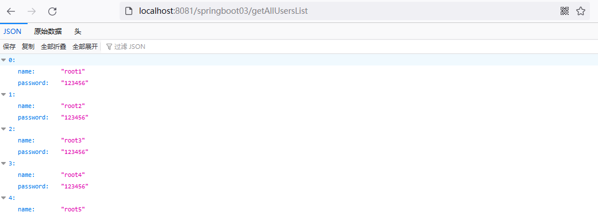

com.meturing.pojo.UserInfo.java
```Java
@Data
@AllArgsConstructor
@NoArgsConstructor
@ToString
public class UserInfo implements Serializable {
	private Integer id;
    private String name;
    private String password;
    private static final long serialVersionUID = 1L;
}
```

com.meturing.controller.UserInfoController.java
```Java
@RestController
public class UserInfoController {
    @Autowired
    private UserInfoService userInfoService;
    @RequestMapping("/getAllUsersList")
    public List<UserInfo> getAllUsersList(){
        return userInfoService.getAllUsersList();
    }
}
```

com.meturing.service.UserInfoService.java
```java
public interface UserInfoService {
    List<UserInfo> getAllUsersList();
}
```

com.meturing.service.impl.UserInfoServiceImpl.java
```java
@Service
public class UserInfoServiceImpl implements UserInfoService {
    @Autowired
    private UserInfoMapper userInfoMapper;
    @Override
    public List<UserInfo> getAllUsersList() {
        return userInfoMapper.getAllUsersList();
    }
}
```

com.meturing.mapper.UserInfoMapper.java
```java
@Mapper
public interface UserInfoMapper {
    List<UserInfo> getAllUsersList();
}
```

resources/com/meturing/mapper/UserInfoMapper.xml
```XMl
<?xml version="1.0" encoding="UTF-8"?>
<!DOCTYPE mapper
        PUBLIC "-//mybatis.org//DTD Mapper 3.0//EN"
        "http://mybatis.org/dtd/mybatis-3-mapper.dtd">
<mapper namespace="com.meturing.mapper.UserInfoMapper">
    <select id="getAllUsersList" resultType="com.meturing.pojo.UserInfo">
        select * from userinfo
    </select>
</mapper>
```

### 一些小Tips

#### 快速生成Mybatis所需文件

我们在IDEA中可以快速对指定的表生成Mybatis的所需文件(类似逆向工程),操作如下:
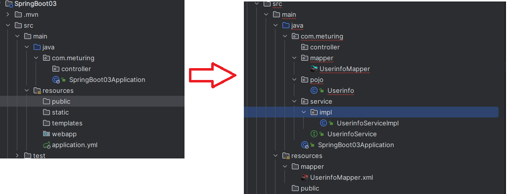

添加插件
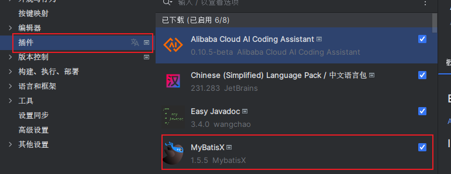

添加数据源
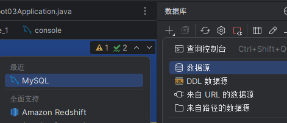

选择表格使用 MybatisX-Generator
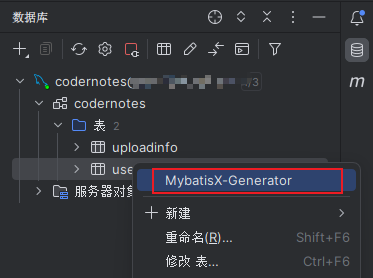

配置参考 :
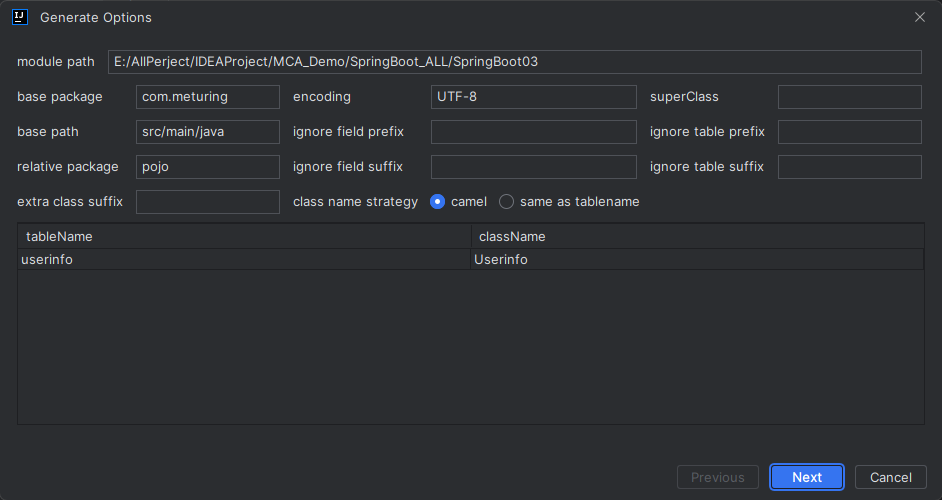
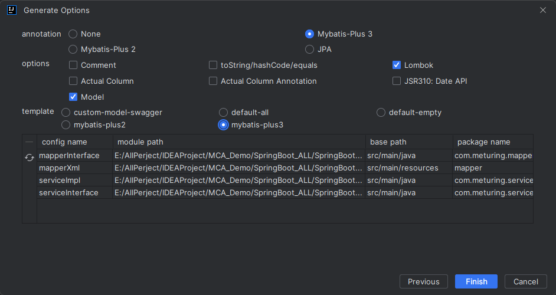

> 注意 : 自动生成的是Mybatis-plus的模板,需要Mybatis-plus的依赖支持

#### Mybatis的个性化映射配置

在之前的学习中,我建议UserInfoMapper.java与UserInfoMapper.xml的层级与名称保持一致,
详见:[注意事项](../../01_Mybatis基础/05_Mybatis代理模式的开发/Mybatis代理模式的开发.md#注意事项)

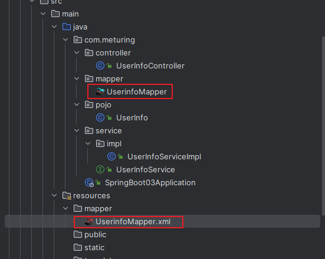

但是在SpringBoot中我们就相对自由了很多,对于文件名称不一致与文件层级不一致都有自定义的处理,如下:

##### 映射文件层级不一致

如果映射文件的层级不一致,我们可以使用`mybatis.mapper-locations`来配置扫描Mapper的路径

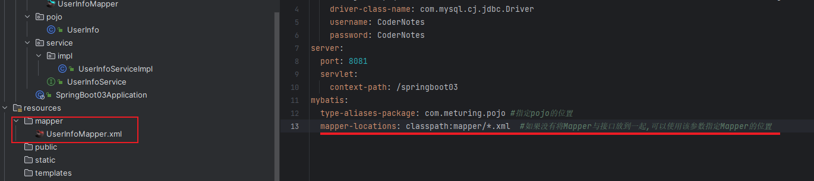

修改Yml文件如下:
```yml
spring:
  datasource:
    url: jdbc:mysql://165.154.132.59:3306/codernotes?useSSL=false&useUnicode=true&characterEncoding=UTF-8&serverTimezone=Asia/Shanghai
    driver-class-name: com.mysql.cj.jdbc.Driver
    username: CoderNotes
    password: CoderNotes
server:
  port: 8081
  servlet:
    context-path: /springboot03
mybatis:
  type-aliases-package: com.meturing.pojo #指定pojo的位置
  mapper-locations: classpath:mapper/*.xml  #如果没有将Mapper与接口放到一起,可以使用该参数指定Mapper的位置
```

##### 映射文件名称不一致

如果映射文件名称不一致,则遵守XML配置的namespace全类路径进行映射

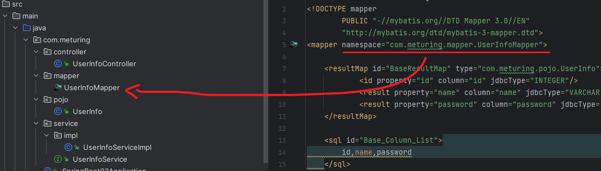


## 实现分页功能

我们在之前的学习中了解了PageHelper分页插件的使用,详见 [使用PageHelper实现分页](../../01_Mybatis基础/10_使用PageHelper实现分页/使用PageHelper实现分页.md). 

接下来我们将快速的在SpringBoot工程中整合该插件的使用

### 环境准备

#### 数据准备

```SQL
CREATE TABLE `student` (
    `stuid` int(11) NOT NULL AUTO_INCREMENT,
    `stuname` varchar(20) DEFAULT NULL,
    `stuage` int(2) DEFAULT NULL,
    `stugender` char(2) DEFAULT NULL,
    `filename` varchar(100) DEFAULT NULL,
    `filetype` varchar(20) DEFAULT NULL,
    PRIMARY KEY (`stuid`)
) ENGINE=InnoDB AUTO_INCREMENT=22 DEFAULT   CHARSET=utf8;

insert into `student`(`stuid`,`stuname`,`stuage`,`stugender`,`filename`,`filetype`)   values   (1,'name1',11,'1',NULL,NULL),(2,'name2',12,'0',NULL,NULL),(3,'name3',13,'1',NULL,NULL),(4,'name4',14,'1',NULL,NULL),(5,'name5',15,'1',NULL,NULL),(6,'name6',16,'0',NULL,NULL),(7,'name7',17,'0',NULL,NULL),(8,'name8',18,'0',NULL,NULL),(9,'name9',19,'0',NULL,NULL),(10,'name10',20,'1',NULL,NULL),(11,'name11',11,'0',NULL,NULL),(12,'name12',12,'1',NULL,NULL),(13,'name13',13,'0',NULL,NULL),(14,'name14',14,'1',NULL,NULL),(15,'name15',15,'0',NULL,NULL),(16,'name16',16,'1',NULL,NULL),(17,'name17',17,'1',NULL,NULL),(18,'name18',18,'0',NULL,NULL),(19,'name19',19,'1',NULL,NULL),(20,'name20',20,'0',NULL,NULL);
```

#### 导入依赖

导入pagehelper启动器
```XMl
<!--pagehelper分页插件-->
<dependency>
	<groupId>com.github.pagehelper</groupId>
	<artifactId>pagehelper-spring-boot-starter</artifactId>
	<version>1.2.12</version>
</dependency>
```

### 实现分页

接下来我们将使用Restful风格实现对数据的分页处理
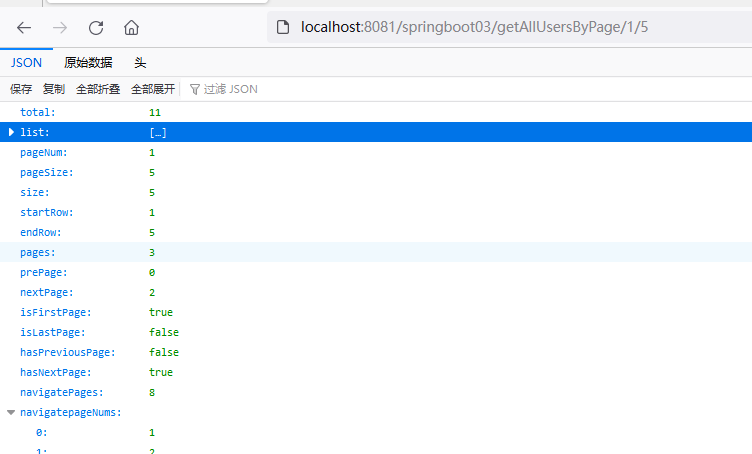

com.meturing.pojo.UserInfo.java
```Java
@Data
@AllArgsConstructor
@NoArgsConstructor
@ToString
public class UserInfo implements Serializable {
	private Integer id;
    private String name;
    private String password;
    private static final long serialVersionUID = 1L;
}
```

com.meturing.controller.UserInfoController.java
```Java
@RestController
public class UserInfoController {
    @Autowired
    private UserInfoService userInfoService;
	@RequestMapping("/getAllUsersByPage/{page}/{size}")
    public PageInfo<UserInfo> getAllUsersByPage(@PathVariable("page") Integer page, @PathVariable("size") Integer size){
        return userInfoService.getAllUsersByPage(page,size);
    }
}
```

com.meturing.service.UserInfoService.java
```java
public interface UserInfoService {
    PageInfo<UserInfo> getAllUsersByPage(Integer page, Integer size);
}
```

com.meturing.service.impl.UserInfoServiceImpl.java
```java
@Service
public class UserInfoServiceImpl implements UserInfoService {
    @Autowired
    private UserInfoMapper userInfoMapper;
    @Override
    public PageInfo<UserInfo> getAllUsersByPage(Integer page, Integer size) {
        PageHelper.startPage(page,size);
        List<UserInfo> allUsersList = userinfoMapper.getAllUsersList();
        return new PageInfo<>(allUsersList);
    }
}
```

com.meturing.mapper.UserInfoMapper.java
```java
@Mapper
public interface UserInfoMapper {
    List<UserInfo> getAllUsersList();
}
```

resources/com/meturing/mapper/UserInfoMapper.xml
```XMl
<?xml version="1.0" encoding="UTF-8"?>
<!DOCTYPE mapper
        PUBLIC "-//mybatis.org//DTD Mapper 3.0//EN"
        "http://mybatis.org/dtd/mybatis-3-mapper.dtd">
<mapper namespace="com.meturing.mapper.UserInfoMapper">
    <select id="getAllUsersList" resultType="com.meturing.pojo.UserInfo">
        select * from userinfo
    </select>
</mapper>
```