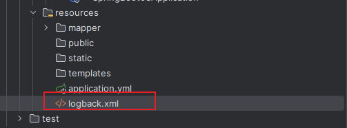

在前面的学习中,我使用了 log4j1 / log4j2,也尝试了手动配置加入Logback日志.
详见之前的手动配置 :

[导入Log4j日志框架](../../01_Mybatis基础/03_Mybatis配置/Mybatis配置.md#导入Log4j日志框架)

[加入logback日志](../../01_Mybatis基础/08_Mybatis缓存/Mybatis缓存.md#加入logback日志)

## logback

Spring Boot默认使用Logback组件作为日志管理。Logback是由log4j创始人设计的一个开源日志组件。

在Spring Boot项目中**我们不需要额外的添加Logback的依赖**，因为在`spring-boot-starter`或者`spring-boot-starter-web`
中已经包含了Logback的依赖。

### logback读取配置文件的步骤

（1）在classpath下查找文件logback-test.xml
（2）如果文件不存在，则查找logback.groovy
（3）如果文件不存在，则查找logback.xml

### logback整合

在resources目录下创建logback.xml配置文件即可



#### 配置参考

```XMl
<?xml version="1.0" encoding="UTF-8" ?>
<configuration>
    <!--定义日志文件的存储地址 勿在 LogBack 的配置中使用相对路径-->
    <property name="LOG_HOME" value="${catalina.base}/logs/"/>
    <!-- 控制台输出 -->
    <appender name="Stdout" class="ch.qos.logback.core.ConsoleAppender">
        <!-- 日志输出格式 -->
        <layout class="ch.qos.logback.classic.PatternLayout">
            <!--格式化输出：%d表示日期，%thread表示线程名，%-5level：级别从左显示5个字符宽度%msg：日志消息，%n是换行符-->
            <pattern>%d{yyyy-MM-dd HH:mm:ss.SSS} [%thread] %-5level %logger{50} - %msg%n
            </pattern>
        </layout>
    </appender>
    <!-- 按照每天生成日志文件 -->
    <appender name="RollingFile" class="ch.qos.logback.core.rolling.RollingFileAppender">
        <rollingPolicy class="ch.qos.logback.core.rolling.TimeBasedRollingPolicy">
            <!--日志文件输出的文件名-->
            <FileNamePattern>${LOG_HOME}/server.%d{yyyy-MM-dd}.log</FileNamePattern>
            <MaxHistory>30</MaxHistory>
        </rollingPolicy>
        <layout class="ch.qos.logback.classic.PatternLayout">
            <!--格式化输出：%d表示日期，%thread表示线程名，%-5level：级别从左显示5个字符宽度%msg：日志消息，%n是换行符-->
            <pattern>%d{yyyy-MM-dd HH:mm:ss.SSS} [%thread] %-5level %logger{50} - %msg%n
            </pattern>
        </layout>
        <!--日志文件最大的大小-->
        <triggeringPolicy class="ch.qos.logback.core.rolling.SizeBasedTriggeringPolicy">
            <MaxFileSize>10MB</MaxFileSize>
        </triggeringPolicy>
    </appender>

    <!-- 日志输出级别 -->
    <root level="info">
        <appender-ref ref="Stdout"/>
        <appender-ref ref="RollingFile"/>
    </root>

    <!-- 指定包的日志级别 -->
    <logger name="com.meturing.mapper" level="DEBUG"></logger>

    <!--日志异步到数据库 -->
    <!--<appender name="DB" class="ch.qos.logback.classic.db.DBAppender">
            日志异步到数据库
            <connectionSource class="ch.qos.logback.core.db.DriverManagerConnectionSource">
               连接池
               <dataSource class="com.mchange.v2.c3p0.ComboPooledDataSource">
                  <driverClass>com.mysql.jdbc.Driver</driverClass>
                  <url>jdbc:mysql://127.0.0.1:3306/databaseName</url>
                  <user>root</user>
                  <password>root</password>
                </dataSource>
            </connectionSource>
      </appender> -->
</configuration>
```

#### 配置解析

##### 日志存放位置


`<property name="LOG_HOME" value="${catalina.base}/logs/"/>` 设置了当前日志文件保存至Tomcat文件的logs目录中


##### 日志级别与配置


##### 指定包的日志级别

logback支持对指定的包执行特定的日志级别,我们通常可以对业务区域配置较低的日志级别,对数据层配置高的日志级别


##### 日志存储至数据库中

logback支持将日志直接存储至日志数据库中,此操作是异步的,不会阻塞主线程的使用.

比如说 : 用户在前端执行的操作日志,会在后端异步存储到数据库中,不会影响到用户的使用


注意 : 此处需要独立配置日志数据库的数据源信息

#### 完整配置

```XML
<?xml version="1.0" encoding="UTF-8"?>
<!-- 日志级别从低到高分为TRACE < DEBUG < INFO < WARN < ERROR < FATAL，比如: 如果设置为WARN，则低于WARN的信息都不会输出 -->
<!-- scan:当此属性设置为true时，配置文档如果发生改变，将会被重新加载，默认值为true -->
<!-- scanPeriod:设置监测配置文档是否有修改的时间间隔，如果没有给出时间单位，默认单位是毫秒。当scan为true时，此属性生效。默认的时间间隔为1分钟。 -->
<!-- debug:当此属性设置为true时，将打印出logback内部日志信息，实时查看logback运行状态。默认值为false。 -->
<configuration scan="true" scanPeriod="10 seconds">
    <contextName>logback</contextName>

    <!-- name的值是变量的名称，value的值时变量定义的值。通过定义的值会被插入到logger上下文中。定义后，可以使“${}”来使用变量。 -->
    <springProperty scope="context" name="myLogLocation" source="logging.file-location" default="/var/log/myapp"/>
    <property name="log.path" value="${myLogLocation}"/>

    <!--0. 日志格式和颜色渲染 -->
    <!-- 彩色日志依赖的渲染类 -->
    <conversionRule conversionWord="clr" converterClass="org.springframework.boot.logging.logback.ColorConverter"/>
    <conversionRule conversionWord="wex"
                    converterClass="org.springframework.boot.logging.logback.WhitespaceThrowableProxyConverter"/>
    <conversionRule conversionWord="wEx"
                    converterClass="org.springframework.boot.logging.logback.ExtendedWhitespaceThrowableProxyConverter"/>
    <!-- 彩色日志格式 -->
    <property name="CONSOLE_LOG_PATTERN"
              value="${CONSOLE_LOG_PATTERN:-%clr(%d{yyyy-MM-dd HH:mm:ss.SSS}){faint} %clr(${LOG_LEVEL_PATTERN:-%5p}) %clr(${PID:- }){magenta} %clr(---){faint} %clr([%15.15t]){faint} %clr(%-40.40logger{39}){cyan} %clr(:){faint} %m%n${LOG_EXCEPTION_CONVERSION_WORD:-%wEx}}"/>

    <!--1. 输出到控制台-->
    <appender name="CONSOLE" class="ch.qos.logback.core.ConsoleAppender">
        <!--此日志appender是为开发使用，只配置最底级别，控制台输出的日志级别是大于或等于此级别的日志信息-->
        <filter class="ch.qos.logback.classic.filter.ThresholdFilter">
            <level>debug</level>
        </filter>
        <encoder>
            <Pattern>${CONSOLE_LOG_PATTERN}</Pattern>
            <!-- 设置字符集 -->
            <charset>UTF-8</charset>
        </encoder>
    </appender>

    <!--2. 输出到文档-->
    <!-- 2.1 level为 DEBUG 日志，时间滚动输出  -->
    <appender name="DEBUG_FILE" class="ch.qos.logback.core.rolling.RollingFileAppender">
        <!-- 正在记录的日志文档的路径及文档名 -->
        <file>${log.path}/debug.log</file>
        <!--日志文档输出格式-->
        <encoder>
            <pattern>%d{yyyy-MM-dd HH:mm:ss.SSS} [%thread] %-5level %logger{50} - %msg%n</pattern>
            <charset>UTF-8</charset> <!-- 设置字符集 -->
        </encoder>
        <!-- 日志记录器的滚动策略，按日期，按大小记录 -->
        <rollingPolicy class="ch.qos.logback.core.rolling.TimeBasedRollingPolicy">
            <!-- 日志归档 -->
            <fileNamePattern>${log.path}/debug-%d{yyyy-MM-dd}.%i.log</fileNamePattern>
            <timeBasedFileNamingAndTriggeringPolicy class="ch.qos.logback.core.rolling.SizeAndTimeBasedFNATP">
                <maxFileSize>100MB</maxFileSize>
            </timeBasedFileNamingAndTriggeringPolicy>
            <!--日志文档保留天数-->
            <maxHistory>15</maxHistory>
        </rollingPolicy>
        <!-- 此日志文档只记录debug级别的 -->
        <filter class="ch.qos.logback.classic.filter.LevelFilter">
            <level>debug</level>
            <onMatch>ACCEPT</onMatch>
            <onMismatch>DENY</onMismatch>
        </filter>
    </appender>

    <!-- 2.2 level为 INFO 日志，时间滚动输出  -->
    <appender name="INFO_FILE" class="ch.qos.logback.core.rolling.RollingFileAppender">
        <!-- 正在记录的日志文档的路径及文档名 -->
        <file>${log.path}/info.log</file>
        <!--日志文档输出格式-->
        <encoder>
            <pattern>%d{yyyy-MM-dd HH:mm:ss.SSS} [%thread] %-5level %logger{50} - %msg%n</pattern>
            <charset>UTF-8</charset>
        </encoder>
        <!-- 日志记录器的滚动策略，按日期，按大小记录 -->
        <rollingPolicy class="ch.qos.logback.core.rolling.TimeBasedRollingPolicy">
            <!-- 每天日志归档路径以及格式 -->
            <fileNamePattern>${log.path}/info-%d{yyyy-MM-dd}.%i.log</fileNamePattern>
            <timeBasedFileNamingAndTriggeringPolicy class="ch.qos.logback.core.rolling.SizeAndTimeBasedFNATP">
                <maxFileSize>100MB</maxFileSize>
            </timeBasedFileNamingAndTriggeringPolicy>
            <!--日志文档保留天数-->
            <maxHistory>15</maxHistory>
        </rollingPolicy>
        <!-- 此日志文档只记录info级别的 -->
        <filter class="ch.qos.logback.classic.filter.LevelFilter">
            <level>info</level>
            <onMatch>ACCEPT</onMatch>
            <onMismatch>DENY</onMismatch>
        </filter>
    </appender>

    <!-- 2.3 level为 WARN 日志，时间滚动输出  -->
    <appender name="WARN_FILE" class="ch.qos.logback.core.rolling.RollingFileAppender">
        <!-- 正在记录的日志文档的路径及文档名 -->
        <file>${log.path}/warn.log</file>
        <!--日志文档输出格式-->
        <encoder>
            <pattern>%d{yyyy-MM-dd HH:mm:ss.SSS} [%thread] %-5level %logger{50} - %msg%n</pattern>
            <charset>UTF-8</charset> <!-- 此处设置字符集 -->
        </encoder>
        <!-- 日志记录器的滚动策略，按日期，按大小记录 -->
        <rollingPolicy class="ch.qos.logback.core.rolling.TimeBasedRollingPolicy">
            <fileNamePattern>${log.path}/warn-%d{yyyy-MM-dd}.%i.log</fileNamePattern>
            <timeBasedFileNamingAndTriggeringPolicy class="ch.qos.logback.core.rolling.SizeAndTimeBasedFNATP">
                <maxFileSize>100MB</maxFileSize>
            </timeBasedFileNamingAndTriggeringPolicy>
            <!--日志文档保留天数-->
            <maxHistory>15</maxHistory>
        </rollingPolicy>
        <!-- 此日志文档只记录warn级别的 -->
        <filter class="ch.qos.logback.classic.filter.LevelFilter">
            <level>warn</level>
            <onMatch>ACCEPT</onMatch>
            <onMismatch>DENY</onMismatch>
        </filter>
    </appender>

    <!-- 2.4 level为 ERROR 日志，时间滚动输出  -->
    <appender name="ERROR_FILE" class="ch.qos.logback.core.rolling.RollingFileAppender">
        <!-- 正在记录的日志文档的路径及文档名 -->
        <file>${log.path}/error.log</file>
        <!--日志文档输出格式-->
        <encoder>
            <pattern>%d{yyyy-MM-dd HH:mm:ss.SSS} [%thread] %-5level %logger{50} - %msg%n</pattern>
            <charset>UTF-8</charset> <!-- 此处设置字符集 -->
        </encoder>
        <!-- 日志记录器的滚动策略，按日期，按大小记录 -->
        <rollingPolicy class="ch.qos.logback.core.rolling.TimeBasedRollingPolicy">
            <fileNamePattern>${log.path}/error-%d{yyyy-MM-dd}.%i.log</fileNamePattern>
            <timeBasedFileNamingAndTriggeringPolicy class="ch.qos.logback.core.rolling.SizeAndTimeBasedFNATP">
                <maxFileSize>100MB</maxFileSize>
            </timeBasedFileNamingAndTriggeringPolicy>
            <!--日志文档保留天数-->
            <maxHistory>15</maxHistory>
        </rollingPolicy>
        <!-- 此日志文档只记录ERROR级别的 -->
        <filter class="ch.qos.logback.classic.filter.LevelFilter">
            <level>ERROR</level>
            <onMatch>ACCEPT</onMatch>
            <onMismatch>DENY</onMismatch>
        </filter>
    </appender>

    <!-- 2.5 所有 除了DEBUG级别的其它高于DEBUG的 日志，记录到一个文件  -->
    <appender name="ALL_FILE" class="ch.qos.logback.core.rolling.RollingFileAppender">
        <!-- 正在记录的日志文档的路径及文档名 -->
        <file>${log.path}/all.log</file>
        <!--日志文档输出格式-->
        <encoder>
            <pattern>%d{yyyy-MM-dd HH:mm:ss.SSS} [%thread] %-5level %logger{50} - %msg%n</pattern>
            <charset>UTF-8</charset> <!-- 此处设置字符集 -->
        </encoder>
        <!-- 日志记录器的滚动策略，按日期，按大小记录 -->
        <rollingPolicy class="ch.qos.logback.core.rolling.TimeBasedRollingPolicy">
            <fileNamePattern>${log.path}/all-%d{yyyy-MM-dd}.%i.log</fileNamePattern>
            <timeBasedFileNamingAndTriggeringPolicy class="ch.qos.logback.core.rolling.SizeAndTimeBasedFNATP">
                <maxFileSize>100MB</maxFileSize>
            </timeBasedFileNamingAndTriggeringPolicy>
            <!--日志文档保留天数-->
            <maxHistory>15</maxHistory>
        </rollingPolicy>
        <!-- 此日志文档记录除了DEBUG级别的其它高于DEBUG的 -->
        <filter class="ch.qos.logback.classic.filter.LevelFilter">
            <level>DEBUG</level>
            <onMatch>DENY</onMatch>
            <onMismatch>ACCEPT</onMismatch>
        </filter>
    </appender>

    <!--
        <logger>用来设置某一个包或者具体的某一个类的日志打印级别、
        以及指定<appender>。<logger>仅有一个name属性，
        一个可选的level和一个可选的addtivity属性。
        name:用来指定受此logger约束的某一个包或者具体的某一个类。
        level:用来设置打印级别，大小写无关：TRACE, DEBUG, INFO, WARN, ERROR, ALL 和 OFF，
              还有一个特殊值INHERITED或者同义词NULL，代表强制执行上级的级别。
              如果未设置此属性，那么当前logger将会继承上级的级别。
        addtivity:是否向上级logger传递打印信息。默认是true。
        <logger name="org.springframework.web" level="info"/>
        <logger name="org.springframework.scheduling.annotation.ScheduledAnnotationBeanPostProcessor" level="INFO"/>
    -->

    <!--
        使用mybatis的时候，sql语句是debug下才会打印，而这里我们只配置了info，所以想要查看sql语句的话，有以下两种操作：
        第一种把<root level="info">改成<root level="DEBUG">这样就会打印sql，不过这样日志那边会出现很多其他消息
        第二种就是单独给dao下目录配置debug模式，代码如下，这样配置sql语句会打印，其他还是正常info级别：
        【logging.level.org.mybatis=debug logging.level.dao=debug】
     -->

    <!--
        root节点是必选节点，用来指定最基础的日志输出级别，只有一个level属性
        level:用来设置打印级别，大小写无关：TRACE, DEBUG, INFO, WARN, ERROR, ALL 和 OFF，
        不能设置为INHERITED或者同义词NULL。默认是DEBUG
        可以包含零个或多个元素，标识这个appender将会添加到这个logger。
    -->

    <!-- 4  最终的策略：
                 基本策略(root级) + 根据profile在启动时, logger标签中定制化package日志级别(优先级高于上面的root级)-->
    <springProfile name="dev">
        <root level="info">
            <appender-ref ref="CONSOLE"/>
            <appender-ref ref="DEBUG_FILE"/>
            <appender-ref ref="INFO_FILE"/>
            <appender-ref ref="WARN_FILE"/>
            <appender-ref ref="ERROR_FILE"/>
            <appender-ref ref="ALL_FILE"/>
        </root>
        <logger name="com.xusanduo.demo" level="debug"/> <!-- 开发环境, 指定某包日志为debug级 -->
    </springProfile>

    <springProfile name="test">
        <root level="info">
            <appender-ref ref="CONSOLE"/>
            <appender-ref ref="DEBUG_FILE"/>
            <appender-ref ref="INFO_FILE"/>
            <appender-ref ref="WARN_FILE"/>
            <appender-ref ref="ERROR_FILE"/>
            <appender-ref ref="ALL_FILE"/>
        </root>
        <logger name="com.xusanduo.demo" level="info"/> <!-- 测试环境, 指定某包日志为info级 -->
    </springProfile>

    <springProfile name="pro">
        <root level="info">
            <!-- 生产环境最好不配置console写文件 -->
            <appender-ref ref="DEBUG_FILE"/>
            <appender-ref ref="INFO_FILE"/>
            <appender-ref ref="WARN_FILE"/>
            <appender-ref ref="ERROR_FILE"/>
            <appender-ref ref="ALL_FILE"/>
        </root>
        <logger name="com.xusanduo.demo" level="warn"/> <!-- 生产环境, 指定某包日志为warn级 -->
        <logger name="com.xusanduo.demo.MyApplication" level="info"/> <!-- 特定某个类打印info日志, 比如application启动成功后的提示语 -->
    </springProfile>

</configuration>
```