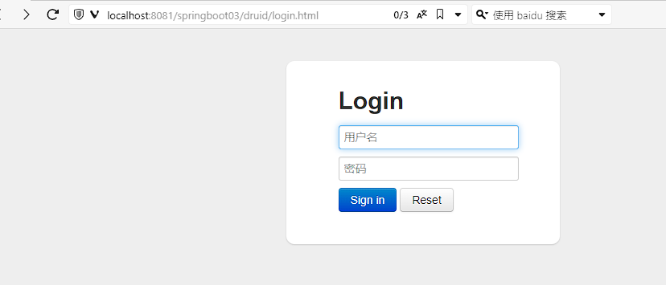
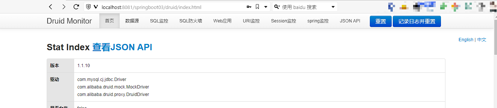

Druid是由阿里巴巴推出的数据库连接池。它结合了C3P0、DBCP、PROXOOL等数据库连接池的优点。之所以从众多数据库连接池中脱颖而出，还有一个重要的原因就是它包含控制台,很方便的帮助我们实现对于sql执行的监控。

## 添加依赖

我们需要在SpringBoot中添加druid的启动器依赖

```XML
<!--druid连接池-->
<dependency>
	<groupId>com.alibaba</groupId>
	<artifactId>druid-spring-boot-starter</artifactId>
	<version>1.1.10</version>
</dependency>
```

> 注意 : 我们此处导入的是启动器依赖,在之前的使用中导入的是单个连接池的依赖,这两个是有区别的

## 修改配置

修改application.yml文件,添加druid的相关配置

```yml
spring:
  datasource:
    url: jdbc:mysql://xxx.xxx.xxx.xx:3306/codernotes?useSSL=false&useUnicode=true&characterEncoding=UTF-8&serverTimezone=Asia/Shanghai
    driver-class-name: com.mysql.cj.jdbc.Driver
    username: CoderNotes
    password: CoderNotes
    type: com.alibaba.druid.pool.DruidDataSource # 使用阿里的Druid连接池
    druid: # 连接池的配置信息
      initial-size: 5 # 初始化连接数量
      min-idle: 5 # 最小空闲数量
      max-active: 20 # 最大链接数
      max-wait: 60000 # 配置获取连接等待超时的时间,单位是毫秒
      time-between-eviction-runs-millis: 60000 # 配置间隔多久才进行一次检测，检测需要关闭的空闲连接，单位是毫秒
      min-evictable-idle-time-millis: 30000 # 配置一个连接在池中最小生存的时间，单位是毫秒
      validationQuery: SELECT 1 # 验证查询
      testWhileIdle: true # 空闲时测试
      testOnBorrow: false # 借用测试
      testOnReturn: false # 返回时测试
      poolPreparedStatements: true # 打开PSCache，并且指定每个连接上PSCache的大小
      maxPoolPreparedStatementPerConnectionSize: 20
      filters: stat,wall,slf4j # 配置监控统计拦截的filters，去掉后监控界面sql无法统计，'wall'用于防火墙
      connectionProperties: druid.stat.mergeSql\=true;druid.stat.slowSqlMillis\=5000 # 通过connectProperties属性来打开mergeSql功能；慢SQL记录
      web-stat-filter: # 配置DruidStatFilter
        enabled: true
        url-pattern: "/*"
        exclusions: "*.js,*.gif,*.jpg,*.bmp,*.png,*.css,*.ico,/druid/*"
      stat-view-servlet: # 配置DruidStatViewServlet
        url-pattern: "/druid/*"
        allow: 127.0.0.1,192.168.8.109 # IP白名单(没有配置或者为空，则允许所有访问)
        deny: 192.168.1.188 # IP黑名单 (存在共同时，deny优先于allow)
        reset-enable: false #  禁用控制台页面上的“重置”功能
        login-username: admin # 登录名
        login-password: 123456 # 登录密码
server:
  port: 8081
  servlet:
    context-path: /springboot03
mybatis:
  type-aliases-package: com.meturing.pojo #指定pojo的位置
  mapper-locations: classpath:mapper/*.xml  #如果没有将Mapper与接口放到一起,可以使用该参数指定Mapper的位置
```

## 启动测试

打开`http://localhost:8081/springboot03/druid/login.html`页面,输入账号密码(配置文件中配置的)


查看控制台


