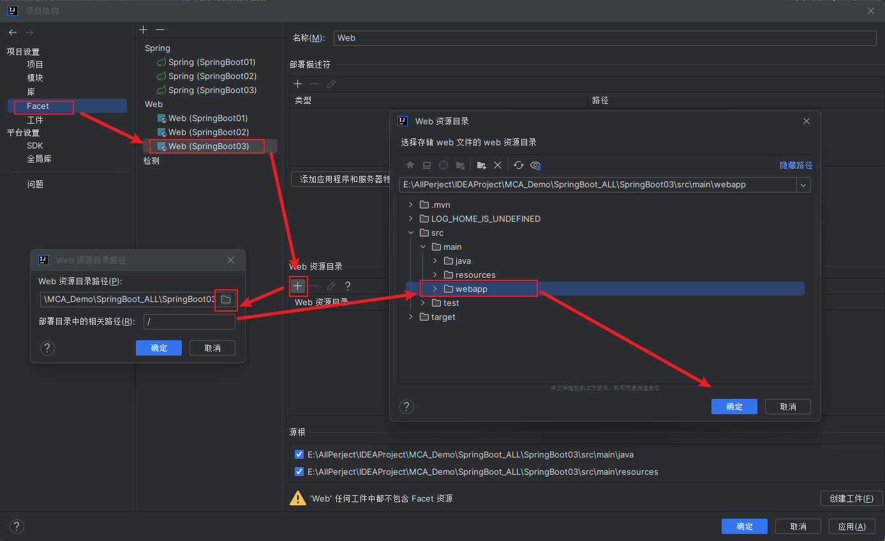
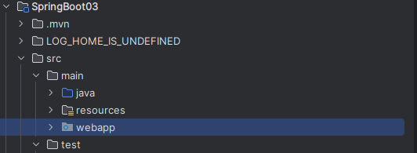
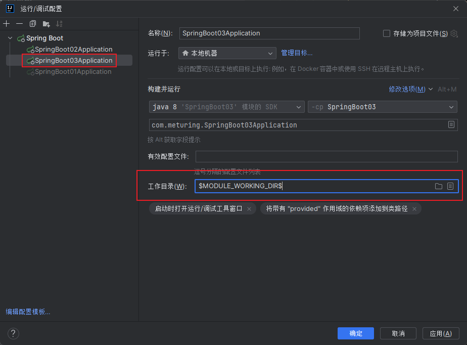
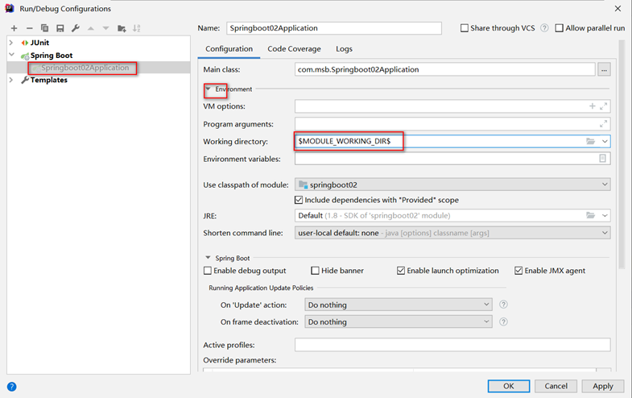
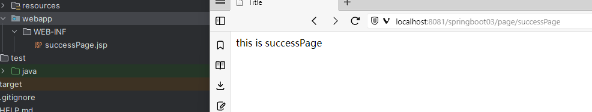

在SpringBoot中默认是舍弃JSP的支持的,所以我们如果需要重新对JSP进行支持,需要执行以下操作

## 导入依赖

```XMl
<!--JSP支持-->
<dependency>
	<groupId>org.apache.tomcat.embed</groupId>
	<artifactId>tomcat-embed-jasper</artifactId>
	<scope>provided</scope>
</dependency>
```

## 设置工程目录

### 设置Webapp目录

默认情况下快速初始化的SpringBoot工程是没有webapp目录的,所以第一步我们需要在resources目录下手动创建webapp目录并按照以下步骤设置为资源目录



设置成功后我们看到该目录被蓝色圆点进行标记


### 设置工作目录

设置工作目录，如果在IDEA中项目结构为聚合工程。那么在运行jsp是需要指定路径。如果项目结构为独立项目则不需要。

新版本IDEA需要手动点击修改选项将工作目录调出,否则是看不到该选项的



老版本的IDEA可以直接设置



## 一些其他配置(可选)

### 配置视图解析器

```yml
spring:
  mvc:  
    view:  
      suffix: .jsp  
      prefix: /WEB-INF/
```

## 测试代码

com.meturing.controller.PageController.java
```Java
@Controller
public class PageController {
    @RequestMapping("/page/{pageName}")
    public String getPage(@PathVariable("pageName") String pageName){
        return pageName;
    }
}
```

main/webapp/WEB-INF/success.jsp
```Jsp
<%@ page contentType="text/html;charset=UTF-8" language="java" %>
<html>
<head>
    <title>Title</title>
</head>
<body>
this is successPage
</body>
</html>
```

访问 : `http://localhost:8081/springboot03/page/success`



## 补充

关于JSP的相关语法可见  : [JSP](../../../../04_JavaEE技术/04_JSP/JSP.md)