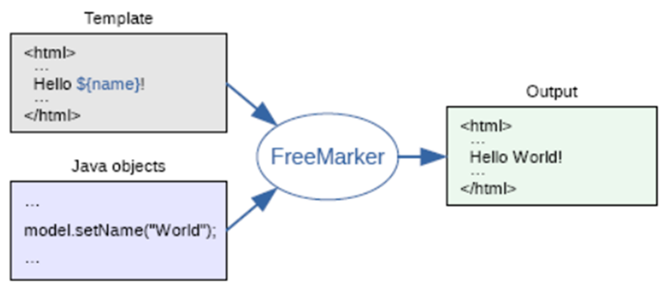

> 写在前面 : FreeMarker是MVC下的产物,需要SpringMVC的技术支持,将ModelAndView对象在视图解析器中解析成View对象并渲染给前端用户


## 了解FreeMarker

 **FreeMarker是一款模板引擎**： 即一种基于模板和要改变的数据， 并用来生成输出文本（HTML网页、电子邮件、配置文件、源代码等）的通用工具。 它不是面向最终用户的，而是一个Java类库，是一款程序员可以嵌入他们所开发产品的组件。
 
FreeMarker是免费的，基于Apache许可证2.0版本发布。其模板编写为FreeMarker Template Language（FTL），属于简单、专用的语言。需要准备数据在真实编程语言中来显示，比如数据库查询和业务运算， 之后模板显示已经准备好的数据。在模板中，主要用于如何展现数据， 而在模板之外注意于要展示什么数据。



**freemarker并不关心数据的来源，只是根据模板的内容**，将数据模型在模板中显示并输出文件（通常为html，也可以生成其它格式的文本文件）

freemarker作为springmvc一种视图格式，**默认情况下SpringMVC支持freemarker视图格式**。 需要创建Spring Boot+Freemarker工程用于测试模板。

## 快速使用FreeMarker

### 快速创建一个SpringBoot项目

创建Springboot项目详见 : [自动部署](../../02_SpringBoot快速部署/SpringBoot快速部署.md#自动部署)

```xml
<!--整合Mybatis-->
<dependency>
	<groupId>org.mybatis.spring.boot</groupId>
	<artifactId>mybatis-spring-boot-starter</artifactId>
	<version>2.2.0</version>
</dependency>
<dependency>
	<groupId>mysql</groupId>
	<artifactId>mysql-connector-java</artifactId>
	<version>8.0.21</version>
</dependency>
<dependency>
	<groupId>org.projectlombok</groupId>
	<artifactId>lombok</artifactId>
	<version>1.18.26</version>
	<scope>provided</scope>
</dependency>
<!--pagehelper分页插件-->
<dependency>
	<groupId>com.github.pagehelper</groupId>
	<artifactId>pagehelper-spring-boot-starter</artifactId>
	<version>1.2.12</version>
</dependency>
```

简单配置Mybatis依赖以及logback配置文件:

application.yml
```yml
spring:
  datasource:
    url: jdbc:mysql://xxx.xxx.xxx.xx:3306/codernotes?useSSL=false&useUnicode=true&characterEncoding=UTF-8&serverTimezone=Asia/Shanghai
    driver-class-name: com.mysql.cj.jdbc.Driver
    username: CoderNotes
    password: CoderNotes
server:
  port: 8080
  servlet:
    context-path: /springboot04
mybatis:
  type-aliases-package: com.meturing.pojo #指定pojo的位置
  mapper-locations: classpath:mapper/*.xml  #如果没有将Mapper与接口放到一起,可以使用该参数指定Mapper的位置
```

logback.xml
```xml
<?xml version="1.0" encoding="UTF-8" ?>
<configuration>
    <!-- 控制台输出 -->
    <appender name="Stdout" class="ch.qos.logback.core.ConsoleAppender">
        <!-- 日志输出格式 -->
        <layout class="ch.qos.logback.classic.PatternLayout">
            <!--格式化输出：%d表示日期，%thread表示线程名，%-5level：级别从左显示5个字符宽度%msg：日志消息，%n是换行符-->
            <pattern>%d{yyyy-MM-dd HH:mm:ss.SSS} [%thread] %-5level %logger{50} - %msg%n
            </pattern>
        </layout>
    </appender>
    <!-- 日志输出级别 -->
    <root level="info">
        <appender-ref ref="Stdout"/>
    </root>
    <!-- 指定包的日志级别 -->
    <logger name="com.meturing.mapper" level="DEBUG"></logger>
</configuration>
```

### 导入Freemarker依赖

```XMl
<!--freemarker依赖支持-->
<dependency>
	<groupId>org.springframework.boot</groupId>
	<artifactId>spring-boot-starter-freemarker</artifactId>
</dependency>
```

### FreeMarker属性配置

我们查看SpringBoot官方提供的FreeMarker属性配置如下 :  [官方配置](https://docs.spring.io/spring-boot/docs/current/reference/html/application-properties.html#appendix.application-properties)


默认情况下,freemarker是以`.ftlh为后缀`,存放于`templates目录`下,我们通常不会更改相关属性,如需更改请参照官方文档进行

### 实现代码

resources/templates/helloFreeMarker.ftlh
```html
<!DOCTYPE html>
<html lang="en">
<head>
    <meta charset="UTF-8">
    <title>Title</title>
</head>
<body>
this is my first FreeMarker Page <br/>
${name}
</body>
</html>
```

com.meturing.controller.FreeMarkerDemo01.java
```java
@Controller
public class FreeMarkerDemo01 {
    @RequestMapping(value = "/{pageName}")
    public ModelAndView showPage(@PathVariable("pageName") String pageName){
        ModelAndView modelAndView = new ModelAndView();
        modelAndView.setViewName(pageName);
        Map<String, Object> model = modelAndView.getModel();
        model.put("name", "zhangsan");
        return modelAndView;
    }
}
```

### 效果

我们看到,如果直接访问`http://localhost:8080/springboot04/helloFreeMarker`页面打开`helloFreeMarker.ftlh`页面,并将`ModelAndView`中存放的`name`参数展示出来


## FreeMarker数据类型

### 布尔类型

com.meturing.controller.FreeMarkerDemo01.java
```Java
@Controller  
public class FreeMarkerDemo01 {
    //测试FreeMarker中的数据类型
    @RequestMapping(value = "/testDataType")
    public ModelAndView testDataType(){
        ModelAndView modelAndView = new ModelAndView();
        modelAndView.setViewName("testDataType");
        //布尔类型
        Map<String, Object> model = modelAndView.getModel();
        model.put("vip",true);
        return modelAndView;
    }
}
```

resources/templates/testDataType.ftlh
```html
<!DOCTYPE html>
<html lang="en">
<head>
    <meta charset="UTF-8">
    <title>Title</title>
    <style type="text/css">
        p>span {
           color: red;
        }
    </style>
</head>
<body>
<#-- 测试布尔类型 -->
<hr/>
<p>在freemarker中布尔类型不能直接输出；如果输出要先转成字符串:</p>
<p><span>方式一：布尔类型?c  </span> ${vip?c}</p>
<p><span>方式二：布尔类型?string  </span> ${vip?string}</p>
<p><span>方式三：布尔类型?string("true时的文本","false时的文本")  </span> ${vip?string('true','false')}</p>
</body>
</html>
```


### 日期类型

com.meturing.controller.FreeMarkerDemo01.java
```Java
@Controller  
public class FreeMarkerDemo01 {
    //测试FreeMarker中的数据类型
    @RequestMapping(value = "/testDataType")
    public ModelAndView testDataType(){
        ModelAndView modelAndView = new ModelAndView();
        modelAndView.setViewName("testDataType");
        Map<String, Object> model = modelAndView.getModel();
        //日期类型
        model.put("birthday",new Date());
        return modelAndView;
    }
}
```

resources/templates/testDataType.ftlh
```html
<!DOCTYPE html>
<html lang="en">
<head>
    <meta charset="UTF-8">
    <title>Title</title>
    <style type="text/css">
        p>span {
           color: red;
        }
    </style>
</head>
<body>
<#-- 测试日期类型 -->
<p>在freemarker中日期类型不能直接输出；如果输出要先转成日期型或字符串:</p>
<p><span>方式一：日期类型?date  </span> ${birthday?date}</p>
<p><span>方式二：日期类型?time  </span> ${birthday?time}</p>
<p><span>方式三：日期类型?datetime  </span> ${birthday?datetime}</p>
<p><span>方式四：日期类型?string("自定义格式")  </span> ${birthday?string('yyyy年MM月dd日 HH:mm:ss')}</p>
</body>
</html>
```


### 数值类型

com.meturing.controller.FreeMarkerDemo01.java
```Java
@Controller  
public class FreeMarkerDemo01 {
    //测试FreeMarker中的数据类型
    @RequestMapping(value = "/testDataType")
    public ModelAndView testDataType(){
        ModelAndView modelAndView = new ModelAndView();
        modelAndView.setViewName("testDataType");
        Map<String, Object> model = modelAndView.getModel();
        //数值类型
        model.put("age",50);
        model.put("money",10086.543);
        model.put("degree",0.543);
        return modelAndView;
    }
}
```

resources/templates/testDataType.ftlh
```html
<!DOCTYPE html>
<html lang="en">
<head>
    <meta charset="UTF-8">
    <title>Title</title>
    <style type="text/css">
        p>span {
           color: red;
        }
    </style>
</head>
<body>
<#-- 测试数值类型 -->
<p>在freemarker中数值类型可以直接输出,或者转换成特定类型:</p>
<p><span>直接输出数值型  </span> ${age} / ${money} / ${degree}</p>
<p><span>将数值转换成字符串输出 : 数值类型?c 或 数值类型?string  </span> ${age?c} / ${money?string} </p>
<p><span>将数值转换成货币类型的字符串输出 ：数值类型?string.currency  </span> ${money?string.currency} </p>
<p><span>将数值转换成百分比类型的字符串输出 ：数值类型?string.percent  </span> ${degree?string.percent}</p>
<p><span>将浮点型数值保留指定小数位输出 （##表示保留两位小数） ：数值类型?string["0.##"]  </span> ${money?string["0.##"]}</p>
</body>
</html>
```


### 字符串类型

com.meturing.controller.FreeMarkerDemo01.java
```Java
@Controller  
public class FreeMarkerDemo01 {
    //测试FreeMarker中的数据类型
    @RequestMapping(value = "/testDataType")
    public ModelAndView testDataType(){
        ModelAndView modelAndView = new ModelAndView();
        modelAndView.setViewName("testDataType");
        Map<String, Object> model = modelAndView.getModel();
        //字符串类型
        model.put("name","zhangsan");
        model.put("alias",null);
        return modelAndView;
    }
}
```

resources/templates/testDataType.ftlh
```html
<!DOCTYPE html>
<html lang="en">
<head>
    <meta charset="UTF-8">
    <title>Title</title>
    <style type="text/css">
        p>span {
           color: red;
        }
    </style>
</head>
<body>
<#-- 测试字符串类型 -->
<p>在freemarker中字符串类型可以直接输出:</p>
<p><span>直接输出  </span> ${name}</p>
<p><span>截取字符串（左闭右开）字符串类型?substring(start,end)  </span> ${name?substring(0,2)}</p>
<p><span>首字母小写输出 字符串类型?uncap_first  </span> ${name?uncap_first} </p>
<p><span>首字母大写输出 字符串类型?cap_first</span> ${name?cap_first} </p>
<p><span>字母转小写输出 字符串类型?lower_case</span> ${name?lower_case} </p>
<p><span>字母转大写输出 字符串类型?upper_case</span> ${name?upper_case} </p>
<p><span>获取字符串长度 字符串类型?length</span> ${name?length} </p>
<p><span>是否以指定字符开头（boolean类型）字符串类型?starts_with("xx")?string</span> ${name?starts_with('z')?string} </p>
<p><span>是否以指定字符结尾（boolean类型）字符串类型?ends_with("xx")?string</span> ${name?ends_with('n')?string} </p>
<p><span>获取指定字符的索引 字符串类型?index_of("xx")</span> ${name?index_of('s')} </p>
<p><span>去除字符串前后空格 字符串类型?trim</span> ${name?trim} </p>
<p><span>替换指定字符串 字符串类型?replace("xx","xx")</span> ${name?replace('s','t')} </p>
<p>在freemarker中null的字符串和''不一样,如果为null则会抛出异常,我们需要对此进行处理:</p>
<p><span>指定缺失变量为空字符串 字符串类型! </span> ${alias!} </p>
<p><span>指定缺失变量为默认字符串 字符串类型!'默认值' </span> ${alias!'空值'} </p>
<p><span>判断字符串是否为空 (字符串类型??)?string </span> ${(name??)?string} </p>
<hr/>
</body>
</html>
```


### 序列类型

com.meturing.pojo.People.java
```Java
@Data
@AllArgsConstructor
@NoArgsConstructor
@ToString
public class People implements Serializable {
    private String name;
    private Integer age;
}
```

com.meturing.controller.FreeMarkerDemo01.java
```Java
@Controller  
public class FreeMarkerDemo01 {
    //测试FreeMarker中的数据类型
    @RequestMapping(value = "/testDataType")
    public ModelAndView testDataType(){
        ModelAndView modelAndView = new ModelAndView();
        modelAndView.setViewName("testDataType");
        Map<String, Object> model = modelAndView.getModel();
		People lisi = new People("lisi", 11);
        People zhangSan = new People("zhangSan", 12);
        People wangWu = new People("wangWu", 18);
        People zhaoLiu = new People("zhaoLiu", 20);
        //序列类型
        List<People> peopleList = new ArrayList<>();
        peopleList.add(lisi);
        peopleList.add(zhangSan);
        peopleList.add(wangWu);
        peopleList.add(zhaoLiu);
        model.put("peopleList",peopleList);
        return modelAndView;
    }
}
```

resources/templates/testDataType.ftlh
```html
<!DOCTYPE html>
<html lang="en">
<head>
    <meta charset="UTF-8">
    <title>Title</title>
    <style type="text/css">
        p>span {
           color: red;
        }
    </style>
</head>
<body>
<#-- 测试序列类型 -->
<#-- <#list 序列名 as 元素名>  ${名称} </#list> -->
<p>序列类型 （数组、List、Set）通过list指令输出序列: </p>
<p><span>遍历输出JavaBean数列值 序列类型 as 别名 </span> <#list peopleList as people>${people_index}.[${people.name}|${people.age}] / </#list></p>
<p><span>获取长度 序列类型?size </span>${peopleList?size}</p>
<p><span>获取第一个元素 序列类型?first </span>${peopleList?first}</p>
<p><span>获取最后一个元素 序列类型?last </span>${peopleList?last}</p>
<p><span>倒序输出 序列类型?reverse as 别名 </span><#list peopleList?reverse as people>${people_index}.[${people.name}|${people.age}] / </#list></p>
<p><span>升序输出 序列类型?sort as 别名 </span><#list peopleList?sort as people>${people_index}.[${people.name}|${people.age}] / </#list></p>
<p><span>降序输出 序列类型?sort?reverse as 别名 </span><#list peopleList?sort?reverse as people>${people_index}.[${people.name}|${people.age}] / </#list></p>
<p><span>指定字段排序 序列类型?sort_by('字段') as 别名 </span><#list peopleList?sort_by('age') as people>${people_index}.[${people.name}|${people.age}] / </#list></p>
</body>
</html>
```


### Map类型

com.meturing.pojo.People.java
```Java
@Data
@AllArgsConstructor
@NoArgsConstructor
@ToString
public class People implements Serializable {
    private String name;
    private Integer age;
}
```

com.meturing.controller.FreeMarkerDemo01.java
```Java
@Controller  
public class FreeMarkerDemo01 {
    //测试FreeMarker中的数据类型
    @RequestMapping(value = "/testDataType")
    public ModelAndView testDataType(){
        ModelAndView modelAndView = new ModelAndView();
        modelAndView.setViewName("testDataType");
        Map<String, Object> model = modelAndView.getModel();
		People lisi = new People("lisi", 11);
        People zhangSan = new People("zhangSan", 12);
        People wangWu = new People("wangWu", 18);
        People zhaoLiu = new People("zhaoLiu", 20);
        //Map类型
		HashMap<String, People> peopleMap = new HashMap<>();
        peopleMap.put(lisi.getName(), lisi);
        peopleMap.put(zhangSan.getName(), zhangSan);
        peopleMap.put(wangWu.getName(), wangWu);
        peopleMap.put(zhaoLiu.getName(), zhaoLiu);
        model.put("peopleMap",peopleMap);
        return modelAndView;
    }
}
```

resources/templates/testDataType.ftlh
```html
<!DOCTYPE html>
<html lang="en">
<head>
    <meta charset="UTF-8">
    <title>Title</title>
    <style type="text/css">
        p>span {
           color: red;
        }
    </style>
</head>
<body>
<#-- 测试Map类型 -->
<#-- <#list Map类型?keys as key别名>  ${Map类型[key别名]} </#list> -->
<p>序列类型 （数组、List、Set）通过list指令输出序列: </p>
<p><span>遍历Keys </span> <#list peopleMap?keys as key>${key} / </#list></p>
<p><span>遍历values </span><#list peopleMap?values as value>${value} / </#list></p>
<p><span>遍历Map </span><#list peopleMap?keys as key>${peopleMap[key]} / </#list></p>
<hr/>
</body>
</html>
```


## 运算符

### 字符串运算

字符串直接拼接 : `+` 

```txt
${"hello" + "," + "freemarker"}
```

### 算术运算

算术运算 : `+`  / `-` / `*` / `/`

```txt
<#assign a1 = 8 a2 = 2 >
${a1} + ${a2} = ${a1 + a2} <br/>
${a1} - ${a2} = ${a1 - a2} <br/>
${a1} * ${a2} = ${a1 * a2} <br/>
${a1} / ${a2} = ${a1 / a2} <br/>
${a1} % ${a2} = ${a1 % a2} <br/>
```


### 逻辑运算

逻辑运算符 `&&` / `||` / `!`

```txt
<#assign a1 = 8 a2 = 2 >
<#if a1 gt a2 && a1 != 0>a1大于a2并且a1不等于0</#if><br/>
<#if a1 gt a2 || a1 == 0>a1大于a2或者a1等于0</#if><br/>
<#if !(a1 gt a2)>a1不大于a2</#if><br/>
```


### 比较运算

比较运算 : 
-  > (gt)  ->  大于号，推荐使用 gt
-  < (lt)  ->  小于号，推荐使用 lt
-  >= (gte)  ->  大于等于， 推荐是用 gte
-  <= (lte)  ->  小于等于，推荐使用 lte
-  ==  ->  等于
-  !=  ->  不等于

```txt
<#assign a1 = 8 a2 = 2 >
<#if a1 gt a2>a1大于a2</#if><br/>
<#if a1 lt a2>a1小于a2</#if><br/>
<#if a1 gte a2>a1大于等于a2</#if><br/>
<#if a1 lte a2>a1小于等于a2</#if><br/>
<#if a1 == a2>a1等于a2</#if><br/>
<#if a1 != a2>a1不等于a2</#if><br/>
```


### 空值运算

-  ??   ->  判断是否为空，返回布尔类型
- !'默认值'   ->  设置默认值，如果为空，则设置默认值

```txt
<#assign tatle=''>
是否为空(获取布尔类型直接转换成字符串):${(tatle??)?c}<br/>
是否为空(为空输出默认值):${tatle!'数据为空'}<br/>
```


## FreeMarker常见指令

### assign 自定义变量指令

使用 assign 指令你可以创建一个新的变量， 或者替换一个已经存在的变量。

```Html
<!DOCTYPE html>
<html lang="en">
<head>
    <meta charset="UTF-8">
    <title>Title</title>
</head>
<body>
<#assign str='hello'>
${str}
<br />
<#assign age=1,names=['zhangsan','lisi','wanger']>
${age} / ${names?join(',')}
</body>
</html>
```


### if elseif else 逻辑判断指令

可以使用 if ， elseif 和 else 指令来条件判断是否满足某些条件。

```Html
<!DOCTYPE html>
<html lang="en">
<head>
    <meta charset="UTF-8">
    <title>Title</title>
</head>
<body>
<#assign score=65>
测试 if elseif else :
<#if score lt 60>
    没有及格
    <#elseif score == 60 >
    刚刚及格
    <#elseif score gt 60 && score lt 90>
    继续加油,还不够优秀
    <#else >
    你很优秀了
</#if>
<br>
<#assign list=[]>
<#if list?size gt 0>
    数组不为空
    <#else >
    数组为空
</#if>
</body>
</html>
```


### list 遍历指令

可以使用 list 指令来对序列进行遍历。

```Html
<!DOCTYPE html>
<html lang="en">
<head>
    <meta charset="UTF-8">
    <title>Title</title>
</head>
<body>
<#assign names=['zhangsan','lisi','wangwu','zhaoliu','mazi']>
第一种遍历 : 直接遍历
<#list names as name>
    ${name},
</#list><br/>

第二种遍历 : 先判空再遍历
<#if names??>
    <#list names as name>
        ${name},
    </#list>
</#if><br/>

第三种遍历 : 使用else,如果为空输出默认信息
<#list names as name>
    ${name}
    <#else >
    没有数据
</#list>
</body>
</html>
```


### macro 自定义指令宏

可以使用 macro 指令来自定义一些自定义指令。

语法如下:
```Html
<!-- 1. 基本使用 -->
<#macro 指令名>指令内容</#macro>
<@指令名></@指令名>

<!-- 2. 有参数的自定义指令 -->
<#macro 指令名 参数名1 参数名2> 指令内容 </#macro>
<@指令名 参数名1=参数值1 参数名2=参数值2></@指令名>
```

> 1. 指令可以被多次使用。 2. 自定义指令中可以包含字符串，也可包含内置指令


```Html
<!DOCTYPE html>
<html lang="en">
<head>
    <meta charset="UTF-8">
    <title>Title</title>
</head>
<body>
<#macro address>shanghai</#macro>
直接使用:<@address></@address>/<@address></@address>/<@address></@address><br>

<#macro userinfo name,age>名字:${name},年龄:${age}</#macro>
带参使用:<@userinfo name='zhangsan' age=18></@userinfo><br>

<#macro foreachNumber numbers><#list numbers as number> ${number} <#else > 没有数据</#list> </#macro>
嵌套指令使用:<@foreachNumber numbers=[]></@foreachNumber>
</body>
</html>
```


### nested 占位指令

nested 指令执行自定义指令开始和结束标签中间的模板片段。嵌套的片段可以包含模板中任意合法的内容。

```Html
<!DOCTYPE html>
<html lang="en">
<head>
    <meta charset="UTF-8">
    <title>Title</title>
</head>
<body>
<#macro text>展示文本!<#nested ><#nested >这是结尾</#macro>
<@text>输出内容</@text>
</body>
</html>
```


### import 导入指令

import 指令可以引入一个库。也就是说，它创建一个新的命名空间， 然后在那个命名空间中执行给定路径的模板。可以使用引入的空间中的指令。  

新建commons.ftlh
```HTMl
<#macro cfb>
    <#list 1..9 as i>
        <#list 1..i as j>
            ${j}*${i}=${j*i}&nbsp;
        </#list>
        <br>
    </#list>
</#macro>
```

使用 import
```Html
<!DOCTYPE html>
<html lang="en">
<head>
    <meta charset="UTF-8">
    <title>Title</title>
</head>
<body>
<#-- 导入命名空间 -->
<#import 'commons.ftlh' as commons>
<#-- 使用命名空间中的指令 -->
<@commons.cfb></@commons.cfb>
</body>
</html>
```


### include 包含指令

可以使用 include 指令在你的模板中插入另外一个 FreeMarker 模板文件 。 被包含模板的输出格式是在 include 标签出现的位置插入的。 被包含的文件和包含它的模板共享变量，就像是被复制粘贴进去的一样。

准备文件 :


helloFreeMarker.txt
```txt
this is my first FreeMarker Page
```
helloFreeMarker.html
```html
<!DOCTYPE html>
<html lang="en">
<head>
    <meta charset="UTF-8">
    <title>Title</title>
</head>
<body>
this is my first FreeMarker Page <br/>
</body>
</html>
```
helloFreeMarker.ftlh
```html
<!DOCTYPE html>
<html lang="en">
<head>
    <meta charset="UTF-8">
    <title>Title</title>
</head>
<body>
this is my first FreeMarker Page <br/>
${name}
</body>
</html>
```

使用 include
```Html
<!DOCTYPE html>
<html lang="en">
<head>
    <meta charset="UTF-8">
    <title>Title</title>
</head>
<body>
<#assign name="aaaa">
<#include 'helloFreeMarker.ftlh'><br/>
<#include 'helloFreeMarker.html'><br/>
<#include 'helloFreeMarker.txt'><br/>
</body>
</html>
```


## 静态化

创建statizationPage.ftlh
```Html
<meta http-equiv="Content-Type" content="text/html; charset=utf-8" />
<#-- 新闻标题 -->
<h1>${title}</h1>
<p>
  新闻来源：${source} &nbsp; 发布时间：${pubTime?string("yyyy-MM-dd HH:mm")}
</p>
<#-- 新闻内容 -->
<p>
  ${content}
</p>
```

创建Controller,并对模板进行静态化操作
```Java
@Controller
public class FreeMarkerDemo02 {

    @Autowired
    private Configuration configuration;

    @RequestMapping(value = "/news/statization")
    public ModelAndView statization(HttpServletRequest request) throws IOException, TemplateException {

        //构建ModelAndView对象
        ModelAndView modelAndView = new ModelAndView();
        modelAndView.setViewName("statizationPage");
        Map<String, Object> model = modelAndView.getModel();
        model.put("title", "特别就业季：稳就业情况如何? 哪些问题待解?");
        model.put("source", "人民日报");
        model.put("pubTime", new Date());
        model.put("content", "中共中央政治局常务委员会近日召开会议强调，" +
                "要有针对性地开展援企、稳岗、扩就业工作，" +
                "做好高校毕业生、农民工等重点群体就业工作，" +
                "积极帮助个体工商户纾困。疫情期间，稳就业情况如何？还有哪些问题待解？" +
                "记者采访了不同群体，记录这个特别的就业季。");
        //获取配置对象
        Template template = configuration.getTemplate("statizationPage.ftlh");

        //创建html文件（文件名，文件存放目录）
        String basePath = request.getServletContext().getRealPath("/");//获取当前的文件路径(如果是Springboot项目则是内置的tomecat位置)
        File filePath = new File(basePath + "/html");//创建html文件存放的目录
        if (!filePath.exists())filePath.mkdirs();//如果html路径不存在则创建

        String fileName = "statizationPage.html";//创建文件名
        File file = new File(filePath, fileName); //获取文件的完整路径，生成file对象
        FileWriter fileWriter = new FileWriter(file);//获取目标文件的文件流

        template.process(model,fileWriter);//将模板静态化

        return modelAndView;
    }
}
```

我们直接访问 `http://localhost:8080/springboot04/html/statizationPage.html` 即可看到html页面


## 实现案例


- 展示Emp表中所有的数据
- 如果值为空则显示N/A
- 如果薪资小于3000则红色标记

### 数据准备

请确保DB中已经存在数据 :  [导入数据库](../../../01_Mybatis基础/02_搭建Mybatis项目环境/搭建Mybatis项目环境.md#导入数据库)


### 实现代码

resources/templates/EmpList.ftlh
```HTMl
<!DOCTYPE html>
<html lang="en">
<head>
    <meta charset="UTF-8">
    <title>Title</title>
	<style>
		th, td {
			border: 1px solid black;
		}
	</style>
</head>
<body>
	<table id="empTable" cellpadding="0px" cellspacing="0px">
	    <tr>
	        <th>索引</th>
	        <th>工号</th>
	        <th>姓名</th>
	        <th>岗位</th>
	        <th>上级</th>
	        <th>入职日期</th>
	        <th>薪资</th>
	        <th>补助</th>
	        <th>部门号</th>
	    </tr>
        <#list empList as emp>
			<tr>
				<td>${emp_index}</td>
				<td>${emp.empno!'N/A'}</td>
				<td>${emp.ename!'N/A'}</td>
				<td>${emp.job!'N/A'}</td>
				<td>${emp.mgr!'N/A'}</td>
				<td>
					<#if emp.hiredate??>
						${emp.hiredate?string('yyyy年MM月dd日')}
					<#else>
						'N/A'
					</#if>
				</td>
				<#assign sal=emp.sal!'0'>
				<td <#if sal lte 3000>style='color: red'</#if>>
					${sal}
				</td>
				<td>${emp.comm!'N/A'}</td>
				<td>${emp.deptno!'N/A'}</td>
			</tr>
		<#else >
		<tr>
			<td rowspan="9">
				没有任何员工数据
			</td>
		</tr>
        </#list>
</table>
</body>
</html>
```

com.meturing.controller.showEmpList.java
```Java
@Controller
public class showEmpList {
    @Autowired
    private EmpService empServiceImpl;
    @RequestMapping(value = "/emp/getAllEmp")
    public ModelAndView getAllEmp() {
        ModelAndView modelAndView = new ModelAndView();
        modelAndView.setViewName("EmpList");
        List<Emp> empList = empServiceImpl.getAllEmp();
        modelAndView.getModel().put("empList",empList);
        return modelAndView;
    }
}
```

com.meturing.service.EmpService.java
```java
public interface EmpService {  
	List<Emp> getAllEmp();  
}
```

com.meturing.service.impl.EmpServiceImpl.java
```java
@Service
public class EmpServiceImpl implements EmpService{
    @Autowired
    private EmpMapper empMapper;
    @Override
    public List<Emp> getAllEmp() {
        return empMapper.getAllEmp();
    }
}
```

com.meturing.mapper.EmpMapper.java
```java
@Mapper
public interface EmpMapper {
    List<Emp> getAllEmp();
}
```

resources/mapper/EmpMapper.xml
```Xml
<?xml version="1.0" encoding="UTF-8"?>
<!DOCTYPE mapper
        PUBLIC "-//mybatis.org//DTD Mapper 3.0//EN"
        "http://mybatis.org/dtd/mybatis-3-mapper.dtd">
<mapper namespace="com.meturing.mapper.EmpMapper">
    <resultMap id="BaseResultMap" type="com.meturing.pojo.Emp">
            <id property="empno" column="EMPNO" jdbcType="INTEGER"/>
            <result property="ename" column="ENAME" jdbcType="VARCHAR"/>
            <result property="job" column="JOB" jdbcType="VARCHAR"/>
            <result property="mgr" column="MGR" jdbcType="INTEGER"/>
            <result property="hiredate" column="HIREDATE" jdbcType="DATE"/>
            <result property="sal" column="SAL" jdbcType="DOUBLE"/>
            <result property="comm" column="COMM" jdbcType="DOUBLE"/>
            <result property="deptno" column="DEPTNO" jdbcType="INTEGER"/>
    </resultMap>
    <sql id="Base_Column_List">
        EMPNO,ENAME,JOB,
        MGR,HIREDATE,SAL,
        COMM,DEPTNO
    </sql>
    <select id="getAllEmp" resultMap="BaseResultMap">
        select <include refid="Base_Column_List"></include> from emp
    </select>
</mapper>
```