> 写在前面 : Thymeleaf是MVC下的产物,需要SpringMVC的技术支持,将ModelAndView对象在视图解析器中解析成View对象并渲染给前端用户

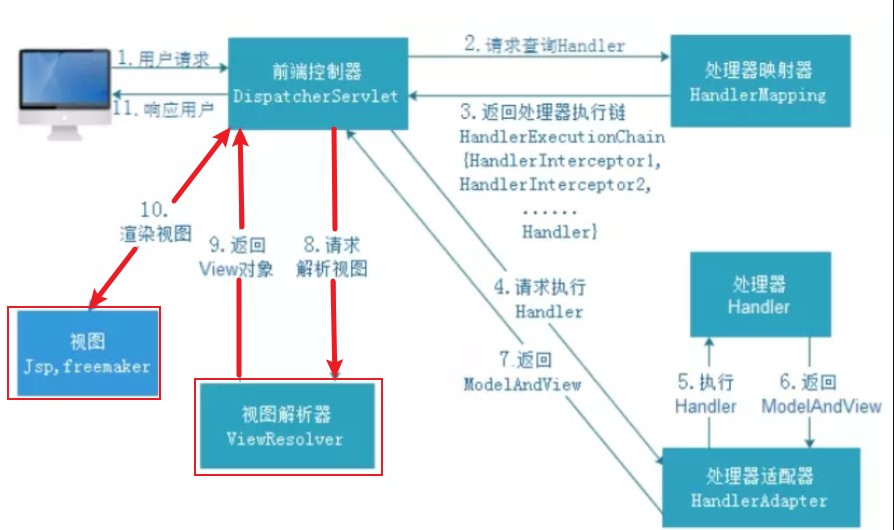

## Thymeleaf基本概念

### 概念

Thymeleaf的主要目标是将优雅的自然模板带到开发工作流程中，并将HTML在浏览器中正确显示，并且可以作为静态原型，让开发团队能更容易地协作。Thymeleaf能够处理HTML，XML，JavaScript，CSS甚至纯文本。

 长期以来,jsp在视图领域有非常重要的地位,随着时间的变迁,出现了一位新的挑战者:Thymeleaf,**Thymeleaf是原生的**,**不依赖于标签库**.它能够在接受原始HTML的地方进行编辑和渲染.因为它没有与Servelet规范耦合,因此Thymeleaf模板能进入jsp所无法涉足的领域。

  Thymeleaf在Spring Boot项目中放入到resources/templates中。这个文件夹中的内容是无法通过浏览器URL直接访问的（和WEB-INF效果一样），所有Thymeleaf页面必须先走控制器。

### 优势

-   SpringBoot官方推荐使用的视图模板技术，和SpringBoot完美整合。
-   不经过服务器运算仍然可以直接查看原始值，对前端工程师更友好。

### 官方文档

[官方文档](assets/Thymeleaf-3.0.11.pdf)

## 快速体验Thymeleaf

### 快速创建一个SpringBoot项目

创建Springboot项目详见 : [自动部署](../../02_SpringBoot快速部署/SpringBoot快速部署.md#自动部署)

```xml
<!--整合Mybatis-->
<dependency>
	<groupId>org.mybatis.spring.boot</groupId>
	<artifactId>mybatis-spring-boot-starter</artifactId>
	<version>2.2.0</version>
</dependency>
<dependency>
	<groupId>mysql</groupId>
	<artifactId>mysql-connector-java</artifactId>
	<version>8.0.21</version>
</dependency>
<dependency>
	<groupId>org.projectlombok</groupId>
	<artifactId>lombok</artifactId>
	<version>1.18.26</version>
	<scope>provided</scope>
</dependency>
<!--pagehelper分页插件-->
<dependency>
	<groupId>com.github.pagehelper</groupId>
	<artifactId>pagehelper-spring-boot-starter</artifactId>
	<version>1.2.12</version>
</dependency>
```

简单配置Mybatis依赖以及logback配置文件:

application.yml
```yml
spring:
  datasource:
    url: jdbc:mysql://xxx.xxx.xxx.xx:3306/codernotes?useSSL=false&useUnicode=true&characterEncoding=UTF-8&serverTimezone=Asia/Shanghai
    driver-class-name: com.mysql.cj.jdbc.Driver
    username: CoderNotes
    password: CoderNotes
server:
  port: 8080
  servlet:
    context-path: /springboot05
mybatis:
  type-aliases-package: com.meturing.pojo #指定pojo的位置
  mapper-locations: classpath:mapper/*.xml  #如果没有将Mapper与接口放到一起,可以使用该参数指定Mapper的位置
```

logback.xml
```xml
<?xml version="1.0" encoding="UTF-8" ?>
<configuration>
    <!-- 控制台输出 -->
    <appender name="Stdout" class="ch.qos.logback.core.ConsoleAppender">
        <!-- 日志输出格式 -->
        <layout class="ch.qos.logback.classic.PatternLayout">
            <!--格式化输出：%d表示日期，%thread表示线程名，%-5level：级别从左显示5个字符宽度%msg：日志消息，%n是换行符-->
            <pattern>%d{yyyy-MM-dd HH:mm:ss.SSS} [%thread] %-5level %logger{50} - %msg%n
            </pattern>
        </layout>
    </appender>
    <!-- 日志输出级别 -->
    <root level="info">
        <appender-ref ref="Stdout"/>
    </root>
    <!-- 指定包的日志级别 -->
    <logger name="com.meturing.mapper" level="DEBUG"></logger>
</configuration>
```

### 导入Thymeleaf依赖

```xml
<!--导入Thymeleaf相关依赖-->
<dependency>
	<groupId>org.springframework.boot</groupId>
	<artifactId>spring-boot-starter-thymeleaf</artifactId>
	<version>2.4.5</version>
</dependency>
```

### 关于Thymeleaf默认配置

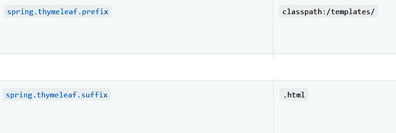

### 实现代码

#### 创建Thymeleaf页面

resources/templates/HelloThymeleaf.html
```html
<!DOCTYPE html>
<html lang="en">
<head>
    <meta charset="UTF-8">
    <title>Title</title>
</head>
<body>
<h1>Hello Thymeleaf Page</h1>
</body>
</html>
```

#### 创建Controller

com.meturing.controller.HelloThymeleafController.java
```Java
@Controller
public class HelloThymeleafController {
    @RequestMapping("/HelloThymeleaf")
    public String helloThymeleaf(){
        return "HelloThymeleaf";
    }
}
```

### 测试效果

我们看到,如果直接访问`http://localhost:8080/springboot05/HelloThymeleaf`页面打开`HelloThymeleaf.html`页面

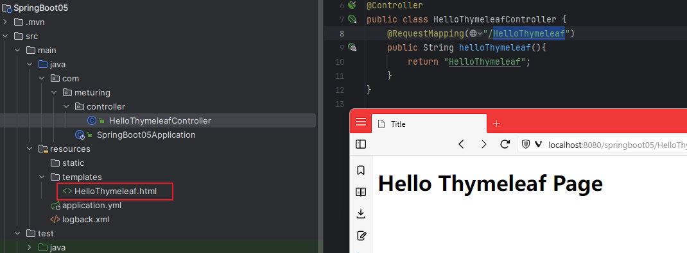

## Thymeleaf基本使用

### th名称空间与基本概念


1. 标准变量表达式必须依赖标签,不能独立使用
2. 标准变量表达式一般在开始标签中,以 th开头
3. 语法为: `<标签 th:属性名="${参数key}">文本</标签>`
4. 表达式中可以通过`${}`取出域中的值并放入标签的指定位置
5. `${}`在这里不能单独使用,必须在 th:后面的双引号里使用

> 注意 : 需要修改HTML中的声明空间 `<html xmlns:th="http://www.thymeleaf.org" >`


### th名称框架的常见使用

#### 基本属性控制

任何HTML标签原有的属性，前面加上『th:』就都可以通过Thymeleaf来设定新值

例如 :
- 修改文本 :  `<p th:text="${标签体新值}">标签体原始值</p>`
- 修改属性 :  `<input type="text" name="username" th:value="${文本框新值}" value="文本框旧值" />`
- 解析URL :  `<a th:href="@{/index.html}">访问index.html</a>`

使用案例:

com.meturing.controller.Namespace01Controller.java
```Java
@Controller
public class Namespace01Controller {
    @RequestMapping("/testNamespace01")
    public ModelAndView testNamespace01(){
        ModelAndView modelAndView = new ModelAndView();
        modelAndView.setViewName("Namespace01");
        Map<String, Object> model = modelAndView.getModel();
        model.put("sText", "这是新文本");
        model.put("userName", "这是新用户名");
        return modelAndView;
    }
}
```

resources/templates/Namespace01.html
```Html
<!DOCTYPE html>
<html lang="en" xmlns:th="http://www.thymeleaf.org">
<head>
    <meta charset="UTF-8">
    <title>Title</title>
</head>
<body>
修改文本 : <p th:text="${sText}">原来的文本</p>
<hr />
修改属性 : <input type="text" name="userName" value="root" th:value="${userName}" disabled >
<hr />
解析URL : <a th:href="@{/HelloThymeleaf}">访问HelloThymeleaf</a>
</body>
</html>
```

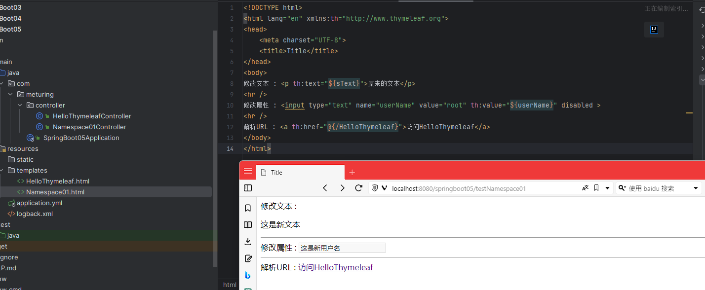

> 使用Thymeleaf解析url地址`@{}`的作用是动态获取上下文路径（当前项目路径）

#### 访问Servlet并携带参数

```Html
<a th:href="@{user(method='toRegisterPage')}" class="register">注册</a>
```

`@{user(method='toRegisterPage')`  表示访问：`http://localhost:8080/webday09/user?method=toRegisterPage`

#### th:if与th:unless

`th:if` : 如果它值为true 则显示标签
`th:unless` : 如果它值为true 则不显示标签

com.meturing.controller.Namespace01Controller.java
```Java
@Controller
public class Namespace01Controller {
    @RequestMapping("/testNamespace02")
    public ModelAndView testNamespace02(){
        ModelAndView modelAndView = new ModelAndView();
        modelAndView.setViewName("Namespace02");
        Map<String, Object> model = modelAndView.getModel();
        model.put("teacherList", "zhangsan");
        return modelAndView;
    }
}
```

resources/templates/Namespace02.html
```Html
<!DOCTYPE html>
<html lang="en" xmlns:th="http://www.thymeleaf.org">
<head>
    <meta charset="UTF-8">
    <title>Title</title>
</head>
<body>
<p th:if="${#lists.isEmpty(teacherList)}">没有数据</p>
<p th:if="${not #lists.isEmpty(teacherList)}">有数据</p>
<p th:unless="${#lists.isEmpty(teacherList)}">有数据</p>
</body>
</html>
```

展示效果 : 
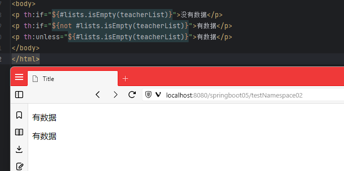

#### th:switch


com.meturing.controller.Namespace01Controller.java
```Java
@Controller
public class Namespace01Controller {
    @RequestMapping("/testNamespace03")
    public ModelAndView testNamespace03(){
        ModelAndView modelAndView = new ModelAndView();
        modelAndView.setViewName("Namespace02");
        Map<String, Object> model = modelAndView.getModel();
        model.put("sex", "man");
        return modelAndView;
    }
}
```

resources/templates/Namespace02.html
```Html
<!DOCTYPE html>
<html lang="en" xmlns:th="http://www.thymeleaf.org">
<head>
    <meta charset="UTF-8">
    <title>Title</title>
</head>
<body>
<div th:switch="${sex}">
    <p th:case="man">男性</p>
    <p th:case="woman">男性</p>
</div>
</body>
</html>
```

展示效果 : 
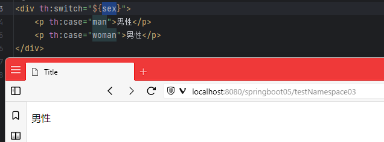

#### th:each

类似于`vue中的v-for`对集合进行迭代遍历，每次遍历出来一条数据就添加一个标签
语法 :` th:each="遍历出来的数据，数据的状态 ：要遍历的数据"`

status 表示遍历的状态 包含以下属性:
1. index 遍历出来每一个元素的下标
2. count 遍历出来每一个元素的计数
3. size  遍历集合的长度
4. current 遍历出来的当前元素
5. even/odd  表示遍历出来的元素是否是奇数或者是否是偶数
6. first 表示遍历出来的元素是否是第一个
7. last 表示遍历出来的元素是否是最后一个

com.meturing.controller.Namespace01Controller.java
```Java
@Controller
public class Namespace01Controller {
	    @RequestMapping("/testNamespace04")
    public ModelAndView testNamespace04(){
        ModelAndView modelAndView = new ModelAndView();
        modelAndView.setViewName("Namespace03");
        Map<String, Object> model = modelAndView.getModel();
        ArrayList<Teacher> teaschers = new ArrayList<>();
        Teacher teacher1 = new Teacher("zhangsan", "男", 35);
        Teacher teacher2 = new Teacher("lisi", "男", 44);
        Teacher teacher3 = new Teacher("wanger", "男", 32);
        Teacher teacher4 = new Teacher("mazi", "男", 58);
        teaschers.add(teacher1);
        teaschers.add(teacher2);
        teaschers.add(teacher3);
        teaschers.add(teacher4);
        model.put("teaschers",teaschers);
        return modelAndView;
    }
}
```

resources/templates/Namespace03.html
```Html
<!DOCTYPE html>
<html lang="en" xmlns:th="http://www.thymeleaf.org">
<head>
    <meta charset="UTF-8">
    <title>Title</title>
    <style>
        th,td{
            border: solid 1px black;
        }
    </style>
</head>
<body>
<table cellpadding="0px" cellspacing="0px">
    <thead>
        <th>姓名</th> <th>性别</th> <th>年龄</th>
        <th>下标</th> <th>计数</th> <th>长度</th>
        <th>当前元素</th> <th>是否偶数</th> <th>是否奇数</th>
        <th>是否第一个</th> <th>是否最后一个</th>
    </thead>
    <tbody>
        <tr th:each="teacher,status : ${teaschers}">
            <td th:text="${teacher.name}"></td>
            <td th:text="${teacher.sex}"></td>
            <td th:text="${teacher.age}"></td>
            <td th:text="${status.index}"></td>
            <td th:text="${status.count}"></td>
            <td th:text="${status.size}"></td>
            <td th:text="${status.current}"></td>
            <td th:text="${status.even}"></td>
            <td th:text="${status.odd}"></td>
            <td th:text="${status.first}"></td>
            <td th:text="${status.last}"></td>
        </tr>
    </tbody>
</table>
</body>
</html>
```

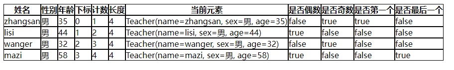

#### th:onclick

给元素绑定事件,单击事件并传递参数

写法1:仅仅支持数字和布尔类型参数的传递,字符串不支持
```html
<a href="javascript:viod(0)"  th:onclick="'del('+${emp.empno}+')'">删除</a>
```

写法2:支持数字和文本类型的参数传递
```Html
<a href="javascript:void(0)" th:onclick="delEmp([[${emp.empno}]],[[${emp.ename}]])">删除</a>
```

com.meturing.controller.Namespace01Controller.java
```Java
@Controller
public class Namespace01Controller {
    @RequestMapping("/testNamespace05")
    public ModelAndView testNamespace05(){
        ModelAndView modelAndView = new ModelAndView();
        modelAndView.setViewName("Namespace04");
        Map<String, Object> model = modelAndView.getModel();
        model.put("age",18);
        model.put("text","你好");
        model.put("name","zhangsan");
        return modelAndView;
    }
}
```

resources/templates/Namespace04.html
```Html
<!DOCTYPE html>
<html lang="en" xmlns:th="http://www.thymeleaf.org">
<head>
    <meta charset="UTF-8">
    <title>Title</title>
    <link src="js/jquery-3.5.1.min.js"/>
</head>
<body>
<a href="javascript:void(0)"  th:onclick="'shay('+${age}+')'">点击继续</a>
<a href="javascript:void(0)" th:onclick="add([[${text}]],[[${name}]])">点击继续</a>
</body>
<script type="text/javascript">
    function shay(age){
        alert("我今年:"+age);
    }
    function add(text,name){
        alert(text+name);
    }
</script>
</html>
```

执行结果:
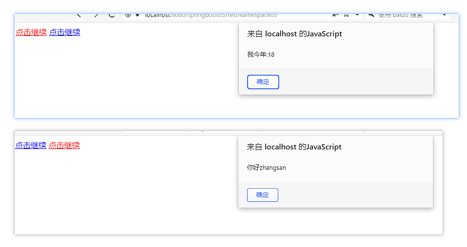

> 注意不要忘了导入JS

### 运算符


## 域对象

### 全局域 ServletContext

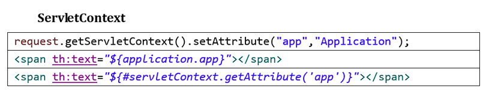

### 请求域 request.setAttribute

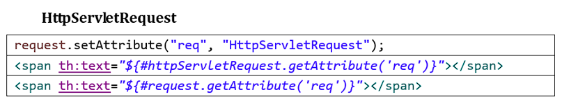


### 会话 session

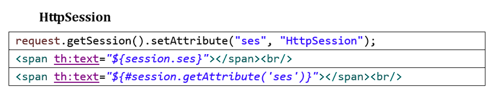


## 内置对象

Thymeleaf提供了一些内置对象，内置对象可直接在模板中使用。这些对象是以#引用的。

使用内置对象的语法:
1. 引用内置对象需要使用#
2. 大部分内置对象的名称都以s结尾。如：strings、numbers、dates
3. 常见内置对象如下:
	1. `#arrays`：数组操作的工具；
	2. `#aggregates`：操作数组或集合的工具；
	3. `#bools`：判断boolean类型的工具；
	4. `#calendars`：类似于`#dates`，但是是java.util.Calendar类的方法；
	5. `#ctx`：上下文对象，可以从中获取所有的thymeleaf内置对象；
	6. `#dates`：日期格式化内置对象，具体方法可以参照java.util.Date；
	7. `#numbers`： 数字格式化；#strings：字符串格式化，具体方法可以参照String，如startsWith、contains等；
	8. `#objects`：参照java.lang.Object；
	9. `#lists`：列表操作的工具，参照java.util.List；
	10. `#sets`：Set操作工具，参照java.util.Set；#maps：Map操作工具，参照java.util.Map；
	11. `#messages`：操作消息的工具。

具体可参考 : [官方文档](https://www.thymeleaf.org/doc/tutorials/3.0/usingthymeleaf.html#number-literals)

### 基本内置对象

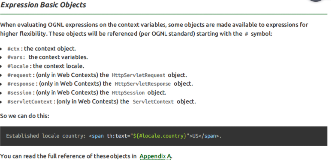

```java
<!--使用request对象-->
<p th:text="${#request.getClass().getName()}">使用request对象所属类的全限定名</p>
<p th:text="${#request.getContextPath()}">使用request对象项目部署名</p>
<p th:text="${#request.getAttribute('username')}">使用request域对象项目部署名</p>
```

-   **如果不清楚这个对象有哪些方法可以使用，那么就通过getClass().getName()获取全类名，再回到Java环境查看这个对象有哪些方法**
-   内置对象的方法可以直接调用
-   调用方法时需要传参的也可以直接传入参数

### 公共内置对象

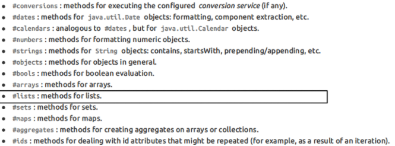

```java
<!--lists内置对象-->
<p th:text="${#lists.isEmpty(aNotEmptyList)}">判断aNotEmptyList这个key是否为空</p>
<p th:text="${#lists.isEmpty(anEmptyList)}">判断anEmptyList这个key是否为空</p>
```

公共内置对象的源码位置

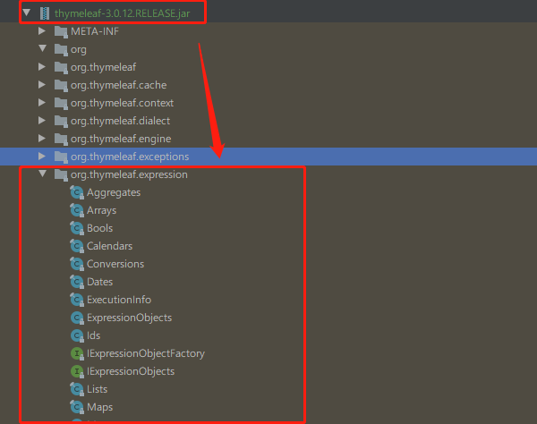

接下来我们着重学习 `strings` `dates` `numbers`

#### strings对象

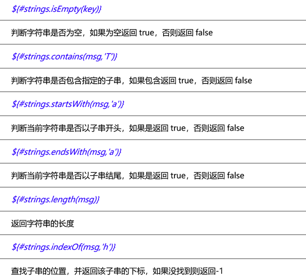

#### dates对象

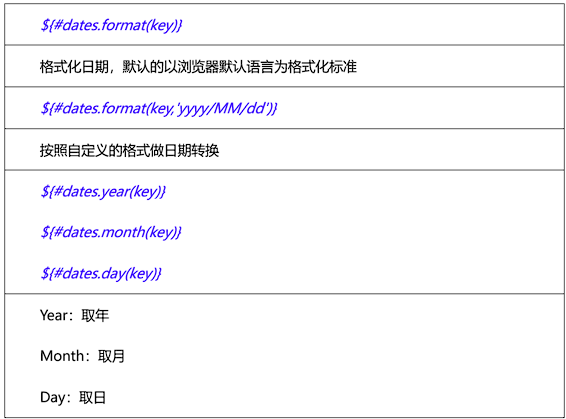

#### numbers对象

`#numbers.formatDecimal(numbwe,整数位,整数位千分位标识符,小数位,小数位表示符)`

例如:`${#numbers.formatDecimal(num,1,&apos;COMMA&apos;,2,&apos;POINT&apos;)}` 
其中 : 1表示整数位至少一位，不足以0补齐，如：num = 0.00，2表示小数点后有两位

关于整数位的区别如下:
`${#numbers.formatDecimal(num,0,&apos;COMMA&apos;,2,&apos;POINT&apos;)}则显示 .00`
`${#numbers.formatDecimal(num,1,&apos;COMMA&apos;,2,&apos;POINT&apos;)}则显示 0.00`

## 包含其他页面模板

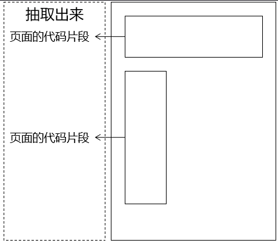

### 创建模板

```html
<div th:fragment="模板名称">
    <p>被抽取出来的头部内容</p>
</div>
```

### 使用模板

| 语法         | 效果                           | 特点                    |
| ---------- | ---------------------------- | --------------------- |
| th:insert  | 把目标的代码片段整个插入到当前标签内部          | 它会保留页面自身的标签           |
| th:replace | 用目标的代码替换当前标签                 | 它不会保留页面自身的标签          |
| th:include | 把目标的代码片段去除最外层标签，然后再插入到当前标签内部 | 它会去掉片段外层标记，同时保留页面自身标记 |

```html
<!-- 代码片段所在页面的逻辑视图 :: 代码片段的名称 -->
<div id="badBoy" th:insert="segment :: header">
    div标签的原始内容
</div>

<div id="worseBoy" th:replace="segment :: header">
    div标签的原始内容
</div>

<div id="worstBoy" th:include="segment :: header">
    div标签的原始内容
</div>
```