## SpringBoot开发者工具实现热部署

在前面的学习中,我们使用SpringBoot发现 :  当我们更新程序中的代码时,如果需要生效需要重新启动SpringBoot项目工程,这样是很麻烦的. 因为在正式的开发部署中,我们会入大量的插件,启动的动作是很重的.

我们可以使用SpringBoot官方提供的开发者工具,将项目设置为热部署的方式,动态更新代码文件,无需重启.

### 导入依赖

```XML
<dependency>
	<groupId>org.springframework.boot</groupId>
	<artifactId>spring-boot-devtools</artifactId>
	<scope>runtime</scope>
	<optional>true</optional>
</dependency>
```

### 修改application.xml

```ymal
spring:
  devtools:
    restart:
      enabled: true
```

### 修改编译工具

#### IDEA2021.1之前

开启自动构建

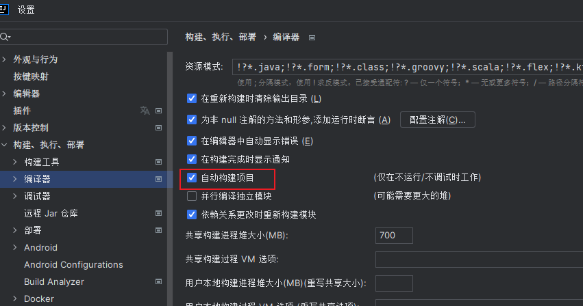

修改注册表 : `Ctrl+Shift+Alt+/` 点击弹出框中`Registry`...

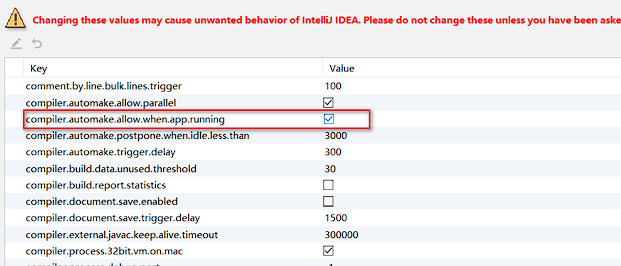

#### IDEA2021.1之后

开启自动构建


开启动态编译功能

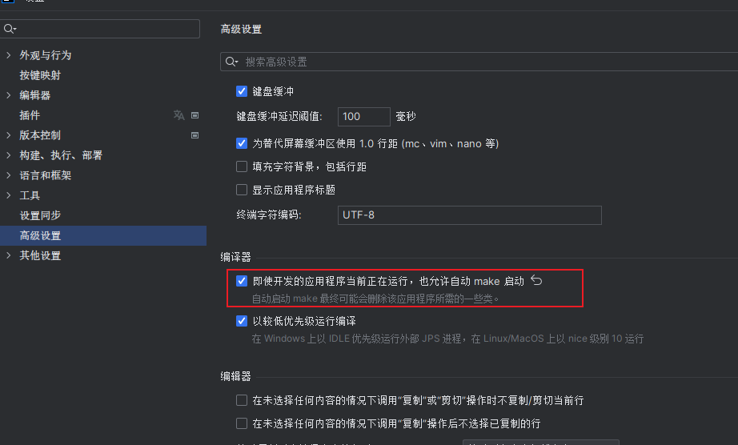

## 项目打包

SpringBoot项目可以是jar类型的maven项目，也可以是一个war类型的maven项目，取决于我们要不要整合jsp使用。但是不管是哪种项目类型，已经不是我们传统意义上的项目结构了

在本地使用SpringBoot的启动器即可访问我们开发的项目。如果我们将项目功能开发完成后，需要使用SpringBoot的打包功能来将项目进行打包。

### 打包成Jar

jar类型项目使用SpringBoot打包插件打包时，会在打成的jar中内置一个tomcat的jar。所以我们可以使用jdk直接运行该jar项目可，jar项目中有一个功能，将功能代码放到其内置的tomcat中运行。我们直接使用浏览器访问即可。

#### 修改Pom文件

修改打包方式为Jar

```XMl
<packaging>jar</packaging>
```

导入SpringBoot的打包插件

```XMl
<build>
	<plugins>
		<plugin>
			<groupId>org.springframework.boot</groupId>
			<artifactId>spring-boot-maven-plugin</artifactId>
		</plugin>
	</plugins>
</build>
```

#### 使用Maven打包

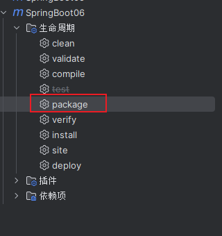

在工程目录的target目录下生成Jar包

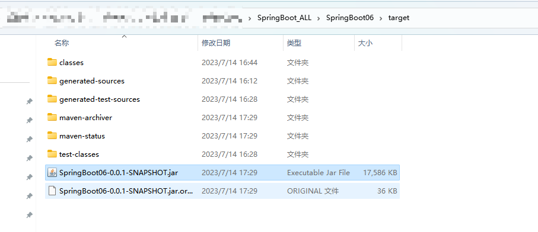

#### 运行测试

cmd 命令窗口中执行 `java -jar jar包的名字`

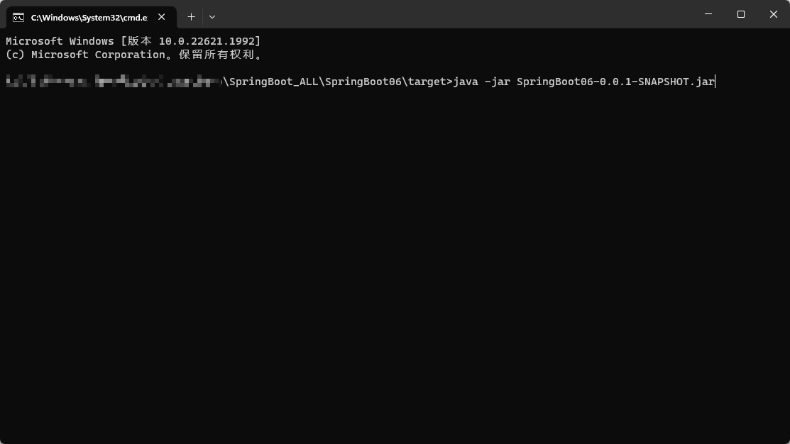

运行

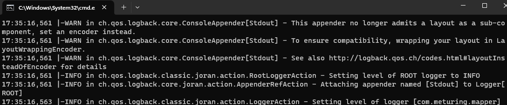

> 注意 : 需要配置JDK的环境变量 以及 运行Jar包时需要注意位置

### 打包成War

在打包时需要将内置的tomcat插件排除，配置servlet的依赖。将war正常的放到tomcat服务器中运行即可

如果我们当前的maven项目本身就是war类型的项目，直接打包即可,**但是如果我们当前的maven项目是jar类型的项目，我们需要将项目修改为war类型，修改项目的pom文件，使用packaging标签设置值为war.并且需要在项目中创建webapp文件夹，并设置为资源文件夹。**

#### 修改Pom文件

修改打包方式为Jar

```XMl
<packaging>war</packaging>
```

导入SpringBoot的打包插件

```XMl
<build>
	<plugins>
		<plugin>
			<groupId>org.springframework.boot</groupId>
			<artifactId>spring-boot-maven-plugin</artifactId>
		</plugin>
	</plugins>
</build>
```

#### webapp 文件夹

这个看需要添加,如果是JSP文件需要用的话,可以使用下述操作配置

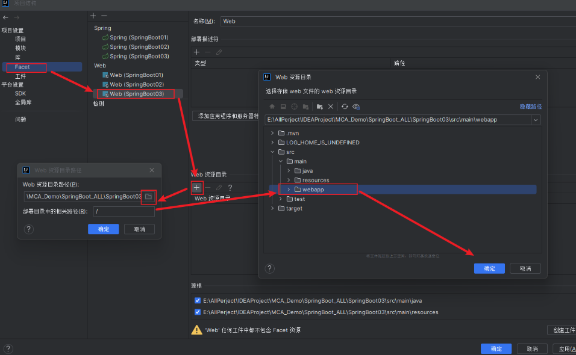

#### 排除Spring工程组件

由于SpringBoot工程文件中自带了Tomcat,所以我们需要将它排除,并设置为仅开发使用,打包编译时排除

```XML
<!-- 手动将Tomcat从Web启动器中排除-->
<dependency>
	<groupId>org.springframework.boot</groupId>
	<artifactId>spring-boot-starter-web</artifactId>
	<exclusions>
		<exclusion>
			<groupId>org.springframework.boot</groupId>
			<artifactId>spring-boot-starter-tomcat</artifactId>
		</exclusion>
	</exclusions>
</dependency>
<!-- 添加Tomcat依赖,并限制为provided,打包时不会打包依赖-->
<dependency>
	<groupId>org.springframework.boot</groupId>
	<artifactId>spring-boot-starter-tomcat</artifactId>
	<scope>provided</scope>
</dependency>
```

#### 修改启动类

继承`SpringBootServletInitializer`类,并重写`configure`方法

```java
@SpringBootApplication
public class SpringBoot06Application extends SpringBootServletInitializer {
    @Override
    protected SpringApplicationBuilder configure(SpringApplicationBuilder builder) {
        return builder.sources(SpringBoot06Application.class);
    }
    public static void main(String[] args) {
        SpringApplication.run(SpringBoot06Application.class, args);
    }
}
```

#### 使用Maven打包


在工程目录的target目录下生成war包


#### 运行测试

将War包放置 Tomcat 目录的webapps文件夹下

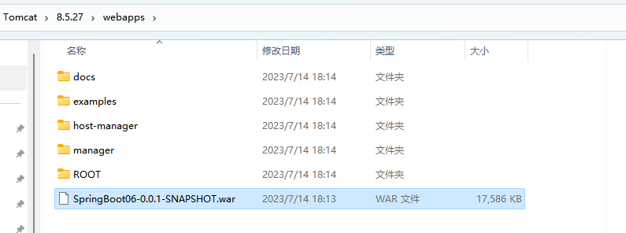

启动Tomcat

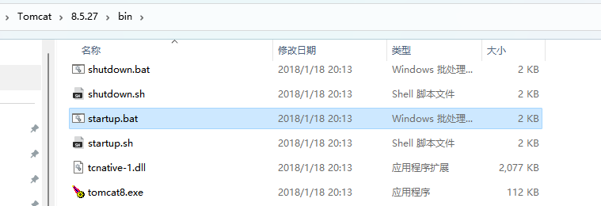

war包将在Tomcat启动后自行解压

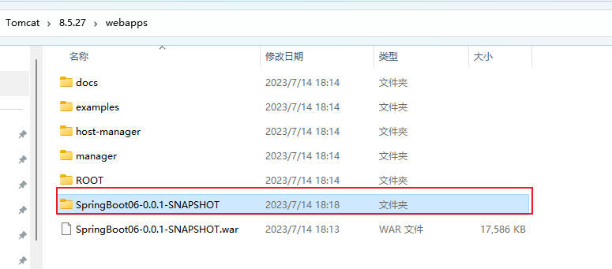

访问 :` http://localhost:8080/SpringBoot06-0.0.1-SNAPSHOT/HelloThymeleaf`

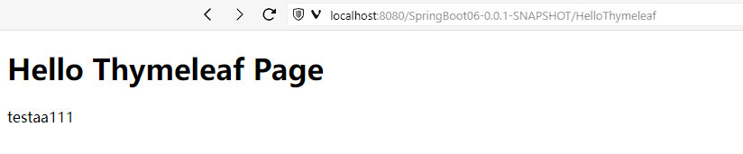


