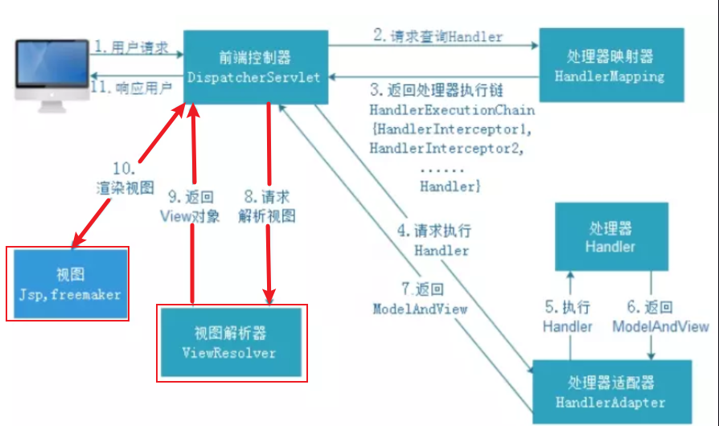
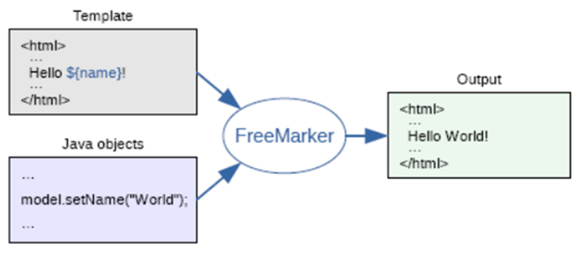
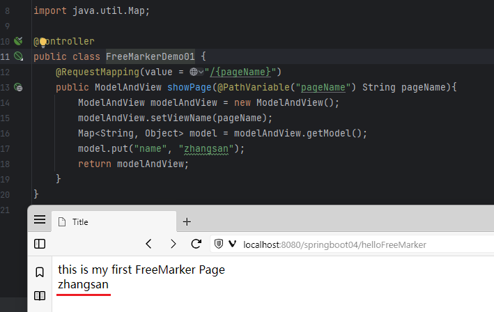
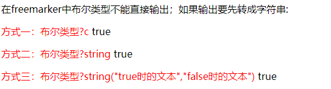
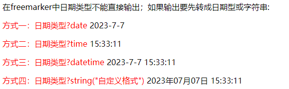
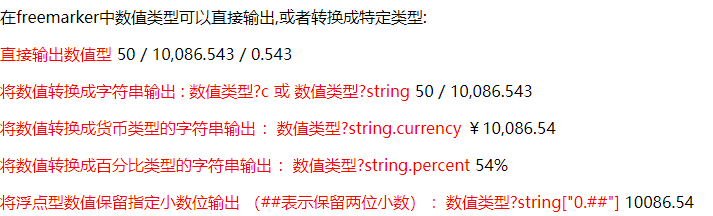
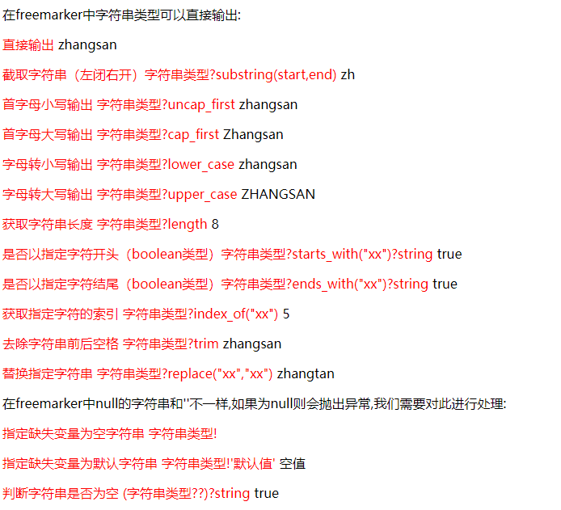
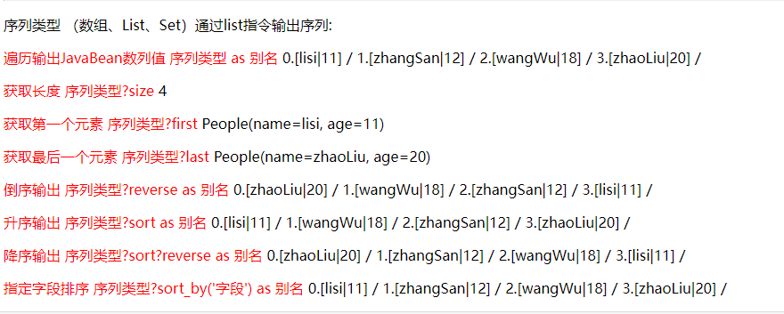
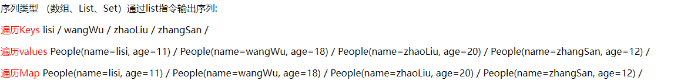
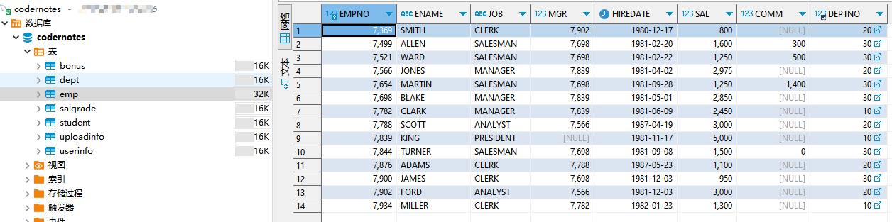

> 写在前面 : FreeMarker是MVC下的产物,需要SpringMVC的技术支持,将ModelAndView对象子啊视图解析器中解析成View对象并渲染给前端用户



## 了解FreeMarker

 **FreeMarker是一款模板引擎**： 即一种基于模板和要改变的数据， 并用来生成输出文本（HTML网页、电子邮件、配置文件、源代码等）的通用工具。 它不是面向最终用户的，而是一个Java类库，是一款程序员可以嵌入他们所开发产品的组件。
 
FreeMarker是免费的，基于Apache许可证2.0版本发布。其模板编写为FreeMarker Template Language（FTL），属于简单、专用的语言。需要准备数据在真实编程语言中来显示，比如数据库查询和业务运算， 之后模板显示已经准备好的数据。在模板中，主要用于如何展现数据， 而在模板之外注意于要展示什么数据。



**freemarker并不关心数据的来源，只是根据模板的内容**，将数据模型在模板中显示并输出文件（通常为html，也可以生成其它格式的文本文件）

freemarker作为springmvc一种视图格式，**默认情况下SpringMVC支持freemarker视图格式**。 需要创建Spring Boot+Freemarker工程用于测试模板。

## 快速使用FreeMarker

### 导入依赖

```XMl
<!--freemarker依赖支持-->
<dependency>
	<groupId>org.springframework.boot</groupId>
	<artifactId>spring-boot-starter-freemarker</artifactId>
</dependency>
```

### FreeMarker属性配置

我们查看SpringBoot官方提供的FreeMarker属性配置如下 :  [官方配置](https://docs.spring.io/spring-boot/docs/current/reference/html/application-properties.html#appendix.application-properties)


默认情况下,freemarker是以`.ftlh为后缀`,存放于`templates目录`下,我们通常不会更改相关属性,如需更改请参照官方文档进行

### 实现代码

resources/templates/helloFreeMarker.ftlh
```html
<!DOCTYPE html>
<html lang="en">
<head>
    <meta charset="UTF-8">
    <title>Title</title>
</head>
<body>
this is my first FreeMarker Page <br/>
${name}
</body>
</html>
```

com.meturing.controller.FreeMarkerDemo01.java
```java
@Controller
public class FreeMarkerDemo01 {
    @RequestMapping(value = "/{pageName}")
    public ModelAndView showPage(@PathVariable("pageName") String pageName){
        ModelAndView modelAndView = new ModelAndView();
        modelAndView.setViewName(pageName);
        Map<String, Object> model = modelAndView.getModel();
        model.put("name", "zhangsan");
        return modelAndView;
    }
}
```

### 效果

我们看到,如果直接访问`http://localhost:8080/springboot04/helloFreeMarker`页面打开`helloFreeMarker.ftlh`页面,并将`ModelAndView`中存放的`name`参数展示出来



## FreeMarker数据类型

### 布尔类型

com.meturing.controller.FreeMarkerDemo01.java
```Java
@Controller  
public class FreeMarkerDemo01 {
    //测试FreeMarker中的数据类型
    @RequestMapping(value = "/testDataType")
    public ModelAndView testDataType(){
        ModelAndView modelAndView = new ModelAndView();
        modelAndView.setViewName("testDataType");
        //布尔类型
        Map<String, Object> model = modelAndView.getModel();
        model.put("vip",true);
        return modelAndView;
    }
}
```

resources/templates/testDataType.ftlh
```html
<!DOCTYPE html>
<html lang="en">
<head>
    <meta charset="UTF-8">
    <title>Title</title>
    <style type="text/css">
        p>span {
           color: red;
        }
    </style>
</head>
<body>
<#-- 测试布尔类型 -->
<hr/>
<p>在freemarker中布尔类型不能直接输出；如果输出要先转成字符串:</p>
<p><span>方式一：布尔类型?c  </span> ${vip?c}</p>
<p><span>方式二：布尔类型?string  </span> ${vip?string}</p>
<p><span>方式三：布尔类型?string("true时的文本","false时的文本")  </span> ${vip?string('true','false')}</p>
</body>
</html>
```



### 日期类型

com.meturing.controller.FreeMarkerDemo01.java
```Java
@Controller  
public class FreeMarkerDemo01 {
    //测试FreeMarker中的数据类型
    @RequestMapping(value = "/testDataType")
    public ModelAndView testDataType(){
        ModelAndView modelAndView = new ModelAndView();
        modelAndView.setViewName("testDataType");
        Map<String, Object> model = modelAndView.getModel();
        //日期类型
        model.put("birthday",new Date());
        return modelAndView;
    }
}
```

resources/templates/testDataType.ftlh
```html
<!DOCTYPE html>
<html lang="en">
<head>
    <meta charset="UTF-8">
    <title>Title</title>
    <style type="text/css">
        p>span {
           color: red;
        }
    </style>
</head>
<body>
<#-- 测试日期类型 -->
<p>在freemarker中日期类型不能直接输出；如果输出要先转成日期型或字符串:</p>
<p><span>方式一：日期类型?date  </span> ${birthday?date}</p>
<p><span>方式二：日期类型?time  </span> ${birthday?time}</p>
<p><span>方式三：日期类型?datetime  </span> ${birthday?datetime}</p>
<p><span>方式四：日期类型?string("自定义格式")  </span> ${birthday?string('yyyy年MM月dd日 HH:mm:ss')}</p>
</body>
</html>
```



### 数值类型

com.meturing.controller.FreeMarkerDemo01.java
```Java
@Controller  
public class FreeMarkerDemo01 {
    //测试FreeMarker中的数据类型
    @RequestMapping(value = "/testDataType")
    public ModelAndView testDataType(){
        ModelAndView modelAndView = new ModelAndView();
        modelAndView.setViewName("testDataType");
        Map<String, Object> model = modelAndView.getModel();
        //数值类型
        model.put("age",50);
        model.put("money",10086.543);
        model.put("degree",0.543);
        return modelAndView;
    }
}
```

resources/templates/testDataType.ftlh
```html
<!DOCTYPE html>
<html lang="en">
<head>
    <meta charset="UTF-8">
    <title>Title</title>
    <style type="text/css">
        p>span {
           color: red;
        }
    </style>
</head>
<body>
<#-- 测试数值类型 -->
<p>在freemarker中数值类型可以直接输出,或者转换成特定类型:</p>
<p><span>直接输出数值型  </span> ${age} / ${money} / ${degree}</p>
<p><span>将数值转换成字符串输出 : 数值类型?c 或 数值类型?string  </span> ${age?c} / ${money?string} </p>
<p><span>将数值转换成货币类型的字符串输出 ：数值类型?string.currency  </span> ${money?string.currency} </p>
<p><span>将数值转换成百分比类型的字符串输出 ：数值类型?string.percent  </span> ${degree?string.percent}</p>
<p><span>将浮点型数值保留指定小数位输出 （##表示保留两位小数） ：数值类型?string["0.##"]  </span> ${money?string["0.##"]}</p>
</body>
</html>
```



### 字符串类型

com.meturing.controller.FreeMarkerDemo01.java
```Java
@Controller  
public class FreeMarkerDemo01 {
    //测试FreeMarker中的数据类型
    @RequestMapping(value = "/testDataType")
    public ModelAndView testDataType(){
        ModelAndView modelAndView = new ModelAndView();
        modelAndView.setViewName("testDataType");
        Map<String, Object> model = modelAndView.getModel();
        //字符串类型
        model.put("name","zhangsan");
        model.put("alias",null);
        return modelAndView;
    }
}
```

resources/templates/testDataType.ftlh
```html
<!DOCTYPE html>
<html lang="en">
<head>
    <meta charset="UTF-8">
    <title>Title</title>
    <style type="text/css">
        p>span {
           color: red;
        }
    </style>
</head>
<body>
<#-- 测试字符串类型 -->
<p>在freemarker中字符串类型可以直接输出:</p>
<p><span>直接输出  </span> ${name}</p>
<p><span>截取字符串（左闭右开）字符串类型?substring(start,end)  </span> ${name?substring(0,2)}</p>
<p><span>首字母小写输出 字符串类型?uncap_first  </span> ${name?uncap_first} </p>
<p><span>首字母大写输出 字符串类型?cap_first</span> ${name?cap_first} </p>
<p><span>字母转小写输出 字符串类型?lower_case</span> ${name?lower_case} </p>
<p><span>字母转大写输出 字符串类型?upper_case</span> ${name?upper_case} </p>
<p><span>获取字符串长度 字符串类型?length</span> ${name?length} </p>
<p><span>是否以指定字符开头（boolean类型）字符串类型?starts_with("xx")?string</span> ${name?starts_with('z')?string} </p>
<p><span>是否以指定字符结尾（boolean类型）字符串类型?ends_with("xx")?string</span> ${name?ends_with('n')?string} </p>
<p><span>获取指定字符的索引 字符串类型?index_of("xx")</span> ${name?index_of('s')} </p>
<p><span>去除字符串前后空格 字符串类型?trim</span> ${name?trim} </p>
<p><span>替换指定字符串 字符串类型?replace("xx","xx")</span> ${name?replace('s','t')} </p>
<p>在freemarker中null的字符串和''不一样,如果为null则会抛出异常,我们需要对此进行处理:</p>
<p><span>指定缺失变量为空字符串 字符串类型! </span> ${alias!} </p>
<p><span>指定缺失变量为默认字符串 字符串类型!'默认值' </span> ${alias!'空值'} </p>
<p><span>判断字符串是否为空 (字符串类型??)?string </span> ${(name??)?string} </p>
<hr/>
</body>
</html>
```



### 序列类型

com.meturing.pojo.People.java
```Java
@Data
@AllArgsConstructor
@NoArgsConstructor
@ToString
public class People implements Serializable {
    private String name;
    private Integer age;
}
```

com.meturing.controller.FreeMarkerDemo01.java
```Java
@Controller  
public class FreeMarkerDemo01 {
    //测试FreeMarker中的数据类型
    @RequestMapping(value = "/testDataType")
    public ModelAndView testDataType(){
        ModelAndView modelAndView = new ModelAndView();
        modelAndView.setViewName("testDataType");
        Map<String, Object> model = modelAndView.getModel();
		People lisi = new People("lisi", 11);
        People zhangSan = new People("zhangSan", 12);
        People wangWu = new People("wangWu", 18);
        People zhaoLiu = new People("zhaoLiu", 20);
        //序列类型
        List<People> peopleList = new ArrayList<>();
        peopleList.add(lisi);
        peopleList.add(zhangSan);
        peopleList.add(wangWu);
        peopleList.add(zhaoLiu);
        model.put("peopleList",peopleList);
        return modelAndView;
    }
}
```

resources/templates/testDataType.ftlh
```html
<!DOCTYPE html>
<html lang="en">
<head>
    <meta charset="UTF-8">
    <title>Title</title>
    <style type="text/css">
        p>span {
           color: red;
        }
    </style>
</head>
<body>
<#-- 测试序列类型 -->
<#-- <#list 序列名 as 元素名>  ${名称} </#list> -->
<p>序列类型 （数组、List、Set）通过list指令输出序列: </p>
<p><span>遍历输出JavaBean数列值 序列类型 as 别名 </span> <#list peopleList as people>${people_index}.[${people.name}|${people.age}] / </#list></p>
<p><span>获取长度 序列类型?size </span>${peopleList?size}</p>
<p><span>获取第一个元素 序列类型?first </span>${peopleList?first}</p>
<p><span>获取最后一个元素 序列类型?last </span>${peopleList?last}</p>
<p><span>倒序输出 序列类型?reverse as 别名 </span><#list peopleList?reverse as people>${people_index}.[${people.name}|${people.age}] / </#list></p>
<p><span>升序输出 序列类型?sort as 别名 </span><#list peopleList?sort as people>${people_index}.[${people.name}|${people.age}] / </#list></p>
<p><span>降序输出 序列类型?sort?reverse as 别名 </span><#list peopleList?sort?reverse as people>${people_index}.[${people.name}|${people.age}] / </#list></p>
<p><span>指定字段排序 序列类型?sort_by('字段') as 别名 </span><#list peopleList?sort_by('age') as people>${people_index}.[${people.name}|${people.age}] / </#list></p>
</body>
</html>
```



### Map类型

com.meturing.pojo.People.java
```Java
@Data
@AllArgsConstructor
@NoArgsConstructor
@ToString
public class People implements Serializable {
    private String name;
    private Integer age;
}
```

com.meturing.controller.FreeMarkerDemo01.java
```Java
@Controller  
public class FreeMarkerDemo01 {
    //测试FreeMarker中的数据类型
    @RequestMapping(value = "/testDataType")
    public ModelAndView testDataType(){
        ModelAndView modelAndView = new ModelAndView();
        modelAndView.setViewName("testDataType");
        Map<String, Object> model = modelAndView.getModel();
		People lisi = new People("lisi", 11);
        People zhangSan = new People("zhangSan", 12);
        People wangWu = new People("wangWu", 18);
        People zhaoLiu = new People("zhaoLiu", 20);
        //Map类型
		HashMap<String, People> peopleMap = new HashMap<>();
        peopleMap.put(lisi.getName(), lisi);
        peopleMap.put(zhangSan.getName(), zhangSan);
        peopleMap.put(wangWu.getName(), wangWu);
        peopleMap.put(zhaoLiu.getName(), zhaoLiu);
        model.put("peopleMap",peopleMap);
        return modelAndView;
    }
}
```

resources/templates/testDataType.ftlh
```html
<!DOCTYPE html>
<html lang="en">
<head>
    <meta charset="UTF-8">
    <title>Title</title>
    <style type="text/css">
        p>span {
           color: red;
        }
    </style>
</head>
<body>
<#-- 测试Map类型 -->
<#-- <#list Map类型?keys as key别名>  ${Map类型[key别名]} </#list> -->
<p>序列类型 （数组、List、Set）通过list指令输出序列: </p>
<p><span>遍历Keys </span> <#list peopleMap?keys as key>${key} / </#list></p>
<p><span>遍历values </span><#list peopleMap?values as value>${value} / </#list></p>
<p><span>遍历Map </span><#list peopleMap?keys as key>${peopleMap[key]} / </#list></p>
<hr/>
</body>
</html>
```



## FreeMarker常见指令

### assign 自定义变量指令

使用 assign 指令你可以创建一个新的变量， 或者替换一个已经存在的变量。

```Html
<!DOCTYPE html>
<html lang="en">
<head>
    <meta charset="UTF-8">
    <title>Title</title>
</head>
<body>
<#assign str='hello'>
${str}
<br />
<#assign age=1,names=['zhangsan','lisi','wanger']>
${age} / ${names?join(',')}
</body>
</html>
```


### if elseif else 逻辑判断指令

可以使用 if ， elseif 和 else 指令来条件判断是否满足某些条件。


### 内置函数

## 实现案例

### 数据准备

请确保DB中已经存在数据 :  [导入数据库](../../01_Mybatis基础/02_搭建Mybatis项目环境/搭建Mybatis项目环境.md#导入数据库)




