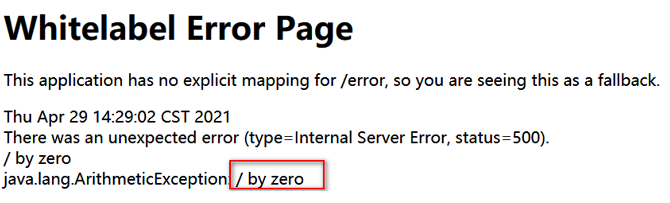
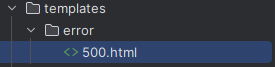
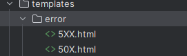
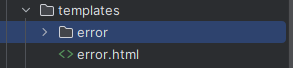

默认情况，Spring Boot项目错误页面如下:



当项目实际上线，如果给用户显示这个页面就不是很友好。当系统出现异常时应该给用户显示更加友好的错误页面。

## 设置指定的错误页

在templates目录下创建error文件夹,我们可以在该文件夹下创建错误码页面,当程序发生错误时将自动展示对应的错误页面,而不是展示对应的错误信息.

例如:
- **具体的错误码**: `500.html `表示当出现500错误时展示该页面
- **模糊匹配错误码**: `4xx.html` 表示当出现4开头的错误时都展示这个页面
- **统一错误页面**: `error.html` 表示如果在页面中没有找到具体的错误页则统一展示该页面

> 优先级如下 :  具体的错误码页面 > 模糊匹配的页面 > 统一的错误页面

### 错误状态码精确匹配



需要在templates目录下创建error目录,并在该目录根据需要处理的码值创建对应的错误页面.

比如: 500.html就是处理错误码500,当出现该错误码时,程序见展示该页面

### 错误状态码模糊匹配



需要在templates目录下创建error目录,并在该目录根据需要处理的码值创建对应的错误页面.
与精确匹配不同的是,我们可以使用X代替某一位具体的数值来达到模糊匹配的效果.

比如:
- 50x.html 则会匹配50开头的所有错误状态码
- 5xx.html 则会匹配5开头的所有错误状态码

### 统一错误页面配置



需要在templates目录下error.html,当程序出现没有找到具体的码值错误页面时,将会采用该通用配置.

## 使用SpringMVC的异常处理

在前面的学习中我们学习了SpringMVC的异常统一处理,详见 : [异常处理](../../04_SpringMVC/14_异常处理/异常处理.md)

在SpringBoot中实现异常处理就相对比较简单,可以参考以下方式:

### 方式一: @ExceptionHandler

> 缺点: **只能处理当前Controller中的异常**

```Java
@Controller
public class HelloThymeleafController {
    @RequestMapping("/HelloThymeleaf")
    public String helloThymeleaf(){
        int i = 1/0;
        return "HelloThymeleaf";
    }

    @ExceptionHandler(value = {ArithmeticException.class,NullPointerException.class})
    public String errorController(){
        return "errorPage";
    }
}
```

### 方式二: @ControllerAdvice+@ExceptionHandler

> 此处优先级低于局部异常处理器

```Java
@ControllerAdvice
public class GloableExceptionHandler {
    @ExceptionHandler(value = {ArithmeticException.class,NullPointerException.class})
    public String GloableExceptionMethod(){
        return "errorPage";
    }
}
```

### 方式三: SimpleMappingExceptionResolver

使用SimpleMappingExceptionResolver类进行全局的异常映射处理

```Java
@Configuration
public class SpringBootConfig {
    @Bean
    public SimpleMappingExceptionResolver SimpleMappingExceptionResolver(){
        SimpleMappingExceptionResolver simpleMappingExceptionResolver = new SimpleMappingExceptionResolver();
        Properties properties = new Properties();
        properties.put("java.lang.ArithmeticException", "errorPage");
        simpleMappingExceptionResolver.setExceptionMappings(properties);
        return simpleMappingExceptionResolver;
    }
}

```

### 方式四: 自定义HandlerExceptionResolver异常处理

自定义配置类并实现HandlerExceptionResolver接口,重写resolveException方法

```java
@Configuration
public class MyHandlerExceptionResolver implements HandlerExceptionResolver {
    @Override
    public ModelAndView resolveException(HttpServletRequest httpServletRequest, HttpServletResponse httpServletResponse, Object o, Exception e) {
        ModelAndView modelAndView = new ModelAndView();
        if (e instanceof ArithmeticException){
            modelAndView.setViewName("errorPage");
        }
        return modelAndView;
    }
}
```


