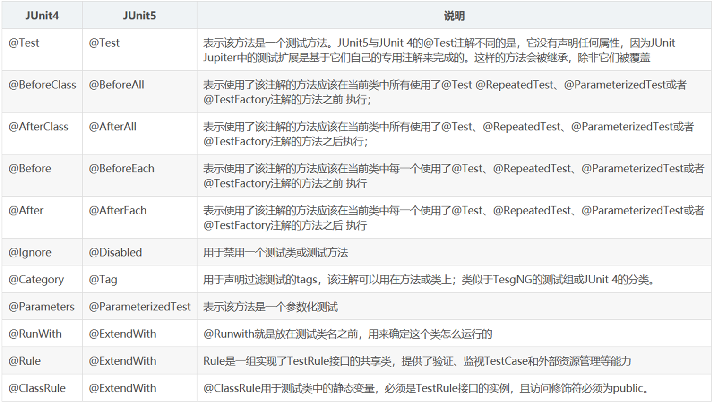
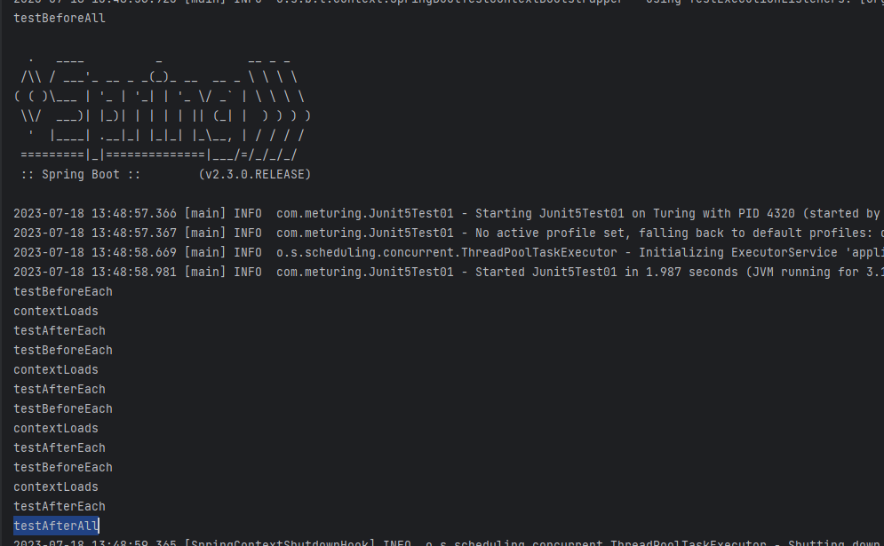

## 了解Junit5

springBoot 2.2.0开始引入Junit5作为单元测试的默认库,JUnit5和之前的版本有很大的不同,由单个子项目的几个不同模块组成:
- `JUnit Platform`是在JVM上启动测试框架的技术,不仅支持Junit自己的测试引擎,其他的测试引擎也可以
- `JUnit Jupiter` 提供了Junit5的最新的编程模型,是Junit5 的核心,内部包含了一个测试引擎,用于在Junit Platform上运行
- `JUnit Vintager`  提供了兼容Junit4/3 的测试引擎

> Junit5 = JUnit Platform+ JUnit Jupiter+JUnit Vintager

## 对Junit4和Junit3的支持

SpringBoot 2.4 以上版本移除了默认对Vintage的依赖,如果需要兼容junit4需要自行引入.

```XMl
<dependency>
	<groupId>org.junit.vintage</groupId>
	<artifactId>junit-vintage-engine</artifactId>
	<scope>test</scope>
	<exclusions>
		<exclusion>
		<groupId>org.hamcrest</groupId>
		<artifactId>hamcrest-core</artifactId> 
		</exclusion>
	</exclusions>
</dependency>
```

## Junit5中的注解

Junit支持Spring中的注解,测试起来比较方便, @Autowired @Transactional 等



## 简单实用

### Junit4

```Java
@BootstrapWith(SpringBootTestContextBootstrapper.class)
@ExtendWith({SpringExtension.class})
public class Junit4Test01 {
    @BeforeClass
    public static void testBeforeClass() {
        System.out.println("testBeforeClass");
    }
    @AfterClass
    public static void testAfterClass() {
        System.out.println("testAfterClass");
    }
    @Before
    public void testBefore() {
        System.out.println("testBefore");
    }
    @After
    public void testAfter() {
        System.out.println("testAfter");
    }
    @Test
    public void testMethod(){
        System.out.println("testMethod");
    }
}
```

执行效果:


### Junit5

```java
@SpringBootTest
@DisplayName("Junit5测试类")
class Junit5Test01 {
    @BeforeAll
    public static void testBeforeAll(){
        System.out.println("testBeforeAll");
    }
    @AfterAll
    public static void testAfterAll(){
        System.out.println("testAfterAll");
    }
    @BeforeEach
    public void testBeforeEach(){
        System.out.println("testBeforeEach");
    }
    @AfterEach
    public void testAfterEach() {
        System.out.println("testAfterEach");
    }
    @RepeatedTest(3)//重复测试3次
    @Timeout(value = 1000,unit = TimeUnit.SECONDS)//超时时间
    @DisplayName("当前是测试类")//当前测试的描述信息
    @Test
    void contextLoads() {
        System.out.println("contextLoads");
    }
}
```

测试效果



## 断言机制

断定某件事情,一定会发生,如果没有发生,那就是出现了问题,所欲的测试运行结束后,会有一个详细的断言报告

断言通常用来对测试需要满足的条件进行验证,这些断言方法都是`org.junit.jupiter.api.Assertions`中的静态方法

### 简单的断言方法


### 测试实例

#### 常规断言

##### 比较值

```Java
@SpringBootTest
@DisplayName("测试断言")
class Junit5Test02 {
    @DisplayName("测试断言1")
    @Test
    public void testMethod01(){
        int age = 18;
        Assertions.assertEquals(10, age,"age参数与期望值10不一致");
    }
	@DisplayName("测试断言2")
    @Test
    public void testMethod02(){
        int age = 10;
        Assertions.assertNotEquals(10, age,"age参数与期望值10一致");
    }
}
```


##### 比较对象

```Java
@SpringBootTest
@DisplayName("测试断言")
class Junit5Test02 {
    @DisplayName("测试断言3")
    @Test
    public void testMethod03(){
        String str1 = new String("123");
        String str2 = new String("123");
        Assertions.assertSame(str1, str2,"两个对象引用不同");
    }
    @DisplayName("测试断言4")
    @Test
    public void testMethod04(){
        String str1 = new String("123");
        String str2 = str1;
        Assertions.assertNotSame(str1, str2,"两个对象为相同引用");
    }
}
```


##### 比较布尔类型

```Java
@SpringBootTest
@DisplayName("测试断言")
class Junit5Test02 {
    @DisplayName("测试断言5")
    @Test
    public void testMethod05(){
        Boolean flag = false;
        Assertions.assertTrue(flag,"结果不是True");
    }
    @DisplayName("测试断言6")
    @Test
    public void testMethod06(){
        Boolean flag = true;
        Assertions.assertFalse(flag,"结果不是Fasle");
    }
}
```


##### 对象判空

```Java
@SpringBootTest
@DisplayName("测试断言")
class Junit5Test02 {
    @DisplayName("测试断言7")
    @Test
    public void testMethod07(){
        People people = new People();
        Assertions.assertNull(people,"结果不为空");
    }
    @DisplayName("测试断言8")
    @Test
    public void testMethod08(){
        People people = null;
        Assertions.assertNotNull(people,"结果为空");
    }
}
```


#### 组合断言

```Java
@SpringBootTest
@DisplayName("测试断言")
class Junit5Test02 {
    @DisplayName("测试断言9")
    @Test
    public void testMethod09(){
        People people = new People("zhangsan",17);
        Assertions.assertAll("assertAll",
                ()-> Assertions.assertNotNull(people,"当前对象为空"),
                ()-> Assertions.assertTrue(18 < people.getAge(),"用户的年龄小于18")
        );
    }
}
```


#### 异常断言

```Java
@SpringBootTest
@DisplayName("测试断言")
class Junit5Test02 {
    @DisplayName("测试断言10")
    @Test
    public void testMethod10()  {
       Assertions.assertThrows(Exception.class,()->{int age = 1/1;},"没有抛出异常");
    }
}
```


#### 超时断言

```Java
@SpringBootTest
@DisplayName("测试断言")
class Junit5Test02 {
    @DisplayName("测试断言11")
    @Test
    public void testMethod11() {
        Assertions.assertTimeout(Duration.ofMillis(3000), () -> {
            Thread.sleep(5000);
        }, "执行时间超过设定值3000毫秒");
    }
}
```


#### 快速断言

```Java
@SpringBootTest
@DisplayName("测试断言")
class Junit5Test02 {
    @DisplayName("测试断言12")
    @Test
    public void testMethod12() {
       boolean flag = false;
        if (!flag) {
            Assertions.fail("结果为fasle");
        }
    }
}
```


## 前置条件

前置条件(assumptions假设) 类似于断言,不同在于: **不满足断言的条件,测试方法会抛出异常表示失败. 而不满足前置条件的话,测试方法根本就不会执行.**

我们可以将前置条件看作测试方法的执行前提,不满足条件则方法没有执行的必要性.

```Java
@SpringBootTest
@DisplayName("测试断言")
class Junit5Test03 {
    @DisplayName("测试断言1")
    @Test
    public void testMethod01(){
        int age = 18;
        Assumptions.assumeTrue(age>18,"age小于等于18");
        System.out.println("后面的代码片段");
    }
}
```


## 嵌套测试

在Junit5中我们可以使用**内部类与@Nested**的组合,来进行嵌套式的测试

```Java
@SpringBootTest
@DisplayName("测试嵌套")
public class Junit5Test04 {
    @BeforeAll
    public static void externalBeforeAll(){System.out.println("ExternalBeforeAll");}
    @AfterAll
    public static void externalAfterAll(){System.out.println("ExternalAfterAll");}
    @BeforeEach
    public void externalBeforeEach(){System.out.println("ExternalBeforeEach");}
    @AfterEach
    public void externalAfterEach(){System.out.println("ExternalAfterEach");}
    @Test
    void isInstantiatedWithNew() {System.out.println("External Test Methods");}
    @Nested
    class InternalTestClass{
        @BeforeEach
        public void interiorBeforeEach(){System.out.println("InteriorBeforeEach");}
        @AfterEach
        public void interiorAfterEach(){System.out.println("InteriorAfterEach");}
        @Test
        void isInstantiatedWithNew() {System.out.println("Interior Test Methods");}
    }
}
```

当我们执行内部类`isInstantiatedWithNew()`方法时 : 会先执行外部的测试方法再执行内部的测试方法

```Java
ExternalBeforeAll
ExternalBeforeEach
InteriorBeforeEach
Interior Test Methods
InteriorAfterEach
ExternalAfterEach
ExternalAfterAll
```


如果我们直接执行外部类`isInstantiatedWithNew()`方法时 : 只执行外部的测试方法,并不会执行内部类的方法

```Java
ExternalBeforeAll
ExternalBeforeEach
External Test Methods
ExternalAfterEach
ExternalAfterAll
```

## 参数化测试

我们在测试的过程中,也可以使用`@ParameterizedTest`注解参数来进行测试
- @ParameterizedTest+@ValueSource  指定参数
- @ParameterizedTest+@MethodSource 指定方法获取参数

### 直接使用参数

```Java
@SpringBootTest
@DisplayName("参数化测试")
public class Junit5Test05 {
    @ParameterizedTest
    @ValueSource(ints = { 1, 2, 3, 4, 5, 6})
    void parametricTestMethods01 (int age) {
        Assertions.assertTrue(age>2&&age<5,"年龄不符");
    }
}
```

上述案例会初始化`{ 1, 2, 3, 4, 5, 6}` 的数据,分别传递给age参数进行测试

我们可以在控制台很直观的看到测试失败的案例


### 使用方法传参

我们也可以指定一个方法获取参数

```Java
@SpringBootTest
@DisplayName("参数化测试")
public class Junit5Test05 {
    @ParameterizedTest
    @MethodSource("testPeopleList")
    void parametricTestMethods02 (People people) {
        Assertions.assertAll(
                ()->{Assertions.assertNotNull(people,"参数不能是NULL");},
                ()->{Assertions.assertTrue(people.getAge()<19,"年龄不能小于19");}
        );
    }
    public static Stream<People> testPeopleList() {
        ArrayList<People> people = new ArrayList<>();
        people.add(new People("zhangsan",18));
        people.add(new People("lisi",21));
        people.add(null);
        return people.stream();
    }
}
```

执行效果如下:


> 注意 : 被调用的方法必须是一个静态的方法,且返回的时Stream流