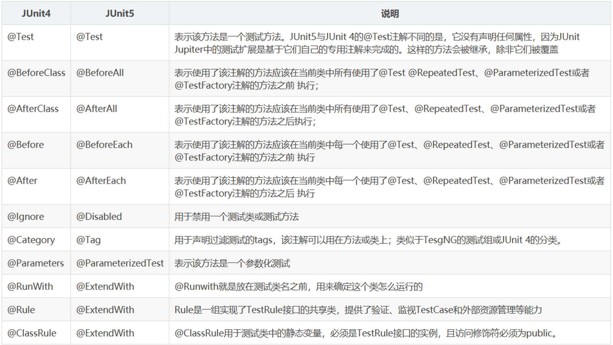
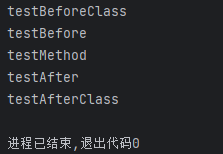
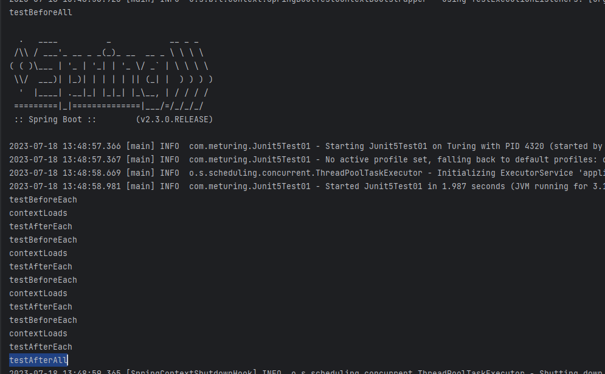
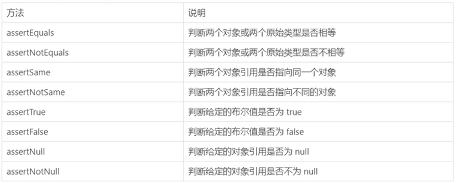

## 了解Junit5

springBoot 2.2.0开始引入Junit5作为单元测试的默认库,JUnit5和之前的版本有很大的不同,由单个子项目的几个不同模块组成:
- `JUnit Platform`是在JVM上启动测试框架的技术,不仅支持Junit自己的测试引擎,其他的测试引擎也可以
- `JUnit Jupiter` 提供了Junit5的最新的编程模型,是Junit5 的核心,内部包含了一个测试引擎,用于在Junit Platform上运行
- `JUnit Vintager`  提供了兼容Junit4/3 的测试引擎

> Junit5 = JUnit Platform+ JUnit Jupiter+JUnit Vintager

## 对Junit4和Junit3的支持

SpringBoot 2.4 以上版本移除了默认对Vintage的依赖,如果需要兼容junit4需要自行引入.

```XMl
<dependency>
	<groupId>org.junit.vintage</groupId>
	<artifactId>junit-vintage-engine</artifactId>
	<scope>test</scope>
	<exclusions>
		<exclusion>
		<groupId>org.hamcrest</groupId>
		<artifactId>hamcrest-core</artifactId> 
		</exclusion>
	</exclusions>
</dependency>
```

## Junit5中的注解

Junit支持Spring中的注解,测试起来比较方便, @Autowired @Transactional 等



## 简单实用

### Junit4

```Java
@BootstrapWith(SpringBootTestContextBootstrapper.class)
@ExtendWith({SpringExtension.class})
public class Junit4Test01 {
    @BeforeClass
    public static void testBeforeClass() {
        System.out.println("testBeforeClass");
    }
    @AfterClass
    public static void testAfterClass() {
        System.out.println("testAfterClass");
    }
    @Before
    public void testBefore() {
        System.out.println("testBefore");
    }
    @After
    public void testAfter() {
        System.out.println("testAfter");
    }
    @Test
    public void testMethod(){
        System.out.println("testMethod");
    }
}
```

执行效果:



### Junit5

```java
@SpringBootTest
@DisplayName("Junit5测试类")
class Junit5Test01 {
    @BeforeAll
    public static void testBeforeAll(){
        System.out.println("testBeforeAll");
    }
    @AfterAll
    public static void testAfterAll(){
        System.out.println("testAfterAll");
    }
    @BeforeEach
    public void testBeforeEach(){
        System.out.println("testBeforeEach");
    }
    @AfterEach
    public void testAfterEach() {
        System.out.println("testAfterEach");
    }
    @RepeatedTest(3)//重复测试3次
    @Timeout(value = 1000,unit = TimeUnit.SECONDS)//超时时间
    @DisplayName("当前是测试类")//当前测试的描述信息
    @Test
    void contextLoads() {
        System.out.println("contextLoads");
    }
}
```

测试效果



## 断言机制

断定某件事情,一定会发生,如果没有发生,那就是出现了问题,所欲的测试运行结束后,会有一个详细的断言报告

断言通常用来对测试需要满足的条件进行验证,这些断言方法都是`org.junit.jupiter.api.Assertions`中的静态方法

### 简单的断言方法



### 测试实例


## 前置条件

## 参数化测试

