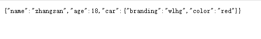

Spring Boot 由于没有XML文件，所以所有的Bean管理都放入在一个配置类中实现。这个类就相当于之前的applicationContext.xml

在之前的学习中我们简单了解了配置类的使用  :  见 [零XML配置事务](../../03_Spring基础/11_零XML配置事务/零XML配置事务.md)

## 使用配置类管理Bean

### 单一Bean的注册

创建配置类

```Java
@Configuration
public class InjectBeanConfig {
    @Bean
    protected People getPeople() {
        return new People("zhangsan",18);
    }
}
```

使用IOC容器中的Bean

```Java
@RestController
public class HelloThymeleafController {
    @Autowired
    private People people;
    @RequestMapping("/getPeople")
    public People getPeople(){
        return people;
    }
}
```


### 多个同类型Bean的注册

> 如果Spring容器中存在同类型的Bean 可以结合@Qualifier使用获取具体的Bean对象

创建配置类

```Java
@Configuration
public class InjectBeanConfig {
    @Bean("people1")
    protected People getPeople() {
        return new People("zhangsan",18);
    }
    @Bean("people2")
    protected People getPeople2() {
        return new People("lisi",20);
    }
}
```

使用IOC容器中的Bean

```Java
@RestController
public class HelloThymeleafController {
    @Autowired
    @Qualifier("people2")
    private People people;
    @RequestMapping("/getPeople2")
    public People getPeople2(){
        return people;
    }
}
```


### 在配置类中直接使用参数注入

创建配置类

```Java
@Configuration
public class InjectBeanConfig {
    @Bean("people3")
    protected People getPeople3(Car car) {
        People people2 = new People("zhangsan", 18,car);
        return people2;
    }
    @Bean
    protected Car getCar(){
        return new Car("wlhg","red");
    }
}
```

使用IOC容器中的Bean

```Java
@RestController
public class HelloThymeleafController {
    @Autowired
    @Qualifier("people3")
    private People people1;
    @RequestMapping("/getPeople")
    public People getPeople(){
        return people1;
    }
}
```


