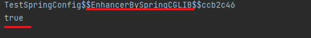
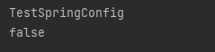
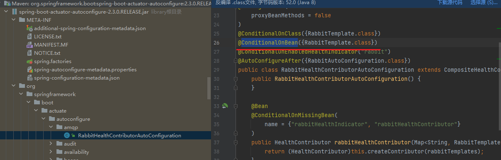
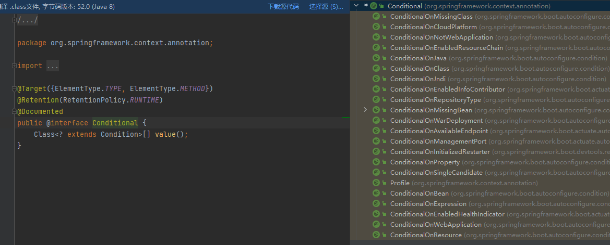
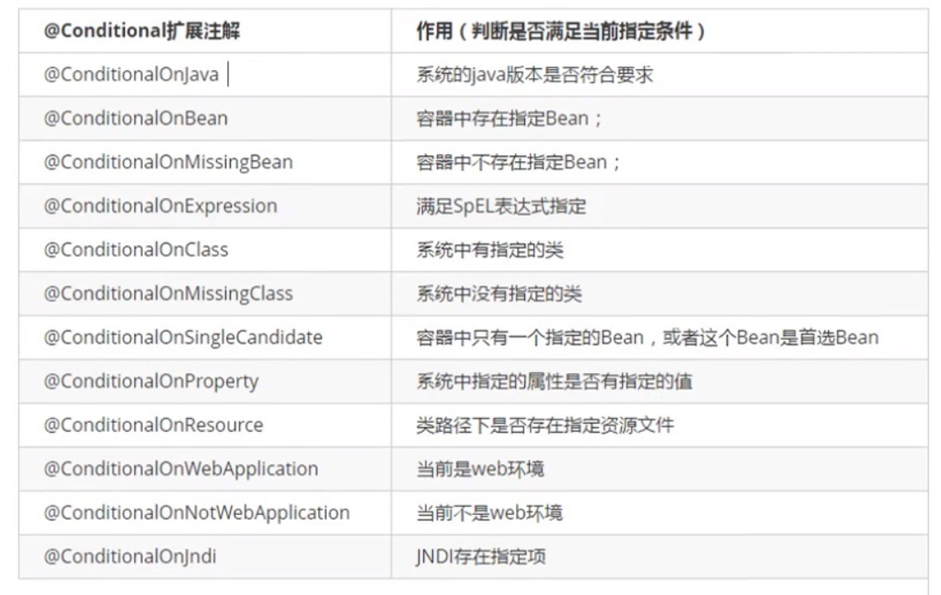
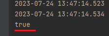
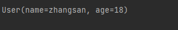
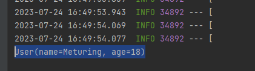
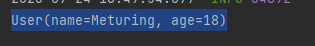

springboot默认已经帮助我们整合好了SpringMVC,同时也给我们默认配置了DispathcerServlet 和编码过滤器,同时也给我们配置好了WEB项目开发的常见组件

## @SpringBootApplication

默认扫描启动类所在包下的所有层级的子包,可以通过`scanBasePackages`属性指定扫描路径

SpringBootApplication是一个合成注解,可以拆分为以下三个注解 : 
`@SpringBootConfiguration`+`@EnableAutoConfiguration`+`@ComponentScan(basePackages = "com.meturing")`

```Java
@SpringBootApplication
@ComponentScan(basePackages = "com.meturing.*")
public class SpringBoot06Application {
    public static void main(String[] args) {
        SpringApplication.run(SpringBoot06Application.class, args);
    }
}
```

## @Configuration

`@Configuration`注解标记的类,表示该类是一个配置类,也是一个spring容器中的bean

其中**proxyBeanMethods属性**配置当前实例化的模式,默认取值为true:
- `proxyBeanMethods=false` 表示Lite模式,启动快
- `proxyBeanMethods=true` 表示Full模式  特点依赖spring容器控制bean单例 

### Lite模式

> 如果是Lite模式,则Spring会给配置类生成一个代理对象.在反复调用配置类时,使用的是同一个对象.

实体类:
```Java
@Data
@AllArgsConstructor
@ToString
public class User implements Serializable {
    private String name;
    private Integer age;
}
```

配置类:
```Java
//默认取值为true
@Configuration(proxyBeanMethods = true)
public class TestSpringConfig {
    @Bean
    public User user(){
        return new User("张三",18);
    }
}
```

启动类:
```Java
@SpringBootApplication
public class SpringBoot07Application {
    public static void main(String[] args) {
	    //获取容器对象
        ConfigurableApplicationContext context = SpringApplication.run(SpringBoot07Application.class, args);
        //获取配置类的名称
        String simpleName = context.getBean(TestSpringConfig.class).getClass().getSimpleName();
        System.out.println(simpleName);
		//调用配置类中的方法,获取对象
        User user1 = context.getBean(TestSpringConfig.class).user();
        User user2 = context.getBean(TestSpringConfig.class).user();
        System.out.println(user1==user2);
    }
}
```

测试结果如下:



我们发现 : 获取到的容器中的配置类对象实际上是Spring给我们生成的代理对象,我们获取的具体的Bean则为同一个引用地址

### Full模式

> Full模式则不会生成代理对象,在重复调用时会生成多个对象实例

修改上述Lite模式中的代码,将`proxyBeanMethods = false`

```java
@Configuration(proxyBeanMethods = false)
public class TestSpringConfig {
    @Bean
    public User user(){
        return new User("张三",18);
    }
}
```

执行效果:



我们看到,此时获取到的配置类是当前类,获取到的对象是两个不同的对象

## @Import

`@Import({User.class})` 在容器中自动创建Bean的注解
通过传入字节码,默认调用bean的无参构造器,向容器中存放一个Bean

```Java
@Configuration()
//向容器中注入User对象
@Import({User.class})
public class TestSpringConfig {
	
}
```

```Java
@SpringBootApplication
public class SpringBoot07Application {
    public static void main(String[] args) {
        ConfigurableApplicationContext context = SpringApplication.run(SpringBoot07Application.class, args);
        User user1 = context.getBean(User.class);//通过字节码匹配Bean
        User user2 = context.getBean("com.meturing.pojo.User",User.class);//通过BeanName匹配
        System.out.println(user1);
        System.out.println(user2);
    }
}
```

> 注意: 
> 1. 默认组件的名字就是类的全路径名
> 2. @Import只要放到可以被扫描到的类之上就可以,不必非得是配置类或者Controller

## @Conditional

`@Conditional` 注解主要是用来按条件装配,在SpringBoot中大量是用来该注解来控制组件相关的参数是否注入.



我们进入`@Conditional`注解中,使用Ctrl+H可以查到他下面的子注解



子注解相关功能如下:



例如: 我们配置一个检查项目配置中存在 `Demo.DemoAttributes`属性且值为`true`时,就将当前Bean注入到容器中

```Java
@Configuration()
public class TestSpringConfig {
    @ConditionalOnProperty(name="Demo.DemoAttributes",havingValue = "true")
    @Bean
    public User user(){
        return new User("张三",18);
    }
}
```

当我们在配置文件中存在：

```ymal
server:
  port: 8080
  servlet:
    context-path: /springboot07
Demo:
  DemoAttributes: "true"
```

使用代码判断User是否注入到容器:

```Java
@SpringBootApplication
public class SpringBoot07Application {
    public static void main(String[] args) {
        ConfigurableApplicationContext context = SpringApplication.run(SpringBoot07Application.class, args);
        System.out.println(context.containsBean("user"));
    }
}
```

执行效果如下:



## @ImportResource

`@ImportResource`注解允许原生配置文件引入,我们可以在SpringBoot中使用XML配置文件

我们在resources目录下创建SpringBean.xml,手动注入User
```XMl
<?xml version="1.0" encoding="UTF-8"?>
<beans xmlns="http://www.springframework.org/schema/beans"
       xmlns:xsi="http://www.w3.org/2001/XMLSchema-instance"
       xsi:schemaLocation="http://www.springframework.org/schema/beans http://www.springframework.org/schema/beans/spring-beans.xsd">
    <bean name="user" class="com.meturing.pojo.User">
        <property name="name" value="zhangsan"></property>
        <property name="age" value="18"></property>
    </bean>
</beans>
```

在配置类上使用`@ImportResource("classpath:SpringBean.xml")` 注入指定的XMl文件
```Java
@Configuration()
@ImportResource("classpath:SpringBean.xml")
public class TestSpringConfig {

}
```

尝试获取User
```Java
@SpringBootApplication
public class SpringBoot07Application {
    public static void main(String[] args) {
        ConfigurableApplicationContext context = SpringApplication.run(SpringBoot07Application.class, args);
        User user = context.getBean("user", User.class);
        System.out.println(user);
    }
}
```

结果:


## @ConfigurationProperties

`@ConfigurationProperties`注解可以读取`.properties`配置文件中的内容

User.java
```Java
@Data
@AllArgsConstructor
@NoArgsConstructor
@ToString
@ConfigurationProperties( prefix = "user")
@Component
public class User implements Serializable {
    private String name;
    private Integer age;
}
```

application.properties
```Properties
user.name=zhangsan
user.age=18
```

测试:

```Java
@SpringBootApplication
public class SpringBoot07Application {
    public static void main(String[] args) {
        ConfigurableApplicationContext context = SpringApplication.run(SpringBoot07Application.class, args);
        User user = context.getBean("user", User.class);
        System.out.println(user);
    }
}
```




## @EnableConfigurationPropertie

`@EnableConfigurationPropertie` 则将配置`@ConfigurationProperties`注解的类获取配置中的属性并注入到容器中,无需再使用`@Component`手动注入

User.java
```Java
@Data
@AllArgsConstructor
@NoArgsConstructor
@ToString
@ConfigurationProperties( prefix = "user")
public class User implements Serializable {
    private String name;
    private Integer age;
}
```

application.properties
```Properties
user.name=zhangsan
user.age=18
```

TestSpringConfig.java配置类
```Java
@Configuration()
@EnableConfigurationProperties(User.class)
public class TestSpringConfig {
}
```


测试:
```Java
@SpringBootApplication
public class SpringBoot07Application {
    public static void main(String[] args) {
        ConfigurableApplicationContext context = SpringApplication.run(SpringBoot07Application.class, args);
        User user = context.getBean("user-com.meturing.pojo.User", User.class);
        System.out.println(user);
    }
}
```



>注意: 使用@EnableConfigurationProperties注解时,注入的Bean的名称将不再是类名小写或全类路径名,此时是两者的组合`类名小写-全类路径名`
