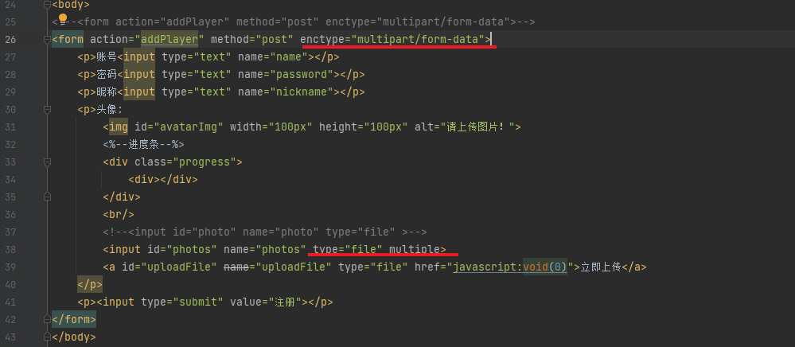
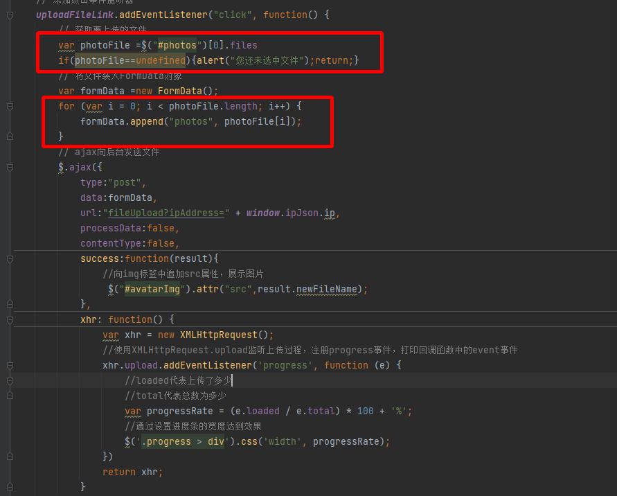

在前面的学习中我们简单的在SpringMVC时测试了上传功能，详见 ： [文件的上传](../../04_SpringMVC/11_文件的上传/文件的上传.md)

接下来我们快速的在SpringBoot中尝试复现文件的上传功能

## 环境准备

### 添加依赖

在SpringBoot中我们不需要再添加文件上传的依赖了，因为它已经内部集成了上传的依赖

但我们仍需要配置跨服务器传输的依赖：

```XML
<dependency>
	<groupId>com.sun.jersey</groupId>
	<artifactId>jersey-client</artifactId>
	<version>1.19</version>
</dependency>
```

### 配置文件上传大小

默认情况下，SpringBoot对单个文件上传的大小设定为1MB，我们可以在SpringBoot的配置文件中配置上传文件的大小

```ymal
spring:
  servlet:
    multipart:
      max-file-size: 10MB
      max-request-size: 100MB
```

## 单一文件上传

### 前端代码

```Html
<html>
<head>
    <meta charset="UTF-8">
    <title>Title</title>
    <script type="text/javascript" src="./js/jquery-3.5.1.min.js"></script>
    <style>
        .progress {
            width: 200px;
            height: 10px;
            border: 1px solid #ccc;
            border-radius: 10px;
            margin: 10px 0px;
            overflow: hidden;
        }
        /* 初始状态设置进度条宽度为0px */
        .progress > div {
            width: 0px;
            height: 100%;
            background-color: yellowgreen;
            transition: all .3s ease;
        }
    </style>
</head>
<body>
<form action="addPlayer" method="post">
    <p>账号<input type="text" name="name"></p>
    <p>密码<input type="text" name="password"></p>
    <p>昵称<input type="text" name="nickname"></p>
    <p>头像:
        
        <%--进度条--%>
        <div class="progress">
            <div></div>
        </div>
        <br/>
        <input id="photo" name="photo" type="file" >
        <a id="uploadFile" name="uploadFile" type="file" href="javascript:void(0)">立即上传</a>
    </p>
    <p><input type="submit" value="注册"></p>
</form>
</body>
<script type="text/javascript">
    // 获取上传文件的标签元素
    var uploadFileLink = document.getElementById("uploadFile");
    // 添加点击事件监听器
    uploadFileLink.addEventListener("click", function() {
        // 获取要上传的文件
        var photoFile =$("#photo")[0].files[0]
        if(photoFile==undefined){alert("您还未选中文件");return;}
        // 将文件装入FormData对象
        var formData =new FormData();
        formData.append("headPhoto",photoFile);
        // ajax向后台发送文件
        $.ajax({
            type:"post",
            data:formData,
            url:"fileUpload?ipAddress=" + window.ipJson.ip,
            processData:false,
            contentType:false,
            success:function(result){
                //向img标签中追加src属性，展示图片
                 $("#avatarImg").attr("src",result.newFileName);
            },
            xhr: function() {
                var xhr = new XMLHttpRequest();
                //使用XMLHttpRequest.upload监听上传过程，注册progress事件，打印回调函数中的event事件
                xhr.upload.addEventListener('progress', function (e) {
                    //loaded代表上传了多少
                    //total代表总数为多少
                    var progressRate = (e.loaded / e.total) * 100 + '%';
                    //通过设置进度条的宽度达到效果
                    $('.progress > div').css('width', progressRate);
                })
                return xhr;
            }
        })
    });
    function ipJson(ipJson) {
        console.log('获取到的网络IP',ipJson);
        //可以把结果存在window上，方便调用
        window.ipJson=ipJson;
    }
</script>
<script src="https://whois.pconline.com.cn/ipJson.jsp?callback=ipJson" type="text/javascript"></script>
</html>
```

### 后端代码

在接收文件流的时候，我们可以通过 `@RequestPart`注解来制定文件流的特殊名字（不是`@RequestParam`！！！）

```java
@RestController
public class RegistrationController {
    // 文件存储位置
    private final static String FILESERVER="http://127.0.0.1:8090/upload/";
    @RequestMapping("/fileUpload")
    public Map<String,String> fileUpload(String name,
                                         String password,
                                         String nickname,
                                         String ipAddress,
                                         @RequestPart("headPhoto") MultipartFile headPhoto,
                                         HttpServletRequest req) throws IOException {
        Map<String,String> map=new HashMap<>();
        // 指定文件存储目录为我们项目部署环境下的upload目录
        String realPath = req.getServletContext().getRealPath("/upload");
        File dir = new File(realPath);
        // 如果不存在则创建目录
        if(!dir.exists()){
            dir.mkdirs();
        }
        // 获取文件名
        String originalFilename = headPhoto.getOriginalFilename();
        // 避免文件名冲突,使用UUID替换文件名
        String uuid = UUID.randomUUID().toString();
        // 获取拓展名
        String extendsName = originalFilename.substring(originalFilename.lastIndexOf("."));
        // 新的文件名
        String newFileName=uuid.concat(extendsName);
        // 创建 sun公司提供的jersey包中的client对象
        Client client= Client.create();
        WebResource resource = client.resource(FILESERVER + newFileName);
        //  文件保存到另一个服务器上去了
        resource.put(String.class, headPhoto.getBytes());
        // 上传成功之后,把文件的名字和文件的类型返回给浏览器
        map.put("message", "上传成功");
        map.put("newFileName", FILESERVER+newFileName);
        map.put("filetype", headPhoto.getContentType());
        return map;
    }
}
```

### 启动文件管理器

详见：[配置文件存储服务器](../../04_SpringMVC/11_文件的上传/文件的上传.md#配置文件存储服务器)

## 多文件同时上传


### 修改前端代码

添加多文件上传的支持：
1. form表单中添加 `enctype="multipart/form-data"` 属性
2. 选择文件的Input组件上 添加`multiple`属性



修改上传的文件JS代码：

```Js
<script type="text/javascript">
    // 获取上传文件的标签元素
    var uploadFileLink = document.getElementById("uploadFile");
    // 添加点击事件监听器
    uploadFileLink.addEventListener("click", function() {
        // 获取要上传的文件
        var photoFile =$("#photos")[0].files
        if(photoFile==undefined){alert("您还未选中文件");return;}
        // 将文件装入FormData对象
        var formData =new FormData();
        for (var i = 0; i < photoFile.length; i++) {
            formData.append("photos", photoFile[i]);
        }
        // ajax向后台发送文件
        $.ajax({
            type:"post",
            data:formData,
            url:"fileUpload?ipAddress=" + window.ipJson.ip,
            processData:false,
            contentType:false,
            success:function(result){
                //向img标签中追加src属性，展示图片
                 $("#avatarImg").attr("src",result.newFileName);
            },
            xhr: function() {
                var xhr = new XMLHttpRequest();
                //使用XMLHttpRequest.upload监听上传过程，注册progress事件，打印回调函数中的event事件
                xhr.upload.addEventListener('progress', function (e) {
                    //loaded代表上传了多少
                    //total代表总数为多少
                    var progressRate = (e.loaded / e.total) * 100 + '%';
                    //通过设置进度条的宽度达到效果
                    $('.progress > div').css('width', progressRate);
                })
                return xhr;
            }
        })
    });
    function ipJson(ipJson) {
        console.log('获取到的网络IP',ipJson);
        //可以把结果存在window上，方便调用
        window.ipJson=ipJson;
    }
</script>
```



> 注意 ： 此时获取的是一个List，需要手动循环塞给`formData`

### 修改后端代码

此时后端接受的也是一个`MultipartFile`数组,需要循环塞给远端文件服务器

```java
    @RequestMapping("/fileUpload")
    public Map<String,String> fileUpload(String name,
                                         String password,
                                         String nickname,
                                         String ipAddress,
                                         MultipartFile[] photos,
                                         HttpServletRequest req) throws IOException {
        Map<String,String> map=new HashMap<>();
        // 指定文件存储目录为我们项目部署环境下的upload目录
        String realPath = req.getServletContext().getRealPath("/upload");
        File dir = new File(realPath);
        // 如果不存在则创建目录
        if(!dir.exists()){
            dir.mkdirs();
        }
        for (MultipartFile headPhoto : photos) {
            // 获取文件名
            String originalFilename = headPhoto.getOriginalFilename();
            // 避免文件名冲突,使用UUID替换文件名
            String uuid = UUID.randomUUID().toString();
            // 获取拓展名
            String extendsName = originalFilename.substring(originalFilename.lastIndexOf("."));
            // 新的文件名
            String newFileName=uuid.concat(extendsName);
            // 创建 sun公司提供的jersey包中的client对象
            Client client= Client.create();
            WebResource resource = client.resource(FILESERVER + newFileName);
            //  文件保存到另一个服务器上去了
            resource.put(String.class, headPhoto.getBytes());
        }
        // 上传成功之后,把文件的名字和文件的类型返回给浏览器
        map.put("message", "上传成功");
        //map.put("newFileName", FILESERVER+newFileName);
        //map.put("filetype", headPhoto.getContentType());
        return map;
    }
}
```

