## 一般静态资源的存放

在前面的学习中我们简单了解了SpringBoot的项目结构 ：[SpringBoot项目结构](../04_SpringBoot项目配置与结构/SpringBoot项目配置与结构.md#SpringBoot项目结构)

我们知道，public目录与static目录,在访问时,无需再次说明目录名(可以省略)

所以我们在存放静态资源时，可以将资源存放至这两个目录。

例如:
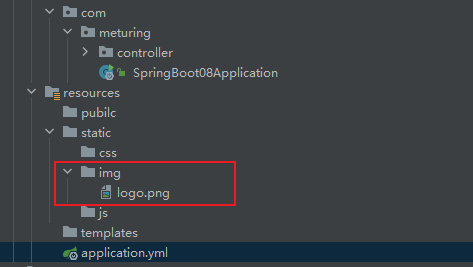

直接访问 : `http://localhost:18090/springboot08/img/logo.png` 即可展示资源

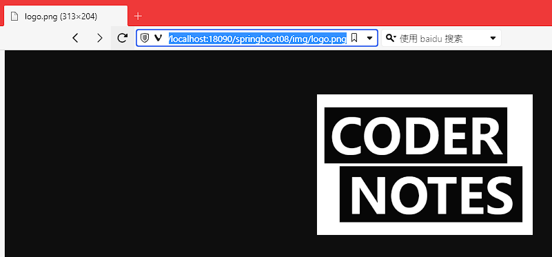

## 静态资源路径与Controller冲突

> 在SpringBoot中: 请求进来,先去看Controller中有没有对应的资源,如果有则,执行controller资源,如果没有,就交给静态资源处理器,静态资源处理器也没有找到,则返回404

例如: 直接logo.png存在以下位置

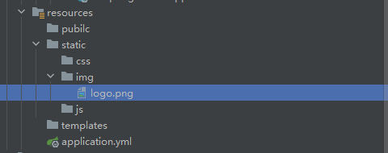

此时也存在一个映射单元: TestController01.java

```Java
@Controller
public class TestController01 {
    @RequestMapping("/img/logo.png")
    @ResponseBody
    public String getLogo(){
        return "logo";
    }
}
```

直接访问 : `http://localhost:18090/springboot08/img/logo.png` 将展示Controller的结果并不会跳转至图片


## 设置访问前缀

> 默认无前缀,如果想指定静态资源前缀,可以 通过`spring.mvc.static-path-pattern`配置

例如我们直接配置前缀为res

```properties
spring:
  mvc:
    static-path-pattern: /res/**
```

我们再次访问图片的时候需要加上`res`前缀


## 指定存放位置

> spring.resources.static-locations 可以指定静态目录的位置,但是如果使用了该属性,则原有的static将失效

```Perpoeties
spring:
  resources:
    static-locations: [classpath:/myres/]
```

例如:

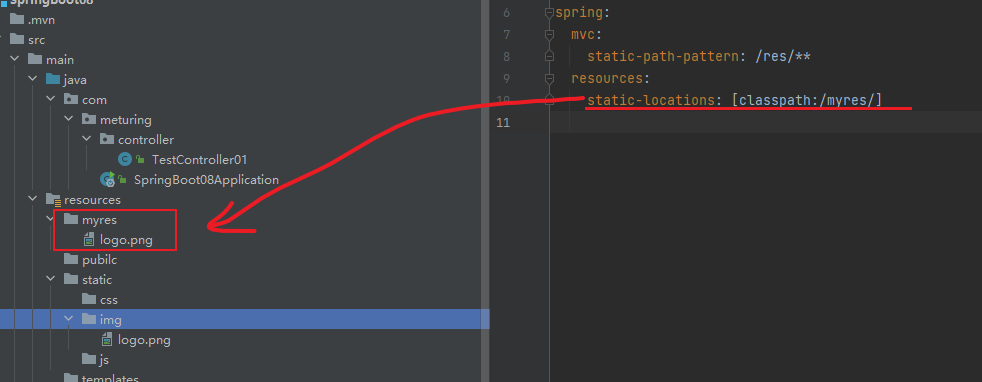

此时访问`http://localhost:18090/springboot08/res/logo.png` 即可查看图片

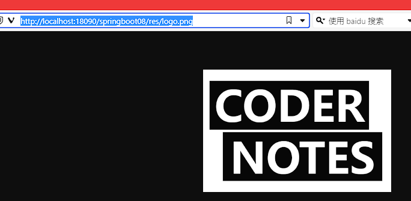

## webjars

> springboot还支持静态资源webjars 的处理方式,就是将静态资源打成jar导入

官网 : [https://www.webjars.org/](https://www.webjars.org/)


我们可以在官网找到指定的Jar,使用Maven进行引入


引入后,我们可以看到对应的Jar依赖:
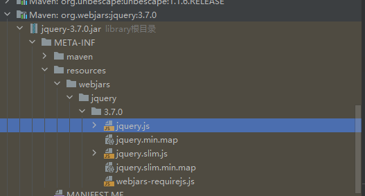

访问时,需要按照目录层级 `项目地址/webjars/jquery/3.7.0/xxxx.js`

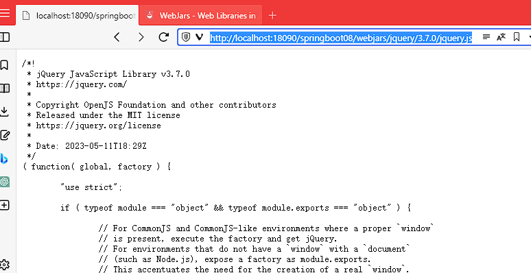

当然,如果配置了前缀,也可以添加前缀访问 : `http://localhost:18090/springboot08/res/webjars/jquery/3.7.0/jquery.js`

## 欢迎页与Favicon

### 默认欢迎页

默认情况下:  SpringBoot支持默认欢迎页为index.html

> 注意不能设置静态资源前缀,否则会出现失效的情况

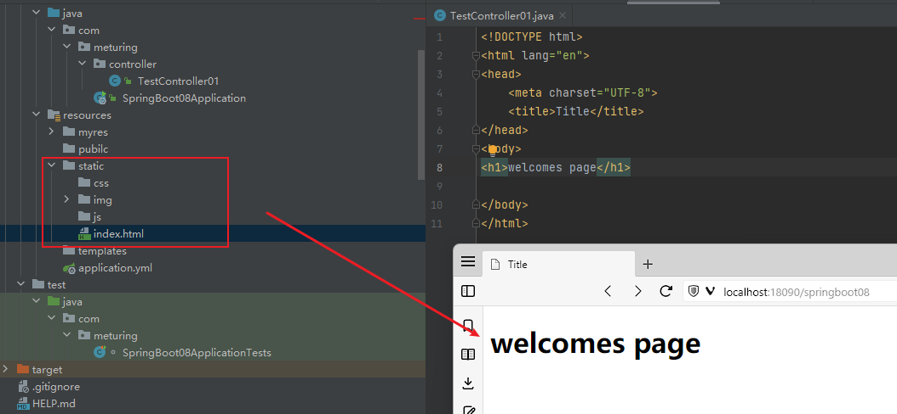

### 手动指定欢迎页

> 如果不能使用默认的方式跳转欢迎页,可以直接使用Controller中对`/`和`/index`路径手动跳转


配置根路径直接跳转到指定的Index页面

```java
@Controller
public class TestController01 {
    @RequestMapping(path = {"/","/index"})
    public String index(){
        return "index";
    }
}
```

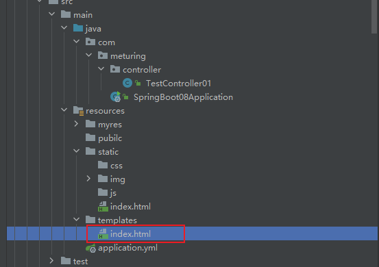


### favicon

浏览器默认访问favicon.ico的路径为  `协议://ip:端口号/favicon.ico`,所以这里不要设置项目的上下文路径

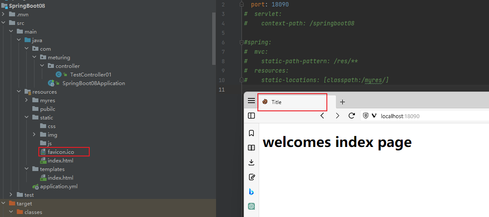

## 拦截器静态资源放行

### 实现Demo

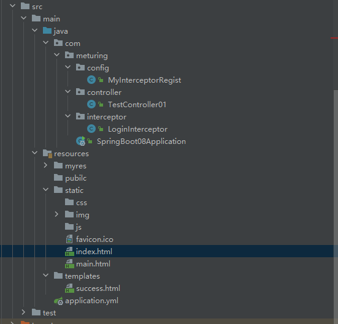

执行逻辑 :

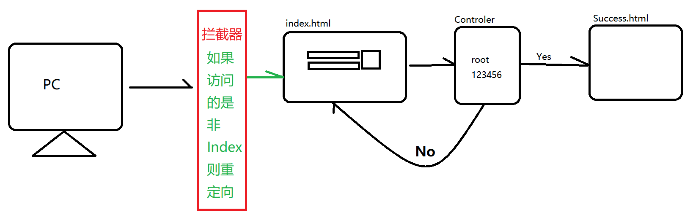

1. 如果没有登录,范围其他也页面都重定向登陆页面
2. 如果登录成功,则可以访问所有页面
3. 如果登陆失败则重定向登录

### 实现拦截器功能

#### 前端代码

index.html
```Html
<!DOCTYPE html>
<html lang="en">
<head>
    <meta charset="UTF-8">
    <title>Title</title>
    <style>
        h1,table{
            text-align: center;
            margin: auto;
        }
        img {
            float: left;
        }
        #submitBtn{
            height: 40px;
        }
        div>img{
            transform: translateY(10%);
            position: absolute;
        }
        div>input{
           padding-left: 20px;
        }
    </style>
</head>
<body>
<h1>welcomes index page</h1>
<form action="login" method="post" >
    <table>
        <tr>
            <td>
                <div>
                    <input name="userName" type="text">
                </div>
                <div>
                    <input name="password" type="password">
                </div>
            </td>
            <td>
                <input id="submitBtn" type="submit" value="登录">
            </td>
        </tr>
    </table>
</form>
</body>
</html>
```

mian.html
```Html
<!DOCTYPE html>
<html lang="en">
<head>
    <meta charset="UTF-8">
    <title>Title</title>
</head>
<body>
 This is mainPage
</body>
</html>
```

success.html
```html
<!DOCTYPE html>
<html lang="en">
<head>
    <meta charset="UTF-8">
    <title>Title</title>
</head>
<body>
Welcome to our System
</body>
</html>
```

#### 后端代码

Controller层
```Java
@Controller
public class TestController01 {

    @RequestMapping("/login")
    public String login(String userName, String password, HttpServletRequest request){
        if (userName.equals("root")&&password.equals("123456")) {
            request.getSession().setAttribute("userName", userName);
            return "success";
        }
        return "redirect:index.html";
    }
}
```

定义拦截器: LoginInterceptor
```Java
@Component
public class LoginInterceptor implements HandlerInterceptor {
    @Override
    public boolean preHandle(HttpServletRequest request, HttpServletResponse response, Object handler) throws Exception {
        Object userName = request.getSession().getAttribute("userName");
        Optional<Object> userNameStr = Optional.ofNullable(userName);
        if (userNameStr.isPresent()) {
            return true;
        }
        response.sendRedirect("index.html");
        return false;
    }
}
```

注册拦截器:

```Java
@Configuration
public class MyInterceptorRegist implements WebMvcConfigurer {
    @Autowired
    private LoginInterceptor loginInterceptor;
    @Override
    public void addInterceptors(InterceptorRegistry registry) {
        registry.addInterceptor(loginInterceptor)
                .addPathPatterns("/**");
    }
}
```

### 放行静态资源

我们发现,在上面的拦截器中,我们对于所有的请求都进行了拦截,当页面加载静态资源时,由于拦截器的作用,会不断的重定向至index页面,所以我们需要对于静态资源的目录进行放行

修改配置类

```Java
@Configuration
public class MyInterceptorRegist implements WebMvcConfigurer {
    @Autowired
    private LoginInterceptor loginInterceptor;
    @Override
    public void addInterceptors(InterceptorRegistry registry) {
        registry.addInterceptor(loginInterceptor)
                .addPathPatterns("/**")
                .excludePathPatterns("/login","/index.html","/css/**","/js/**","/img/**","/font/**");
    }
}
```


