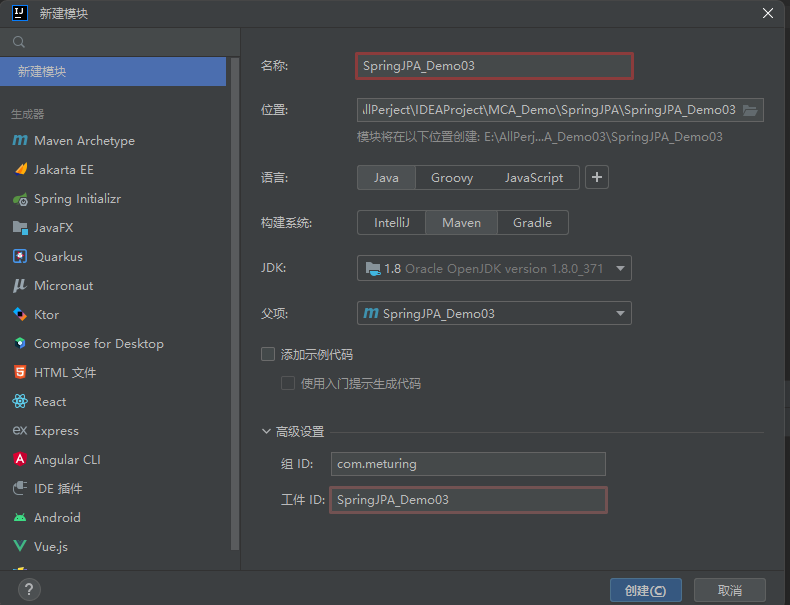
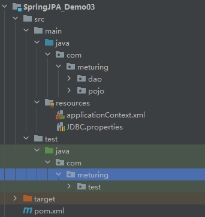
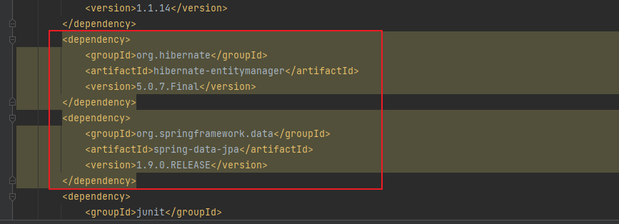
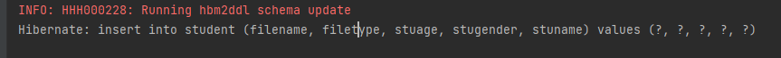
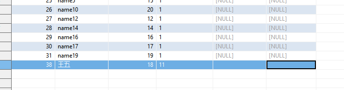
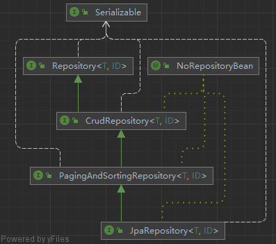

学习了前面的Hibernate和HibernateJPA,我们接下来将在Spring中整合SpringJPA

## 构建项目环境

### 数据源

```SQL
CREATE TABLE `student` (
  `stuid` int NOT NULL AUTO_INCREMENT,
  `stuname` varchar(20) DEFAULT NULL,
  `stuage` int DEFAULT NULL,
  `stugender` char(2) DEFAULT NULL,
  `filename` varchar(100) DEFAULT NULL,
  `filetype` varchar(20) DEFAULT NULL,
  PRIMARY KEY (`stuid`)
) ENGINE=InnoDB AUTO_INCREMENT=38 DEFAULT CHARSET=utf8mb3;
```

### 创建Spring项目

创建一个全新的Spring模块




### 导入依赖

导入所需依赖

```XML
    <dependencies>
        <!--Spring核心包-->
        <dependency>
            <groupId>org.springframework</groupId>
            <artifactId>spring-context</artifactId>
            <version>5.1.6.RELEASE</version>
        </dependency>
        <!--Spring切面包-->
        <dependency>
            <groupId>org.springframework</groupId>
            <artifactId>spring-aspects</artifactId>
            <version>5.1.6.RELEASE</version>
        </dependency>
        <!--SpringORM-->
        <dependency>
            <groupId>org.springframework</groupId>
            <artifactId>spring-orm</artifactId>
            <version>5.1.6.RELEASE</version>
        </dependency>
        <!--Mysql驱动包-->
        <dependency>
            <groupId>mysql</groupId>
            <artifactId>mysql-connector-java</artifactId>
            <version>8.0.11</version>
        </dependency>
        <!--德鲁特连接池-->
        <dependency>
            <groupId>com.alibaba</groupId>
            <artifactId>druid</artifactId>
            <version>1.1.8</version>
        </dependency>
        <!--hibernate-entitymanager-->
		<dependency>  
		    <groupId>org.hibernate</groupId>  
		    <artifactId>hibernate-entitymanager</artifactId>  
		    <version>5.0.7.Final</version>  
		</dependency>
		<!-- spring-data-jpa -->
		<dependency>  
		    <groupId>org.springframework.data</groupId>  
		    <artifactId>spring-data-jpa</artifactId>  
		    <version>1.9.0.RELEASE</version>  
		</dependency>
        <!--junit测试单元-->
        <dependency>
            <groupId>junit</groupId>
            <artifactId>junit</artifactId>
            <version>4.12</version>
            <scope>test</scope>
        </dependency>
        <dependency>
            <groupId>org.springframework</groupId>
            <artifactId>spring-test</artifactId>
            <version>5.1.6.RELEASE</version>
        </dependency>
        <!--lombok-->
        <dependency>
            <groupId>org.projectlombok</groupId>
            <artifactId>lombok</artifactId>
            <version>1.18.28</version>
        </dependency>
    </dependencies>
```

注意: 此时导入的是`hibernate-entitymanager`包和`spring-data-jpa`包


### 添加配置文件

添加applicationContext.xml 配置文件

```XML
<?xml version="1.0" encoding="UTF-8"?>
<beans xmlns="http://www.springframework.org/schema/beans"
       xmlns:xsi="http://www.w3.org/2001/XMLSchema-instance"
       xmlns:aop="http://www.springframework.org/schema/aop"
       xmlns:p="http://www.springframework.org/schema/p"
       xmlns:c="http://www.springframework.org/schema/c"
       xmlns:jpa="http://www.springframework.org/schema/data/jpa"
       xmlns:context="http://www.springframework.org/schema/context"
       xmlns:tx="http://www.springframework.org/schema/tx"
       xsi:schemaLocation="http://www.springframework.org/schema/beans
       http://www.springframework.org/schema/beans/spring-beans.xsd
       http://www.springframework.org/schema/aop
       http://www.springframework.org/schema/aop/spring-aop.xsd
       http://www.springframework.org/schema/p
       http://www.springframework.org/schema/p/spring-p.xsd
       http://www.springframework.org/schema/c
       http://www.springframework.org/schema/c/spring-c.xsd
       http://www.springframework.org/schema/context
       http://www.springframework.org/schema/context/spring-context.xsd
       http://www.springframework.org/schema/tx
       http://www.springframework.org/schema/tx/spring-tx.xsd
       http://www.springframework.org/schema/data/jpa
       http://www.springframework.org/schema/data/jpa/spring-jpa.xsd
">
    <!--配置包扫描-->
    <context:component-scan base-package="com.meturing"/>

    <!--配置外部的链接依赖-->
    <context:property-placeholder location="classpath:JDBC.properties"/>
    <!-- 创建druid 的数据源 -->
    <bean id="dataSource" class="com.alibaba.druid.pool.DruidDataSource">
        <property name="username" value="${jdbc_username}"></property>
        <property name="password" value="${jdbc_password}"></property>
        <property name="driverClassName" value="${jdbc_driver}"></property>
        <property name="url" value="${jdbc_url}"></property>
    </bean>
    <!-- 配置Hibernate的SessionFactory对象 id必须得是 ： entityManagerFactory -->
    <bean class="org.springframework.orm.jpa.LocalContainerEntityManagerFactoryBean" id="entityManagerFactory">
        <!-- 关联数据源 -->
        <property name="dataSource" ref="dataSource"></property>
        <!-- 配置Hibernate的属性信息 -->
        <property name="jpaVendorAdapter">
            <bean class="org.springframework.orm.jpa.vendor.HibernateJpaVendorAdapter">
                <property name="database" value="MYSQL"/>
                <property name="generateDdl" value="true"/>
                <property name="showSql" value="true"/>
            </bean>
        </property>
        <!-- 扫描路径 -->
        <property name="packagesToScan">
            <list>
                <value>com.meturing.pojo</value>
            </list>
        </property>
    </bean>
    <!--配置JPA所在的接口包-->
    <jpa:repositories base-package="com.meturing.dao" />
    <!--  配置事务管理-->
    <bean class="org.springframework.orm.jpa.JpaTransactionManager" id="transactionManager">
        <property name="entityManagerFactory" ref="entityManagerFactory"/>
    </bean>
    <!-- 配置开启事务注解 -->
    <tx:annotation-driven transaction-manager="transactionManager"/>
</beans>
```

> 基本的注册配置与前面的HibernateJPA配置比较相似:
> 1. 引入JPA声明空间
> 2. 配置包扫描
> 3. 导入外部文件引用
> 4. 配置Durid连接池
> 5. 配置Hibernate的SessionFactory对象 **(id必须是: entityManagerFactory)**  -> **LocalContainerEntityManagerFactoryBean**
> 6. 配置JPA扫描接口
> 7.  配置事务管理 -> **JpaTransactionManager**
> 8. 配置开启事务注解

添加数据库链接配置:

```properties
jdbc_username=CoderNotes
jdbc_password=CoderNotes
jdbc_driver=com.mysql.cj.jdbc.Driver
jdbc_url=jdbc:mysql://xxx.xxx.xxx.xx:3306/codernotes?useSSL=false&useUnicode=true&characterEncoding=UTF-8&serverTimezone=Asia/Shanghai&allowPublicKeyRetrieval=true
```

### 创建实体类

创建实体类Student.java

```Java
@Data
@AllArgsConstructor
@NoArgsConstructor
@ToString
@Entity
@Table(name = "student")
public class Student implements Serializable {
    @Id
    @GeneratedValue(strategy = GenerationType.IDENTITY)
    @Column(name="stuid")
    private Integer stuId;
    @Column(name="stuname")
    private String stuName;
    @Column(name="stuage")
    private Integer stuAge;
    @Column(name="stugender")
    private Integer stuGender;
    @Column(name="filename")
    private String fileName;
    @Column(name="filetype")
    private String fileType;
}
```

>1. `@Entity` 注解需要标注在实体类上,表示当前是个实体类
>2. `@Table(name = "xxxx")`注解修改当前类Mapping到指定的表名(如果类名与表明不一致时使用)
>3. `@Id` 使用在字段上,表示当前字段是主键
>4. `@GeneratedValue(strategy = GenerationType.IDENTITY)` 使用在主键字段上,表示当前主键自增方式
>5. `@Column(name="xxx")` 使用在字段上,表示当前的字段和数据库中的字段的映射方式

### 创建持久层

StudentDao.java 接口继承`JpaRepository
`
```Java
public interface StudentDao extends JpaRepository<Student, Integer> {

}
```

## 实现保存

TestDemo01.java 测试代码

```java
@RunWith(SpringJUnit4ClassRunner.class)
@ContextConfiguration("classpath:applicationContext.xml")
public class TestDemo01 {
    @Autowired
    private StudentDao studentDao;
    @Test
	@Transactional
    @Rollback(false)
    public void query1(){
        Student student = new Student(null, "王五", 18, 11, "", "");
        studentDao.save(student);
    }
}
```





## JpaRepository接口



