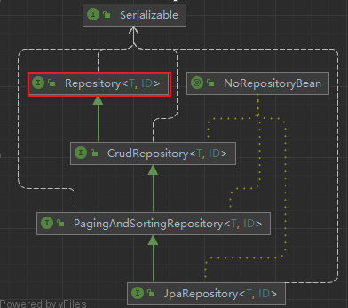
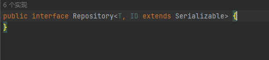
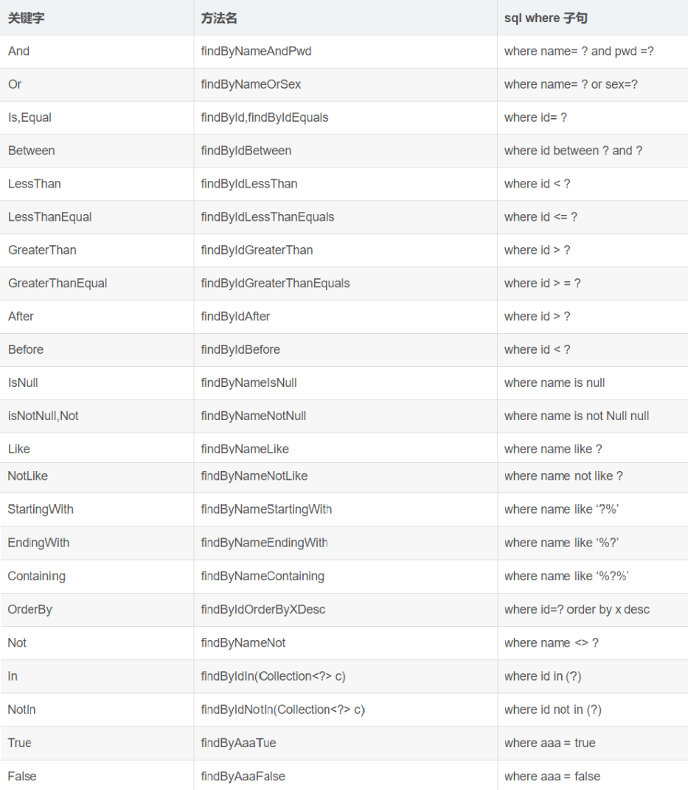

## 了解Repository接口

Repository 接口是 SpringDataJPA 中为我我们提供的所有接口中的顶层接口



该接口是标志接口



Repository 提供了两种查询方式的支持
1. 基于方法名称命名规则查询
2. 基于`@Query` 注解查询

## 搭建环境

请按照开始章节搭建环境 : [入门案例](../01_入门案例/入门案例.md)
## 使用Repository接口

> Repository接口接口是顶级标记接口,提供了对DB的查询操作和更新操作
### 使用方法名命名规则查询

#### 命名规则


#### 实现使用

StudentDaoByName.java接口继承Repository接口

```Java
public interface StudentDaoByName extends Repository<Student, Integer> {
    //from student where stuName = ?
    Student findByStuName(String name);
    //from student where stuName like %?%
    List<Student> findByStuNameContaining(String name);
    // from student where stuAge > ?
    List<Student> findByStuAgeAfter(Integer stuAge);
    // from student where stuName like %?% and stuAge > ?
    List<Student> findByStuNameContainingAndStuAgeAfter(String name,Integer stuAge);
}
```

测试类

```Java
@RunWith(SpringJUnit4ClassRunner.class)
@ContextConfiguration("classpath:applicationContext.xml")
public class TestDemo02 {
    @Autowired
    private StudentDaoByName studentDaoByName;
    @Test
    @Transactional
    public void query1(){
        Student student = studentDaoByName.findByStuName("王五");
        System.out.println(student);
    }
    @Test
    @Transactional
    public void query2(){
        List<Student> students = studentDaoByName.findByStuNameContaining("name");
        students.forEach(System.out::println);
    }
    @Test
    @Transactional
    public void query3(){
        List<Student> students = studentDaoByName.findByStuAgeAfter(18);
        students.forEach(System.out::println);
    }
    @Test
    @Transactional
    public void query4(){
        List<Student> students = studentDaoByName.findByStuNameContainingAndStuAgeAfter("name",18);
        students.forEach(System.out::println);
    }
}
```

> 我们发现,但是用命名规则时,对于复杂的场景下,名字会变得冗长,不是很方便而且容易出错

### 使用@Query注解查询

使用`@Query`注解可以应对复杂场景下的查询操作,可以使用JPQL和SQL语句

> `@Query`注解可以完成数据更新操作，但是不能实现数据的添加和删除操作
#### JPQL

JPQL：是通过Hibernate的HQL语句演变而来的，他和HQL语句很相似

StudentDaoByAnnotations01.java 接口

```Java
public interface StudentDaoByAnnotations01 extends Repository<Student, Integer> {
    @Query("from Student where stuName = ?")
    Student selectByStuName(String name);
    @Query("from Student where stuName like ?")
    List<Student> selectByStuNameLike(String name);
    @Query("from Student where  stuAge > ?")
    List<Student> selectByStuAge(Integer stuAge);
    @Query("from Student where  stuName like ? and stuAge > ?")
    List<Student> findByStuNameAndStuAge(String name,Integer stuAge);
}
```

测试代码

```Java
@RunWith(SpringJUnit4ClassRunner.class)
@ContextConfiguration("classpath:applicationContext.xml")
public class TestDemo03 {
    @Autowired
    private StudentDaoByAnnotations01 studentDaoByAnnotations01;
    @Test
    @Transactional
    public void query1(){
        Student student = studentDaoByAnnotations01.selectByStuName("王五");
        System.out.println(student);
    }
    @Test
    @Transactional
    public void query2(){
        List<Student> students = studentDaoByAnnotations01.selectByStuNameLike("%name%");
        students.forEach(System.out::println);
    }
    @Test
    @Transactional
    public void query3(){
        List<Student> students = studentDaoByAnnotations01.selectByStuAge(18);
        students.forEach(System.out::println);
    }
    @Test
    @Transactional
    public void query4(){
        List<Student> students = studentDaoByAnnotations01.findByStuNameAndStuAge("%name%",18);
        students.forEach(System.out::println);
    }
}
```
#### SQL

我们也可以直接使用SQL语句,不过**需要将nativeQuery属性设置为True**

StudentDaoByAnnotations02.java 接口

```Java
public interface StudentDaoByAnnotations02 extends Repository<Student, Integer> {
    @Query(value = "select * from Student where stuName = ?",nativeQuery = true)
    Student selectByStuName(String name);
    @Query(value = "select * from Student where stuName like ?",nativeQuery = true)
    List<Student> selectByStuNameLike(String name);
    @Query(value = "select * from Student where  stuAge > ?",nativeQuery = true)
    List<Student> selectByStuAge(Integer stuAge);
    @Query(value = "select * from Student where  stuName like ? and stuAge > ?",nativeQuery = true)
    List<Student> findByStuNameAndStuAge(String name,Integer stuAge);
}
```

测试代码

```Java
@RunWith(SpringJUnit4ClassRunner.class)
@ContextConfiguration("classpath:applicationContext.xml")
public class TestDemo04 {
    @Autowired
    private StudentDaoByAnnotations02 studentDaoByAnnotations02;
    @Test
    @Transactional
    public void query1(){
        Student student = studentDaoByAnnotations02.selectByStuName("王五");
        System.out.println(student);
    }
    @Test
    @Transactional
    public void query2(){
        List<Student> students = studentDaoByAnnotations02.selectByStuNameLike("%name%");
        students.forEach(System.out::println);
    }
    @Test
    @Transactional
    public void query3(){
        List<Student> students = studentDaoByAnnotations02.selectByStuAge(18);
        students.forEach(System.out::println);
    }
    @Test
    @Transactional
    public void query4(){
        List<Student> students = studentDaoByAnnotations02.findByStuNameAndStuAge("%name%",18);
        students.forEach(System.out::println);
    }
}
```
#### 对数据的更新

当我们使用`@Query`注解执行更新操作时,需要使用`@Modifying`注解修饰方法

StudentDaoByAnnotations03.java 接口
```Java
public interface StudentDaoByAnnotations03 extends Repository<Student, Integer> {
    @Query(value = "update Student set stuName = ? where stuId = ? ")
    @Modifying// 被@Modifying修饰的方法是一个更新操作
    void updateStudentInfo(String stuName,Integer stuId);
}
```

TestDemo05.java测试方法
```Java
@RunWith(SpringJUnit4ClassRunner.class)
@ContextConfiguration("classpath:applicationContext.xml")
public class TestDemo05 {
    @Autowired
    private StudentDaoByAnnotations03 studentDaoByAnnotations03;
    @Test
    @Transactional
    @Rollback(false)
    public void update01(){
        studentDaoByAnnotations03.updateStudentInfo("aaaa", 1);
    }
}
```