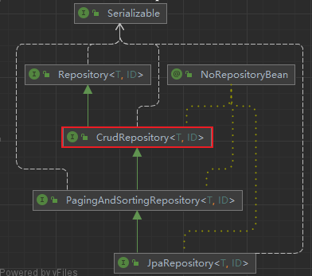

## 了解CrudRepository接口

> CrudRepository接口继承自Repository接口，所以Repository接口具有的功能CrudRepository接口都具有，而且又扩展了CRUD相关的功能



接口内容

```Java
@NoRepositoryBean
public interface CrudRepository<T, ID extends Serializable> extends Repository<T, ID> {
    <S extends T> S save(S var1);
    <S extends T> Iterable<S> save(Iterable<S> var1);
    T findOne(ID var1);
    boolean exists(ID var1);
    Iterable<T> findAll();
    Iterable<T> findAll(Iterable<ID> var1);
    long count();
    void delete(ID var1);
    void delete(T var1);
    void delete(Iterable<? extends T> var1);
    void deleteAll();
}
```

## 搭建环境

请按照开始章节搭建环境 : [入门案例](../01_入门案例/入门案例.md)
## 使用CrudRepository接口

### 创建接口

StudentDaoByCrudRepository.java 接口 继承 CrudRepository接口
```Java
public interface StudentDaoByCrudRepository extends CrudRepository<Student, Integer> {

}
```
### 实现业务代码

#### 添加数据

- save -> 保存指定对象到DB中

```java
@RunWith(SpringJUnit4ClassRunner.class)
@ContextConfiguration("classpath:applicationContext.xml")
public class TestDemo06 {
    @Autowired
    private StudentDaoByCrudRepository studentDaoByCrudRepository;
    
    /**
     * 添加数据
     */
    @Test
    public void test1(){
        Student student = new Student();
        student.setStuName("成龙");
        student.setStuAge(18);
        studentDaoByCrudRepository.save(student);
    }
	
    /**
     * 批量添加数据
     */
    @Test
    public void test2(){
        List<Student> list = new ArrayList<>();
        for (int i = 0; i < 10; i++) {
            Student student = new Student();
            student.setStuName("成龙"+i);
            student.setStuAge(18);
            list.add(student);
        }
        studentDaoByCrudRepository.save(list);
    }
}
```

#### 删除数据

- delete -> 删除指定主键的数据

```java
@RunWith(SpringJUnit4ClassRunner.class)
@ContextConfiguration("classpath:applicationContext.xml")
public class TestDemo06 {
    @Autowired
    private StudentDaoByCrudRepository studentDaoByCrudRepository;
    /**
     * 删除数据
     */
    @Test
    public void delete1(){
        studentDaoByCrudRepository.delete(32);
    }
}
```

#### 更新数据

- save -> 如果主键不为空时,则为更新操作
- 如果是findOne查询出来的数据,直接修改他的对象内容,也会通过序列化到DB内部

```java
@RunWith(SpringJUnit4ClassRunner.class)
@ContextConfiguration("classpath:applicationContext.xml")
public class TestDemo06 {
    @Autowired
    private StudentDaoByCrudRepository studentDaoByCrudRepository;
    /**
     * 更新数据
     */
    @Test
    public void update1(){
        // 根据save方法来实现 如果Users对象的userId属性不为空则update
        Student student = studentDaoByCrudRepository.findOne(34);
        student.setStuName("成龙666");
        studentDaoByCrudRepository.save(student);
    }
    /**
     * 更新数据 方式二
     */
    @Test
    @Transactional
    @Rollback(false)
    public void update2(){
        Student student = studentDaoByCrudRepository.findOne(34);
        student.setStuName("成龙666");
    }
}
```

#### 查询数据

- findOne -> 根据主键查询一条数据
- findAll -> 查询所有数据

```java
@RunWith(SpringJUnit4ClassRunner.class)
@ContextConfiguration("classpath:applicationContext.xml")
public class TestDemo06 {
    @Autowired
    private StudentDaoByCrudRepository studentDaoByCrudRepository;
    /**
     * 查询单条数据
     */
    @Test
    public void test3(){
        Student student = studentDaoByCrudRepository.findOne(1);
        System.out.println(student);
    }
    /**
     * 查询所有的数据
     */
    @Test
    public void test4(){
        Iterable<Student> studentList = studentDaoByCrudRepository.findAll();
        studentList.forEach(System.out::println);
    }
}
```