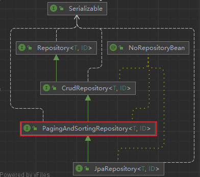
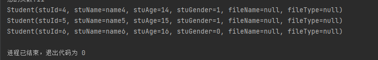
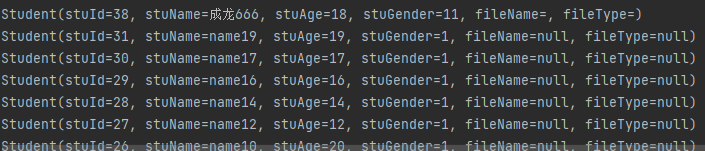

## 了解PagingAndSortingRepository接口

PagingAndSortingRepository继承自CrudRepository接口，那么显然PagingAndSortingRepository就具备了CrudRepository接口的相关的功能，同时也扩展了分页和排序的功能



```Java
@NoRepositoryBean
public interface PagingAndSortingRepository<T, ID extends Serializable> extends CrudRepository<T, ID> {
	//排序的支持
    Iterable<T> findAll(Sort var1);
    //分页的支持
    Page<T> findAll(Pageable var1);
}
```

>注意 : PagingAndSortingRepository即可仅仅是拓展了排序和分页,是不支持条件查询的
## 搭建环境

请按照开始章节搭建环境 : [入门案例](../01_入门案例/入门案例.md)
## 使用PagingAndSortingRepository接口

### 创建接口

StudentDaoByCrudRepository.java 接口 继承 CrudRepository接口
```Java
public interface StudentDaoByPageingAndSortingRepository extends CrudRepository<Student, Integer> {

}
```
### 分页查询


```Java
@RunWith(SpringJUnit4ClassRunner.class)
@ContextConfiguration("classpath:applicationContext.xml")
public class TestDemo07 {
    @Autowired
    private StudentDaoByPageingAndSortingRepository peopleDaoByPageingAndSortingRepository;
    @Test
    public void testDemo01(){
        int page = 1; // page:当前分页的索引  从0开始
        int size = 3; // size:每页显示的条数
        PageRequest pageRequest = new PageRequest(page, size);
        Page<Student> pageObject = peopleDaoByPageingAndSortingRepository.findAll(pageRequest);
        System.out.println("总的条数:" + pageObject.getTotalElements());
        System.out.println("总的页数:" + pageObject.getTotalPages());
        List<Student> studentList = pageObject.getContent();
        studentList.forEach(System.out::println);
    }
}
```



### 排序查询

```java
@RunWith(SpringJUnit4ClassRunner.class)
@ContextConfiguration("classpath:applicationContext.xml")
public class TestDemo07 {
    @Autowired
    private StudentDaoByPageingAndSortingRepository peopleDaoByPageingAndSortingRepository;
    @Test
    public void testDemo02(){
        Sort sortById = new Sort(Sort.Direction.DESC, "stuId");
        Iterable<Student> studentList = peopleDaoByPageingAndSortingRepository.findAll(sortById);
        studentList.forEach(System.out::println);
    }
}
```

