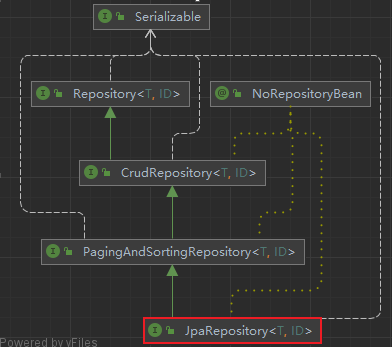

## 了解JpaRepository接口

JpaRepository接口是我们开发时使用最多接口，其特点是可以帮助我们将其他接口的方法的返回值做适配处理，可以使我们在开发的时候更方便的使用这些方法



```java
@NoRepositoryBean
public interface JpaRepository<T, ID extends Serializable> extends PagingAndSortingRepository<T, ID> {
    List<T> findAll();
    List<T> findAll(Sort var1);
    List<T> findAll(Iterable<ID> var1);
    <S extends T> List<S> save(Iterable<S> var1);
    void flush();
    <S extends T> S saveAndFlush(S var1);
    void deleteInBatch(Iterable<T> var1);
    void deleteAllInBatch();
    T getOne(ID var1);
}
```

## 搭建环境

请按照开始章节搭建环境 : [入门案例](../01_入门案例/入门案例.md)

## 使用

请查看入门案例 : [入门案例](../01_入门案例/入门案例.md)

