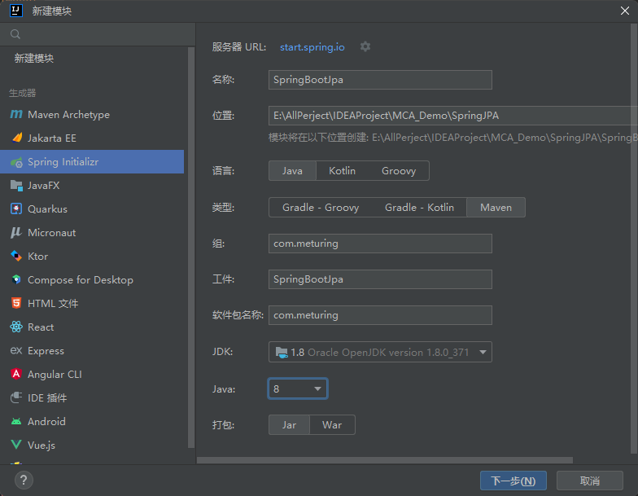
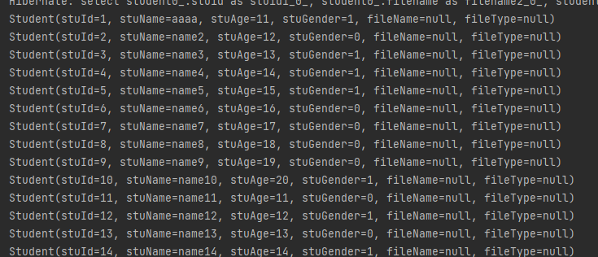

## 构建项目环境
### 创建项目

新建SpringBoot项目



### 导入依赖

```XMl
<dependency>
	<groupId>org.springframework.boot</groupId>
	<artifactId>spring-boot-starter-data-jpa</artifactId>
</dependency>
<dependency>
	<groupId>com.alibaba</groupId>
	<artifactId>druid</artifactId>
	<version>1.1.14</version>
</dependency>
<dependency>
	<groupId>mysql</groupId>
	<artifactId>mysql-connector-java</artifactId>
	<version>8.0.28</version>
</dependency>
<dependency>  
    <groupId>org.projectlombok</groupId>  
    <artifactId>lombok</artifactId>  
    <optional>true</optional>  
</dependency>
```

### 添加配置

```properties
# jdbc 的相关信息
spring.datasource.driverClassName=com.mysql.cj.jdbc.Driver
spring.datasource.url=jdbc:mysql://xxx.xxx.xxx.xx:3306/codernotes?useSSL=false&useUnicode=true&characterEncoding=UTF-8&serverTimezone=Asia/Shanghai&allowPublicKeyRetrieval=true
spring.datasource.username=CoderNotes
spring.datasource.password=CoderNotes

# 配置连接池信息
spring.datasource.type=com.alibaba.druid.pool.DruidDataSource

# 配置jpa的相关参数
spring.jpa.hibernate.ddl-auto=update
spring.jpa.show-sql=true
```
## 业务代码

### 数据源

```SQL
CREATE TABLE `student` (
  `stuid` int NOT NULL AUTO_INCREMENT,
  `stuname` varchar(20) DEFAULT NULL,
  `stuage` int DEFAULT NULL,
  `stugender` char(2) DEFAULT NULL,
  `filename` varchar(100) DEFAULT NULL,
  `filetype` varchar(20) DEFAULT NULL,
  PRIMARY KEY (`stuid`)
) ENGINE=InnoDB AUTO_INCREMENT=38 DEFAULT CHARSET=utf8mb3;
```
### 添加实体类

```Java
@Data
@AllArgsConstructor
@NoArgsConstructor
@ToString
@Entity
@Table(name = "student")
public class Student implements Serializable {
    @Id
    @GeneratedValue(strategy = GenerationType.IDENTITY)
    @Column(name="stuid")
    private Integer stuId;
    @Column(name="stuname")
    private String stuName;
    @Column(name="stuage")
    private Integer stuAge;
    @Column(name="stugender")
    private Integer stuGender;
    @Column(name="filename")
    private String fileName;
    @Column(name="filetype")
    private String fileType;
}
```
### 添加接口

```Java
public interface StudentDao extends JpaRepository<Student,Integer>, JpaSpecificationExecutor {

}
```

### 测试

```Java
@SpringBootTest
class SpringBootJpaApplicationTests {
	@Autowired
	private StudentDao studentDao;
	@Test
	void contextLoads() {
		List<Student> studentList = studentDao.findAll();
		studentList.forEach(System.out::println);
	}
}
```




