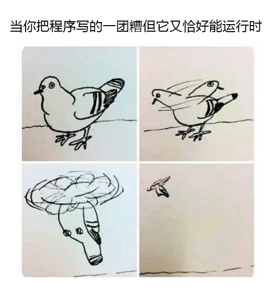
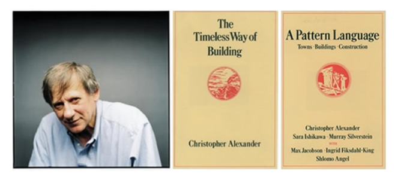
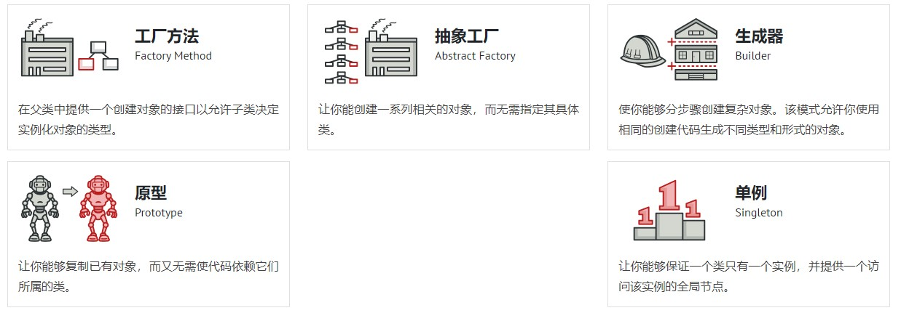
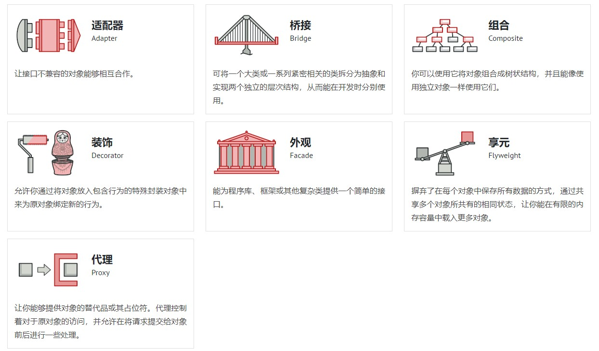
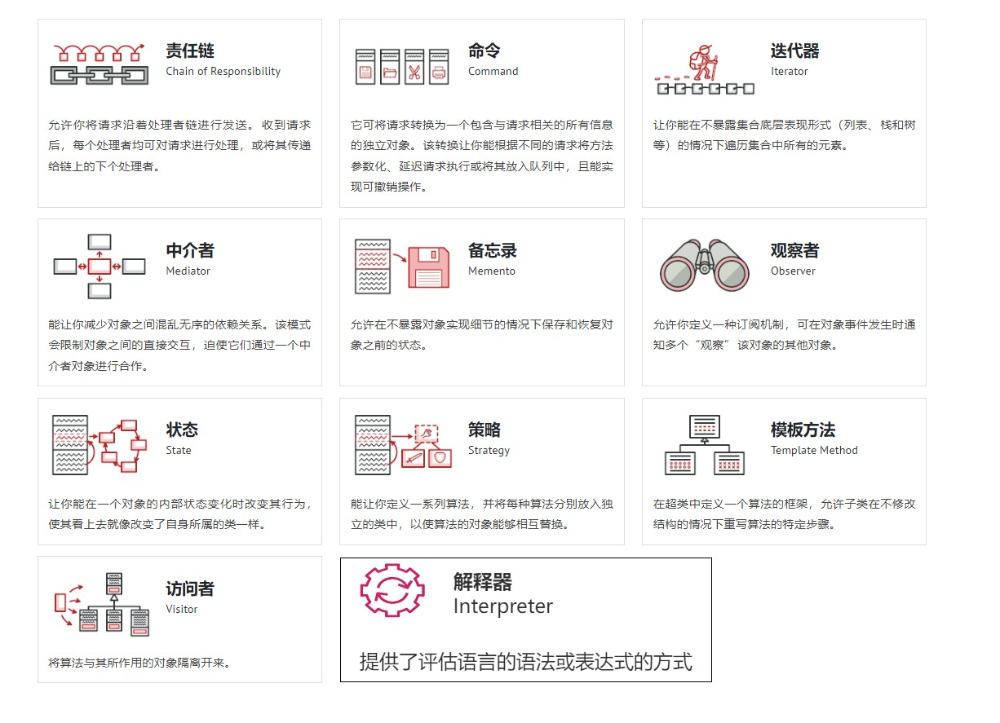

## 代码质量好坏的评判

要想学习设计模式呢 我们就必须搞清楚设计模式到底在我们的编程过程中起到了怎样的作用,在编程世界中它处在一个什么样的位置,它到底是一种抽象的设计思想,还是一套具体的落地方案.

在学习设计模式之前呢 我们需要了解一下 代码质量的评价标准和编程的方法论

我们经常会听到有人对项目代码进行评价,一般就会说：**“代码写得很烂”或者“代码写得很好”**。 用“好”“烂”这样的词汇来描述代码质量，非常地笼统。

对于程序员来说，辨别代码写得“好”还是“烂”，是一个非常重要的能力。这也是我们写出好代码的前提。

代码质量的评价标准非常之多,我这里就给大家介绍一下最常用的几个标准

### 代码质量标准

**评价代码的质量,有以下几个常用标准:**
- **可维护性**
- **可读性**
- **可扩展性**
- **灵活性**
- **简洁性**
- **可复用性**
- **可测试性**
#### 可维护性

**可维护性强的代码**指的是: 在不去破坏原有的代码设计以及不引入新的BUG的前提下,能够快速的修改或者新增代码.
**不易维护的代码**指的是: 在添加或者修改一些功能逻辑的时候,存在极大的引入新的BUG的风险,并且需要花费的时间也很长.

> 代码可维护性的评判标准比较模糊, 因为是否易维护是针对维护的人员来说的,不同水平的人对于同一份代码的维护能力是不同的. 所谓 ''难者不会 会者不难''. 对于同样的系统,熟悉它的资深工程师会觉得代码可维护性还可以,而新人则会因为能力不足、了解不够深入等原因觉得代码的可维护性不是很好.
#### 可读性

软件开发教父，Martin Fowler曾经说过一句话: "任何傻瓜都能够编写计算机能理解的代码，而优秀的程序员能够编写人类能理解的代码。" 这句话的意思非常容易理解,就是要求我们写出的代码是**易读的**、**易理解的**,因为代码的可读性会在很大程度上影响代码的**可维护行性**.

> code review ( 代码审查,一种测试代码可读性的手段 ):
> 1. 检查代码风格和编程规范: 代码是否符合编码规范、命名是否达意、注释是否详尽、模块划分是否清晰等
> 2. 检查常规的 bad smell 和代码 bug: 是否存在重复代码、过长函数、过大类、过于亲密的两个 classes等
#### 可扩展性

代码的可扩展性表示，我们在不修改或少量修改原有代码的情况下，通过扩展的方式添加新的功能代码。

> 可扩展性的背后其实就是: "对修改关闭,对扩展开放" 这条设计原则,后面我们会详细的讲解
#### 灵活性

"灵活" 是指在添加新代码的时候，**已有代码能够不受影响，不产生冲突，不出现排斥**，在保证自身不遭到破坏的前提下灵活地接纳新代码。

> 下面的几个场景,可以体现代码的灵活性:
> 1.添加新的功能代码时,原有代码已经预留了扩展点,我们不需要修改 直接在扩展点上新增代码即可.
> 2.当我们想实现一个功能模块时,发现原有代码中,已经抽象出了很多底层可以复用的模块、类等代码,我们可以直接拿来使用
> 3.当我们使用某组接口时,这组接口可以应对各种使用场景,满足不同需求,这个接口设计的十分的灵活易用.

#### 简洁性

我们要遵从KISS ( Keep It Simple Stupid) 原则，代码要尽可能的简单；但是**思从深而行从简**，真正的高手能云淡风轻地用最简单的方法解决最复杂的问题。这也是一个编程老手跟编程新手的本质区别之一。

> 代码的写法应当使别人理解它所需的时间最小化.

#### 可复用性

代码的可复用性可以简单地理解为，尽量**减少重复代码的编写，复用已有的代码**.

> 可复用性也是一个非常重要的代码评价标准，是很多设计原则、思想、模式等所 要达到的最终效果
> 可复用性与DRY(Don't Repeat Yourself) 避免编写重复的代码逻辑. 原则关系紧密,后面我们会介绍有哪些编程方法可以提高代码复用性.

#### 可测试性

单元测试在一个完整的软件开发流程中是必不可少的、非常重要的一个环节。通常写单元测试并不难，但有的时候，有的代码和功能难以测试，导致写起测试来困难重重。所以写出的代码具有可测试性，具有很重要的作用。

> 代码可测试性的好坏，能从侧面上非常准确地反应代码质量的好坏

## 编程方法论

想要拥有编写高质量代码的能力,我们就要学习一些编程的方法论.其中就包含面向对象（我们可以把它看成一种设计思想）、设计原则、设计模式、编程规范、重构技巧等等

> 代码重构的工具就是面向对象设计思想、设计原则、设计模式、编码规范

提高代码质量的方法论包含:
- 面向对象思想 (基础)
- 设计原则 (指导方针)
- 设计模式 (设计原则的具体实现)
- 编程规范 (提高代码可读性)
- 重构 (面向对象设计思想、设计原则、设计模式、编码规范的融合贯通)
### 面向对象

面向对象是一种编程思想,也是一种编程范式. 现在比较流行的编程语言大部分都是面向对象编程语言.而大部分项目也都是基于面向对象编程风格进行开发的.
### 设计原则(重点)

设计原则是指导我们代码设计的一些经验总结。在软件开发中，为了提高软件系统的可维护性和可复用性，增加软件的可扩展性和灵活性，程序员要尽量根据设计原则来开发程序，从而提高软件开发效率、节约软件开发成本和维护成本。

常用的设计原则:
- 单一职责原则
- 开闭原则
- 里氏代换原则
- 依赖倒转原则
- 接口隔离原则
- 迪米特法则

>设计原则的特点就是比较的抽象,大家不需要死记硬背.每个人根据自己所积累的经验和所处的业务场景, 去灵活的运用这些原则即可
### 设计模式(重点)

设计模式是针对软件开发中经常遇到的一些设计问题，总结出来的一套解决方案或者设计思路。大部分设计模式要解决的都是代码的可扩展性问题。

> 设计模式是遵循设计原则的, 设计模式相对于设计原则来说，没有那么抽象，而且大部分都不难理解，代码实现也并不复杂。这一块的学习难点是了解它们 都能解决哪些问题，掌握典型的应用场景，并且懂得不过度应用。

### 编程规范

编程规范主要解决的是代码的可读性问题。编码规范相对于设计原则、设计模式，更加具 体、更加偏重代码细节。

> 对于编码规范，考虑到很多书籍已经讲得很好了（比如《编写可读性代码的艺术》《代码大全》《代码整洁之 道》等）。而且，每条编码规范都非常简单、非常明确，比较偏向于记忆，你只要照着来做 可以。

### 重构

维基百科: 在软件工程学里，**重构**代码一词通常是指在不改变代码的外部行为情况下而修改源代码，有时非正式地称为“清理干净”。在极限编程或其他敏捷方法学中，重构常常是软件开发循环的一部分：开发者轮流增加新的测试和功能，并重构代码来增进内部的清晰性和一致性。

> 在软件开发中，只要软件在不停地迭代，就没有一劳永逸的设计。随着需求的变化，代码的 不停堆砌，原有的设计必定会存在这样那样的问题。针对这些问题，我们就需要进行代码重构。重构是软件开发中非常重要的一个环节。持续重构是保持代码质量不下降的有效手段， 能有效避免代码腐化到无可救药的地步。

## 设计模式概述

**设计模式（Design pattern）** 是一套被反复使用、多数人知晓的、经过分类编目的、代码设计经验的总结

> 在GOF编写的设计模式(可复用面向对象软件的基础)一书中说道: 本书涉及的设计模式**并不描述新的或未经证实的设计**，我们只**收录那些在不同系统中多次使用过的成功设计**。

**大部分设计模式要解决的都是代码的可重用性、可扩展性问题**

如果说数据结构和算法是教你如何写出高效代码，那设计模式讲的是如何写出可扩展、可读、可维护的高质量代码，所以，它们跟平时的编码会有直接的关系，也会直接影响到你的开发能力。

学习设计模式的好处:
- 能够从容应对面试中的设计模式相关问题
- 不再编写 bullshit-code
- 提高复杂代码的设计和开发能力
- 有助于我们读懂源码,学习框架更加事半功倍
## 设计模式产生背景

**"设计模式"**  最初并不是出现在软件设计中，而是被用于建筑领域的设计中。

1977年美国著名建筑大师、加利福尼亚大学伯克利分校环境结构中心主任`克里斯托夫·亚历山大（Christopher Alexander）`在他的著作《建筑模式语言：城镇、建筑、构造》中描述了一些常见的建筑设计问题，并提出了 253 种关于对城镇、邻里、住宅、花园和房间等进行设计的基本模式。

1990年软件工程界开始研讨设计模式的话题，后来召开了多次关于设计模式的研讨会。

**四人帮（GOF）**  :   1994 年，艾瑞克·伽马（ErichGamma）、理査德·海尔姆（Richard Helm）、拉尔夫·约翰森（Ralph Johnson）、约翰·威利斯迪斯（John Vlissides）等 4 位作者合作出版了《设计模式：可复用面向对象软件的基础》一书，在此书中收录了 23 个设计模式，这是设计模式领域里程碑的事件，导致了软件设计模式的突破。

**由于书名太长， 人们将其简称为 "四人组 （Gang of Four， GoF） 的书"， 并且很快进一步简化为 "GoF 的书"。**

> 在之前设计模式的**绝大部分以往并无文本记录**，它们或是来源于面向对象设计者圈子里的非正式交流，或是来源于某些成功的面向对象系统的某些部分，但对**设计新手**来说，这些东西是很难学得到的。尽管这些设计**不包括新的思路**，但我们**用一种新的、便于理解的方式将其展现给读者**，即：具有统一格式的、已分类编目的若干组设计模式。

## 设计模式分类

GoF设计模式只有23个，但是它们各具特色 ，每个模式都为某一个可重复的设计问题提供了一套解决方案。
根据它们的用途，设计模式可分为 **创建型(Creational)** ，**结构型(Structural)** 和**行为型(Behavioral)**
### 创建型(Creational)

**创建型模式(5种)：提供创建对象的机制，提升已有代码的灵活性和可复用性**

常用的有：单例模式、工厂模式（工厂方法和抽象工厂）、建造者模式。
不常用的有：原型模式。

### 结构型(Structural)

**结构型模式(7种)：介绍如何将对象和类组装成较大的结构，并同时保持结构的灵活和高效**

常用的有：代理模式、桥接模式、装饰者模式、适配器模式。
不常用的有：门面模式、组合模式、享元模式。

### 行为型(Behavioral)

**行为模式(11种)：负责对象间的高效沟通和职责传递委派**

常用的有：观察者模式、模板模式、策略模式、职责链模式、迭代器模式、状态模式。 
不常用的有：访问者模式、备忘录模式、命令模式、解释器模式、中介模式。

.