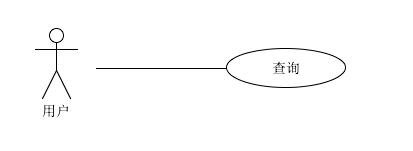
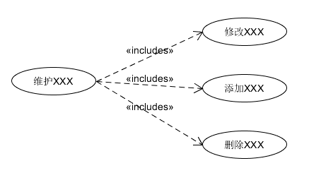

## UML概述

`统一建模语言（Unified Modeling Language，UML）`是用来设计软件的可视化建模语言。它的特点是简单、统一、图形化、能表达软件设计中的动态与静态信息。

UML 从目标系统的不同角度出发，定义了用例图、类图、对象图、状态图、活动图、时序图、协作图、构件图、部署图等 9 种图。
## 类图概述

`类图(Class diagram)` 是显示了模型的静态结构，特别是模型中存在的类、类的内部结构以及它们与其他类的关系等。类图不显示暂时性的信息。类图是面向对象建模的主要组成部分。
## 类图的作用

- 在软件工程中，类图是一种静态的结构图，描述了系统的类的集合，类的属性和类之间的关系，可以简化了人们对系统的理解；
- 类图是系统分析和设计阶段的重要产物，是系统编码和测试的重要模型。
## 类图的表示法

类图通常分为为三层：
-- 名称部分(Name) : 在顶端存放;  
-- 属性部分(Attribute) : 在中间存放属性,属性类型(AttributeType),初始值(InitialValue);  
-- 方法部分(Operation) : 底部存放操作,参数表(arg:ArgumentType),返回值(ReturnType);

（接口类型没有属性部分）
### 名称部分(Name) - 不同类型类的表示

UML类图中具体类、抽象类、接口和包有不同的表示方法。
#### 表示具体的类

具体类在类图中用**矩形框表示**，矩形框分为三层：第一层是**类名字**。第二层是类的**成员变量**；第三层是类的**方法**。


#### 表示抽象类

抽象类在UML类图中同样用矩形框表示，但是抽象类的类名以及抽象方法的名字都用斜体字表示，如图所示。


#### 表示接口

接口在类图中也是用矩形框表示，但是与类的表示法不同的是，接口在类图中的第一层顶端用构造型 `<<interface>>`表示，下面是接口的名字，第二层是方法。


> 此外，接口还有另一种表示法，俗称棒棒糖表示法，就是类上面的一根棒棒糖（圆圈+实线）。圆圈旁为接口名称，接口方法在实现类中出现。


### 属性部分(Attribute)

#### 语法

**属性语法 :**` [可见性]属性名[ :类型][ =初始值][{属性字符串}] `;

> 注意 : `[] `中的内容可有可无 ;
> 属性字符串用来指定关于属性的其它信息 , 不一定是是属性值, 如果希望添加一个属性定义规则 , 但是没地方添加, 可以写在属性字符串中 ;
#### 可见性

成员变量以及方法前的访问修饰符用符号来表示：
- “+” 表示 `public`；可以在此类的外部使用查看该属性;
- “-” 表示 `private`；不可以从外部类中访问该属性;
- “#” 表示 `protected`；常与泛化一起使用;
- 不带符号表示 `default`。
### 方法部分(Operation)

#### 语法

**方法语法：**`[可见性]操作名[( 参数表 )][ : 返回类型][ { 属性字符串 } ]`;

> 注意 : `[]`中的内容可有可无 ; 如果有多个参数列表的话，中间用逗号隔开
#### 可见性

可见性 : 主要包括 **公有(public +)**, **私有(private -)**, **受保护(protected #)**, **包内公有(package ~)**;  
-- 公有 : 用 "+" 表示, 只要调用对象能访问操作所在的包, 就能访问公有操作;  
-- 私有 : 用 "-" 表示, 同一个类的对象才能调用私有的操作;  
-- 保护 : 用 "#" 表示, 子类对象才可以调用受保护操作;  
-- 包内 : 用 "~" 表示, 同一个包内的对象才可以调用包内公有的操作;
## 在类图中表示关系

类和类、类和接口、接口和接口之间存在一定关系，UML类图中一般会有连线指明它们之间的关系。

关系共有六种类型 ,如下图:


为了节省学习成本, 方便记忆,我们可以将类和类之间的关系重新调整一下,使其更加贴近编程的角度:

- 实现关系
- 泛化关系
- 依赖关系
- 组合关系 (组合关系+关联关系+聚合关系)

> 我们也没有必要去区分组合与聚合这两个概念,只需要记住一点就是: **多用组合少用继承**
> 也就是说只要 B 类对象是 A 类对象的成员变量，那我们就称，A 类跟 B 类是组合关系.

### 实现关系(implements)

**概念** ：实现关系是接口与实现类之间的关系。在这种关系中，类实现了接口，类中的操作实现了接口中所声明的所有的抽象操作。

**语义**：
i. 类和接口之间的关系；
ii. 一个类可以实现多个接口，实现所有接口的功能；体现了规范和实现分离的原则

**语法**： `implements`

**表示方式** ：在 UML 类图中，**实现关系使用带空心三角箭头的虚线来表示，箭头从实现类指向接口。**

例如，汽车和船实现了交通工具，其类图:

### 继承关系(泛化-extends)

**概念** ： 泛化关系是对象之间耦合度最大的一种关系，表示一般与特殊的关系，是父类与子类之间的关系，是一种继承关系。

**语义** ：
i. 类和子类的关系，接口和子接口的关系；
ii. 一个类（称为子类、子接口）继承另外的一个类（称为父类、父接口）的功能，并可以增加它自己的新功能

**语法**：`extends`

**表示方式** ： 在 UML 类图中，**泛化关系用带空心三角箭头的实线来表示，箭头从子类指向父类。** 在代码实现时，使用面向对象的继承机制来实现泛化关系。

例如，Student 类和 Teacher 类都是 Person 类的子类，其类图如下图所示：

### 一般关联关系

关联关系是对象之间的一种引用关系，用于表示一类对象与另一类对象之间的联系，如老师和学生、师傅和徒弟、丈夫和妻子等。关联关系是类与类之间最常用的一种关系，分为一般关联关系、聚合关系和组合关系。类B作为成员变量形成存在于类A中, 简单来说: **A包含B,且A的B创建相互独立**

关联关系又可以分为单向关联，双向关联，自关联。
#### 单向关联

在UML类图中单向关联用一个带箭头的实线表示。上图表示每个顾客都有一个地址，这通过让Customer类持有一个类型为Address的成员变量类实现。


#### 双向关联

从上图中我们很容易看出，所谓的双向关联就是双方各自持有对方类型的成员变量。


在UML类图中，双向关联用一个不带箭头的直线表示。上图中在Customer类中维护一个`List<Product>`，表示一个顾客可以购买多个商品；在Product类中维护一个Customer类型的成员变量表示这个产品被哪个顾客所购买。
#### 自关联

自关联在UML类图中用一个带有箭头且指向自身的线表示。上图的意思就是Node类包含类型为Node的成员变量，也就是“自己包含自己”。


### 聚合关系(has-a)

聚合关系是关联关系的一种，表示一种弱的‘拥有’关系，体现的是A对象可以包含B对象，但是B对象不是A对象的一部分,简单来说: **A拥有B,创建A时初始化B,但不创建B**

```Java
public class University{
	private ArrayList<Teacher> teacherList;
	public University(ArrayList<Teacher> teacherList){
		this.teacherList = teacherList;
	}
}
```

> 在代码中: 比如 University 类对象包含 Teacher 类对象，Teacher 类对象的生命周期可以不依赖 University 类对象的生命周期，也就是说可以单独销毁 University 类对象而不影响 Teacher 对象

在 UML 类图中，聚合关系可以用带空心菱形的实线来表示，菱形指向整体。


### 组合关系(contains-a)

组合关系是一种强‘拥有’关系，体现了严格的部分和整体的关系，部分和整体的声明周期一样.简单来说: **A创建B,且拥有B**

```java
public class Head{
    private Mouth mouth;
    public Head(){
        this.mouth = new Mouth();
    }
}
```

> 在代码中: 比如 Head 类对象包含 Mouth 类对象，Mouth 类对象的生命周期依赖 Head 类对象的生命周期，Mouth 类对象不可以单独存在

在 UML 类图中，组合关系用带实心菱形的实线来表示，菱形指向整体。


### 依赖关系(uae-a)

**概念** : 依赖关系是一种使用关系，它是对象之间耦合度最弱的一种关联方式，是临时性的关联。

**语义** : 一个类A使用到了另一个类B，但是这种使用关系是具有偶然性的、临时性的、非常弱的，但是类B的变化会影响到类A

简单来说: **A不拥有B,但是使用B**

**表示方式** : 由类A指向类B的带箭头虚线表示

```Java
public class Driver{
    pubilc void driver(Car car){
	    car.move();
    }
}

public class Car{
    pubilc void move(){
	    //汽车驾驶移动...
    }
}
```

>在代码中，某个类的方法通过局部变量、方法的参数或者对静态方法的调用来访问另一个类（被依赖类）中的某些方法来完成一些职责。


## 常见UML图

### 用例图

#### 概念

用例图是指由参与者、用例，边界以及它们之间的关系构成的用于描述系统功能的视图。


**用例图主要用来描述角色以及角色与用例之间的连接关系** 。说明的是谁要使用系统，以及他们使用该系统可以做些什么。一个用例图包含了多个模型元素 ，如系统、参与者和用例，并且显示这些元素之间的各种关系 ，如泛化 、关联 和依赖 。它展示了一个外部用户能够观察到的系统功能模型图。

> 【用途】：帮助开发团队以一种可视化的方式理解系统的功能需求。
#### 包含元素

##### 参与者(Actor)

与应用程序或系统进行交互的用户、组织或外部系统。用一个小人表示 。


##### 用例(Use Case)

用例就是外部可见的系统功能，对系统提供的服务进行描述。用椭圆表示 。


##### 子系统(Subsystem)

用来展示系统的一部分功能，这部分功能联系紧密。(就是具体的系统功能)


#### 包含关系

用例图中涉及的关系有：**关联** 、**泛化** 、**包含** 、**扩展** 。


##### 关联(Association)

表示参与者与用例之间的通信，任何一方都可发送或接受消息。

【箭头指向】：无箭头，将参与者与用例相连接，指向消息接收方


##### 泛化(Inheritance)

就是通常理解的继承关系，子用例和父用例相似，但表现出更特别的行为；

子用例将继承父用例的所有结构、行为和关系。子用例可以使用父用例的一段行为，也可以重载它。父用例通常是抽象的。

在实际应用中很少使用泛化关系，子用例中的特殊行为都可以作为父用例中的备选流存在。

【箭头指向】：指向父用例


> PS：父类的功能少，子类的功能多
##### 包含(Include)

包含关系用来把一个较复杂用例所表示的功能分解成较小的步骤。

包含关系对典型的应用就是复用，也就是定义中说的情景。

但是有时当某用例的事件流过于复杂时，为了简化用例的描述，我们也可以把某一段事件流抽象成为一个被包含的用例；相反，用例划分太细时，也可以抽象出一个基用例，来包含这些细颗粒的用例。这种情况类似于在过程设计语言中，将程序的某一段算法封装成一个子过程，然后再从主程序中调用这一子过程。

例如：业务中，总是存在着维护某某信息的功能，如果将它作为一个用例，那添加、修改以及删除都要在用例详述中描述，过于复杂；如果分成添加用例、修改用例和删除用例，则划分太细。这时包含关系可以用来理清关系。

【箭头指向】：指向**分解出来的功能用例**


例如: 预约功能、借书功能都包含 登陆功能，将通用功能（复用功能）提取

##### 扩展(Extend)

扩展关系是指用例功能的延伸，相当于为基础用例提供一个附加功能。

将基用例中一段相对独立并且可选的动作，用扩展（Extension）用例加以封装，再让它从基用例中声明的扩展点（Extension Point）上进行扩展，从而使基用例行为更简练和目标更集中。

扩展用例为基用例添加新的行为。扩展用例可以访问基用例的属性，因此它能根据基用例中扩展点的当前状态来判断是否执行自己。但是扩展用例对基用例不可见。

对于一个扩展用例，可以在基用例上有几个扩展点。

【箭头指向】：指向基础用例

### 状态图

#### 概念

状态图(statechart diagram）：用来操述一个特定的对象所有可能的状态，以及哪些事件将导致状态改变。
#### 包含元素

（1）箭头表示一个转换/一个动作
（2）箭头上的文字：表示一个事件

（3）长方形表示某种状态

（4）起始状态 ：是一种伪状态，只是表示从这里要开始 （可选）

（5）结束状态：是一种伪状态，只是表示从这里要结束（可选）


例如: 


### 活动图

#### 概念

**活动图(activity diagram)** 是UML的动态规图之一，用来描述事物或对象的活动变化流程。类似流程图，描述从一个动作转移到另外一个动作，阐明了业务用例实现的工作流程。
#### 包含元素

（1）开始：线条表示-活动流(ActionFlow):描述活动之间的有向关系，表示一个活动向另外一个活动之间的转移。用带箭头的实线表示。

（2）结束：

（3）活动：

（4）条件转移（分支）：表示从一个活动按照某种条件转移到几个不同的活动。

（5）分劈和汇合：表示并发的同步行为，用同步杆表示。 - 》 有分劈、有汇总


例如:

### 时序图

#### 概念

时序图（Sequence Diagram），又名序列图、循序图，是一种UML交互图，当用户进行某个操作的时候，按照时间的顺序看，各个模块之间如何调用的。描述了方法的调用过程，程序的执行流程，以及方法执行结束的返回值情况。所以用例图当中的一个用例会对应一个时序图，该时序图描述的是该功能/用例具体是怎么实现的，流程是什么。严格情况下，肯定是先设计再开发。
#### 包含元素

（1）角色(Actor)


（2）对象(Object)


（3）生命线(LifeLine)


（4）控制焦点(Activation)

PS：控制焦点可以体现生命周期

（5）消息(Message)


举例：

### 组件图

组件图用来建立系统的各个组件之间的关系（网站分了多少层，每层有多少组件），它们是通过功能或者文件组织在一起，使用组件图可以帮助读者了解某个功能位于软件包的哪一位置，以及各个版本的软件包含那些功能。如javabean、 ejb 、 jsp都是组件。在UML中，组件元素为：


组件图可以用来帮助设计系统的整体构架。

举例：

### 部署图

表现用于部署软件应用的物理设备信息


