## 设计原则概述

> 而设计模式通常需要遵循一些设计原则，在设计原则的基础之上衍生出了各种各样的设计模式。设计原则是设计要求，设计模式是设计方案，使用设计模式的代码则是具体的实现。

设计模式中主要有六大设计原则，简称为**SOLID** ，是由于各个原则的首字母简称合并的来 (两个L算一个,solid 稳定的)，六大设计原则分别如下：

1. 单一职责原则（Single Responsibitity Principle）
2. 开放封闭原则（Open Close Principle）
3. 里氏替换原则（Liskov Substitution Principle）
4. 接口分离原则（Interface Segregation Principle）
5. 依赖倒置原则（Dependence Inversion Principle）
6. 迪米特法则（Law Of Demter）

软件开发中我们要基于这六个原则,设计建立稳定、灵活、健壮的程序.

这里我们只需要重点关注三个常用的原则即可:

**1 ) 单一职责原则**
单一职责原则是类职责划分的重要参考依据，是保证代码”高内聚“的有效手段，是我们在进行面向对象设计时的主要指导原则。
> 单一职责原则的难点在于，对代码职责是否足够单一的判定。这要根据具体的场景来具体分析。同一个类的设计，在不同的场景下，对职责是否单一的判定，可能是不同的。

**2 ) 开闭原则**
开闭原则是保证代码可扩展性的重要指导原则，是对代码扩展性的具体解读。很多设计模式诞生的初衷都是为了提高代码的扩展性，都是以满足开闭原则为设计目的的。
> 开闭原则是所有设计模式的最核心目标，也是最难实现的目标，但是所有的软件设计模式都应该以开闭原则当作标准，才能使软件更加的稳定和健壮。

**3 ) 依赖倒置原则**
依赖倒置原则主要用来指导框架层面的设计。高层模块不依赖低层模块，它们共同依赖同一个抽象。
> 依赖倒置原则其实也是实现开闭原则的重要途径之一，它降低了类之间的耦合，提高了系统的稳定性和可维护性，同时这样的代码一般更易读，且便于传承。

## 单一职责原则

### 官方定义

**单一职责原则**，英文缩写SRP，全称 Single Responsibility Principle。

> 在<<架构整洁之道>>一书中 关于这个原则的英文描述是这样的：A class or module should have a single responsibility 。如果我们把它翻译成中文，那就是：**一个类或者模块只负责完成一个职责（或者功能）**。
### 通俗理解

单一职责原则的定义描述非常简单，也不难理解。**一个类只负责完成一个职责或者功能。**
也就是说在类的设计中 我们不要设计大而全的类,而是要设计粒度小、功能单一的类.

> 比如 我们设计一个类里面既包含了用户的一些操作,又包含了支付的一些操作,那这个类的职责就不够单一, 应该将该类进行拆分, 拆分成多个功能更加**单一的**, **粒度更细**的类.
### 场景示例

**不同的应用场景、不同阶段的需求背景下，对同一个类的职责是否单一的判定，可能都是不一样的**

例如: 下面的UserInfo类中,是否满足单一职责呢?
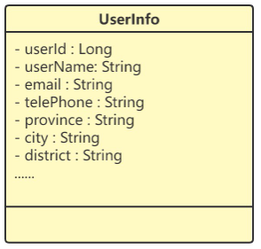
正确答案: **根据实际业务场景选择是否拆分**
- 该社交产品的有用户信息只是用来展示的,那么这个类这样设计就没有问题
- 假设后面这个社交产品又添加了电商模块, 那就需要将地址信息提取出来,单独设计一个类
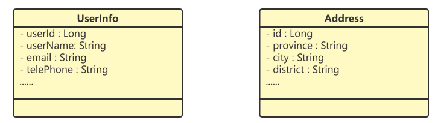

**所以我们在开发中可以按照以下的模式**:  我们可以先写一个粗粒度的类，满足业务需求。随着业务的发展，如果粗粒度的类越来越庞大，代码越来越多，这个时候，我们就可以将这个粗粒度的类，拆分成几个更细粒度的类。这就是所谓的持续重构
### 如何判断一个类的职责是否单一

这里没有一个具体的金科玉律，但从实际代码开发经验上，有一些可执行性的侧面判断指标，可供参考：
- 类中的代码行数、函数、或者属性过多；
- 类依赖的其他类过多
- 私有方法过多
- 类中大量的方法都是集中操作类中的几个属性
## 开放封闭原则

### 官方定义

一般认为最早提出开闭原则（Open-Close Principle，OCP）的是伯特兰·迈耶。他在1988 年发表的《面向对象软件构造》中给出的。在面向对象编程领域中，

开闭原则规定软件中的**对象、类、模块和函数对扩展应该是开放的，但对于修改是封闭的**。这意味着应该用抽象定义结构，用具体实现扩展细节，以此确保软件系统开发和维护过程的可靠性。
### 通俗理解

定义：**对扩展开放，对修改关闭**

>对扩展开放和对修改关闭表示 :
>1. 当一个类或一个方法有新需求或者需求发生改变时应该采用扩展的方式而不应该采用修改原有逻辑的方式来实现。因为扩展了新的逻辑如果有问题只会影响新的业务，不会影响老业务；而如果采用修改的方式，很有可能就会影响到老业务受影响。
>2. 开闭原则是所有设计模式的最核心目标，也是最难实现的目标，但是所有的软件设计模式都应该以开闭原则当作标准，才能使软件更加的稳定和健壮。

优点：
1. 新老逻辑解耦，需求发生改变不会影响老业务的逻辑
2. 改动成本最小，只需要追加新逻辑，不需要改的老逻辑
3. 提供代码的稳定性和可扩展性
### 场景示例

例如 : 系统A与系统B之间进行数据传输使用的是427版本的协议，一年以后对427版本的协议进行了修正。

设计时应该考虑的数据传输协议的可变性，抽象出具有报文解译、编制、校验等所有版本协议使用的通用方法，调用方针对接口进行编程即可，如上述示例设计类图如下

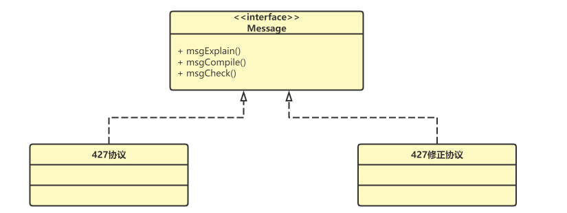

调用方依赖于报文接口，报文接口是稳定的，而不针对具体的427协议或427修正协议。利用接口多态技术，实现了开闭原则。

### 顶层设计思维

- 抽象意识
- 封装意识
- 扩展意识

> 在写代码的时候后，我们要多花点时间往前多思考一下，这段代码未来可能有哪些需求变 更、如何设计代码结构，事先留好扩展点，以便在未来需求变更的时候，不需要改动代码整 体结构、做到最小代码改动的情况下，新的代码能够很灵活地插入到扩展点上，做到“对扩 展开放、对修改关闭”。
## 里氏替换原则

### 官方定义

里氏替换原则（Liskov Substitution Principle，LSP）是由麻省理工学院计算机科学系教授芭芭拉·利斯科夫于 1987 年在“面向对象技术的高峰会议”（OOPSLA）上发表的一篇论文《数据抽象和层次》（Data Abstractionand Hierarchy）里提出的.

她在论文中提到：如果S是T的子类型，对于S类型的任意对象，如果将他们看作是T类型的对象，则对象的行为也理应与期望的行为一致。

> 类对象能够替换程序中父类对象出现的任何地方，并且保证原来程序的逻辑行为不变及正确性不被破坏。
### 通俗理解

**如何理解里氏替换原则？**

要理解里氏替换原则，其实就是要理解两个问题：
- 什么是替换？
- 什么是与期望行为一致的替换（Robert Martin所说的“必须能够替换”）？
#### 什么是替换

替换的前提是面向对象语言所支持的多态特性，同一个行为具有多个不同表现形式或形态的能力。

> 以JDK的集合框架为例，`List`接口的定义为有序集合，`List`接口有多个派生类，比如大家耳熟能详的`ArrayList`, `LinkedList`。那当某个方法参数或变量是`List`接口类型时，既可以是`ArrayList`的实现, 也可以是`LinkedList`的实现，这就是替换。
####  什么是与期望行为一致的替换

在不了解派生类的情况下，仅通过接口或基类的方法，即可清楚的知道方法的行为，而不管哪种派生类的实现，都与接口或基类方法的期望行为一致。

> 不需要关心是哪个类对接口进行了实现,因为不管底层如何实现,最终的结果都会符合接口中关于方法的描述(也就是与接口中方法的期望行为一致).
> 或者说接口或基类的方法是一种契约，使用方按照这个契约来使用，派生类也按照这个契约来实现。这就是与期望行为一致的替换。

### 场景示例

里氏替换原则要求我们在编码时使用基类或接口去定义对象变量，使用时可以由具体实现对象进行赋值，实现变化的多样性，完成代码对修改的封闭，扩展的开放。

比如 : 在一个商城项目中, 定义结算接口Istrategy，该接口有三个具体实现类，分别为 PromotionalStrategy （满减活动，两百以上百八折）、RebateStrategy （打折活动）、 ReduceStrategy（返现活动）

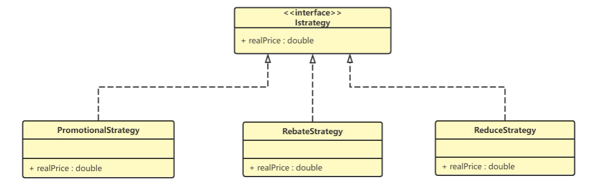

```Java
public interface Istrategy {
    public double realPrice(double consumePrice);
}

public class PromotionalStrategy implements Istrategy {
    public double realPrice(double consumePrice) {
        if (consumePrice > 200) {
            return 200 + (consumePrice - 200) * 0.8;
        } else {
            return consumePrice;
        }
    }
}
public class RebateStrategy implements Istrategy {
    private final double rate;
    public RebateStrategy() {
        this.rate = 0.8;
    }
    public double realPrice(double consumePrice) {
        return consumePrice * this.rate;
    }
}
public class ReduceStrategy implements Istrategy {
    public double realPrice(double consumePrice) {
        if (consumePrice >= 1000) {
            return consumePrice - 200;
        } else {
            return consumePrice;
        }
    }
}
```

调用方为Context，在此类中使用接口定义了一个对象。

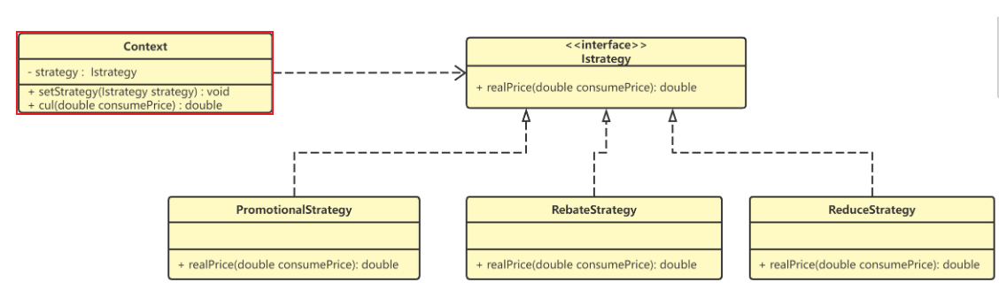

```Java
public class Context {
    //使用基类定义对象变量
    private Istrategy strategy;
    // 注入当前活动使用的具体对象
    public void setStrategy(Istrategy strategy) {
        this.strategy = strategy;
    }
    // 计算并返回费用
    public double cul(double consumePrice) {
        // 使用具体商品促销策略获得实际消费金额
        double realPrice = this.strategy.realPrice(consumePrice);
        // 格式化保留小数点后1位，即：精确到角
        BigDecimal bd = new BigDecimal(realPrice);
        bd = bd.setScale(1, BigDecimal.ROUND_DOWN);
        return bd.doubleValue();
    }
}
```

Context 中代码使用接口定义对象变量，这个对象变量可以是实现了lStrategy接口的PromotionalStrategy、RebateStrategy 、 ReduceStrategy任意一个。

```Java
Context context = new Context();

lStrategy promotionalStrategy = new PromotionalStrategy();//满减
double realPrice1 = context.setStrategy(promotionalStrategy);

lStrategy rebateStrategy = new RebateStrategy();//打折
double realPrice2 = context.setStrategy(rebateStrategy);

lStrategy reduceStrategy = new ReduceStrategy();//返现
double realPrice3 = context.setStrategy(reduceStrategy);
```

### 里氏代换原则与多态的区别

虽然从定义描述和代码实现上 来看，多态和里式替换有点类似，但它们关注的角度是不一样的。多态是面向对象编程的一 大特性，也是面向对象编程语言的一种语法。它是一种代码实现的思路。而里式替换是一种 设计原则，用来指导继承关系中子类该如何设计，子类的设计要保证在替换父类的时候，不 改变原有程序的逻辑及不破坏原有程序的正确性。

里氏替换原则和依赖倒置原则，构成了面向接口编程的基础，正因为里氏替换原则，才使得程序呈现多样性。
## 接口分离原则

### 官方定义

<<代码整洁之道>>作者罗伯特 C·马丁为 “接口隔离原则” 的定义是：客户端不应该被迫依赖于它不使用的方法（Clients should not be forced to depend on methods they do not use）。

该原则还有另外一个定义：**一个类对另一个类的依赖应该建立在最小的接口上**
### 通俗理解

上面两个定义的含义用一句话概括就是：**要为各个类建立它们需要的专用接口，而不要试图去建立一个很庞大的接口供所有依赖它的类去调用。**

**接口隔离原则与单一职责原则的区别** :
接口隔离原则和单一职责都是为了提高类的内聚性、降低它们之间的耦合性，体现了封装的思想，但两者是不同的：
- 单一职责原则注重的是职责，而接口隔离原则注重的是对接口依赖的隔离。
- 单一职责原则主要是约束类，它针对的是程序中的实现和细节；接口隔离原则主要约束接口，主要针对抽象和程序整体框架的构建。
### 场景示例

微服务用户系统提供了一组跟用户相关的 API 给其他系统 使用，比如：注册、登录、获取用户信息等。

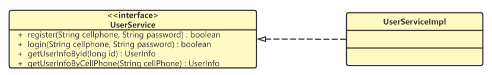

```Java
public interface UserService {
    boolean register(String cellphone, String password);
    boolean login(String cellphone, String password);
    UserInfo getUserInfoById(long id);
    UserInfo getUserInfoByCellphone(String cellphone);
}

public class UserServiceImpl implements UserService {
		//...
}
```

需求: 后台管理系统要实现删除用户的功能，希望用户系统提供一个删除用户的接口,应该如何设计这个接口(假设这里我们不去考虑使用鉴权框架).
#### 方式一 : 不考虑接口隔离直接修改接口

```Java
public interface UserService {
    boolean register(String cellphone, String password);
    boolean login(String cellphone, String password);
    UserInfo getUserInfoById(long id);
    UserInfo getUserInfoByCellphone(String cellphone);
    //新增删除方法
    boolean deleteUserByEmail(String email);
    boolean deleteUserById(Long userId);
}
```

这个方法可以解决问题，但是也隐藏了一些安全隐患。

删除用户是一个非常慎重的操作，我们只希望通过后台管理系统来执行，所以这个接口只限于给后台管理系统使用。

如果我们把它放到 UserService 中，那所有使用到 UserService 的系统，都可以调用这个接口。不加限制地被其他业务系统调用，就有可能导致误删用户。
#### 方式二 : 考虑接口隔离

遵照接口隔离原则,为依赖接口的类定制服务。只提供调用者需要的方法，屏蔽不需要的方法。

将删除接口单独放到另外 一个接口 RestrictedUserService 中, 然后将 RestrictedUserService 只打包提供给后台管理系统来使用 : 
 
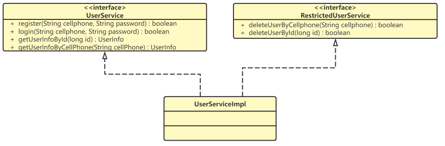

```java
public interface UserService {
    boolean register(String cellphone, String password);
    boolean login(String cellphone, String password);
    UserInfo getUserInfoById(long id);
    UserInfo getUserInfoByCellphone(String cellphone);
}
public interface RestrictedUserService {
 boolean deleteUserByCellphone(String cellphone);
 boolean deleteUserById(long id);
}
public class UserServiceImpl implements UserService, RestrictedUserService {
		//...
}
```
### 遵循接口隔离原则的优势

1. 将臃肿庞大的接口分解为多个粒度小的接口，可以预防外来变更的扩散，**提高系统的灵活性和可维护性。**
2. 使用多个专门的接口还能够**体现对象的层次**，因为可以通过接口的继承，实现对总接口的定义。
3. 能**减少项目工程中的代码冗余**。过大的大接口里面通常放置许多不用的方法，当实现这个接口的时候，被迫设计冗余的代码.
## 依赖倒置原则

### 官方定义

依赖倒置原则是Robert C.Martin于1996年在C++Report上发表的文章中提出的 :  High level modules should not depend upon low level modules. Both should depend upon abstractions.
Abstractions should not depend upon details. Details should depend upon abstractions

依赖倒置原则（Dependence Inversion Principle，DIP）是指在设计代码架构时，**高层模块不应该依赖于底层模块，二者都应该依赖于抽象**。抽象不应该依赖于细节，细节应该依赖于抽象。
### 通俗理解

依赖倒置原则是实现开闭原则的重要途径之一，它降低了客户与实现模块之间的耦合。

1. 高层级的模块应该依赖的是低层级的模块的行为的抽象，取决于具体编程语言，可以是抽象类或者接口等技术；
2. 只要依赖了实现，就是耦合了代码，所以我们需要始终依赖的是抽象，而不是实现。
#### 传统设计与依赖倒置设计

##### 传统设计

传统设计方式采用自顶向下的原则， 逐级依赖，中层模块和高层模块的耦合度很高，如果需要修改其中的一个模块，则可能会导致其它很多模块也需要修改，牵一发动全身，不易于维护。

不使用依赖反转的系统构架，控制流和依赖关系流的依赖箭头是一个方向的，由高层指向底层，也就是高层依赖底层

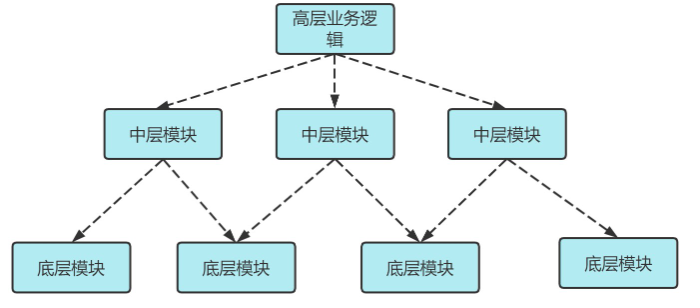

##### 依赖倒置设计

按照依赖倒置的设计 : 高层业务依赖于具体模块功能的抽象,底层业务去实现这些抽象功能

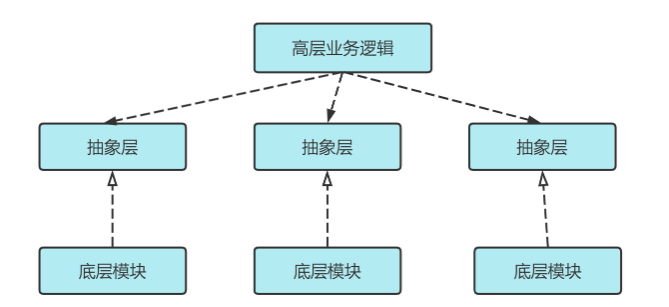
### 场景示例

假设我们现在要组装一台电脑,需要的配件有 cpu，硬盘，内存条。只有这些配置都有了，计算机才能正常的运行。选择cpu有很多选择，如Intel，AMD等，硬盘可以选择希捷，西数等，内存条可以选择金士顿，海盗船等。

#### 传统开发

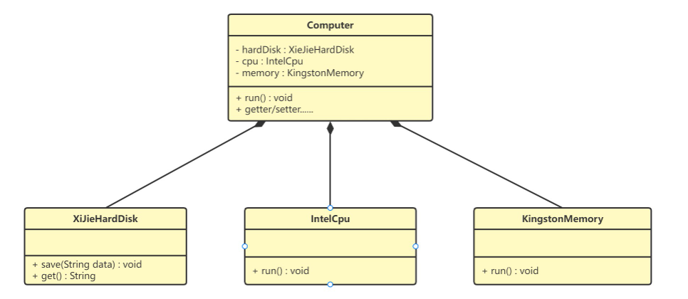

**希捷硬盘类（XiJieHardDisk）:**
```Java
public class XiJieHardDisk {  
    public void save(String data) {  
        System.out.println("使用希捷硬盘存储数据" + data);  
    }  
    public String get() {  
        System.out.println("使用希捷希捷硬盘取数据");  
        return "数据";  
    }  
}
```

**Intel处理器（IntelCpu）：**
```java
public class IntelCpu {  
    public void run() {  
        System.out.println("使用Intel处理器");  
    }  
}
```

**金士顿内存条（KingstonMemory）：**

```java
public class KingstonMemory {  
    public void save() {  
        System.out.println("使用金士顿作为内存条");  
    }  
}
```

**电脑（Computer）：**

```Java
public class Computer {  
​  
    private XiJieHardDisk hardDisk;  
    private IntelCpu cpu;  
    private KingstonMemory memory;  
​  
    public IntelCpu getCpu() {  return cpu; }  
    public void setCpu(IntelCpu cpu) {  this.cpu = cpu;  }  
    public KingstonMemory getMemory() {  return memory;  }  
    public void setMemory(KingstonMemory memory) {  this.memory = memory;  }  
    public XiJieHardDisk getHardDisk() {  return hardDisk;  }  
    public void setHardDisk(XiJieHardDisk hardDisk) {  this.hardDisk = hardDisk; }  
    public void run() {  
        System.out.println("计算机工作");  
        cpu.run();  
        memory.save();  
        String data = hardDisk.get();  
        System.out.println("从硬盘中获取的数据为：" + data);  
    }  
}
```

**测试类（TestComputer）：**
```Java
public class TestComputer {  
    public static void main(String[] args) {  
        Computer computer = new Computer();  
        computer.setHardDisk(new XiJieHardDisk());  
        computer.setCpu(new IntelCpu());  
        computer.setMemory(new KingstonMemory());  
        computer.run();  
    }  
}
```

上面代码可以看到已经组装了一台电脑，但是似乎组装的电脑的cpu只能是Intel的，内存条只能是金士顿的，硬盘只能是希捷的，这**对用户肯定是不友好**的，用户有了机箱肯定是想按照自己的喜好，选择自己喜欢的配件。
#### 使用依赖倒置

代码我们需要修改Computer类，让Computer类依赖抽象（各个配件的接口），而不是依赖于各个组件具体的实现类。

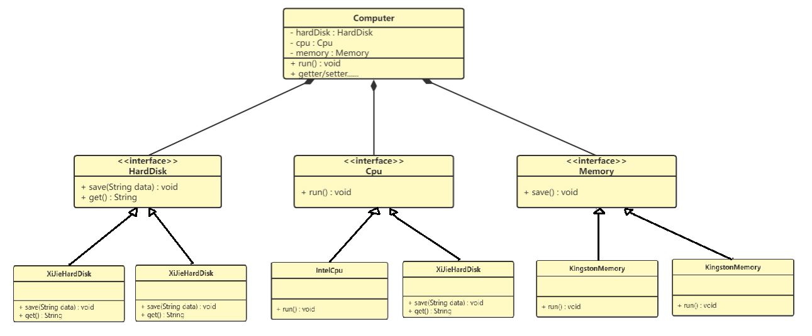

**修改Computer上层业务依赖于接口**
```Java
public class Computer {  
    private HardDiskInterface hardDiskIn;  
    private CpuInterface cpuIn;  
    private MemoryInterface memoryIn;  
    public CpuInterface getCpu() {  return cpuIn; }  
    public void setCpu(CpuInterface cpuIn) {  this.cpuIn = cpuIn;  }  
    public MemoryInterface getMemory() {  return memoryIn;  }  
    public void setMemory(MemoryInterface memoryIn) {  this.memoryIn = memoryIn;  }  
    public HardDiskInterface getHardDisk() {  return hardDiskIn;  }  
    public void setHardDisk(HardDiskInterface hardDiskIn) {  this.hardDiskIn = hardDiskIn; }  
    public void run() {  
        System.out.println("计算机工作");  
        cpuIn.run();  
        memoryIn.save();  
        String data = hardDiskIn.get();  
        System.out.println("从硬盘中获取的数据为：" + data);  
    }  
}
```

**硬盘：**
```Java
public class XiJieHardDisk implements HardDiskInterface {  
    public void save(String data) {  
        System.out.println("使用希捷硬盘存储数据" + data);  
    }  
    public String get() {  
        System.out.println("使用希捷硬盘取数据");  
        return "数据";  
    }  
}
public class ToshibaHardDisk implements HardDiskInterface {  
    public void save(String data) {  
        System.out.println("使用东芝硬盘存储数据" + data);  
    }  
    public String get() {  
        System.out.println("使用东芝硬盘取数据");  
        return "数据";  
    }  
}
```

**处理器：**
```java
public class IntelCpu implements CpuInterface {  
    public void run() {  
        System.out.println("使用Intel处理器");  
    }  
}
public class AMDCpu implements CpuInterface {  
    public void run() {  
        System.out.println("使用AMD处理器");  
    }  
}
```

**内存条：**

```java
public class KingstonMemory implements MemoryInterface {  
    public void save() {  
        System.out.println("使用金士顿作为内存条");  
    }  
}

public class SamSungMemory implements MemoryInterface {  
    public void save() {  
        System.out.println("使用三星作为内存条");  
    }  
}
```

**用户组装电脑:**
```Java
public class TestComputer {  
    public static void main(String[] args) {  
		//组装电脑一
		Computer computer1 = new Computer();  
		computer1.setHardDisk(new XiJieHardDisk());  
		computer1.setCpu(new IntelCpu());  
		computer1.setMemory(new KingstonMemory());  
		computer1.run();  
		//组装电脑二
		Computer computer2 = new Computer();  
		computer2.setHardDisk(new ToshibaHardDisk());  
		computer2.setCpu(new AMDCpu());  
		computer2.setMemory(new MemoryInterface());  
		computer2.run();  
    }  
}
```
### 依赖倒置的好处

- 减少**类间的耦合性，提高系统的稳定性** . (根据类与类之间的耦合度从弱到强排列：依赖关系、关联关系、聚合关系、组合关系、泛化关系和实现关系 )
- **降低并行开发引起的风险** (两个类之间有依赖关系，只要制定出两者之间的接口（或抽象类）就可以独立开发了)
- **提高代码的可读性和可维护性**

### 关于依赖倒置、依赖注入、控制反转这三者之间的区别与联系

1 ) 依赖倒置原则

依赖倒置是一种通用的软件设计原则, 主要用来指导框架层面的设计。
> 高层模块不依赖低层模块，它们共同依赖同一个抽象。抽象不要依赖具体实现细节，具体实现细节依赖抽象。

2 ) 控制反转

控制反转与依赖倒置有一些相似, 它也是一种框架设计常用的模式,但并不是具体的方法。
> “控制”指的是对程序执行流程的控制，而“反转”指的是在没有使用框架之前，程序员自己控制整个程序的执行。在使用框架之后，整个程序的执行流程通过框架来控制。流程的控制权从程序员“反转”给了框架。
> Spring框架，核心模块IoC容器,就是通过控制反转这一种思想进行设计的

3 ) 依赖注入

依赖注入是实现控制反转的一个手段，它是一种具体的编码技巧。
> 我们不通过 new 的方式在类内部创建依赖的对象，而是将依赖的对象在外部创建好之后，通过构造函数等 方式传递（或注入）进来, 给类来使用。
> 依赖注入真正实现了面向接口编程的愿景，可以很方便地替换同一接口的不同实现，而不会影响到依赖这个接口的客户端。
## 迪米特法则

### 官方定义

1987年秋天，迪米特法则由美国Northeastern University的Ian Holland(伊恩 霍兰德)提出，被UML的创始者之一Booch(布奇)等人普及。后来，因为经典著作The PragmaticProgrammer <<程序员修炼之道>>而广为人知。

迪米特法则（LoD：Law of Demeter）又叫最少知识原则（LKP：Least Knowledge Principle ），指的是一个类/模块对其他的类/模块有越少的了解越好。简言之：talk only to your immediate friends（只跟你最亲密的朋友交谈），不跟陌生人说话。
### 通俗理解

大部分设计原则和思想都非常抽象，有各种各样的解读，要想灵活地应用到 实际的开发中，需要有实战经验的积累。迪米特法则也不例外。

简单来说迪米特法则想要表达的思想就是: **不该有直接依赖关系的类之间，不要有依赖；有依赖关系的类之间，尽量只依赖必要的接口。**

> 如果两个软件实体无须直接通信，那么就不应当发生直接的相互调用，可以通过第三方转发该调用。其目的是降低类之间的耦合度，提高模块的相对独立性。
### 场景示例

明星由于全身心投入艺术，所以许多日常事务由经纪人负责处理，如和粉丝的见面会，和媒体公司的业务洽淡等。这里的经纪人是明星的朋友，而粉丝和媒体公司是陌生人，所以适合使用迪米特法则。

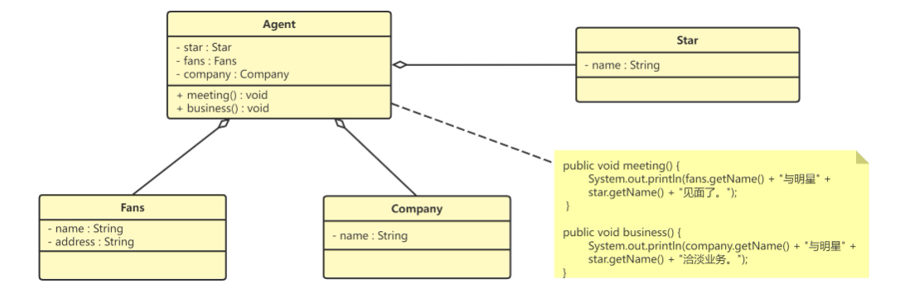

**明星类（Star）**
```Java
public class Star {  
    private String name;  
    public Star(String name) {   this.name=name;   }  
    public String getName() {   return name;   }  
}
```

**粉丝类（Fans）**
```java
public class Fans {  
    private String name;  
    public Fans(String name) {  this.name=name;  }  
    public String getName() {   return name;  }  
}
```

**媒体公司类（Company）**
```java
public class Company {  
    private String name;  
    public Company(String name) {  this.name=name;   }  
    public String getName() {  return name;   }  
}
```

**经纪人类（Agent）**
```java
public class Agent {  
    private Star star;  
    private Fans fans;  
    private Company company;  
    public void setStar(Star star) { this.star = star;  }  
    public void setFans(Fans fans) { this.fans = fans;  }  
    public void setCompany(Company company) { his.company = company; }  
    public void meeting() { System.out.println(fans.getName() + "与明星" + star.getName() + "见面了。");   }  
    public void business() { System.out.println(company.getName() + "与明星" + star.getName() + "洽淡业务。");   }  
}
```

**注意** : 迪米特法则的独特之处在于它简洁而准确的定义，它允许在编写代码时直接应用，几乎自动地应用了适当的封装、高内聚和低耦合。
但是，过度使用迪米特法则会使系统产生大量的中介类，从而增加系统的复杂性，使模块之间的通信效率降低。所以，**在釆用迪米特法则时需要反复权衡，确保高内聚和低耦合的同时，保证系统的结构清晰。**

