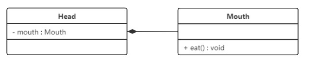

## UML概述

`统一建模语言（Unified Modeling Language，UML）`是用来设计软件的可视化建模语言。它的特点是简单、统一、图形化、能表达软件设计中的动态与静态信息。

UML 从目标系统的不同角度出发，定义了用例图、类图、对象图、状态图、活动图、时序图、协作图、构件图、部署图等 9 种图。

我们接下来简单学习一下类图相关的知识
## 类图概述

`类图(Class diagram)` 是显示了模型的静态结构，特别是模型中存在的类、类的内部结构以及它们与其他类的关系等。类图不显示暂时性的信息。类图是面向对象建模的主要组成部分。
## 类图的作用

- 在软件工程中，类图是一种静态的结构图，描述了系统的类的集合，类的属性和类之间的关系，可以简化了人们对系统的理解；
- 类图是系统分析和设计阶段的重要产物，是系统编码和测试的重要模型。
## 类图的表示法

UML类图中具体类、抽象类、接口和包有不同的表示方法。
### 表示具体的类

具体类在类图中用**矩形框表示**，矩形框分为三层：第一层是**类名字**。第二层是类的**成员变量**；第三层是类的**方法**。成员变量以及方法前的访问修饰符用符号来表示：
- “+” 表示 `public`；
- “-” 表示 `private`；
- “#” 表示 `protected`；
- 不带符号表示 `default`。


### 表示抽象类

抽象类在UML类图中同样用矩形框表示，但是抽象类的类名以及抽象方法的名字都用斜体字表示，如图所示。


### 表示接口

接口在类图中也是用矩形框表示，但是与类的表示法不同的是，接口在类图中的第一层顶端用构造型 `<<interface>>`表示，下面是接口的名字，第二层是方法。


> 此外，接口还有另一种表示法，俗称棒棒糖表示法，就是类上面的一根棒棒糖（圆圈+实线）。圆圈旁为接口名称，接口方法在实现类中出现。


## 在类图中表示关系

类和类、类和接口、接口和接口之间存在一定关系，UML类图中一般会有连线指明它们之间的关系。

关系共有六种类型 ,如下图:


为了节省学习成本, 方便记忆,我们可以将类和类之间的关系重新调整一下,使其更加贴近编程的角度:

- 实现关系
- 泛化关系
- 依赖关系
- 组合关系 (组合关系+关联关系+聚合关系)

> 我们也没有必要去区分组合与聚合这两个概念,只需要记住一点就是: **多用组合少用继承**
> 也就是说只要 B 类对象是 A 类对象的成员变量，那我们就称，A 类跟 B 类是组合关系.

### 实现关系

实现关系是接口与实现类之间的关系。在这种关系中，类实现了接口，类中的操作实现了接口中所声明的所有的抽象操作。

在 UML 类图中，**实现关系使用带空心三角箭头的虚线来表示，箭头从实现类指向接口。**

例如，汽车和船实现了交通工具，其类图:


### 继承关系(泛化)

泛化关系是对象之间耦合度最大的一种关系，表示一般与特殊的关系，是父类与子类之间的关系，是一种继承关系。

在 UML 类图中，**泛化关系用带空心三角箭头的实线来表示，箭头从子类指向父类。** 在代码实现时，使用面向对象的继承机制来实现泛化关系。

例如，Student 类和 Teacher 类都是 Person 类的子类，其类图如下图所示：

### 关联关系

关联关系是对象之间的一种引用关系，用于表示一类对象与另一类对象之间的联系，如老师和学生、师傅和徒弟、丈夫和妻子等。关联关系是类与类之间最常用的一种关系，分为一般关联关系、聚合关系和组合关系。简单来说: **A包含B,且A的B创建相互独立**
#### 一般关联关系

一般关联关系又可以分为单向关联，双向关联，自关联。
##### 单向关联

在UML类图中单向关联用一个带箭头的实线表示。上图表示每个顾客都有一个地址，这通过让Customer类持有一个类型为Address的成员变量类实现。


##### 双向关联

从上图中我们很容易看出，所谓的双向关联就是双方各自持有对方类型的成员变量。


在UML类图中，双向关联用一个不带箭头的直线表示。上图中在Customer类中维护一个`List<Product>`，表示一个顾客可以购买多个商品；在Product类中维护一个Customer类型的成员变量表示这个产品被哪个顾客所购买。
##### 自关联

自关联在UML类图中用一个带有箭头且指向自身的线表示。上图的意思就是Node类包含类型为Node的成员变量，也就是“自己包含自己”。


#### 聚合关系

聚合关系是关联关系的一种，表示一种弱的‘拥有’关系，体现的是A对象可以包含B对象，但是B对象不是A对象的一部分,简单来说: **A拥有B,创建A时初始化B,但不创建B**

```Java
public class University{
	private ArrayList<Teacher> teacherList;
	public University(ArrayList<Teacher> teacherList){
		this.teacherList = teacherList;
	}
}
```

> 在代码中: 比如 University 类对象包含 Teacher 类对象，Teacher 类对象的生命周期可以不依赖 University 类对象的生命周期，也就是说可以单独销毁 University 类对象而不影响 Teacher 对象

在 UML 类图中，聚合关系可以用带空心菱形的实线来表示，菱形指向整体。


#### 组合关系

组合关系是一种强‘拥有’关系，体现了严格的部分和整体的关系，部分和整体的声明周期一样.简单来说: **A创建B,且拥有B**

```java
public class Head{
    private Mouth mouth;
    public Head(){
        this.mouth = new Mouth();
    }
}
```

> 在代码中: 比如 Head 类对象包含 Mouth 类对象，Mouth 类对象的生命周期依赖 Head 类对象的生命周期，Mouth 类对象不可以单独存在

在 UML 类图中，组合关系用带实心菱形的实线来表示，菱形指向整体。


#### 依赖关系

依赖关系是一种使用关系，它是对象之间耦合度最弱的一种关联方式，是临时性的关联。简单来说: **A不拥有B,但是使用B**

```Java
public class Driver{
    pubilc void driver(Car car){
	    car.move();
    }
}

public class Car{
    pubilc void move(){
	    //汽车驾驶移动...
    }
}
```

>在代码中，某个类的方法通过局部变量、方法的参数或者对静态方法的调用来访问另一个类（被依赖类）中的某些方法来完成一些职责。


