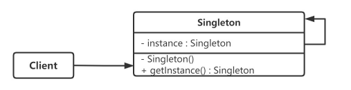
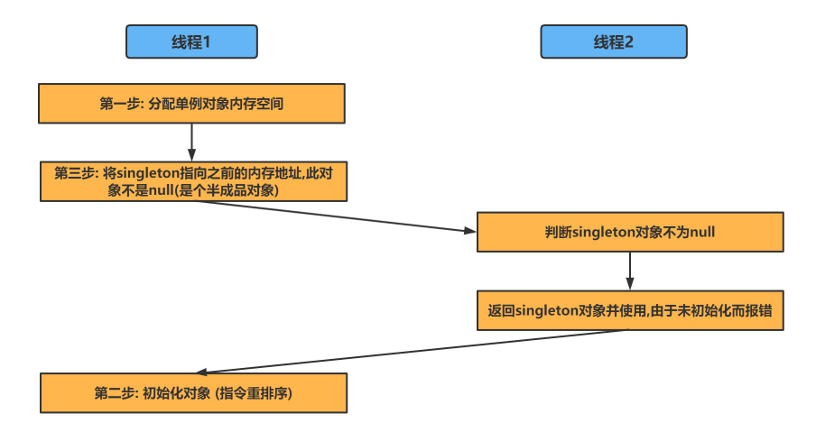
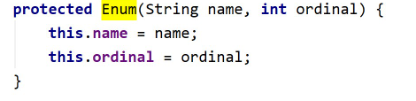
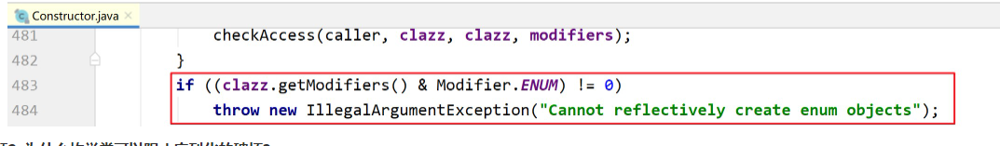
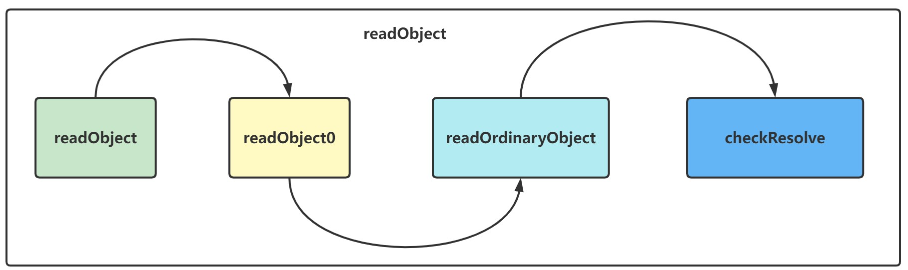

## 概述

**定义** : 单例模式（Singleton Pattern）是 Java 中最简单的设计模式之一，此模式保证某个类在运行期间，只有一个实例对外提供服务，而这个类被称为单例类。

**使用单例模式要做的两件事**:
1. 保证一个类只有一个实例
2. 为该实例提供一个全局访问节点

**单例模式的结构**:


## 实现单例模型的方式

### 饿汉式

**在类加载期间初始化静态实例** ,保证 instance 实例的创建是线程安全的 ( 实例在类加载时实例化，有JVM保证线程安全).

特点: 不支持延迟加载实例(懒加载) , 此中方式类加载比较慢，但是获取实例对象比较快
问题: 该对象足够大的话，而一直没有使用就会造成内存的浪费。

```Java
public class Singleton_01 {
    //1. 私有构造方法
    private Singleton_01(){}
    //2. 在本类中创建私有静态的全局对象
    private static Singleton_01 instance = new Singleton_01();
    //3. 提供一个全局访问点,供外部获取单例对象
    public static  Singleton_01 getInstance(){
        return instance;
    }
}
```
### 懒汉式
#### 方式一: 线程不安全

**在使用时初始化实列** , 最大程度不去浪费内存空间.

特点: 时间换空间,启动快,按需使用节省空间
缺点: 但是如果是多线程情况,会出现线程安全问题.

```java
public class Singleton_02 {
    //1. 私有构造方法
    private Singleton_02(){}
    //2. 在本类中创建私有静态的全局对象
    private static Singleton_02 instance;
    //3. 通过判断对象是否被初始化,来选择是否创建对象
    public static  Singleton_02 getInstance(){
        if(instance == null){
            instance = new Singleton_02();
        }
        return instance;
    }
}
```

假设在单例类被实例化之前，有两个线程同时在获取单例对象:

- 线程A在执行完if (instance == null) 后，线程调度机制将 CPU 资源分配给线程B
- 此时线程B在执行 if (instance == null)时也发现单例类还没有被实例化

这样就会导致单例类被实例化两次。为了防止这种情况发生，需要对 getInstance() 方法同步处理
#### 方式二: 线程安全

原理: 在 方式一 的基础上使用同步锁 `synchronized`锁住 创建单例的方法 ，防止多个线程同时调用，从而避免造成单例被多次创建

1. 即，`getInstance（）`方法块只能运行在1个线程中
2. 若该段代码已在1个线程中运行，另外1个线程试图运行该块代码，则 **会被阻塞而一直等待**
3. 而在这个线程安全的方法里我们实现了单例的创建，保证了多线程模式下 单例对象的唯一性

```java
public class Singleton_03 {
    //1. 私有构造方法
    private Singleton_03(){}
    //2. 在本类中创建私有静态的全局对象
    private static Singleton_03 instance;
    //3. 通过判断对象是否被初始化,来选择是否创建对象
    public static synchronized Singleton_03 getInstance(){
        if(instance == null){
            instance = new Singleton_03();
        }
        return instance;
    }
}
```

我们使用了方法锁,让该方法只能在一个线程中进行执行,所以并发度是1。如果这个单例类偶尔会被用到，那这种实现方式还可以接受。但是，如果频繁地用到，那频繁加锁、释放锁及并发度低等问题，**会导致性能瓶颈**，这种实现方式就不可取了。
#### 方式三: 双重校验

在方式二的基础上,我们继续优化锁的粒度.使用**代码块锁**只针对对象的创建进行限制

```Java
public class Singleton_04 {
    //使用 volatile保证变量的可见性
    private volatile static Singleton_04 instance = null;
    private Singleton_04(){}
    //对外提供静态方法获取对象
    public static Singleton_04 getInstance(){
        //第一次判断,如果instance不为null,不进入抢锁阶段,直接返回实例
        if(instance == null){
            synchronized (Singleton_04.class){
                //抢到锁之后再次进行判断是否为null
                if(instance == null){
                    instance = new Singleton_04();
                }
            }
        }
        return instance;
    }
}
```
##### 为什么要使用volatile关键字和双重校验

在java内存模型中，volatile 关键字作用可以是保证可见性或者禁止指令重排。这里是因为 singleton = new Singleton() ，它并非是一个原子操作. 详见: [初始化对象的步骤](01_单例模式.md#初始化对象的步骤)

如果发生了指令重排 : 例如 1-3-2，那么在第 3 步执行完以后，singleton 就不是 null 了，可是这时第 2 步并没有执行，singleton 对象未完成初始化，它的属性的值可能不是我们所预期的值。假设此时线程 2 进入 getInstance 方法，由于 singleton 已经不是 null 了，所以会通过第一重检查并直接返回，但其实这时的 singleton 并没有完成初始化，所以使用这个实例的时候会报错.

详细流程如下图所示：


线程 1 首先执行新建实例的第一步，也就是分配单例对象的内存空间，由于线程 1 被重排序，所以执行了新建实例的第三步，也就是把 singleton 指向之前分配出来的内存地址，在这第三步执行之后，singleton 对象便不再是 null。

这时线程 2 进入 getInstance 方法，判断 singleton 对象不是 null，紧接着线程 2 就返回 singleton 对象并使用，由于没有初始化，所以报错了。最后，线程 1 “姗姗来迟”，才开始执行新建实例的第二步——初始化对象，可是这时的初始化已经晚了，因为前面已经报错了。

使用了 volatile 之后，相当于是表明了该字段的更新可能是在其他线程中发生的，因此应确保在读取另一个线程写入的值时，可以顺利执行接下来所需的操作。在 JDK 5 以及后续版本所使用的 JMM 中，在使用了 volatile 后，会一定程度禁止相关语句的重排序，从而避免了上述由于重排序所导致的读取到不完整对象的问题的发生。
### 静态内部类

原理 : 根据 **静态内部类** 的特性(外部类的加载不影响内部类)，同时解决了按需加载、线程安全的问题，同时实现简洁

1. 在静态内部类里创建单例，在装载该内部类时才会去创建单例
2. 线程安全：类是由 `JVM`加载，而`JVM`只会加载1遍，保证只有1个单例

```Java
public class Singleton_05 {
    private static class SingletonHandler{
        private static Singleton_05 instance = new Singleton_05();
    }
    private Singleton_05(){}
    public static Singleton_05 getInstance(){
        return SingletonHandler.instance;
    }
}
```

### 枚举

枚举单例方式是`<<Effective Java>>`作者推荐的使用方式,这种方式

在使用枚举时，构造方法会被自动调用，利用这一特性也可以实现单例；**默认枚举实例的创建是线程安全的，即使反序列化也不会生成新的实例，任何情况下都是一个单例(暴力反射对枚举方式无效)。**

特点: 满足单例模式所需的 **创建单例、线程安全、实现简洁的需求**

```Java
public enum Singleton_06{
    INSTANCE;
    public static Singleton_06 getInstance(){
        return INSTANCE;
    }
}
```

#### 为什么枚举可以阻止反射的破坏?

- 首先枚举类中是没有空参构造方法的,只有一个带两个参数的构造方法.


- 真正原因是: 反射方法中不予许使用反射创建枚举对象

#### 为什么枚举类可以阻止序列化的破坏

Java规范字规定，**每个枚举类型及其定义的枚举变量在JVM中都是唯一的**，因此在枚举类型的序列化和反序列化上，Java做了特殊的规定。

在序列化的时候Java仅仅是将枚举对象的name属性输到结果中，反序列化的时候则是通过java.lang.Enum的valueOf()方法来根据名字查找枚举对象。

比如说，序列化的时候只将`INSTANCE`这个名称输出，反序列化的时候再通过这个名称，查找对应的枚举类型，因此反序列化后的实例也会和之前被序列化的对象实例相同。

```Java
public enum Singleton_06{
    INSTANCE;
}
```
## 反射和序列化的影响

#### 反射对单例的影响

反射的概念:  JAVA反射机制是在运行状态中，对于任意一个类，都能够知道这个类的所有属性和方法；对于任意一个对象，都能够调用它的任意方法和属性；这种动态获取信息以及动态调用对象方法的功能称为java语言的反射机制。

反射技术过于强大，它可以通过`setAccessible()`来修改构造器，字段，方法的可见性。单例模式的构造方法是私有的，如果将其可见性设为`public`，那么将无法控制对象的创建。

```Java
public class Test_Reflect {
    public static void main(String[] args) {
        try {
            //反射中，欲获取一个类或者调用某个类的方法，首先要获取到该类的Class 对象。
            Class<Singleton_05> clazz = Singleton_05.class;
            //getDeclaredXxx: 不受权限控制的获取类的成员.
            Constructor c = clazz.getDeclaredConstructor(null);
            //设置为true,就可以对类中的私有成员进行操作了
            c.setAccessible(true);
            Object instance1 = c.newInstance();
            Object instance2 = c.newInstance();
            System.out.println(instance1 == instance2);
        } catch (Exception e) {
            e.printStackTrace();
        }
    }
}
```

如图所示,反射仍然可以对于非枚举实现单例的方式进行干扰,所以我们可以在**私有构造器中添加检查异常**:

```Java
public class Singleton_05 {
    private static class SingletonHandler{
        private static Singleton_05 instance = new Singleton_05();
    }
    private Singleton_05(){
        if(SingletonHandler.instance != null){
            throw new RuntimeException("不允许非法访问!");
        }
    }
    public static Singleton_05 getInstance(){
        return SingletonHandler.instance;
    }
}
```

如果通过反射调用当前类的私有构造器,则会抛出异常阻止操作.但是着这种方式使代码简洁性遭到破坏,设计不够优雅.
#### 序列化对单例的影响

在下列的代码中中,我们尝试对单例对象进行序列化和反序列化的操作:

```Java
class Singleton implements Serializable {
    private volatile static Singleton singleton;
    private Singleton() {  }
    public static Singleton getInstance() {
        if (singleton == null) {
            synchronized (Singleton.class) {
                if (singleton == null) {
                    singleton = new Singleton();
                }
            }
        }
        return singleton;
    }
}
```

```Java
public class Test_Serializable {
    @Test
    public void test() throws Exception{
        //序列化对象输出流
        ObjectOutputStream oos = new ObjectOutputStream(new FileOutputStream("tempFile.obj"));
        oos.writeObject(Singleton.getInstance());
        //序列化对象输入流
        File file = new File("tempFile.obj");
        ObjectInputStream ois = new ObjectInputStream(new FileInputStream(file));
        Singleton Singleton = (Singleton) ois.readObject();
        System.out.println(Singleton);
        System.out.println(Singleton.getInstance());
        //判断是否是同一个对象
        System.out.println(Singleton.getInstance() == Singleton);//false
    }
}
```

输出结构为false, 说明：通过对Singleton的序列化与反序列化得到的对象是一个新的对象，这就`破坏了Singleton的单例性`。

> 解决方案: **Singleton中定义readResolve方法，并在该方法中指定要返回的对象的生成策略，就可以防止单例被破坏。**

```Java
class Singleton implements Serializable {
    private volatile static Singleton singleton;
    private Singleton() {  }
    public static Singleton getInstance() {
        if (singleton == null) {
            synchronized (Singleton.class) {
                if (singleton == null) {
                    singleton = new Singleton();
                }
            }
        }
        return singleton;
    }
    /**
	* 解决方案:只要在Singleton类中定义readResolve就可以解决该问题
	* 程序会判断是否有readResolve方法,如果存在就在执行该方法,如果不存在--就创建一个对象
	*/
    private Object readResolve() {
		return singleton;
	}
}
```

**为什么要使用readResolve返回当前对象?**

问题是出在ObjectInputputStream 的readObject 方法上, 我们来看一下ObjectInputStream的readObject的调用栈:



ObjectInputStream中readObject方法的代码片段:
```Java
try {
    Object obj = readObject0(false); //最终会返回一个object对象,其实就是序列化对象
    return obj;
} finally {
    passHandle = outerHandle;
    if (closed && depth == 0) {
        clear();
    }
}
```

ObjectInputStream中readObject0方法的代码片段:
```java
private Object readObject0(boolean unshared) throws IOException {
 case TC_OBJECT: //匹配如果是对象
        return checkResolve(readOrdinaryObject(unshared));
}
```

readOrdinaryObject方法的代码片段:
```java
private Object readOrdinaryObject(boolean unshared)
        throws IOException
    {
        //此处省略部分代码
        Object obj;
        try {
            //通过反射创建的这个obj对象，就是本方法要返回的对象，也可以暂时理解为是ObjectInputStream的readObject返回的对象。
            //isInstantiable：如果一个serializable的类可以在运行时被实例化，那么该方法就返回true
            //desc.newInstance：该方法通过反射的方式调用无参构造方法新建一个对象。
            obj = desc.isInstantiable() ? desc.newInstance() : null;
        } catch (Exception ex) {
            throw (IOException) new InvalidClassException(
                desc.forClass().getName(),
                "unable to create instance").initCause(ex);
        }
        return obj;
    }
```

我们发现 : 序列化会通过反射调用无参数的构造方法创建一个新的对象,所以会对当前的单例模式进行破坏

但是在: java.io.ObjectStreamClass#invokeReadResolve 中我们看到:

```Java
if (obj != null &&
            handles.lookupException(passHandle) == null &&
            desc.hasReadResolveMethod())
        {
            Object rep = desc.invokeReadResolve(obj);
            if (unshared && rep.getClass().isArray()) {
                rep = cloneArray(rep);
            }
            if (rep != obj) {
                handles.setObject(passHandle, obj = rep);
            }
        }
```

`hasReadResolveMethod`:如果实现了serializable 接口的类中包含readResolve则返回true
`invokeReadResolve`:通过反射的方式调用要被反序列化的类的readResolve方法。

所以我们只需要在**Singleton中定义readResolve方法，并在该方法中指定要返回的对象的生成策略，就可以防止单例被破坏。**

## 单例模式总结

**1 ) 单例的定义**
单例设计模式保证某个类在运行期间，只有一个实例对外提供服务，而这个类被称为单例类。

**2 ) 单例的实现**

**饿汉式**
- 饿汉式的实现方式，在类加载的期间，就已经将 instance 静态实例初始化好了，所以，instance 实例的创建是线程安全的。不过，这样的实现方式不支持延迟加载实例。

**懒汉式**
- 相对于饿汉式的优势是支持延迟加载。这种实现方式会导致频繁加锁、释放锁，以及并发度低等问题，频繁的调用会产生性能瓶颈。

**双重检测**
- 双重检测实现方式既支持延迟加载、又支持高并发的单例实现方式。只要 instance 被创建之后，再调用 getInstance() 函数都不会进入到加锁逻辑中。所以，这种实现方式解决了懒汉式并发度低的问题。

**静态内部类**
- 利用 Java 的静态内部类来实现单例。这种实现方式，既支持延迟加载，也支持高并发，实现起来也比双重检测简单。

**枚举方式**
- 最简单的实现方式，基于枚举类型的单例实现。这种实现方式通过 Java 枚举类型本身的特性，保证了实例创建的线程安全性和实例的唯一性(同时阻止了反射和序列化对单例的破坏)。
## 小知识

### 初始化对象的步骤

 1.  第一步是给对象分配内存空间；
 2. 第二步开始调用构造函数等，来初始化对象；
 3. 第三步，将对象指向分配的内存空间（执行完这步声明的对象就不是null 了）

这里需要留意一下 1-2-3 的顺序，因为存在指令重排序的优化，也就是说第 2 步和第 3 步的顺序是不能保证的，最终的执行顺序，可能是 1-2-3，也有可能是 1-3-2。