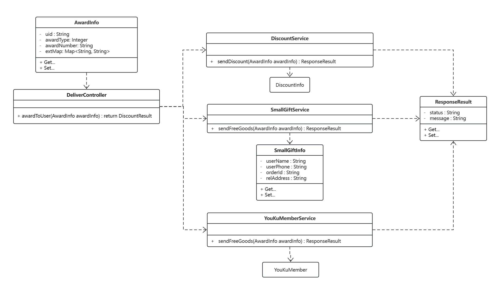
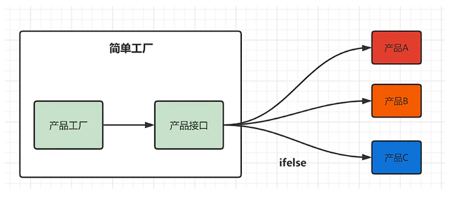
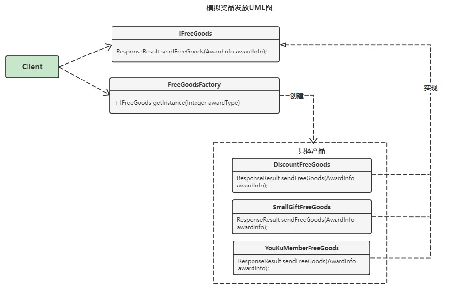
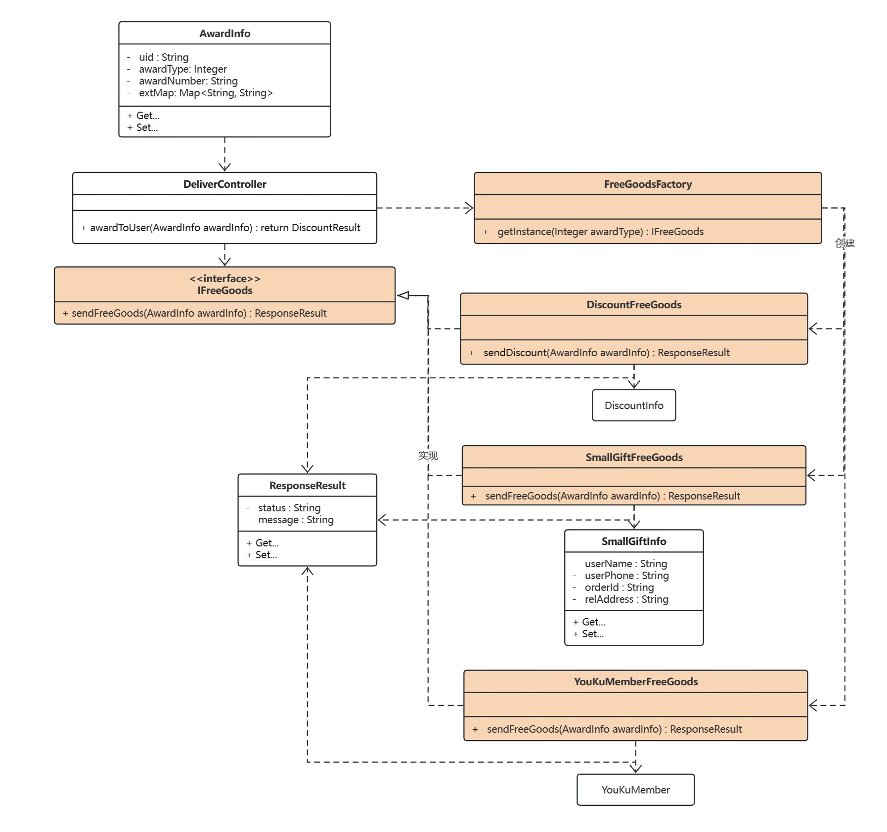
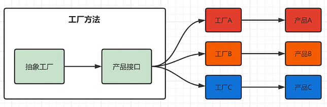
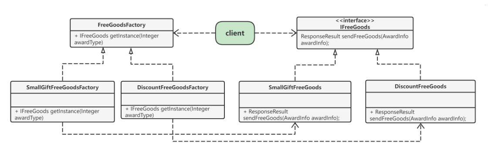
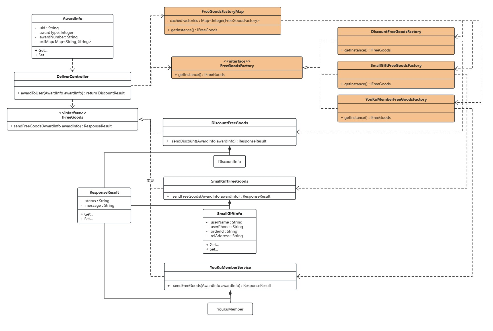
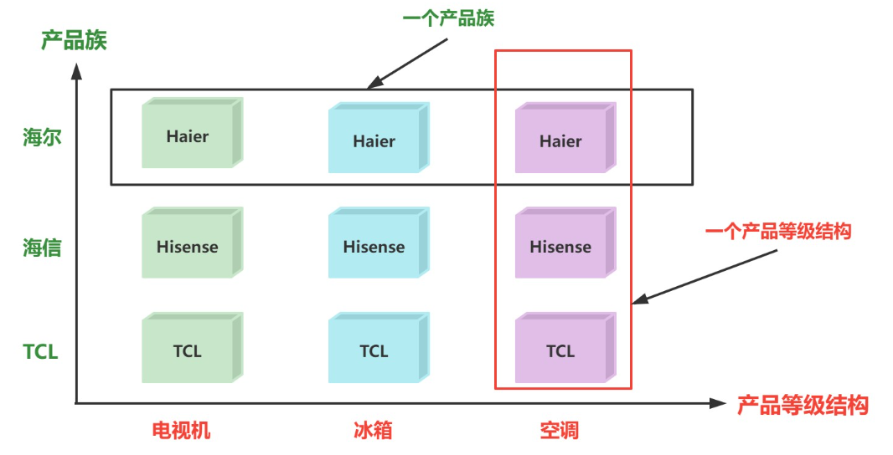
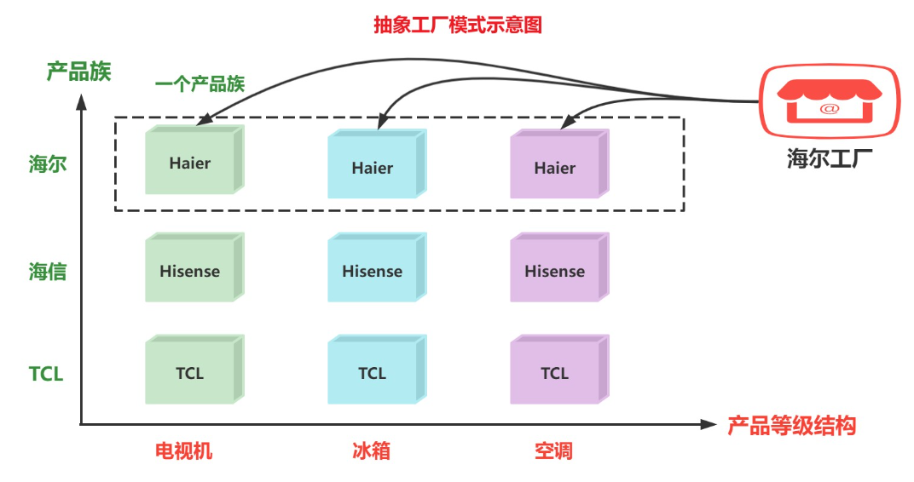
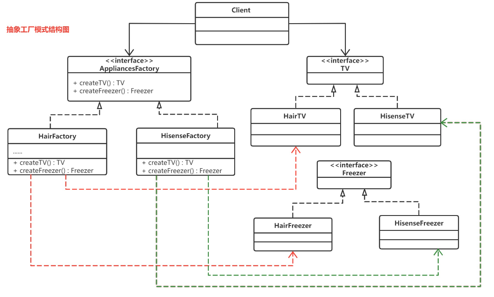

## 概述

工厂模式（Factory Pattern）是 Java 中最常用的设计模式之一。这种类型的设计模式属于创建型模式，它提供了一种创建对象的最佳方式。

> **在工厂模式中，我们在创建对象时不会对客户端暴露创建逻辑，并且是通过使用一个共同的接口来指向新创建的对象。**

《设计模式》一书中，工厂模式被分为了三种：简单工厂、工厂方法和抽象工厂。（不过，在书中作者将简单工厂模式看作是工厂方法模式的一种特例。）
- 简单工厂模式（不属于GOF的23种经典设计模式）
- 工厂方法模式
- 抽象工厂模式

## 模拟的业务需求

我们来模拟一下互联网电商中促销拉新下的业务场景, **新用户注册立即参与抽奖活动** ,奖品的种类有: 打折券, 免费优酷会员,小礼品.
### 使用原始开发模式

我们使用原始的开发形式: 控制层根据前端不同的业务直接请求处理不同的服务层业务代码



#### 实体类

| 名称           | 描述                     |
| -------------- | ------------------------ |
| AwardInfo      | 获奖信息对应实体类       |
| DiscountInfo   | 打折券信息对应实体类     |
| YouKuMember    | 优酷会员对应实体类       |
| SmallGiftInfo  | 小礼品信息对应实体类     |
| DiscountResult | 打折券操作响应结果封装类 |

```Java
public class AwardInfo {
    private String uid; //用户唯一ID
    private Integer awardType; //奖品类型: 1 打折券 ,2 优酷会员,3 小礼品
    private String awardNumber; //奖品编号
    Map<String, String> extMap; //额外信息
    
}

public class DiscountInfo {
    //属性信息省略......
}

public class YouKuMember {
    //属性信息省略......
}

public class SmallGiftInfo {
    private String userName;              // 用户姓名
    private String userPhone;             // 用户手机
    private String orderId;               // 订单ID
    private String relAddress;            // 收货地址
    
}

public class DiscountResult {
    private String status; // 状态码
    private String message; // 信息
}
```
#### 服务层

|名称|功能|描述|
|---|---|---|
|DiscountService|DiscountResult sendDiscount(String uid,String number)|模拟打折券服务|
|YouKuMemberService|void openMember(String bindMobile , String number)|模拟赠送优酷会员服务|
|SmallGiftService|Boolean giveSmallGift(SmallGiftInfo smallGiftInfo)|模拟礼品服务|

```Java
public class DiscountService {
    public DiscountResult sendDiscount(String uid, String number){
        System.out.println("向用户发放打折券一张: " + uid + " , " + number);
        return new DiscountResult("200","发放打折券成功");
    }
}

public class YouKuMemberService {
    public void openMember(String bindMobile , String number){
        System.out.println("发放优酷会员: " + bindMobile + " , " + number);
    }
}

public class SmallGiftService {
    public Boolean giveSmallGift(SmallGiftInfo smallGiftInfo){
        System.out.println("小礼品已发货,获奖用户注意查收! " + JSON.toJSON(smallGiftInfo));
        return true;
    }
}
```
#### 控制层

|名称|功能|描述|
|---|---|---|
|DeliverController|ResponseResult awardToUser(AwardInfo awardInfo)|按照类型的不同发放商品 奖品类型: 1 打折券 ,2 优酷会员,3 小礼品|

```Java
public class DeliverController {

    /**
     * 按照类型的不同发放商品
     *     奖品类型: 1 打折券 ,2 优酷会员,3 小礼品
     */
    public void awardToUser(AwardInfo awardInfo){
        if(awardInfo.getAwardType() == 1){ //打折券
            DiscountService discountService = new DiscountService();
            DiscountResult result = discountService.sendDiscount(awardInfo.getUid(), awardInfo.getAwardNumber());
            System.out.println("打折券发放成功!"+ JSON.toJSON(result));
        }else if(awardInfo.getAwardType() == 2){ //优酷会员
            //获取用户手机号
            String bindMobile = awardInfo.getExtMap().get("phone");
            //调用service
            YouKuMemberService youKuMemberService = new YouKuMemberService();
            youKuMemberService.openMember(bindMobile,awardInfo.getAwardNumber());
            System.out.println("优酷会员发放成功!");
        }else if(awardInfo.getAwardType() == 3){ /*
            小礼品
            封装收货用户信息
            */
            SmallGiftInfo smallGiftInfo = new SmallGiftInfo();
            smallGiftInfo.setUserName(awardInfo.getExtMap().get("username"));
            smallGiftInfo.setOrderId(UUID.randomUUID().toString());
            smallGiftInfo.setRelAddress(awardInfo.getExtMap().get("adderss"));
            SmallGiftService smallGiftService = new SmallGiftService();
            Boolean isSuccess = smallGiftService.giveSmallGift(smallGiftInfo);
            System.out.println("小礼品发放成功!" + isSuccess);
        }
    }
}
```
#### 测试代码

```Java
public class TestDemo01 {
    DeliverController deliverController = new DeliverController();
    /**
     * 发放打折券优惠
     *
     * @author sqTan
     * @date 2023/08/13
     *///测试发放奖品接口
    @Test
    public void test01(){
        AwardInfo info1 = new AwardInfo();
        info1.setUid("1001");
        info1.setAwardType(1);
        info1.setAwardNumber("DEL12345");
        DiscountResult discountResult = deliverController.awardToUser(info1);
        System.out.println(discountResult);
    }
    /**
     * 发放优酷会员
     *
     * @author sqTan
     * @date 2023/08/13
     */
    @Test
    public void test02(){
        AwardInfo info2 = new AwardInfo();
        info2.setUid("1002");
        info2.setAwardType(2);
        info2.setAwardNumber("DW12345");
        Map<String,String> map = new HashMap<>();
        map.put("phone","13512341234");
        info2.setExtMap(map);
        DiscountResult discountResult = deliverController.awardToUser(info2);
        System.out.println(discountResult);
    }
    /**
     * 发放小礼品
     *
     * @author sqTan
     * @date 2023/08/13
     */
    @Test
    public void test03(){
        AwardInfo info3 = new AwardInfo();
        info3.setUid("1003");
        info3.setAwardType(3);
        info3.setAwardNumber("SM12345");
        Map<String,String> map2 = new HashMap<>();
        map2.put("username","大远");
        map2.put("phone","13512341234");
        map2.put("address","北京天安门");
        info3.setExtMap(map2);
        DiscountResult discountResult = deliverController.awardToUser(info3);
        System.out.println(discountResult);
    }
}
```
### 使用原始开发的劣势

对于上面的实现方式 : 如果我们有想要添加的新的奖品时,势必要改动DeliverController的代码,**违反开闭原则**.而且如果有的抽奖接口出现问题,那么对其进行**重构的成本会非常高**.

除此之外代码中有一组if分支判断逻辑,现在看起来还可以,但是如果经历几次迭代和拓展,后续ifelse肯定还会增加.到时候接手这段代码的研发将会十分痛苦.
## 简单工厂模式

### 概述

简单工厂不是一种设计模式，反而比较像是一种编程习惯。简单工厂模式又叫做**静态工厂方法模式（static Factory Method pattern）**,它是通过使用静态方法接收不同的参数来返回不同的实例对象.
#### 实现方式

**定义一个工厂类，根据传入的参数不同返回不同的实例，被创建的实例具有共同的父类或接口**。



例如上述奖品发放的大致思路:


#### 适用场景

- 需要创建的对象较少。
- 客户端不关心对象的创建过程。

#### 优缺点

**优点：**
封装了创建对象的过程，可以通过参数直接获取对象。把对象的创建和业务逻辑层分开，这样以后就避免了修改客户代码，如果要实现新产品直接修改工厂类，而不需要在原代码中修改，这样就降低了客户代码修改的可能性，更加容易扩展。

**缺点：**
增加新产品时还是需要修改工厂类的代码，违背了“开闭原则”。
### 设计原理

简单工厂包含如下角色：
- 抽象产品 ：定义了产品的规范，描述了产品的主要特性和功能。
- 具体产品 ：实现或者继承抽象产品的子类
- 具体工厂 ：提供了创建产品的方法，调用者通过该方法来获取产品。



1. DeliverController控制层调用FreeGoodsFactory工厂类,传入AwardInfo信息
2. 在FreeGoodsFactory工厂类中根据AwardInfo信息,创建不同的具体实现,并返回IFreeGoods接口对象
3. 调用IFreeGoods对象,通过多态的特性直接调用具体的实现

按照上面的思路,我们控制层将无需再关注具体的业务实现,将业务逻辑全部交给工厂类进行区分和创建

#### 实体类

```Java
@Data
@AllArgsConstructor
@NoArgsConstructor
@ToString
public class AwardInfo {
    private String uid; //用户唯一ID
    private Integer awardType; //奖品类型: 1 打折券 ,2 优酷会员,3 小礼品
    private String awardNumber; //奖品编号
    Map<String, String> extMap; //额外信息
}

@Data
@AllArgsConstructor
@NoArgsConstructor
@ToString
public class ResponseResult {
    private String status; // 状态码
    private String message; // 信息
    private Object object;
}

@Data  
@AllArgsConstructor  
@NoArgsConstructor  
@ToString  
public class SmallGiftInfo {  
    private String userName;              // 用户姓名  
    private String userPhone;             // 用户手机  
    private String orderId;               // 订单ID  
    private String relAddress;            // 收货地址  
}
```

#### 抽象接口

```Java
public interface IFreeGoods {  
    ResponseResult sendFreeGoods(AwardInfo awardInfo);  
}
```

#### 具体实现类

```Java
public class DiscountFreeGoods implements IFreeGoods {  
    @Override  
    public ResponseResult sendFreeGoods(AwardInfo awardInfo) {  
        System.out.println("向用户发放一张打折券: " + awardInfo.getUid() + " , " + awardInfo.getAwardNumber());  
        return new ResponseResult("200","打折券发放成功!",null);  
    }  
}

public class SmallGiftFreeGoods implements IFreeGoods {  
    @Override  
    public ResponseResult sendFreeGoods(AwardInfo awardInfo) {  
        SmallGiftInfo smallGiftInfo = new SmallGiftInfo();  
        smallGiftInfo.setUserPhone(awardInfo.getExtMap().get("phone"));  
        smallGiftInfo.setUserName(awardInfo.getExtMap().get("username"));  
        smallGiftInfo.setRelAddress(awardInfo.getExtMap().get("address"));  
        smallGiftInfo.setOrderId(UUID.randomUUID().toString());  
        System.out.println("小礼品发放成,请注意查收: " + JSON.toJSON(smallGiftInfo));  
        return new ResponseResult("200","小礼品发送成功",smallGiftInfo);  
    }  
}

public class YouKuMemberFreeGoods implements IFreeGoods {  
    @Override  
    public ResponseResult sendFreeGoods(AwardInfo awardInfo) {  
        String phone = awardInfo.getExtMap().get("phone");  
        System.out.println("发放优酷会员成功,绑定手机号: " + phone);  
        return new ResponseResult("200","优酷会员发放成功!",null);  
    }  
}
```

#### 具体工厂类

```Java
public class FreeGoodsFactory {  
    public static IFreeGoods getInstance(Integer awardType){  
        IFreeGoods iFreeGoods = null;  
        if(awardType == 1){  //打折券  
            iFreeGoods = new DiscountFreeGoods();  
        }else if(awardType == 2){ //优酷会员  
            iFreeGoods = new YouKuMemberFreeGoods();  
        }else if(awardType == 3){ //小礼品  
            iFreeGoods = new SmallGiftFreeGoods();  
        }  
        return iFreeGoods;  
    }  
}
```

#### 控制层

```Java
public class DeliverController {  
    //发放奖品  
    public ResponseResult awardToUser(AwardInfo awardInfo){  
        ResponseResult responseResult = null;  
        try {  
            IFreeGoods instance = FreeGoodsFactory.getInstance(awardInfo.getAwardType());  
            responseResult = instance.sendFreeGoods(awardInfo);  
        } catch (Exception e) {  
            responseResult = new ResponseResult("201","请求错误",null);  
        }  
        return responseResult;  
    }  
}
```

#### 测试代码

```java
public class TestDemo01 {
    DeliverController deliverController = new DeliverController();
    /**
     * 发放打折券优惠
     *
     * @author sqTan
     * @date 2023/08/13
     *///测试发放奖品接口
    @Test
    public void test01(){
        //1. 发放打折券优惠
        AwardInfo info1 = new AwardInfo();
        info1.setUid("1001");
        info1.setAwardType(1);
        info1.setAwardNumber("DEL12345");
        ResponseResult result = deliverController.awardToUser(info1);
        System.out.println(result);
    }
    /**
     * 发放优酷会员
     *
     * @author sqTan
     * @date 2023/08/13
     */
    @Test
    public void test02(){
        AwardInfo info2 = new AwardInfo();
        info2.setUid("1002");
        info2.setAwardType(2);
        info2.setAwardNumber("DW12345");
        Map<String,String> map = new HashMap<>();
        map.put("phone","13512341234");
        info2.setExtMap(map);
        ResponseResult responseResult = deliverController.awardToUser(info2);
        System.out.println(responseResult);
    }
    /**
     * 发放小礼品
     *
     * @author sqTan
     * @date 2023/08/13
     */
    @Test
    public void test03(){
        AwardInfo info3 = new AwardInfo();
        info3.setUid("1003");
        info3.setAwardType(3);
        info3.setAwardNumber("SM12345");
        Map<String,String> map2 = new HashMap<>();
        map2.put("username","大远");
        map2.put("phone","13512341234");
        map2.put("address","北京天安门");
        info3.setExtMap(map2);
        ResponseResult responseResult = deliverController.awardToUser(info3);
        System.out.println(responseResult);
    }
}
```
## 工厂方法模式

### 概述

工厂方法模式 `Factory Method pattern`,属于创建型模式.
**概念** :  定义一个用于创建对象的接口，让子类决定实例化哪个产品类对象。工厂方法使一个产品类的实例化延迟到其工厂的子类。

#### 实现方式

在简单工厂的基础上,**对于工厂的创建继续封装**,提升代码创建对象的可复用性

工厂方法模式的主要角色：
- 抽象工厂：提供了创建产品的接口，调用者通过它访问具体工厂的工厂方法来创建产品。
- 具体工厂：主要是实现抽象工厂中的抽象方法，完成具体产品的创建。
- 抽象产品：定义了产品的规范，描述了产品的主要特性和功能。
- 具体产品：实现了抽象产品角色所定义的接口，由具体工厂来创建，它同具体工厂之间一一对应。



设计大致思路:


#### 适用场景

- 需要使用很多重复代码创建对象时，比如，DAO 层的数据对象、API 层的 VO 对象等。
- 创建对象要访问外部信息或资源时，比如，读取数据库字段，获取访问授权 token 信息，配置文件等。
- 创建需要统一管理生命周期的对象时，比如，会话信息、用户网页浏览轨迹对象等。
- 创建池化对象时，比如，连接池对象、线程池对象、日志对象等。这些对象的特性是：有限、可重用，使用工厂方法模式可以有效节约资源。
- 希望隐藏对象的真实类型时，比如，不希望使用者知道对象的真实构造函数参数等。
#### 优缺点

**优点：**
- 用户只需要知道具体工厂的名称就可得到所要的产品，无须知道产品的具体创建过程；
- 在系统增加新的产品时只需要添加具体产品类和对应的具体工厂类，无须对原工厂进行任何修改，满足开闭原则；

**缺点：**
- 每增加一个产品就要增加一个具体产品类和一个对应的具体工厂类，这增加了系统的复杂度。

### 设计原理

为了提高代码扩展性,我们需要将简单工厂中的if分支逻辑去掉,通过增加抽象工厂(**生产工厂的工厂**)的方式,让具体工厂去进行实现,由具体工厂来决定实例化哪一个具体的产品对象.



1. 在简单工厂的基础上,继续对工厂类进行抽取FreeGoodsFactory接口
2. 创建不同的工厂类实现,来分别调用业务类的实现
3. 创建FreeGoodsFactoryMap类,来初始化所有的工厂类实现
4. 控制层直接调用FreeGoodsFactoryMap类获取对应的工厂类接口,调用业务类接口中具体的实现对象
#### 抽取工厂接口

```java
public interface FreeGoodsFactory {
    IFreeGoods getInstance();
}
```

#### 实现工厂接口,创建业务对象

> 注意 : 此时调用的是业务类的具体实现类,但是返回的是业务类的接口对象

```java
public class DiscountFreeGoodsFactory implements FreeGoodsFactory {
    @Override
    public IFreeGoods getInstance() {
        return new DiscountFreeGoods();
    }
}

public class SmallGiftFreeGoodsFactory implements FreeGoodsFactory {  
    @Override  
    public IFreeGoods getInstance() {  
        return new SmallGiftFreeGoods();  
    }  
}

public class YouKuMemberFreeGoodsFactory implements FreeGoodsFactory {  
    @Override  
    public IFreeGoods getInstance() {  
        return new YouKuMemberFreeGoods();  
    }  
}
```

#### 创建工厂初始化类

> 由于工厂对象应该是有限性的,可被反复调用的.所以我们可以创建一个静态的FreeGoodsFactoryMap对象存储工厂对象的初始化属性. 
> 用户控制层无需关注工厂类的创建,只需要传入类型,全部由FreeGoodsFactoryMap对象完成对工厂的创建

```Java
public class FreeGoodsFactoryMap {
    private static final Map<Integer,FreeGoodsFactory> cachedFactories = new HashMap<>();
    static {
        cachedFactories.put(1, new DiscountFreeGoodsFactory());
        cachedFactories.put(2, new SmallGiftFreeGoodsFactory());
        cachedFactories.put(3, new YouKuMemberFreeGoodsFactory());
    }
    public static FreeGoodsFactory getParserFactory(Integer type){
        FreeGoodsFactory freeGoodsFactory = null;
        try {
            freeGoodsFactory = cachedFactories.get(type);
        } catch (Exception e) {
            throw new RuntimeException(e);
        }
        return freeGoodsFactory;
    }
}
```

#### 控制层

```Java
public class DeliverController {
    //发放奖品
    public ResponseResult awardToUser(AwardInfo awardInfo){
        ResponseResult responseResult = null;//执行对应的业务模块
        try {
            Integer awardType = awardInfo.getAwardType();//获取当前的类型
            FreeGoodsFactory parserFactory = FreeGoodsFactoryMap.getParserFactory(awardType);//获取对应的工厂类实现
            IFreeGoods instance = parserFactory.getInstance();//通过工厂类获取业务实现对象
            responseResult = instance.sendFreeGoods(awardInfo);
        } catch (Exception e) {
            responseResult = new ResponseResult("201","请求错误",null);
            throw new RuntimeException(e);
        }
        return responseResult;
    }
}
```

现在我们的代码已经基本上符合了开闭原则,当有新增的产品时,我们需要做的事情包括:
1. 创建新的产品类,并且让该产品实现抽象产品接口
2. 创建产品类对应的具体工厂,并让具体工厂实现抽象工厂
3. 将新的具体工厂对象,添加到FreeGoodsFactoryMap的cachedFactories中即可,需要改动的代码改动的非常少.

## 抽象工厂模式

### 概述

抽象工厂模式比工厂方法模式的抽象程度更高. 在工厂方法模式中每一个具体工厂只需要生产一种具体产品,但是在抽象工厂模式中一个具体工厂可以生产一组相关的具体产品,这样一组产品被称为**产品族**.产品族中的每一个产品都分属于某一个产品继承**等级**结构.
#### 产品等级与产品族

- **产品等级结构** ：产品等级结构即产品的继承结构，如一个抽象类是电视机，其子类有海尔电视机、海信电视机、TCL电视机，则抽象电视机与具体品牌的电视机之间构成了一个产品等级结构，抽象电视机是父类，而具体品牌的电视机是其子类。

- **产品族** ：在抽象工厂模式中，产品族是指由同一个工厂生产的，位于不同产品等级结构中的一组产品，如海尔电器工厂生产的海尔电视机、海尔电冰箱，海尔电视机位于电视机产品等级结构中，海尔电冰箱位于电冰箱产品等级结构中。



> 在上图中,每一个具体工厂可以生产属于一个产品族的所有产品,例如海尔工厂生产海尔电视机、海尔空调和海尔冰箱,所生产的产品又位于不同的产品等级结构中. 如果使用工厂方法模式,上图所示的结构需要提供9个具体工厂,而使用抽象工厂模式只需要提供3个具体工厂,极大减少了系统中类的个数.

#### 使用抽象工厂

抽象工厂模式(Abstract Factory Pattern) 原始定义：**提供一个创建一系列相关或相互依赖对象的接口，而无须指定它们具体的类。**

抽象工厂模式为创建一组对象提供了解决方案.与工厂方法模式相比,**抽象工厂模式中的具体工厂不只是创建一种产品,而是负责创建一个产品族**.如下图:


#### 实现方式

在抽象工厂模式中,每一个具体工厂都提供了多个工厂方法,用于产生多种不同类型的产品.这些产品构成了一个产品族.



抽象工厂模式的主要角色如下：
- 抽象工厂（Abstract Factory）：它声明了一种用于创建一族产品的方法,每一个方法对应一种产品.
- 具体工厂（Concrete Factory）：主要是实现抽象工厂中的多个抽象方法，完成具体产品的创建.
- 抽象产品（Product）：定义了产品的规范，描述了产品的主要特性和功能，抽象工厂模式有多个抽象产品。
- 具体产品（ConcreteProduct）：实现了抽象产品角色所定义的接口，由具体工厂来创建，它 同具体工厂之间是多对一的关系。
#### 适用场景

抽象工厂模式向使用（客户）方隐藏了下列变化：

- 程序所支持的实例集合（具体工厂）的数目；
- 当前是使用的实例集合中的哪一个实例；
- 在任意给定时刻被实例化的具体类型；

所以说，在理解抽象工厂模式原理时，你一定要牢牢记住“如何找到某一个类产品的正确共性功能”这个重点。
#### 优缺点

**抽象工厂模式优点**

1. 对于不同产品系列有比较多共性特征时，可以使用抽象工厂模式，有助于提升组件的复用性.
2. 当需要提升代码的扩展性并降低维护成本时，把对象的创建和使用过程分开，能有效地将代码统一到一个级别上
3. 解决跨平台带来的兼容性问题

**抽象工厂模式缺点**

增加新的产品等级结构麻烦,需要对原有结构进行较大的修改,甚至需要修改抽象层代码,这显然会带来较大不变,违背了开闭原则.
### 设计原理

#### 创建抽象工厂

在一个抽象工厂中可以声明多个工厂方法,用于创建不同类型的产品

```Java
public interface AppliancesFactory {
    AbstractTV createTV();
    AbstractFreezer createFreezer();
    AbstractVentilation createVentilation();
}
```
#### 创建具体工厂

每一个具体工厂方法,可以返回一个特定的产品对象,而同一个具体工厂所创建的产品对象构成了一个产品族.

```java
public class HisenseFactory implements AppliancesFactory {
    @Override
    public AbstractTV createTV() {
        return new HisenseTV();
    }
    @Override
    public AbstractFreezer createFreezer() {
        return new HisenseFreezer();
    }
    @Override
    public AbstractVentilation createVentilation() {
        return new HisenseVentilation();
    }
}

public class HairFactory implements AppliancesFactory {  
    @Override  
    public AbstractTV createTV() {  
        return new HairTV();  
    }  
    @Override  
    public AbstractFreezer createFreezer() {  
        return new HairFreezer();  
    }  
    @Override  
    public AbstractVentilation createVentilation() {  
        return new HairVentilation();  
    }  
}
```

#### 创建抽象产品

```java
public interface AbstractVentilation {  }
public interface AbstractTV {  }
public interface AbstractFreezer {  }
```

#### 创建具体的产品

```Java
public class HairFreezer implements AbstractFreezer { }
public class HairTV implements AbstractTV { }
public class HairVentilation implements AbstractVentilation { }
public class HisenseFreezer implements AbstractFreezer { }
public class HisenseTV implements AbstractTV { }
public class HisenseVentilation implements AbstractVentilation {  }
```

#### 客户端

```java
@Data  
public class Client {  
    private AbstractTV abstractTV;  
    private AbstractFreezer abstractFreezer;  
    private AbstractVentilation abstractVentilation;  
    public Client(AppliancesFactory appliancesFactory) {  
        this.abstractTV = appliancesFactory.createTV();  
        this.abstractFreezer = appliancesFactory.createFreezer();  
        this.abstractVentilation = appliancesFactory.createVentilation();  
    }  
}
```

#### 使用抽象工厂

```Java
        Client client = new Client(new HairFactory());
        AbstractFreezer abstractFreezer = client.getAbstractFreezer();
        System.out.println(abstractFreezer);
        AbstractTV abstractTV = client.getAbstractTV();
        System.out.println(abstractTV);
```

或者

```java
HairFactory hairFactory = new HairFactory();  

AbstractFreezer freezer = hairFactory.createFreezer();  
System.out.println(freezer); 

AbstractTV tv = hairFactory.createTV();  
System.out.println(tv);  

AbstractVentilation ventilation = hairFactory.createVentilation();  
System.out.println(ventilation);
```