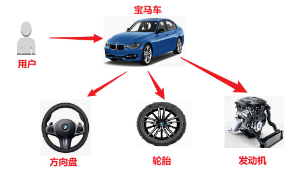
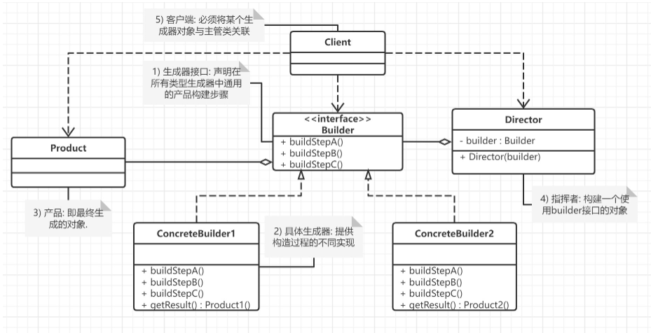
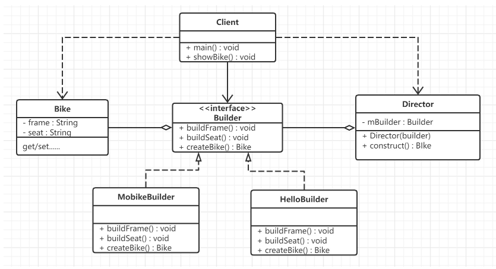

## 概述

**建造者模式** (builder pattern), 也被称为**生成器模式** , 是一种创建型设计模式.

**定义** : 将一个复杂对象的构建与表示分离，使得同样的构建过程可以创建不同的表示。

**建造者模式要解决的问题** :
建造者模式可以将部件和其组装过程分开，一步一步创建一个复杂的对象。用户只需要指定复杂对象的类型就可以得到该对象，而无须知道其内部的具体构造细节。

> 比如: 一辆汽车是由多个部件组成的,包括了车轮、方向盘、发动机等等.对于大多数用户而言,并不需要知道这些部件的装配细节,并且几乎不会使用单独某个部件,而是使用一辆完整的汽车.而建造者模式就是负责将这些部件进行组装让后将完整的汽车返回给用户.


## 原理

建造者（Builder）模式包含以下4个角色 :

- **抽象建造者类（Builder）**：这个接口规定要实现复杂对象的哪些部分的创建，并不涉及具体的部件对象的创建。
- **具体建造者类（ConcreteBuilder）**：实现 Builder 接口，完成复杂产品的各个部件的具体创建方法。在构造过程完成后，提供一个方法,返回创建好的负责产品对象。
- **产品类（Product）**：要创建的复杂对象 (包含多个组成部件).
- **指挥者类（Director）**：调用具体建造者来创建复杂对象的各个部分，在指导者中不涉及具体产品的信息，只负责保证对象各部分完整创建或按某种顺序创建(客户端一般只需要与指挥者进行交互)。


## 实现方式

### 实现方式一  :  标准的实现

**场景** : 生产自行车是一个复杂的过程，它包含了车架，车座等组件的生产。而车架又有碳纤维，铝合金等材质的，车座有橡胶，真皮等材质。对于自行车的生产就可以使用建造者模式。

这里Bike是产品，包含车架，车座等组件；Builder是抽象建造者，MobikeBuilder和HelloBuilder是具体的建造者；Director是指挥者。类图如下：


#### 产品类（Product）

```Java
@Data
@NoArgsConstructor
@AllArgsConstructor
public class Bike {
    private String frame;
    private String seat;
}
```
#### 抽象建造者类（Builder）

```Java
public abstract class Builder {
    protected Bike bike = new Bike();
    public abstract void buildFrame();
    public abstract void buildSeat();
    public abstract Bike createBike();
}
```
#### 具体建造者类（ConcreteBuilder）

```Java
public class HelloBuilder extends Builder {
    @Override
    public void buildFrame() { bike.setFrame("碳纤维车架"); }
    @Override
    public void buildSeat() { bike.setSeat("橡胶车座"); }
    @Override
    public Bike createBike() { return bike; }
}

public class MobikeBuilder extends Builder {  
    @Override  
    public void buildFrame() { bike.setFrame("铝合金车架"); }  
    @Override  
    public void buildSeat() {  bike.setSeat("真皮车座"); }  
    @Override  
    public Bike createBike() { return bike; }  
}
```
#### 指挥者类（Director）

```Java
public class Director {
    private Builder builder;
    
    public Director(Builder builder) {
        this.builder = builder;
    }
    
    public Bike construct(){
        builder.buildFrame();
        builder.buildSeat();
        return builder.createBike();
    }
}
```
#### 测试使用

```java
public class TestDemo01 {
    @Test
    public void demo01(){
        Director moBikeDirector = new Director(new MobikeBuilder());
        Bike moBike = moBikeDirector.construct();
        System.out.println(moBike);
		
        Director helloDirector = new Director(new HelloBuilder());
        Bike hello = helloDirector.construct();
        System.out.println(hello);
    }
}
```
### 实现方式二 : 常用的实现

建造者模式除了上面的用途外，在开发中还有一个常用的使用方式，就是当一个类构造器需要传入很多参数时，如果创建这个类的实例，代码可读性会非常差，而且很容易引入错误，此时就可以利用建造者模式进行重构。

```Java
/**
 * 使用构造函数初始化对象
 *
 * @author sqTan
 * @description 
 * @date 2023/08/15
 */
public class RabbitMQClient1 {
    private String host = "127.0.0.1";
    private int port = 5672;
    private int mode;
    private String exchange;
    private String queue;
    private boolean isDurable = true;
    int connectionTimeout = 1000;
    
    public RabbitMQClient1(String host, int port, int mode, String exchange, String queue, boolean isDurable, int connectionTimeout) {
        this.host = host;
        this.port = port;
        this.mode = mode;
        this.exchange = exchange;
        this.queue = queue;
        this.isDurable = isDurable;
        this.connectionTimeout = connectionTimeout;
        if (mode == 1) { //工作队列模式不需要设计交换机,但是队列名称一定要有
            if (exchange != null) {
                throw new RuntimeException("工作队列模式无需设计交换机");
            }
            if (queue == null || queue.trim().equals("")) {
                throw new RuntimeException("工作队列模式名称不能为空");
            }
            if (isDurable == false) {
                throw new RuntimeException("工作队列模式必须开启持久化");
            }
        } else if (mode == 2) { //路由模式必须设计交换机,但是不能设计队列
            if (exchange == null) {
                throw new RuntimeException("路由模式下必须设置交换机");
            }
            if (queue != null) {
                throw new RuntimeException("路由模式无须设计队列名称");
            }
        }
        //其他验证方式,
    }
	
    public void sendMessage(String msg) {
        System.out.println("发送消息......");
    }
	
    public static void main(String[] args) {
        //每一种模式,都需要根据不同的情况进行实例化,构造方法会变得过于复杂.
        RabbitMQClient1 client1 = new RabbitMQClient1("192.168.52.123", 5672,
                2, "sample-exchange", null, true, 5000);
        client1.sendMessage("Test-MSG");
    }
}
```
#### 复杂参数下面临的问题

##### 使用构造器初始化对象

构造方法如果参数过多,代码的可读性和**易用性都会变差**. 在使用构造函数时,很容易搞错参数的顺序,**传递进去错误的参数值**,导致很有隐蔽的BUG出现.
##### 使用Getter/Setter初始化对象

**set方式设置对象属性时,存在中间状态**,并且属性校验时有前后顺序约束,逻辑校验的代码找不到合适的地方放置.
```Java
//比如下面的代码,  创建对象后使用set 的方式，那就会导致在第一个 set 之后，对象处于无效状态
Rectangle r = new Rectangle ();  //无效状态
r.setWidth(2);  //无效状态
r.setHeight(3);  //有效状态
```

**set方法还破坏了"不可变对象"的密闭性** . (不可变对象是指: 对象创建好了,就不能再修改内部的属性值,下面的client类就是典型的不可变对象,创建好的连接对象不能再改动)

```Java
public class RabbitMQClient2 {
    private String host = "127.0.0.1";
    private int port = 5672;
    private int mode;
    private String exchange;
    private String queue;
    private boolean isDurable = true;
    private int connectionTimeout = 1000;
	
    //私有化构造方法
    private RabbitMQClient2() {}
    public String getExchange() { return exchange; }
    public void setExchange(String exchange) {
        if (mode == 1) { //工作队列模式不需要设计交换机,但是队列名称一定要有
            if (exchange != null) {
                throw new RuntimeException("工作队列模式无需设计交换机");
            }
            if (queue == null || queue.trim().equals("")) {
                throw new RuntimeException("工作队列模式名称不能为空");
            }
            if (isDurable == false) {
                throw new RuntimeException("工作队列模式必须开启持久化");
            }
        } else if (mode == 2) { //路由模式必须设计交换机,但是不能设计队列
            if (exchange == null) {
                throw new RuntimeException("路由模式下必须设置交换机");
            }
            if (queue != null) {
                throw new RuntimeException("路由模式无须设计队列名称");
            }
        }
        //其他验证方式,
        this.exchange = exchange;
    }
	
    public String getHost() {return host; }
    public void setHost(String host) {this.host = host;}
    public int getPort() {return port;}
    public void setPort(int port) { this.port = port; }
    public int getMode() { return mode; }
	
    public void setMode(int mode) {
        if (mode == 1) { //工作队列模式不需要设计交换机,但是队列名称一定要有
            if (exchange != null) {
                throw new RuntimeException("工作队列模式无需设计交换机");
            }
            if (queue == null || queue.trim().equals("")) {
                throw new RuntimeException("工作队列模式名称不能为空");
            }
            if (isDurable == false) {
                throw new RuntimeException("工作队列模式必须开启持久化");
            }
        } else if (mode == 2) { //路由模式必须设计交换机,但是不能设计队列
            if (exchange == null) {
                throw new RuntimeException("路由模式下必须设置交换机");
            }
            if (queue != null) {
                throw new RuntimeException("路由模式无须设计队列名称");
            }
        }
        this.mode = mode;
    }
    public String getQueue() {return queue;}
    public void setQueue(String queue) {this.queue = queue;}
    public boolean isDurable() {return isDurable;}
    public void setDurable(boolean durable) {isDurable = durable;}
    public int getConnectionTimeout() {return connectionTimeout;}
    public void setConnectionTimeout(int connectionTimeout) {this.connectionTimeout = connectionTimeout;}
    public void sendMessage(String msg) { System.out.println("发送消息......");}
    
    public static void main(String[] args) {
        RabbitMQClient2 client2 = new RabbitMQClient2();
        client2.setHost("192.168.52.123");
        client2.setQueue("queue");
        client2.setMode(1);
        client2.setDurable(true);
        client2.sendMessage("Test-MSG2");
    }
}
```

我们发现 : set方法的好处是参数的设计更加的灵活,但是通过set方式设置对象属性时,对象有可能存在中间状态(无效状态),并且进行属性校验时有前后顺序约束.
#### 使用建造者模式

建造者使用步骤如下:
1. 目标类的构造方法要传入Builder对象
2. Builder建造者类位于目标类内部,并且使用static修饰
3. Builder建造者对象提供内置的各种set方法,注意set方法返回的是builder对象本身
4. Builder建造者类提供build()方法实现目标对象的创建

```Java
public class 目标类{
	
    //目标类的构造方法需要传入Builder对象
    public 目标类(Builder builder){  }
    public 返回值 业务方法(参数列表){ }
    
    //Builder建造者类位于目标类内部,并且使用static修饰
    public static class Builder(){
        //Builder建造者对象提供内置的各种set方法,注意set方法返回的是builder对象本身
        private String xxx;
        public Builder setXxx(String xxx){
            this.xxx = xxx;
            return this;
        }
        //Builder建造者类提供build()方法实现目标对象的创建
        public 目标类 build(){
            //校验
            return new 目标类(this);
        }
    }
}
```

实现代码:

```Java
@Getter
@ToString
public class RabbitMQClient3 {
    private String host = "127.0.0.1";
    private int port = 5672;
    private int mode;
    private String exchange;
    private String queue;
    private boolean isDurable = true;
    private int connectionTimeout = 1000;
    private RabbitMQClient3(Builder builder){
        host = builder.host;
        port = builder.port;
        mode = builder.mode;
        exchange = builder.exchange;
        queue = builder.queue;
        isDurable = builder.isDurable;
        connectionTimeout = builder.connectionTimeout;
    }
    public void sendMessage(String msg){ System.out.println("发送消息......"); }
    
    public static class Builder{
        //属性密闭性,保证对象不可变
        private String host = "127.0.0.1";
        private int port = 5672;
        private int mode;
        private String exchange;
        private String queue;
        private boolean isDurable = true;
        private int connectionTimeout = 1000;
        public Builder setHost(String host) { this.host = host; return this; }
        public Builder setPort(int port) { this.port = port; return this; }
        public Builder setMode(int mode) { this.mode = mode; return this; }
        public Builder setExchange(String exchange) { this.exchange = exchange; return this; }
        public Builder setQueue(String queue) { this.queue = queue; return this; }
        public Builder setDurable(boolean durable) { isDurable = durable; return this; }
        public Builder setConnectionTimeout(int connectionTimeout) { this.connectionTimeout = connectionTimeout; return this; }
        //返回构建好的复杂对象
        public RabbitMQClient3 build(){
            //首先进行校验
            if(mode == 1){ //工作队列模式不需要设计交换机,但是队列名称一定要有
                if(exchange != null){
                    throw new RuntimeException("工作队列模式无需设计交换机");
                }
                if(queue == null || queue.trim().equals("")){
                    throw new RuntimeException("工作队列模式名称不能为空");
                }
                if(isDurable == false){
                    throw new RuntimeException("工作队列模式必须开启持久化");
                }
            }else if(mode == 2){ //路由模式必须设计交换机,但是不能设计队列
                if(exchange == null){
                    throw new RuntimeException("路由模式下必须设置交换机");
                }
                if(queue != null){
                    throw new RuntimeException("路由模式无须设计队列名称");
                }
            }
            return new RabbitMQClient3(this);
        }
    }
}
```

测试

```Java
public class TestDemo01 {
    @Test
    public void demo01(){
        RabbitMQClient3 build = new RabbitMQClient3.Builder()
                .setHost("192.168.52.123")
                .setMode(2)
                .setExchange("text-exchange")
                .setPort(5672)
                .setDurable(true)
                .build();
        System.out.println("build=="+build);
        build.sendMessage("123");
    }
}
```
## 总结
### 建造者模式与工厂模式区别

- **工厂模式是用来创建不同但是相关类型的对象（继承同一父类或者接口的一组子类）**，由给定的参数来决定创建哪种类型的对象。
- **建造者模式是用来创建一种类型的复杂对象**，通过设置不同的可选参数，“定制化”地创建不同的对象。

>举例: 顾客走进一家餐馆点餐，我们利用工厂模式，根据用户不同的选择，来制作不同的食物，比 如披萨、汉堡、沙拉。对于披萨来说，用户又有各种配料可以定制，比如奶酪、西红柿、起 司，我们通过建造者模式根据用户选择的不同配料来制作披萨。
### 建造者模式的优缺点

**优点** :
- 建造者模式的**封装性**很好。使用建造者模式可以有效的封装变化，在使用建造者模式的场景中，一般产品类和建造者类是比较稳定的，因此，将主要的业务逻辑封装在指挥者类中对整体而言可以取得比较好的稳定性。
- 在建造者模式中，客户端不必知道产品内部组成的细节，将产品本身与产品的**创建过程解耦**，使得相同的创建过程可以创建不同的产品对象。
- 可以**更加精细地控制产品的创建过程** 。将复杂产品的创建步骤分解在不同的方法中，使得创建过程更加清晰，也更方便使用程序来控制创建过程。
- 建造者模式很**容易进行扩展**。如果有新的需求，通过实现一个新的建造者类就可以完成，基本上不用修改之前已经测试通过的代码，因此也就不会对原有功能引入风险。符合开闭原则。

缺点 :
- 建造者模式所**创建的产品一般具有较多的共同点，其组成部分相似，如果产品之间的差异性很大，则不适合使用建造者模式**，因此其使用范围受到一定的限制。
### 应用场景

- 建造者（Builder）模式创建的是复杂对象，其产品的各个部分经常面临着剧烈的变化，但将它们组合在一起的算法却相对稳定，所以它通常在以下场合使用。
    - **创建的对象较复杂**，由多个部件构成，各部件面临着复杂的变化，但构件间的建造顺序是稳定的。
    - **创建复杂对象的算法独立于该对象的组成部分以及它们的装配方式**，即产品的构建过程和最终的表示是独立的。

