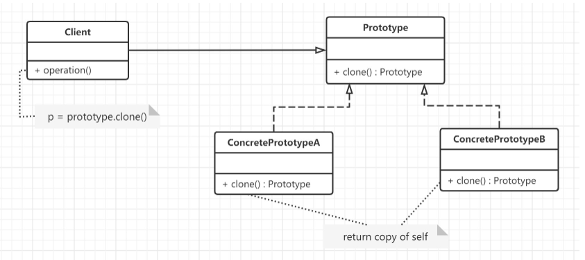
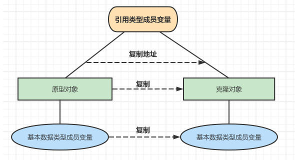
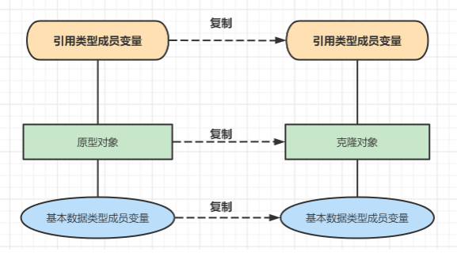
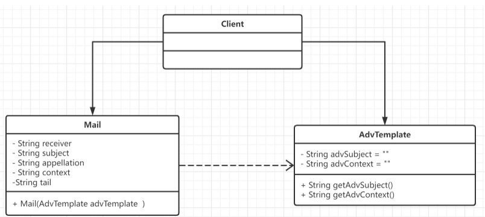

## 概念

**定义** : 原型模式(Prototype Design Pattern)用一个已经创建的实例作为原型，通过复制该原型对象来创建一个和原型对象相同的新对象。

> 西游记中的孙悟空 拔毛变小猴,孙悟空这种根据自己的形状复制出多个身外化身的技巧,在面向对象软件设计领域被称为原型模式.孙悟空就是原型对象.


**原型模式主要解决的问题**
如果创建对象的成本比较大,比如对象中的数据是经过复杂计算才能得到,或者需要从RPC接口或者数据库等比较慢的IO中获取,这种情况我们就可以使用原型模式,从其他已有的对象中进行拷贝,而不是每次都创建新对象,进行一些耗时的操作.

## 原理

原型模式包含如下角色：
- **抽象原型类(Prototype)**：它是声明克隆方法的接口,是所有具体原型类的公共父类,它可以是抽象类也可以是接口.
- **具体原型类(ConcretePrototype)**：实现在抽象原型类中声明的克隆方法,在克隆方法中返回自己的一个克隆对象.
- **客户类(Client)**：在客户类中,让一个原型对象克隆自身从而创建一个新的对象.由于客户类针对抽象原型类Prototype编程.因此用户可以根据需要选择具体原型类,系统具有较好的扩展性,增加或者替换具体原型类都比较方便.


## 深拷贝与浅拷贝

根据在**复制原型对象的同时是否复制包含在原型对象中引用类型的成员变量** 这个条件,原型模式的克隆机制分为两种,即浅克隆(Shallow Clone)和深克隆(Deep Clone)

### 浅拷贝

#### 概念

> 什么是浅拷贝 : 被复制对象的所有变量都含有与原来的对象相同的值，而所有的对其他对象的引用仍然指向原来的对象(克隆对象与原型对象共享引用数据类型变量)。


#### 实现

Java中的Object类中提供了 `clone()` 方法来实现**浅克隆**。需要注意的是要想实现克隆的Java类必须实现一个标识接口 Cloneable ,来表示这个Java类支持被复制.

Cloneable接口是上面的类图中的抽象原型类，而实现了Cloneable接口的子实现类就是具体的原型类。代码如下：

```Java
@Data
@ToString
public class ShallowCopy implements Cloneable{
    private Object obj;
    public ShallowCopy() {
        System.out.println("具体的原型对象创建完成!");
    }
    @Override
    protected ShallowCopy clone() throws CloneNotSupportedException {
        System.out.println("具体的原型对象复制成功!");
        return (ShallowCopy)super.clone();
    }
}
```

测试代码:

```Java
public class ShallowCopyTest {
    @Test
    public void Test() throws CloneNotSupportedException {
        ShallowCopy shallowCopy = new ShallowCopy();
        shallowCopy.setObj(new Object());
        ShallowCopy cloneShallowCopy = shallowCopy.clone();
        System.out.println("克隆前与克隆后是同一个对象嘛?"+(shallowCopy==cloneShallowCopy));//false
        System.out.println("克隆前的引用类型属性与克隆后的引用类型属性是同一个对象嘛?"+(shallowCopy.getObj()==cloneShallowCopy.getObj()));//true
    }
}
```
### 深拷贝

#### 概念

除去那些引用其他对象的变量，被复制对象的所有变量都含有与原来的对象相同的值。那些引用其他对象的变量将指向被复制过的新对象，而不再是原有的那些被引用的对象。

换言之，深**复制把要复制的对象所引用的对象都复制了一遍。**


#### 实现

实现深拷贝可以参考 : 对象序列化之后,再进行反序列化获取到的是不同对象

> 注意：ConcretePrototype类和Person类必须实现Serializable接口，否则会抛NotSerializableException异常。

```Java
@Data
@ToString
public class DeepCopy implements Cloneable, Serializable {
    private People people;
    public DeepCopy() {
        System.out.println("具体的原型对象创建完成!");
    }
    @Override
    protected ShallowCopy clone() throws CloneNotSupportedException {
        System.out.println("具体的原型对象复制成功!");
        return (ShallowCopy)super.clone();
    }
}
@Data  
@NoArgsConstructor  
@AllArgsConstructor  
@ToString  
public class People implements Serializable {  
    private String name;  
}
```

测试代码:

```java
public class DeepCopyTest {
    @Test
    public void Test() throws CloneNotSupportedException, IOException, ClassNotFoundException {
        DeepCopy deepCopy = new DeepCopy();
        deepCopy.setPeople(new People("张三"));
		
        //序列化
        ObjectOutputStream objectOutputStream = new ObjectOutputStream(new FileOutputStream("c.obj"));
        objectOutputStream.writeObject(deepCopy);
        objectOutputStream.close();
		
        //反序列化
        ObjectInputStream objectInputStream = new ObjectInputStream(new FileInputStream("c.obj"));
        DeepCopy cloneDeepCopy = (DeepCopy)objectInputStream.readObject();
		
        System.out.println("克隆前与克隆后是同一个对象嘛?"+(deepCopy==cloneDeepCopy));//false
        System.out.println("克隆前的引用类型属性与克隆后的引用类型属性是同一个对象嘛?"+(deepCopy.getPeople()==cloneDeepCopy.getPeople()));//false
    }
}
```

### 推荐的方式

其实现在不推荐大家用Cloneable接口，实现比较麻烦，现在借助Apache Commons或者springframework可以直接实现：

- 浅克隆：`BeanUtils.cloneBean(Object obj);BeanUtils.copyProperties(S,T);`
- 深克隆：`SerializationUtils.clone(T object);`

BeanUtils是利用反射原理获得所有类可见的属性和方法，然后复制到target类。 SerializationUtils.clone()就是使用我们的前面讲的序列化实现深克隆，当然你要把要克隆的类实现Serialization接口。
## 应用

模拟某银行电子账单系统的广告信发送功能,广告信的发送都是有一个模板的,从数据库查出客户的信息,然后放到模板中生成一份完整的邮件,然后交给发送机进行发送处理.

对应的UML类图:


### 直接实现业务

实体类 : 

```Java
@Data
public class AdvTemplate {
    //广告信名称
    private String advSubject = "xx银行本月还款达标,可抽iPhone 13等好礼!";
    //广告信内容
    private String advContext = "达标用户请在2022年3月1日到2022年3月30参与抽奖......";
}

@Data
public class Mail {
    //收件人
    private String receiver;
    //邮件名称
    private String subject;
    //称谓
    private String appellation;
    //邮件内容
    private String context;
    //邮件尾部, 一般是"xxx版权所有"等信息
    private String tail;
	
    public Mail(AdvTemplate template) {
        this.context = template.getAdvContext();
        this.subject = template.getAdvSubject();
    }
}
```

业务代码 :

```java

public class Client {
    //发送信息的是数量,这个值可以从数据库获取
    private static int MAX_COUNT = 6;
	
    //发送邮件
    public static void sendMail(List<Mail> mailList){
        for (Mail mail : mailList) {
            System.out.println("标题: " + mail.getSubject() + "\t收件人: " + mail.getReceiver()
                    + "\t..发送成功!");
        }
    }
	
    @Test
    public void TestDemo01(){
        int i = 0;
        List<Mail> mailList= new ArrayList<>();
        while(i < MAX_COUNT){
            //把模板定义出来,数据是从数据库获取的
            Mail mail = new Mail(new AdvTemplate());
            mail.setTail("xxx银行版权所有");
            //下面是每封邮件不同的地方
            mail.setAppellation(" 先生 (女士)");
            Random random = new Random();
            int num = random.nextInt(9999999);
            mail.setReceiver(num+"@"+"liuliuqiu.com");
            mailList.add(mail);
            i++;
        }
        //发送 邮件
        sendMail(mailList);
    }
}
```

上面的代码存在的问题:
- 发送邮件需要**重复创建Mail类对象**,而且Mail类的不同对象之间差别非常小,这样重复的创建操作十分的浪费资源.
### 使用原型实现业务

针对于上述代码 : 我们可以使用原型模式,从其他已有的对象中进行拷贝,而不是每次都创建新对象,进行一些耗时的操作.

实体类 

```Java
@Data
public class AdvTemplate {
    //广告信名称
    private String advSubject = "xx银行本月还款达标,可抽iPhone 13等好礼!";
    //广告信内容
    private String advContext = "达标用户请在2022年3月1日到2022年3月30参与抽奖......";
}
@Data
public class Mail implements Cloneable{
    //收件人
    private String receiver;
    //邮件名称
    private String subject;
    //称谓
    private String appellation;
    //邮件内容
    private String context;
    //邮件尾部, 一般是"xxx版权所有"等信息
    private String tail;
	
    public Mail(AdvTemplate template) {
        this.context = template.getAdvContext();
        this.subject = template.getAdvSubject();
    }
	
    @Override
    public Mail clone() throws CloneNotSupportedException {
        Mail mail = null;
        try {
            mail = (Mail)super.clone();
        } catch (CloneNotSupportedException e) {
            throw new RuntimeException(e);
        }
        return mail;
    }
}
```

业务代码 :

```java
public class Client {
    //发送信息的是数量,这个值可以从数据库获取
    private static int MAX_COUNT = 6;
	
    //发送邮件
    public static void sendMail(List<Mail> mailList){
        for (Mail mail : mailList) {
            System.out.println("标题: " + mail.getSubject() + "\t收件人: " + mail.getReceiver()
                    + "\t..发送成功!");
        }
    }
	
    @Test
    public void TestDemo01() throws CloneNotSupportedException {
        int i = 0;
        List<Mail> mailList= new ArrayList<>();
        //把模板定义出来,数据是从数据库获取的
        Mail mail = new Mail(new AdvTemplate());
        while(i < MAX_COUNT){
            //把模板定义出来,数据是从数据库获取的
            Mail cloneMail = mail.clone();
            cloneMail.setTail("xxx银行版权所有");
            //下面是每封邮件不同的地方
            cloneMail.setAppellation(" 先生 (女士)");
            Random random = new Random();
            int num = random.nextInt(9999999);
            cloneMail.setReceiver(num+"@"+"liuliuqiu.com");
            mailList.add(cloneMail);
            i++;
        }
        //发送 邮件
        sendMail(mailList);
    }
}
```
## 总结

### 原型模式的优缺点

**原型模式的优点**
1. 当创建新的对象实例较为复杂时,使用原型模式可以简化对象的创建过程, 通过复制一个已有实例可以**提高新实例的创建效率**.
    > 比如，在 AI 系统中，我们经常需要频繁使用大量不同分类的数据模型文件，在对这一类文件建立对象模型时，不仅会长时间占用 IO 读写资源，还会消耗大量 CPU 运算资源，如果频繁创建模型对象，就会很容易造成服务器 CPU 被打满而导致系统宕机。通过原型模式我们可以很容易地解决这个问题，当我们完成对象的第一次初始化后，新创建的对象便使用对象拷贝（在内存中进行二进制流的拷贝），虽然拷贝也会消耗一定资源，但是相比初始化的外部读写和运算来说，内存拷贝消耗会小很多，而且速度快很多
    
2. 原型模式提供了**简化的创建结构**,工厂方法模式常常需要有一个与产品类等级结构相同的工厂等级结构(具体工厂对应具体产品),而原型模式就不需要这样,原型模式的产品复制是通过封装在原型类中的克隆方法实现的,无须专门的工厂类来创建产品.
    
3. **可以使用深克隆的方式保存对象状态**,使用原型模式将对象复制一份并将其状态保存起来,以便在需要的时候使用,比如恢复到某一历史状态,可以辅助实现撤销操作.
    
    > 在某些需要保存历史状态的场景中，比如，聊天消息、上线发布流程、需要撤销操作的程序等，原型模式能快速地复制现有对象的状态并留存副本，方便快速地回滚到上一次保存或最初的状态，避免因网络延迟、误操作等原因而造成数据的不可恢复。
    

**原型模式缺点**
- 需要为每一个类配备一个克隆方法,而且该克隆方法位于一个类的内部,当对已有的类进行改造时需要修改源代码,**违背了开闭原则**.
### 应用场景

原型模式常见的使用场景有以下六种。
- **资源优化场景**。也就是当进行对象初始化需要使用很多外部资源时，比如，IO 资源、数据文件、CPU、网络和内存等。
- **复杂的依赖场景**。 比如，F 对象的创建依赖 A，A 又依赖 B，B 又依赖 C……于是创建过程是一连串对象的 get 和 set。
- **性能和安全要求的场景**。 比如，同一个用户在一个会话周期里，可能会反复登录平台或使用某些受限的功能，每一次访问请求都会访问授权服务器进行授权，但如果每次都通过 new 产生一个对象会非常烦琐，这时则可以使用原型模式。
- **同一个对象可能被多个修改者使用的场景**。 比如，一个商品对象需要提供给物流、会员、订单等多个服务访问，而且各个调用者可能都需要修改其值时，就可以考虑使用原型模式。
- **需要保存原始对象状态的场景**。 比如，记录历史操作的场景中，就可以通过原型模式快速保存记录。


