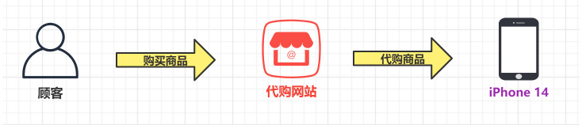
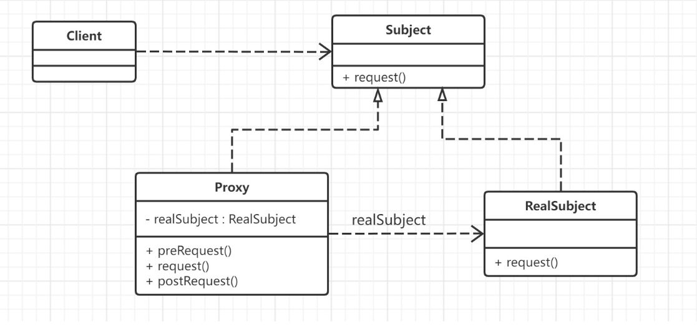
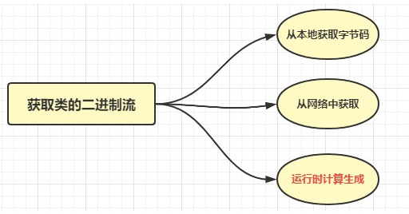
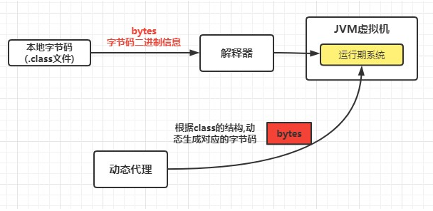
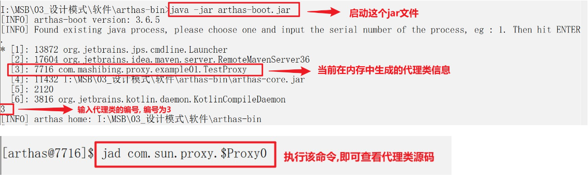
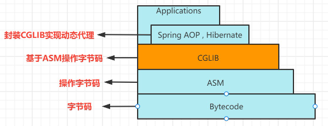
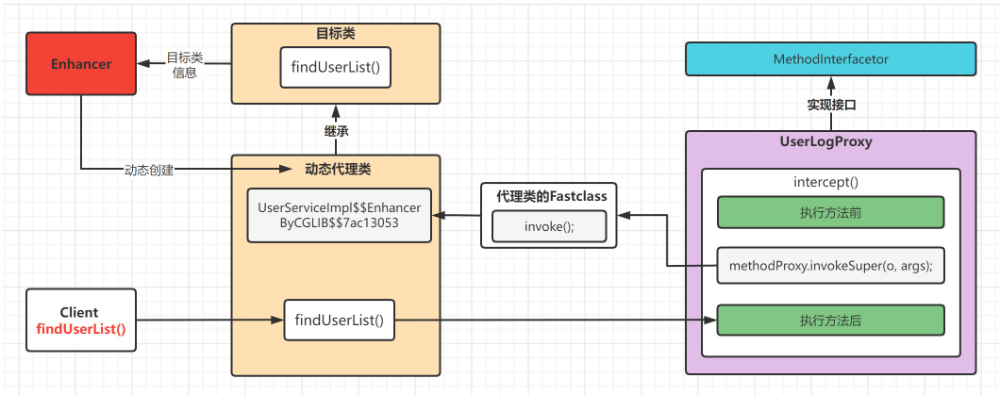

## 概览

### 介绍

在软件开发中,由于一些原因,客户端不想或不能直接访问一个对象,此时可以通过一个称为"代理"的第三者来实现间接访问.该方案对应的设计模式被称为代理模式.

`代理模式(Proxy Design Pattern ) `原始定义是：让你能够提供对象的替代品或其占位符。代理控制着对于原对象的访问，并允许将请求提交给对象前后进行一些处理。

- 现实生活中的代理: **海外代购**


- 软件开发中的代理
代理模式中引入了一个新的代理对象,代理对象在客户端对象和目标对象之间起到了中介的作用,它去掉客户不能看到的内容和服务或者增加客户需要的额外的新服务.
### 原理

`代理（Proxy）`模式分为三种角色：
- `抽象主题（Subject）类`： 声明了真实主题和代理主题的共同接口,这样就可以保证任何使用真实主题的地方都可以使用代理主题,客户端一般针对抽象主题类进行编程。
- `代理（Proxy）类 `： 提供了与真实主题相同的接口，其内部含有对真实主题的引用，它可以在任何时候访问、控制或扩展真实主题的功能。
- `真实主题（Real Subject）类`： 实现了抽象主题中的具体业务，是代理对象所代表的真实对象，是最终要引用的对象。


## 静态代理

这种代理方式需要代理对象和目标对象实现一样的接口。

- 优点：可以在不修改目标对象的前提下扩展目标对象的功能。
- 缺点：
	- 冗余。由于代理对象要实现与目标对象一致的接口，会产生过多的代理类。
	- 不易维护。一旦接口增加方法，目标对象与代理对象都要进行修改。

IUserDao.java 接口
```Java
public interface IUserDao {
    void save();
}
```

IUserDao.java 实现类
```java
public class IUserDaoImpl implements IUserDao {
    @Override
    public void save() {
        System.out.println("保存用户的数据");
    }
}
```

UserDaoProxy.java 代理类
```Java
public class UserDaoProxy implements IUserDao {
    private IUserDao iUserDao;
    public UserDaoProxy(IUserDaoImpl iUserDao) {
        this.iUserDao = iUserDao;
    }
    @Override
    public void save() {
        System.out.println("开启事务....");
        iUserDao.save();
        System.out.println("关闭事务....");
    }
}
```

测试类
```Java
public class StaticProxy {
    public static void main(String[] args) {
        UserDaoProxy userDaoProxy = new UserDaoProxy(new IUserDaoImpl());
        userDaoProxy.save();
    }
}
```
## JDK动态代理

动态代理利用了JDK API,动态地在内存中构建代理对象,从而实现对目标对象的代理功能.动态代理又被称为JDK代理或接口代理.

静态代理与动态代理的区别:
1. 静态代理在编译时就已经实现了,编译完成后代理类是一个实际的class文件
2. 动态代理是在运行时动态生成的,即编译完成后没有实际的class文件,而是在运行时动态生成类字节码,并加载到JVM中.

JDK中生成代理对象主要涉及的类有:
`java.lang.reflect Proxy` 主要方法为:
```Java
static Object newProxyInstance(
    ClassLoader loader,  		//指定当前目标对象使用类加载器
    Class<?>[] interfaces,    //目标对象实现的接口的类型
    InvocationHandler h      //事件处理器
) 
//返回一个指定接口的代理类实例，该接口可以将方法调用指派到指定的调用处理程序。
```
`java.lang.reflect InvocationHandler` 主要方法为
```Java
Object invoke(Object proxy, Method method, Object[] args) 
// 在代理实例上处理方法调用并返回结果。
```
### 实现JDK动态代理

IUserDao.java 接口
```Java
public interface IUserDao {
    void save();
}
```

IUserDao.java 实现类
```java
public class IUserDaoImpl implements IUserDao {
    @Override
    public void save() {
        System.out.println("保存用户的数据");
    }
}
```

JDKDynamicAgent.java 代理类
```Java
public class JDKDynamicAgent {
    private Object obj;
	
    public JDKDynamicAgent(Object obj) {
        this.obj = obj;
    }
	
    public Object getProxyInstance(){
        return Proxy.newProxyInstance(
                obj.getClass().getClassLoader(),//目标类加载器
                obj.getClass().getInterfaces(),//目标类接口
                new InvocationHandler() {//事件处理器
                    /**
                     * invoke方法参数说明
                     * @param proxy 代理对象
                     * @param method 对应于在代理对象上调用的接口方法Method实例
                     * @param args 代理对象调用接口方法时传递的实际参数
                     * @return: java.lang.Object 返回目标对象方法的返回值,没有返回值就返回null
                     */
                    @Override
                    public Object invoke(Object proxy, Method method, Object[] args) throws Throwable {
                        System.out.println("开启事务..");
                        method.invoke(obj,args);
                        System.out.println("关闭事务..");
                        return null;
                    }
                }
        );
    }
}
```

测试类:
```Java
public class JDKDynamicAgentTest {
    public static void main(String[] args) {
        IUserDao proxyInstance = (IUserDao)new JDKDynamicAgent(new IUserDaoImpl()).getProxyInstance();
        proxyInstance.save();
    }
}
```
### 类是如何动态生成的

Java虚拟机类加载过程主要分为五个阶段：加载、验证、准备、解析、初始化。其中加载阶段需要完成以下3件事情：
1. 通过一个类的全限定名来获取定义此类的二进制字节流
2. 将这个字节流所代表的静态存储结构转化为方法区的运行时数据结构
3. 在内存中生成一个代表这个类的 `java.lang.Class` 对象，作为方法区这个类的各种数据访问入口

由于虚拟机规范对这3点要求并不具体，所以实际的实现是非常灵活的，关于第1点，**获取类的二进制字节流**（class字节码）就有很多途径：

- 从本地获取
- 从网络中获取
- **运行时计算生成**，这种场景使用最多的是动态代理技术，在 java.lang.reflect.Proxy 类中，就是用了 ProxyGenerator.generateProxyClass 来为特定接口生成形式为 `*$Proxy` 的代理类的二进制字节流


所以，动态代理就是想办法，根据接口或目标对象，计算出代理类的字节码，然后再加载到JVM中使用
### 代理类的调用过程

我们通过借用阿里巴巴的一款线上监控诊断产品 Arthas(阿尔萨斯) ,对动态生成的代理类代码进行查看



代理类代码如下:
```Java
package com.sun.proxy;

import com.mashibing.proxy.example01.IUserDao;
import java.lang.reflect.InvocationHandler;
import java.lang.reflect.Method;
import java.lang.reflect.Proxy;
import java.lang.reflect.UndeclaredThrowableException;

public final class $Proxy0
extends Proxy
implements IUserDao {
    private static Method m1;
    private static Method m3;
    private static Method m2;
    private static Method m0;
	
    public $Proxy0(InvocationHandler invocationHandler) {
        super(invocationHandler);
    }
	
    static {
        try {
            m1 = Class.forName("java.lang.Object").getMethod("equals", Class.forName("java.lang.Object"));
            m3 = Class.forName("com.mashibing.proxy.example01.IUserDao").getMethod("save", new Class[0]);
            m2 = Class.forName("java.lang.Object").getMethod("toString", new Class[0]);
            m0 = Class.forName("java.lang.Object").getMethod("hashCode", new Class[0]);
            return;
        }
        catch (NoSuchMethodException noSuchMethodException) {
            throw new NoSuchMethodError(noSuchMethodException.getMessage());
        }
        catch (ClassNotFoundException classNotFoundException) {
            throw new NoClassDefFoundError(classNotFoundException.getMessage());
        }
    }
	
    public final boolean equals(Object object) {
        try {
            return (Boolean)this.h.invoke(this, m1, new Object[]{object});
        }
        catch (Error | RuntimeException throwable) {
            throw throwable;
        }
        catch (Throwable throwable) {
            throw new UndeclaredThrowableException(throwable);
        }
    }
	
    public final String toString() {
        try {
            return (String)this.h.invoke(this, m2, null);
        }
        catch (Error | RuntimeException throwable) {
            throw throwable;
        }
        catch (Throwable throwable) {
            throw new UndeclaredThrowableException(throwable);
        }
    }
	
    public final int hashCode() {
        try {
            return (Integer)this.h.invoke(this, m0, null);
        }
        catch (Error | RuntimeException throwable) {
            throw throwable;
        }
        catch (Throwable throwable) {
            throw new UndeclaredThrowableException(throwable);
        }
    }
	
    public final void save() {
        try {
            this.h.invoke(this, m3, null);
            return;
        }
        catch (Error | RuntimeException throwable) {
            throw throwable;
        }
        catch (Throwable throwable) {
            throw new UndeclaredThrowableException(throwable);
        }
    }
}
```

简化后的代码

```Java
package com.sun.proxy;

import com.mashibing.proxy.example01.IUserDao;
import java.lang.reflect.InvocationHandler;
import java.lang.reflect.Method;
import java.lang.reflect.Proxy;
import java.lang.reflect.UndeclaredThrowableException;

public final class $Proxy0
extends Proxy
implements IUserDao {
    private static Method m3;
	
    public $Proxy0(InvocationHandler invocationHandler) {
        super(invocationHandler);
    }
	
    static {
        try {
         m3 = Class.forName("com.mashibing.proxy.example01.IUserDao").getMethod("save", new Class[0]);
          return;
        }
    }
	
    public final void save() {
        try {
            this.h.invoke(this, m3, null);
            return;
        }
    }
}
```

- 动态代理类对象 继承了 Proxy 类，并且实现了被代理的所有接口，以及equals、hashCode、toString等方法
- 代理类的构造函数，参数是`InvocationHandler`实例，`Proxy.newInstance`方法就是通过这个构造函数来创建代理实例的
- 类和所有方法都被 `public final` 修饰，所以代理类只可被使用，不可以再被继承
- 每个方法都有一个 Method 对象来描述，Method 对象在static静态代码块中创建，以 `m + 数字` 的格式命名
- 调用方法的时候通过 `this.h.invoke(this, m3, null));` **实际上 h.invoke就是在调用ProxyFactory中我们重写的invoke方法**

```Java
@Override
public Object invoke(Object proxy, Method method, Object[] args) throws Throwable {
    System.out.println("开启事务");
	
    //执行目标对象方法
    method.invoke(target, args);
    System.out.println("提交事务");
    return null;
}
```
## CGLIB动态代理

### 概念

`cglib (Code Generation Library ) `是一个第三方代码生成类库，运行时在内存中动态生成一个子类对象从而实现对目标对象功能的扩展。cglib 为没有实现接口的类提供代理，为JDK的动态代理提供了很好的补充。


- 最底层是字节码
- ASM是操作字节码的工具
- cglib基于ASM字节码工具操作字节码（即动态生成代理，对方法进行增强）
- SpringAOP基于cglib进行封装，实现cglib方式的动态代理

### 实现CGLIB动态代理

使用cglib 需要引入cglib 的jar包，如果你已经有spring-core的jar包，则无需引入，因为spring中包含了cglib 。
- cglib 的Maven坐标
```XML
<dependency>
    <groupId>cglib</groupId>
    <artifactId>cglib</artifactId>
    <version>3.2.5</version>
</dependency>
```

IUserDao.java 接口
```Java
public interface IUserDao {
    void save();
}
```

IUserDao.java 实现类
```java
public class IUserDaoImpl implements IUserDao {
    @Override
    public void save() {
        System.out.println("保存用户的数据");
    }
}
```

cglibDynamicAgent.java 代理类
```java

public class cglibDynamicAgent implements MethodInterceptor {
    private Object target;
    public cglibDynamicAgent(Object target) {
        this.target = target;
    }
    public Object getLogProxy(){
        //增强器类,用来创建动态代理类
        Enhancer en = new Enhancer();
        //设置代理类的父类字节码对象
        en.setSuperclass(target.getClass());
        //设置回调: 对于代理类上所有的方法的调用,都会调用CallBack,而Callback则需要实现intercept()方法进行拦截
        en.setCallback(this);
        //创建动态代理对象并返回
        return en.create();
    }
    /**
     * 实现回调方法
     * @param o     代理对象
     * @param method  目标对象中的方法的Method实例
     * @param objects      实际参数
     * @param methodProxy  代理对象中的方法的method实例
     * @return: java.lang.Object
     */
    @Override
    public Object intercept(Object o, Method method, Object[] objects, MethodProxy methodProxy) throws Throwable {
        Calendar calendar = Calendar.getInstance();
        SimpleDateFormat formatter = new SimpleDateFormat("yyyy-MM-dd HH:mm:ss");
        System.out.println(formatter.format(calendar.getTime()) + " [" +method.getName() + "] 开始执行方法...]");
        Object result = methodProxy.invokeSuper(o, objects);
        System.out.println(formatter.format(calendar.getTime()) + " [" +method.getName() + "] 开始执行成功...]");
        return result;
    }
}
```

cglibDynamicAgentTest.java 测试类
```Java
public class cglibDynamicAgentTest {
    public static void main(String[] args) {
        IUserDaoImpl iUserDaoImpl = (IUserDaoImpl)new cglibDynamicAgent(new IUserDaoImpl()).getLogProxy();
        iUserDaoImpl.save();
    }
}
```
### cglib代理流程


## 总结

### 三种代理模式实现方式的对比

- jdk代理和CGLIB代理
    使用CGLib实现动态代理，CGLib底层采用ASM字节码生成框架，使用字节码技术生成代理类，在JDK1.6之前比使用Java反射效率要高。唯一需要注意的是，CGLib不能对声明为final的类或者方法进行代理，因为CGLib原理是动态生成被代理类的子类。
    在JDK1.6、JDK1.7、JDK1.8逐步对JDK动态代理优化之后，在调用次数较少的情况下，JDK代理效率高于CGLib代理效率，只有当进行大量调用的时候，JDK1.6和JDK1.7比CGLib代理效率低一点，但是到JDK1.8的时候，JDK代理效率高于CGLib代理。所以如果有接口使用JDK动态代理，如果没有接口使用CGLIB代理。
- 动态代理和静态代理
    动态代理与静态代理相比较，最大的好处是接口中声明的所有方法都被转移到调用处理器一个集中的方法中处理（InvocationHandler.invoke）。这样，在接口方法数量比较多的时候，我们可以进行灵活处理，而不需要像静态代理那样每一个方法进行中转。
    如果接口增加一个方法，静态代理模式除了所有实现类需要实现这个方法外，所有代理类也需要实现此方法。增加了代码维护的复杂度。而动态代理不会出现该问题
#### 代理模式优缺点

**优点：**
- 代理模式在客户端与目标对象之间起到一个中介作用和保护目标对象的作用；
- 代理对象可以扩展目标对象的功能；
- 代理模式能将客户端与目标对象分离，在一定程度上降低了系统的耦合度；

**缺点：**
- 增加了系统的复杂度；

#### 代理模式使用场景

- 功能增强
    当需要对一个对象的访问提供一些额外操作时,可以使用代理模式
- 远程（Remote）代理
    实际上，RPC 框架也可以看作一种代理模式，GoF 的《设计模式》一书中把它称作远程代理。通过远程代理，将网络通信、数据编解码等细节隐藏起来。客户端在使用 RPC 服务的时候，就像使用本地函数一样，无需了解跟服务器交互的细节。除此之外，RPC 服务的开发者也只需要开发业务逻辑，就像开发本地使用的函数一样，不需要关注跟客户端的交互细节。
- 防火墙（Firewall）代理
    当你将浏览器配置成使用代理功能时，防火墙就将你的浏览器的请求转给互联网；当互联网返回响应时，代理服务器再把它转给你的浏览器。
- 保护（Protect or Access）代理
    控制对一个对象的访问，如果需要，可以给不同的用户提供不同级别的使用权限。

