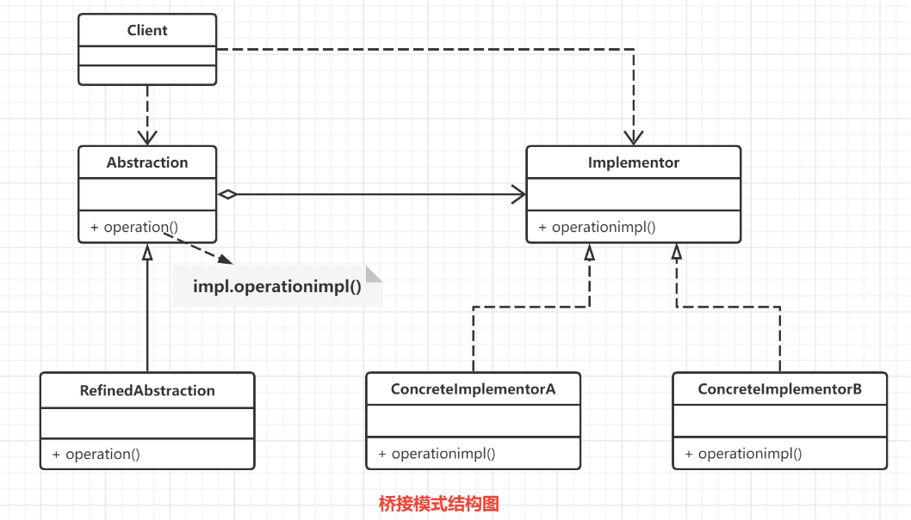
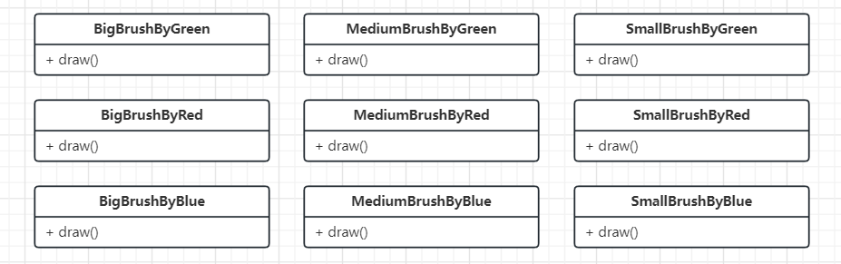
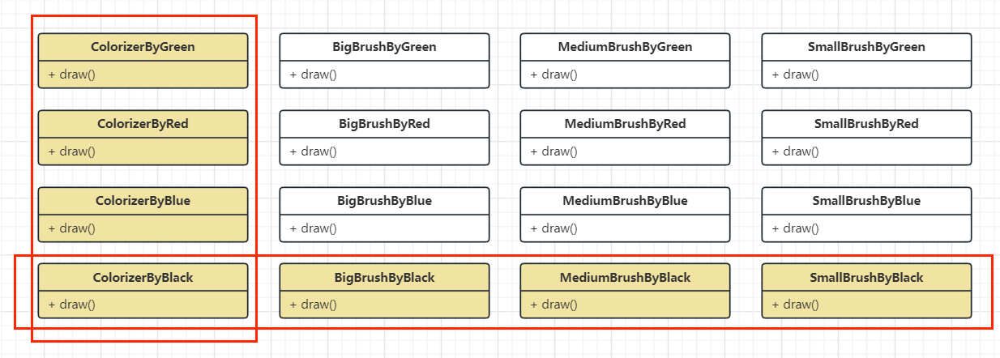
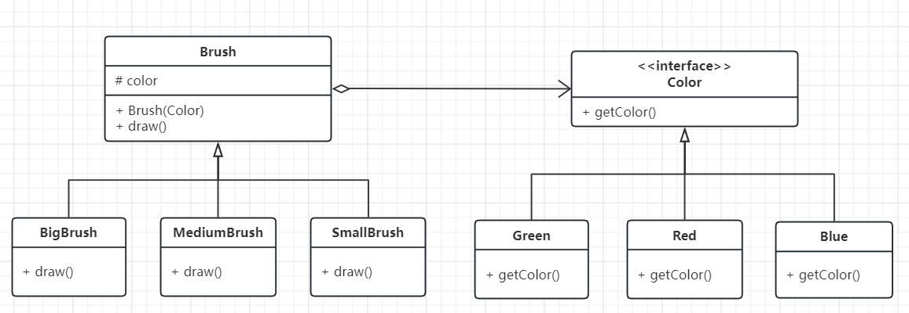
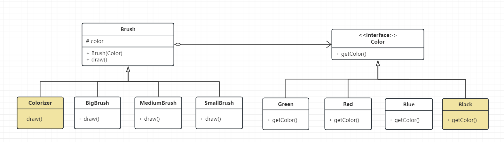
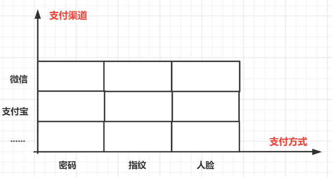
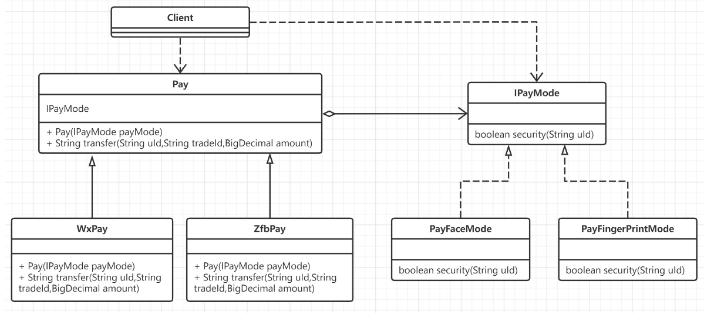

## 简介

桥接模式 (bridge pattern) 的定义是：将抽象部分与它的实现部分分离，使它们都可以独立地变化。

> 桥接模式用一种巧妙的方式处理多层继承存在的问题,用抽象关联来取代传统的多层继承,将类之间的静态继承关系转变为动态的组合关系,使得系统更加灵活,并易于扩展,有效的控制了系统中类的个数 (避免了继承层次的指数级爆炸).

## 原理

### 原理结构



桥接（Bridge）模式包含以下主要角色：
- 抽象化（Abstraction）角色 ：主要负责定义出该角色的行为 ,并包含一个对实现化对象的引用。
- 扩展抽象化（RefinedAbstraction）角色 ：是抽象化角色的子类，实现父类中的业务方法，并通过组合关系调用实现化角色中的业务方法。
- 实现化（Implementor）角色 ：定义实现化角色的接口，包含角色必须的行为和属性,并供扩展抽象化角色调用。
- 具体实现化（Concrete Implementor）角色 ：给出实现化角色接口的具体实现。

**桥接模式原理的核心是: 首先有要识别出一个类所具有的的两个独立变化维度,将它们设计为两个独立的继承等级结构,为两个维度都提供抽象层,并建立抽象耦合.总结一句话就是: 抽象角色引用实现角色**

### 简单的案例

我们模拟一个毛笔画图的功能,有`大/中/小`三种型号的毛笔,需要`红/绿/蓝`不同的颜色画图

#### 传统模式



我们针对于不同的毛笔不同的颜色 创建了不同的业务类,这样**业务非常臃肿,拓展十分麻烦**

比如下面我们拓展一个颜色和一个工具



#### 使用桥接

对此我们使用桥接模式,将工具与颜色抽取成两个维度

- 型号是其固有的维度,所以抽象出一个毛笔类,而将各种型号的毛笔作为其子类,也就是下图的右侧抽象部分内容.
- 颜色是毛笔的另一个维度, 它与毛笔之间存在一种设置的关系,因此可以提供一个抽象的颜色接口,将具体颜色作为该接口的子类.



```Java
public interface Color{ getColor(); }
public class Red implements Color { public String getColor(){return "Red"; } }
public class Green implements Color { public String getColor(){return "Green"; } }
public class Blue implements Color { public String getColor(){return "Blue"; } }


public abstract class Brush {
	protected Color color;
	pubilc Brush (Color color){this.color = color;}
	public void draw();
}

public class BigBrush extends Brush{
	public BigBrush(Color color){super(color);}
	public void draw(){
		System.out.println("大号的笔开始绘画....")
		System.out.println("当前颜色是:" + color.getColor());
	}
}

public class MediumBrush extends Brush{
	public MediumBrush(Color color){super(color);}
	public void draw(){
		System.out.println("中号的笔开始绘画....")
		System.out.println("当前颜色是:" + color.getColor());
	}
}

public class SmallBrush extends Brush{
	public SmallBrush(Color color){super(color);}
	public void draw(){
		System.out.println("小号的笔开始绘画....")
		System.out.println("当前颜色是:" + color.getColor());
	}
}
```

当我们在使用时,就可以根据不同的实现类实现对应的业务了

```Java
//使用大号笔,刷红色
BigBrush bigBrushByRed = new BigBrush(new Red());
bigBrushByRed.draw();

//使用中号笔,刷绿色
MediumBrush mediumBrushByGreen = new MediumBrush(new Green());
mediumBrushByGreen.draw();
```

在我们后面的维护中,如果出现了新的颜色(功能),我们只需要拓展接口实现. 如果出现了新的毛笔(业务),我们只需要拓展抽象类实现.


## 应用

模拟不同的支付工具对应不同的支付模式,比如微信和支付宝都可以完成支付操作,而支付操作又可以有扫码支付、密码支付、人脸支付等,那么关于支付操作其实就有两个维度, 包括:**支付渠道和支付方式**



### 传统模式开发

```Java
public class PayController {
    /**
     * @param uId   用户id
     * @param tradeId 交易流水号
     * @param amount    交易金额
     * @param channelType 渠道类型 1 微信, 2 支付宝
     * @param modeType    支付模式 1 密码,2 人脸,3 指纹
     * @return: boolean
     */
    public boolean doPay(String uId, String tradeId, BigDecimal amount,int channelType,int modeType){
        //微信支付
        if(1 == channelType){
            System.out.println("微信渠道支付划账开始......");
            if(1 == modeType){
                System.out.println("密码支付");
            }if(2 == modeType){
                System.out.println("人脸支付");
            }if(3 == modeType){
                System.out.println("指纹支付");
            }
        }
        //支付宝支付
        if(2 == channelType){
            System.out.println("支付宝渠道支付划账开始......");
            if(1 == modeType){
                System.out.println("密码支付");
            }if(2 == modeType){
                System.out.println("人脸支付");
            }if(3 == modeType){
                System.out.println("指纹支付");
            }
        }
        return true;
    }
}

//测试
public class Test_Pay {
    public static void main(String[] args) {
        PayController payController = new PayController();
        System.out.println("测试: 微信支付、人脸支付方式");
        payController.doPay("weixin_001","1000112333333",new BigDecimal(100),1,2);
        System.out.println("\n测试: 支付宝支付、指纹支付方式");
        payController.doPay("hifubao_002","1000112334567",new BigDecimal(100),2,3);
    }
}
```
### 使用桥接模式

对现有需求可以抽取成两个维度:
1. 支付渠道 : 支付宝 / 微信 
2. 支付方式:  人脸识别 / 指纹识别 / 密码验证

所以我们可以:



#### 支付接口(实现化角色)

```Java
public interface IPayMode {
    //安全校验功能: 对各种支付模式进行风控校验
    boolean security(String uId);
}
```
#### 支付方式 (具体实现化角色)

```Java
//指纹支付及风控校验
public class PayFingerprintMode implements IPayMode {
    @Override
    public boolean security(String uId) {
        System.out.println("指纹支付,风控校验-指纹信息");
        return true;
    }
}

//刷脸支付及风控校验
public class PayFaceMode implements IPayMode {
    @Override
    public boolean security(String uId) {
        System.out.println("人脸支付,风控校验-脸部识别");
        return true;
    }
}
//密码支付及风控校验
public class PayCypher implements IPayMode {
    @Override
    public boolean security(String uId) {
        System.out.println("密码支付,风控校验-环境安全");
        return false;
    }
}
```
#### 支付渠道抽象(抽象化角色)

```Java
public abstract class Pay {
    //桥接对象
    protected IPayMode payMode;
    public Pay(IPayMode payMode) {
        this.payMode = payMode;
    }
    //划账功能
    public abstract String transfer(String uId, String tradeId, BigDecimal amount);
}
```
#### 支付渠道实现(扩展抽象化角色)

```Java
/**
 * 支付渠道-微信划账
 * @author spikeCong
 * @date 2022/9/26
 **/
public class WxPay extends Pay {
    public WxPay(IPayMode payMode) {
        super(payMode);
    }
    @Override
    public String transfer(String uId, String tradeId, BigDecimal amount) {
        System.out.println("微信渠道支付划账开始......");
        boolean security = payMode.security(uId);
        System.out.println("微信渠道支付风险校验: " + uId + " , " + tradeId +" , " + security);
        if(!security){
            System.out.println("微信渠道支付划账失败!");
            return "500";
        }
        System.out.println("微信渠道划账成功! 金额: "+ amount);
        return "200";
    }
}

/**
 * 支付渠道-支付宝划账
 * @author spikeCong
 * @date 2022/9/26
 **/
public class ZfbPay extends Pay {
    public ZfbPay(IPayMode payMode) {
        super(payMode);
    }
    @Override
    public String transfer(String uId, String tradeId, BigDecimal amount) {
        System.out.println("支付宝渠道支付划账开始......");
        boolean security = payMode.security(uId);
        System.out.println("支付宝渠道支付风险校验: " + uId + " , " + tradeId +" , " + security);
        if(!security){
            System.out.println("支付宝渠道支付划账失败!");
            return "500";
        }
        System.out.println("支付宝渠道划账成功! 金额: "+ amount);
        return "200";
    }
}
```
#### 测试

```Java
@Test
public void test02() {
    System.out.println("测试场景1: 微信支付、人脸方式.");
    Pay wxpay = new WxPay(new PayFaceMode());
    wxpay.transfer("wx_00100100","10001900",new BigDecimal(100));
    System.out.println("==========");
    System.out.println("测试场景2: 支付宝支付、指纹方式");
    Pay zfbPay = new ZfbPay(new PayFingerprintMode());
    zfbPay.transfer("jlu1234567","567689999999",new BigDecimal(200));
}
```

代码重构完成后,结构更加清晰整洁, 可读性和易用性更高,外部的使用接口的用户不需要关心具体实现.桥接模式满足了单一职责原则和开闭原则,让每一部分都更加清晰并且易扩展.
## 总结

### 优点

1. 分离抽象接口及其实现部分.桥接模式使用"对象间的关联关系"**解耦**了抽象和实现之间固有的绑定关系,使得抽象和实现可以沿着各自的维度来变化.
2. 在很多情况下,桥接模式可以**取代多层继承方案**.多层继承方案违背了单一职责原则,复用性差,类的个数多.桥接模式很好的解决了这些问题.
3. 桥接模式**提高了系统的扩展性**,在两个变化维度中任意扩展一个维度都不需要修改原有系统,符合开闭原则.
### 缺点

1. 桥接模式的使用会**增加系统的理解和设计难度**,由于关联关系建立在抽象层,要求开发者一开始就要对抽象层进行设计和编程
2. 桥接模式要求正确识别出系统中的两个独立变化的维度,因此具**有一定的局限性**,并且如果正确的进行维度的划分,也需要相当丰富的经验.
### 场景

1. **需要提供平台独立性的应用程序时**。 比如，不同数据库的 JDBC 驱动程序、硬盘驱动程序等。
2. **需要在某种统一协议下增加更多组件时**。 比如，在支付场景中，我们期望支持微信、支付宝、各大银行的支付组件等。这里的统一协议是收款、支付、扣款，而组件就是微信、支付宝等。
3. **基于消息驱动的场景**。 虽然消息的行为比较统一，主要包括发送、接收、处理和回执，但其实具体客户端的实现通常却各不相同，比如，手机短信、邮件消息、QQ 消息、微信消息等。
4. **拆分复杂的类对象时**。 当一个类中包含大量对象和方法时，既不方便阅读，也不方便修改。
5. **希望从多个独立维度上扩展时**。 比如，系统功能性和非功能性角度，业务或技术角度等。