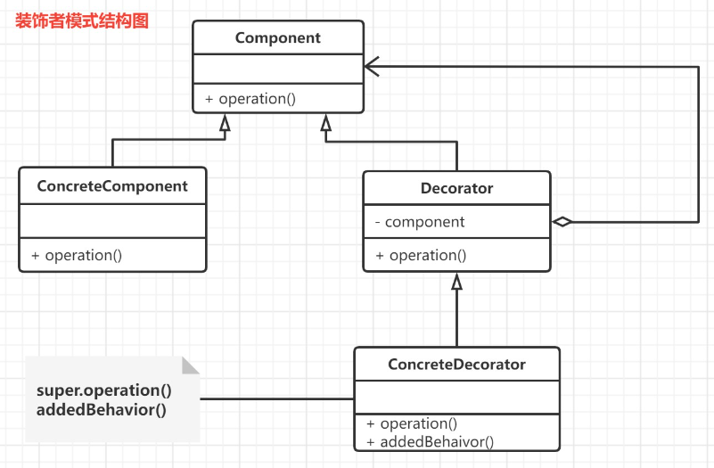
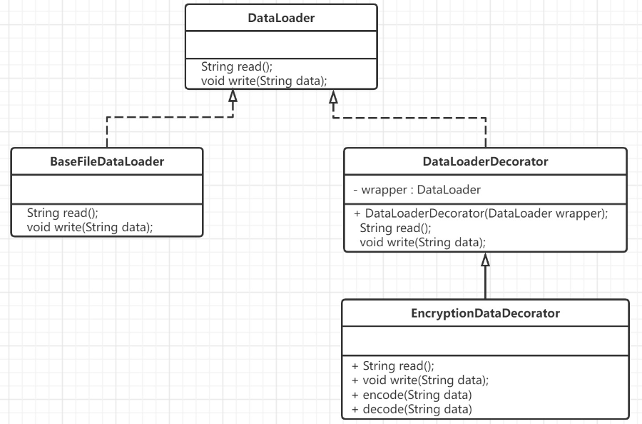

## 简介

装饰模式(decorator pattern) 的原始定义是：动态的给一个对象添加一些额外的职责. 就扩展功能而言,装饰器模式提供了一种比使用子类更加灵活的替代方案.

> 假设现在有有一块蛋糕,如果只有涂上奶油那这个蛋糕就是普通的**奶油蛋糕**, 这时如果我们添加上一些蓝莓,那这个蛋糕就是**蓝莓蛋糕**.如果我们再拿一块黑巧克力 然后写上姓名、插上代表年龄的蜡烛, 这就是变成了一块生日蛋糕 


在软件设计中,装饰器模式是一种用于替代继承的技术,它通过一种无须定义子类的方式给对象动态的增加职责,使用对象之间的关联关系取代类之间的继承关系.

## 原理

### 基本角色



装饰（Decorator）模式中的角色：
- `抽象构件（Component）角色` ：它是具体构件和抽象装饰类的共同父类,声明了在具体构件中实现的业务方法.它引进了可以使客户端以一致的方式处理未被装饰的对象以及装饰之后的对象,实现客户端的透明操作
- `具体构件（Concrete Component）角色` ：它是抽象构件类的子类,用于定义具体的构建对象,实现了在抽象构建中声明的方法,装饰类可以给它增加额外的职责(方法).
- `抽象装饰（Decorator）角色` ：它也是抽象构件类的子类,用于给具体构件增加职责,但是具体职责在其子类中实现.它维护了一个指向抽象构件对象的引用,通过该引用可以调用装饰之前构件对象的方法,并通过其子类扩展该方法,以达到装饰的目的.
- `具体装饰（ConcreteDecorator）角色` : 它是抽象装饰类的子类,负责向构件添加新的职责.每一个具体装饰类都定义了一些新的行为,它可以调用在抽象装饰类中定义的方法,并可以增加新的方法用于扩充对象的行为.
### 相关代码

#### 抽象构件（Component）角色

```Java
public abstract class Component {
    //抽象方法
    public abstract void operation();
}
```
#### 具体构件（Concrete Component）角色

```Java
public class ConcreteComponent extends Component {
    @Override
    public void operation() {
        //基础功能实现(复杂功能通过装饰类进行扩展)
    }
}
```
#### 抽象装饰（Decorator）角色

```Java
public class Decorator extends Component{
    //维持一个对抽象构件对象的引用
    private Component component;
    //注入一个抽象构件类型的对象
    public Decorator(Component component) {
        this.component = component;
    }
    @Override
    public void operation() {
        //调用原有业务方法(这里并没有真正实施装饰,而是提供了一个统一的接口,将装饰过程交给子类完成)
        component.operation();
    }
}
```
#### 具体装饰（ConcreteDecorator）角色

```Java
public class ConcreteDecorator extends Decorator {
    public ConcreteDecorator(Component component) {
        super(component);
    }
    @Override
    public void operation() {
        super.operation(); //调用原有业务方法
        addedBehavior(); //调用新增业务方法
    }
    //新增业务方法
    public void addedBehavior(){
        //......
    }
}
```
## 应用实例

接下来我们将模拟一个对于文件读写的操作,我们需要在读取文件时解密,写入文件时加密
### UML类图设计



- `抽象构件（Component）角色` ：抽象的文件读取接口DataLoader
- `具体构件（Concrete Component）角色` ：BaseFileDataLoader重写组件 DataLoader 的读写方法
- `抽象装饰（Decorator）角色` ：装饰器DataLoaderDecorator，这里要包含一个引用 DataLoader 的对象实例 wrapper，同样是重写 DataLoader 方法，不过这里使用 wrapper 来读写,并不进行扩展
- `具体装饰（ConcreteDecorator）角色` : 读写时有加解密功能的具体装饰器EncryptionDataDecorator，它继承了装饰器 DataLoaderDecorator 重写读写方法
### 实现

导入IO依赖
```XML
<dependencies>
	<dependency>
		<groupId>commons-io</groupId>
		<artifactId>commons-io</artifactId>
		<version>2.6</version>
	</dependency>
</dependencies>
```

#### 抽象构建

```Java
public interface DataLoader {
    String read();
    void write(String data);
}
```
#### 具体构建

```Java
public class BaseFileDataLoader implements DataLoader {
    private String filePath;
    public BaseFileDataLoader(String filePath) {
        this.filePath = filePath;
    }
    @Override
    public String read() {
        try {
            String result = FileUtils.readFileToString(new File(filePath), "utf-8");
            return result;
        } catch (IOException e) {
            e.printStackTrace();
            return null;
        }
    }
    @Override
    public void write(String data) {
        try{
            FileUtils.writeStringToFile(new File(filePath), data, "utf-8");
        } catch (IOException e) {
            e.printStackTrace();
        }
    }
}
```
#### 抽象装饰

```Java
public class DataLoaderDecorator implements DataLoader {
    private DataLoader wrapper;
    public DataLoaderDecorator(DataLoader wrapper) {
        this.wrapper = wrapper;
    }
    @Override
    public String read() {
        return wrapper.read();
    }
    @Override
    public void write(String data) {
        wrapper.write(data);
    }
}
```
#### 具体装饰

```Java
public class EncryptionDataDecorator extends DataLoaderDecorator {
    public EncryptionDataDecorator(DataLoader wrapper) {
        super(wrapper);
    }
    @Override
    public String read() {
        return decode(super.read());
    }
    @Override
    public void write(String data) {
        super.write(encode(data));
    }
    //加密操作
    private String encode(String data) {
        try {
             Base64.Encoder encoder = Base64.getEncoder();
             byte[] bytes = data.getBytes("UTF-8");
             String result = encoder.encodeToString(bytes);
             return result;
        } catch (Exception e) {
            e.printStackTrace();
            return null;
        }
    }
    //解密
    private String decode(String data) {
        try {
            Base64.Decoder decoder = Base64.getDecoder();
            String result = new String(decoder.decode(data), "UTF-8");
            return result;
        } catch (Exception e) {
            e.printStackTrace();
            return null;
        }
    }
}
```
#### 测试

```Java
String info = "name:tom,age:15";
DataLoaderDecorator decorator = new EncryptionDataDecorator(new BaseFileDataLoader("demo.txt"));
decorator.write(info);
String data = decorator.read();
System.out.println(data);
```
## 总结

### 优点

1. 对于扩展一个对象的功能,装饰模式**比继承更加灵活**,不会导致类的个数急剧增加
2. 可以**通过一种动态的方式来扩展一个对象的功能**,通过配置文件可以在运行时选择不同的具体装饰类,从而实现不同的行为.
3. **可以对一个对象进行多次装饰**,通过使用不同的具体装饰类以及这些装饰类的排列组合可以创造出很多不同行为的组合,得到更加强大的对象.
4. **具体构建类与具体装饰类可以独立变化**,用户可以根据需要增加新的具体构建类和具体装饰类,原有类库代码无序改变,符合开闭原则.
### 缺点

1. 在使用装饰模式进行系统设计时**将产生很多小对象**,这些对象的区别在于它们之间相互连接的方式有所不同,而不是它们的类或者属性值不同,大量的小对象的产生势必会占用更多的系统资源,在一定程度上影响程序的性能.
2. 装饰器模式提供了一种比继承更加灵活、机动的解决方案,但同时也意味着**比继承更加易于出错,排错也更加困难**,对于多次装饰的对象,在调试寻找错误时可能需要逐级排查,较为烦琐.
### 场景

1. **快速动态扩展和撤销一个类的功能场景**。 比如，有的场景下对 API 接口的安全性要求较高，那么就可以使用装饰模式对传输的字符串数据进行压缩或加密。如果安全性要求不高，则可以不使用。
2. **不支持继承扩展类的场景**。 比如，使用 final 关键字的类，或者系统中存在大量通过继承产生的子类。


