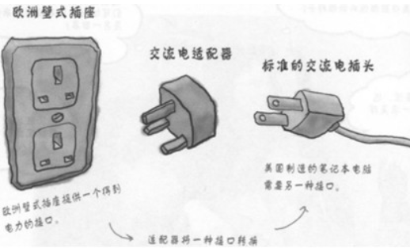
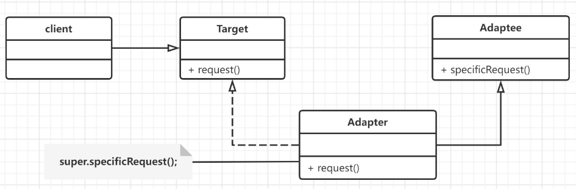
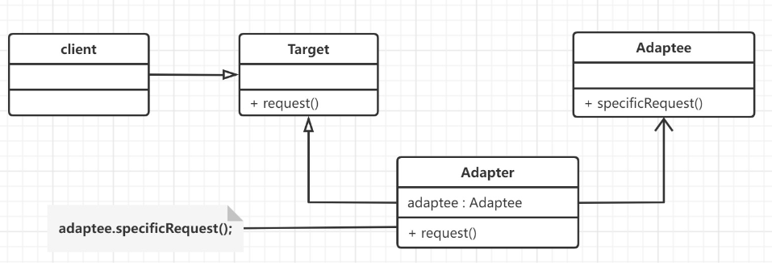
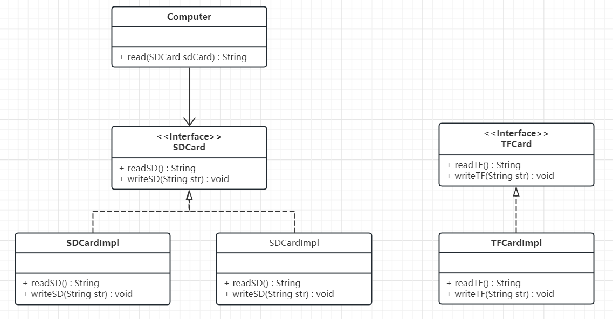
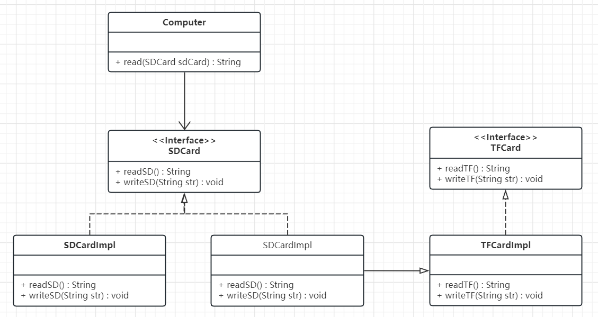
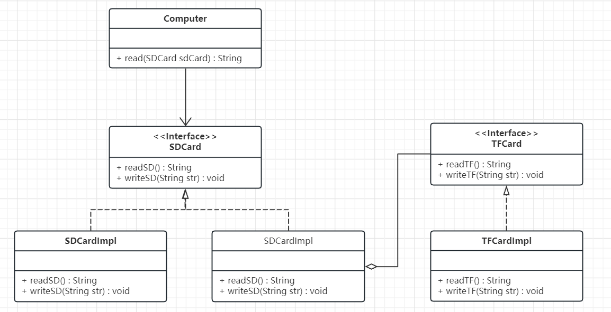

## 概述

适配器模式(adapter pattern )的原始定义是：将类的接口转换为客户期望的另一个接口，适配器可以让不兼容的两个类一起协同工作。

> 如果去欧洲国家去旅游的话，他们的插座如下图最左边，是欧洲标准。而我们使用的插头如下图最右边的。因此我们的笔记本电脑，手机在当地不能直接充电。所以就需要一个插座转换器，转换器第1面插入当地的插座，第2面供我们充电，这样使得我们的插头在当地能使用。生活中这样的例子很多，手机充电器（将220v转换为5v的电压），读卡器等，其实就是使用到了适配器模式。



适配器模式是用来做适配，它将不兼容的接口转换为可兼容的接口，让原本由于接口不兼容而不能一起工作的类可以一起工作。适配器模式有两种实现方式：类适配器和对象适配器。其中，类适配器使用继承关系来实现，对象适配器使用组合关系来实现。

类适配器模式的耦合度比后者高，且要求程序员了解现有组件库中的相关组件的内部结构，所以应用相对较少些。

## 原理

适配器模式（Adapter）包含以下主要角色：
- 目标（Target）接口：当前系统业务所期待的接口，它可以是抽象类或接口。
- 适配者（Adaptee）类：适配者即被适配的角色,它是被访问和适配的现存组件库中的组件接口。
- 适配器（Adapter）类：它是一个转换器，通过继承或引用适配者的对象，把适配者接口转换成目标接口，让客户按目标接口的格式访问适配者。
### 类适配器

简单来说就是 **实现目标（Target）接口,继承适配者（Adaptee）类**


### 方法适配器

简单来说就是 **实现目标（Target）接口,聚合适配者（Adaptee）类**


## 实际应用

我们模拟读取SD卡读取接口读取TF卡信息



电脑类
```Java
public class Computer {
    pubic String read(SDCard sdCard){
	   return sdCard.readSD();
    }
}
```

SD类
```java
public interface SDCard {
    //读取SD卡方法
    String readSD();
    //写入SD卡功能
    void writeSD(String msg);
}

public class SDCardImpl implements SDCard {
    @Override
    public String readSD() {
        String msg = "sd card reading data";
        return msg;
    }
    @Override
    public void writeSD(String msg) {
        System.out.println("sd card write data : " + msg);
    }
}
```

SD类
```java
public interface TFCard {
    //读取TF卡方法
    String readTF();
    //写入TF卡功能
    void writeTF(String msg);
}

public class TFCardImpl implements TFCard {
    @Override
    public String readTF() {
        String msg = "TF card reading data";
        return msg;
    }
    @Override
    public void writeTF(String msg) {
        System.out.println("TF card write data : " + msg);
    }
}
```
### 使用类适配器



```Java
public class SDAdapterTF extends TFCardImpl implements SDCard{
    @Override
    public String readSD() {
        System.out.println("adapter read tf card ");
        return readTF();
    }
    @Override
    public void writeSD(String msg) {
        System.out.println("adapter write tf card");
        writeTF(msg);
    }
}
```
### 使用对象适配器




