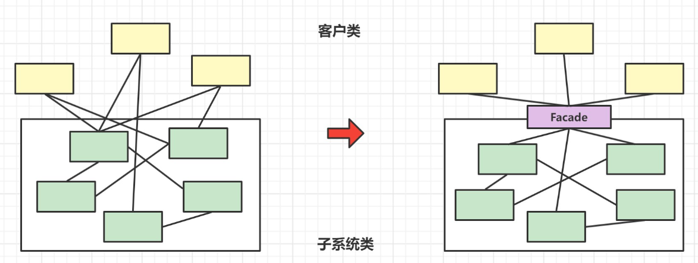
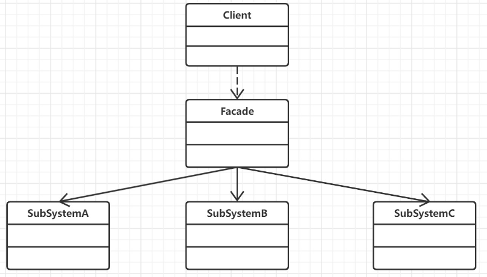
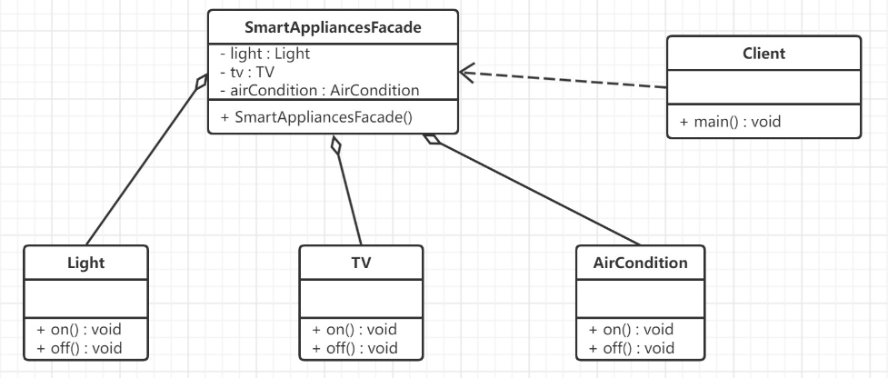

## 简介

外观模式( Facade Pattern)，也叫门面模式, 外观模式的原始定义是：为子系统中的一组接口提供统一的接口。它定义了一个更高级别的接口，使子系统更易于使用。

外观模式，是一种通过为多个复杂的子系统提供一个一致的接口，而使这些子系统更加容易被访问的模式。该模式对外有一个统一接口，外部应用程序不用关心内部子系统的具体的细节，这样会大大降低应用程序的复杂度，提高了程序的可维护性。

门面模式有点类似之前讲到的迪米特法则（最少知识原则）和接口隔离原则：**两个有交互的系统，只暴露有限的必要的接口**



门面类充当了系统中的"服务员",它为多个业务类的调用提供了一个统一的入口,简化了类与类之间的交互,如果没有门面类,每个客户类需要和多个子系统之间进行复杂的交互,系统的耦合度将会很大.
## 原理



外观（Facade）模式包含以下主要角色：

- 外观（Facade）角色：为多个子系统对外提供一个共同的接口。
> 外观角色中可以知道多个相关的子系统中的功能和责任.在正常情况下,它将所有从客户端发来的请求委派到相应的子系统,传递给相应的子系统对象处理

```Java
public class Facade {
    private SubSystemA obj1 = new SubSystemA();
    private SubSystemB obj2 = new SubSystemB();
    private SubSystemC obj3 = new SubSystemC();
    public void method(){
        obj1.methodA();
        obj2.methodB();
        obj3.methodC();
    }
}
```

- 子系统（Sub System）角色：实现系统的部分功能，客户可以通过外观角色访问它。
> 每一个子系统可以是一个类也可以是多个类的集合.每一个子系统都可以被客户端直接调用,或者被外观角色调用.子系统并不 | 知道外观的存在,对于子系统而言,外观角色仅仅是另一个客户端而已.

```Java
public class SubSystemA {
    public void methodA(){
        //业务代码
    }
}

public class SubSystemB {
    public void methodB(){
        //业务代码
    }
}

public class SubSystemC {
    public void methodC(){
        //业务代码
    }
}
```

使用
```Java
public class Client {
    public static void main(String[] args) {
        Facade facade = new Facade();
        facade.method();
    }
}
```
## 应用

接下来我们将模拟智能家电的控制 : 通过只能终端统一对智能模块进行管理

### UML类图



### 子系统（Sub System）角色

```Java
public class Light {
    public void on(){System.out.println("打开灯......");}
    public void off(){System.out.println("关闭灯......");}
}

public class TV {
    public void on(){System.out.println("打开电视......");}
    public void off(){System.out.println("关闭电视......");}
}

public class AirCondition {
    public void on(){System.out.println("打开空调......");}
    public void off(){System.out.println("关闭空调......");}
}
```

### 外观（Facade）角色

```Java
public class SmartAppliancesFacade {
    private Light light;
    private TV tv;
    private AirCondition airCondition;
    public SmartAppliancesFacade() {
        this.light =new Light();
        this.tv = new TV();
        this.airCondition = new AirCondition();
    }
    public void say(String message){
        if(message.contains("打开")){
            on();
        }else if(message.contains("关闭")){
            off();
        }else{
            System.out.println("对不起没有听清楚您说什么! 请重新再说一遍");
        }
    }
    //起床后 语音开启 电灯 电视 空调
    private void on() {
        System.out.println("起床了!");
        light.on();
        tv.on();
        airCondition.on();
    }
    //睡觉前 语音关闭 电灯 电视 空调
    private void off() {
        System.out.println("睡觉了!");
        light.off();
        tv.off();
        airCondition.off();
    }
}
```
### 使用

```Java
public class Client {
    public static void main(String[] args) {
        //创建外观对象
        SmartAppliancesFacade facade = new SmartAppliancesFacade();
        facade.say("打开家电");
        facade.say("关闭家电");
    }
}
```
## 总结

### 优点

1. 它**对客户端屏蔽了子系统组件,减少了客户端所需要处理的对象数目,并使子系统使用起来更加的容易**.通过引入外观模式,客户端代码将变得很简单,与之关联的对象也很少.
2. 它**实现了子系统与客户端之间的松耦合关系**,这使得子系统的变化不会影响到调用它的客户端,只需要调整外观类即可
3. 一个子系统的修改**对其他子系统没有任何影响**,而子系统内部变化也不会影响到外观对象.
### 缺点

1. **不能很好的控制客户端直接使用子系统类**,如果客户端访问子系统类做太多的限制则减少了可变性和灵活性.
2. 如果设计不当,增加新的子系统可能需要修改外观类的源代码,**违背了开闭原则**.
### 场景

- **简化复杂系统**  :  比如，当我们开发了一整套的电商系统后（包括订单、商品、支付、会员等系统），我们不能让用户依次使用这些系统后才能完成商品的购买，而是需要一个门户网站或手机 App 这样简化过的门面系统来提供在线的购物功能
- **减少客户端处理的系统数量**  :  比如，在 Web 应用中，系统与系统之间的调用可能需要处理 Database 数据库、Model 业务对象等，其中使用 Database 对象就需要处理打开数据库、关闭连接等操作，然后转换为 Model 业务对象，实在是太麻烦了。如果能够创建一个数据库使用的门面（其实就是常说的 DAO 层），那么实现以上过程将变得容易很多
- **让一个系统（或对象）为多个系统（或对象）工作**  :  比如，线程池 ThreadPool 就是一个门面模式，它为系统提供了统一的线程对象的创建、销毁、使用等
- **联合更多的系统来扩展原有系统** : 当我们的电商系统中需要一些新功能时，比如，人脸识别，我们可以不需要自行研发，而是购买别家公司的系统来提供服务，这时通过门面系统就能方便快速地进行扩展
- **作为一个简洁的中间层**  :  门面模式还可以用来隐藏或者封装系统中的分层结构，同时作为一个简化的中间层来使用。比如，在秒杀、库存、钱包等场景中，我们需要共享有状态的数据时（如商品库存、账户里的钱），在不改变原有系统的前提下，通过一个中间的共享层（如将秒杀活动的商品库存总数统一放在 Redis 里），就能统一进行各种服务（如，秒杀详情页、商品详情页、购物车等）的调用。


