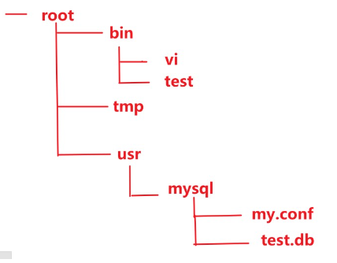

## 概览

我们很容易将“组合模式”和“组合关系”搞混。组合模式最初只是用于解决树形结构的场景，更多的是处理对象组织结构之间的问题。而组合关系则是通过将不同对象封装起来完成一个统一功能.

组合模式(Composite Pattern) 的定义是：**将对象组合成树形结构以表示整个部分的层次结构.组合模式可以让用户统一对待单个对象和对象的组合**

比如: windows操作系统中的目录结构,其实就是树形目录结构,通过tree命令实现树形结构展示.


在上图中包含了文件夹和文件两类不同元素,其中在文件夹中可以包含文件,还可以继续包含子文件夹.子文件夹中可以放入文件,也可以放入子文件夹. 文件夹形成了一种容器结构(树形结构),递归结构.


接着我们再来思考虽然文件夹和文件是不同类型的对象,但是他们有一个共性,就是 **都可以被放入文件夹中**. 其实文件和文件夹可以被当做是同一种对象看待.

组合模式其实就是将一组对象(文件夹和文件)组织成树形结构,以表示一种'部分-整体' 的层次结构,(目录与子目录的嵌套结构). 组合模式让客户端可以统一单个对象(文件)和组合对象(文件夹)的处理逻辑(递归遍历).

组合模式更像是一种数据结构和算法的抽象,其中数据可以表示成树这种数据结构,业务需求可以通过在树上的递归遍历算法来实现.

## 原理

### UML图


### 角色

组合模式主要包含三种角色：

- 抽象根节点（Component）：定义系统各层次对象的共有方法和属性，可以预先定义一些默认行为和属性
> 在该角色中可以包含所有子类共有行为的声明和实现.在抽象根节点中定义了访问及管理它的子构件的方法,如增加子节点、删除子节点、获取子节点等.

- 树枝节点（Composite）：定义树枝节点的行为，存储子节点，组合树枝节点和叶子节点形成一个树形结构
>树枝节点可以包含树枝节点,也可以包含叶子节点,它其中有一个集合可以用于存储子节点,实现了在抽象根节点中定义的行为.包括那些访问及管理子构件的方法,在其业务方法中可以递归调用其子节点的业务方法.

- 叶子节点（Leaf）：叶子节点对象，其下再无分支，是系统层次遍历的最小单位
>在组合结构中叶子节点没有子节点,它实现了在抽象根节点中定义的行为.
## 实现

组合模式的关键在于定义一个抽象根节点类,它既可以代表叶子,又可以代表树枝节点,客户端就是针对该抽象类进行编程,不需要知道它到底表示的是叶子还是容器,可以对其进行统一处理.

树枝节点对象和抽象根节点类之间建立了一个聚合关联关系,在树枝节点对象中既可以包含叶子节点,还可以继续包含树枝节点,以此实现递归组合,形成一个树形结构.
### 抽象根节点（Component）

对于客户端而言将针对抽象编程,无需关心其具体子类是容器构件还是叶子构件

```Java
public abstract class Component {
    public abstract void add(Component c); //增加成员
    public abstract void remove(Component c); //删除成员
    public abstract Component getChild(int i); //获取成员
    public abstract void operation(); //业务方法
}
```

### 叶子节点(Leaf)

叶子节点中不能包含子节点

```Java
public class Leaf extends Component {
    @Override
    public void add(Component c) {
        //具体操作
    }
    @Override
    public void remove(Component c) {
        //具体操作
    }
    @Override
    public Component getChild(int i) {
        //具体操作
        return new Leaf();
    }
    @Override
    public void operation() {
        //叶子节点具体业务方法
    }
}
```
### 树枝节点(Composite)

容器对象,可以包含子节点

```Java
public class Composite extends Component {
    private ArrayList<Component> list = new ArrayList<>();
    @Override
    public void add(Component c) {
        list.add(c);
    }
    @Override
    public void remove(Component c) {
        list.remove(c);
    }
    @Override
    public Component getChild(int i) {
        return (Component) list.get(i);
    }
    @Override
    public void operation() {
        //在树枝节点中的业务方法,将递归调用其他节点中的operation() 方法
        for (Component component : list) {
            component.operation();
        }
    }
}
```
## 应用

下面我们通过一段程序来演示一下组合模式的使用. 程序的功能是列出某一目录下所有的文件和文件夹.类图如下:


我们按照下图的表示,进行文件和文件夹的构建.



Entry类: 抽象类,用来定义File类和Directory类的共性内容

```Java
public abstract class Entry {
    public abstract String getName(); //获取文件名
    public abstract int getSize(); //获取文件大小
    //添加文件夹或文件
    public abstract Entry add(Entry entry);
    //显示指定目录下的所有信息
    public abstract void printList(String prefix);
    @Override
    public String toString() {
        return getName() + "(" +getSize() + ")";
    }
}
```

File类,叶子节点,表示文件.

```Java
public class File extends Entry {
    private String name; //文件名
    private int size; //文件大小
    public File(String name, int size) {
        this.name = name;
        this.size = size;
    }
    @Override
    public String getName() {
        return name;
    }
    @Override
    public int getSize() {
        return size;
    }
    @Override
    public Entry add(Entry entry) {
        return null;
    }
    @Override
    public void printList(String prefix) {
        System.out.println(prefix + "/" + this);
    }
}
```

Directory类,树枝节点,表示文件

```Java
public class Directory extends Entry{
    //文件的名字
    private String name;
    //文件夹与文件的集合
    private ArrayList<Entry> directory = new ArrayList();
    //构造函数
    public Directory(String name) {
        this.name = name;
    }
    //获取文件名称
    @Override
    public String getName() {
        return this.name;
    }
    /**
     * 获取文件大小
     *      1.如果entry对象是File类型,则调用getSize方法获取文件大小
     *      2.如果entry对象是Directory类型,会继续调用子文件夹的getSize方法,形成递归调用.
     */
    @Override
    public int getSize() {
        int size = 0;
        //遍历或者去文件大小
        for (Entry entry : directory) {
            size += entry.getSize();
        }
        return size;
    }
    @Override
    public Entry add(Entry entry) {
        directory.add(entry);
        return this;
    }
    //显示目录
    @Override
    public void printList(String prefix) {
        System.out.println("/" + this);
        for (Entry entry : directory) {
            entry.printList("/" + name);
        }
    }
}
```

测试

```Java
public class Client {
    public static void main(String[] args) {
        //根节点
        Directory rootDir = new Directory("root");
        //树枝节点
        Directory binDir = new Directory("bin");
        //向bin目录中添加叶子节点
        binDir.add(new File("vi",10000));
        binDir.add(new File("test",20000));
        Directory tmpDir = new Directory("tmp");
        Directory usrDir = new Directory("usr");
        Directory mysqlDir = new Directory("mysql");
        mysqlDir.add(new File("my.cnf",30));
        mysqlDir.add(new File("test.db",25000));
        usrDir.add(mysqlDir);
        rootDir.add(binDir);
        rootDir.add(tmpDir);
        rootDir.add(mysqlDir);
        rootDir.printList("");
    }
}
```
## 分类

### 透明组合模式

透明组合模式中，抽象根节点角色中声明了所有用于管理成员对象的方法，比如在示例中 `Component` 声明了 `add`、`remove` 、`getChild` 方法，这样做的好处是确保所有的构件类都有相同的接口。透明组合模式也是组合模式的标准形式。

透明组合模式的缺点是不够安全，因为叶子对象和容器对象在本质上是有区别的，叶子对象不可能有下一个层次的对象，即不可能包含成员对象，因此为其提供 add()、remove() 等方法是没有意义的，这在编译阶段不会出错，但在运行阶段如果调用这些方法可能会出错（如果没有提供相应的错误处理代码）


### 安全组合模式

在安全组合模式中，在抽象构件角色中没有声明任何用于管理成员对象的方法，而是在树枝节点类中声明并实现这些方法。安全组合模式的缺点是不够透明，因为叶子构件和容器构件具有不同的方法，且容器构件中那些用于管理成员对象的方法没有在抽象构件类中定义，因此客户端不能完全针对抽象编程，必须有区别地对待叶子构件和容器构件。


## 总结

### 优点


- 组合模式可以清楚地定义分层次的复杂对象，表示对象的全部或部分层次，它**让客户端忽略了层次的差异，方便对整个层次结构进行控制**
- 客户端可以一致地使用一个组合结构或其中单个对象，**不必关心处理的是单个对象还是整个组合结构，简化了客户端代码**
- 在组合模式中增加新的树枝节点和叶子节点都很方便，无须对现有类库进行任何修改，**符合“开闭原则”**
- 组合模式为树形结构的面向对象实现提供了一种灵活的解决方案，通过叶子节点和树枝节点的递归组合，**可以形成复杂的树形结构**，但对树形结构的控制却非常简单
### 缺点

- 使用组合模式的前提在于，你的**业务场景必须能够表示成树形结构**。所以，组合模式的应用场景也 比较局限，它并不是一种很常用的设计模式
### 场景

- **处理一个树形结构**，比如，公司人员组织架构、订单信息等
- **跨越多个层次结构聚合数据**，比如，统计文件夹下文件总数
- **统一处理一个结构中的多个对象**，比如，遍历文件夹下所有 XML 类型文件内容
