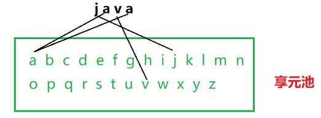
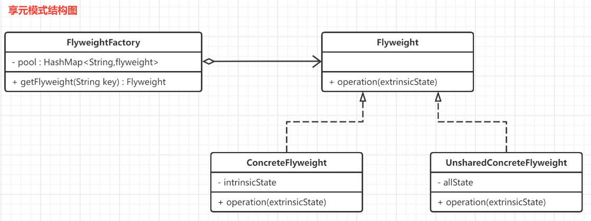
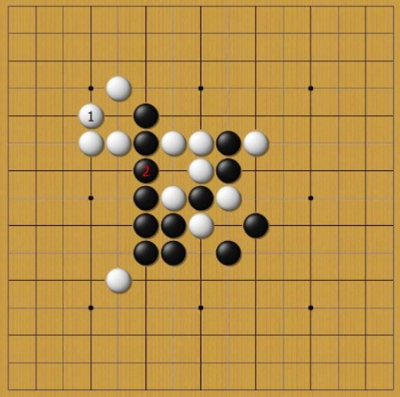
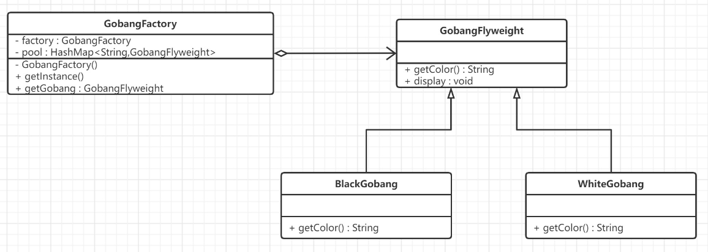

## 简介

享元模式 (flyweight pattern) 的原始定义是：**摒弃了在每个对象中保存所有数据的方式，通过共享多个对象所共有的相同状态，从而让我们能在有限的内存容量中载入更多对象**

从这个定义中你可以发现，享元模式要**解决的核心问题就是节约内存空间**，使用的办法是找出相似对象之间的共有特征，然后复用这些特征。所谓“享元”，顾名思义就是被共享的单元

比如: 一个文本字符串中存在很多重复的字符,如果每一个字符都用一个单独的对象来表示,将会占用较多的内存空间,我们可以使用享元模式解决这一类问题



享元模式通过共享技术实现相同或者相似对象的重用,在逻辑上每一个出现的字符都有一个对象与之对应,然而在物理上他们却是共享同一个享元对象.
## 原理

享元模式的结构较为复杂,通常会结合工厂模式一起使用,在它的结构图中包含了一个享元工厂类.




> 注意 : 享元（Flyweight）模式中存在以下两种状态：
> 1. 内部状态，即不会随着环境的改变而改变的可共享部分。
> 2. 外部状态，指随环境改变而改变的不可以共享的部分。享元模式的实现要领就是区分应用中的这两种状态，并将外部状态外部化
### 角色

享元模式的主要有以下角色：
- **抽象享元角色（Flyweight）**：通常是一个接口或抽象类，在抽象享元类中声明了具体享元类公共的方法，这些方法可以向外界提供享元对象的内部数据（内部状态），同时也可以通过这些方法来设置外部数据（外部状态）
- **可共享的具体享元（Concrete Flyweight）角色** ：它实现了抽象享元类，称为享元对象；在具体享元类中为内部状态提供了存储空间。通常我们可以结合单例模式来设计具体享元类，为每一个具体享元类提供唯一的享元对象
- **非共享的具体享元（Unshared Flyweight)角色** ：并不是所有的抽象享元类的子类都需要被共享，不能被共享的子类可设计为非共享具体享元类；当需要一个非共享具体享元类的对象时可以直接通过实例化创建
- **享元工厂（Flyweight Factory）角色** ：负责创建和管理享元角色。当客户对象请求一个享元对象时，享元工厂检査系统中是否存在符合要求的享元对象，如果存在则提供给客户；如果不存在的话，则创建一个新的享元对象
## 实现

抽象享元类可以是一个接口也可以是一个抽象类,作为所有享元类的公共父类, 主要作用是提高系统的可扩展性

```Java
public abstract class Flyweight {
    public abstract void operation(String extrinsicState);
}
```

具体享元类,具体享元类中要将内部状态和外部状态分开处理,内部状态作为具体享元类的成员变量,而外部状态通过注入的方式添加到具体享元类中

```Java
public class ConcreteFlyweight extends Flyweight {
    //内部状态 intrinsicState作为成员变量,同一个享元对象的内部状态是一致的
    private String intrinsicState;
    public ConcreteFlyweight(String intrinsicState) {
        this.intrinsicState = intrinsicState;
    }
    /**
     * 外部状态在使用时由外部设置,不保存在享元对象中,即使是同一个对象
     * @param extrinsicState  外部状态,每次调用可以传入不同的外部状态
     */
    @Override
    public void operation(String extrinsicState) {
        //实现业务方法
        System.out.println("=== 享元对象内部状态" + intrinsicState +",外部状态:" + extrinsicState);
    }
}
```

非共享享元类,不复用享元工厂内部状态,但是是抽象享元类的子类或实现类

```Java
public class UnsharedConcreteFlyweight extends Flyweight {
    private String intrinsicState;
    public UnsharedConcreteFlyweight(String intrinsicState) {
        this.intrinsicState = intrinsicState;
    }
    @Override
    public void operation(String extrinsicState) {
        System.out.println("=== 使用不共享对象,内部状态: " + intrinsicState +",外部状态: " + extrinsicState);
    }
}
```

享元工厂类, 管理一个享元对象类的缓存池。它会存储享元对象之间需要传递的共有状态，比如，按照大写英文字母来作为状态标识，这种只在享元对象之间传递的方式就叫内部状态。同时，它还提供了一个通用方法 getFlyweight()，主要通过内部状态标识来获取享元对象

```Java
public class FlyweightFactory {
    //定义一个HashMap用于存储享元对象,实现享元池
    private Map<String,Flyweight> pool = new HashMap();
    public FlyweightFactory() {
        //添加对应的内部状态
        pool.put("A",new ConcreteFlyweight("A"));
        pool.put("B",new ConcreteFlyweight("B"));
        pool.put("C",new ConcreteFlyweight("C"));
    }
    //根据内部状态来进行查找
    public Flyweight getFlyweight(String key){
        //对象存在,从享元池直接返回
        if(pool.containsKey(key)){
            System.out.println("===享元池中存在,直接复用,key:" + key);
            return pool.get(key);
        }else{
            //如果对象不存在,先创建一个新的对象添加到享元池中,然后返回
            System.out.println("===享元池中不存在,创建并复用,key:" + key);
            Flyweight fw = new ConcreteFlyweight(key);
            pool.put(key,fw);
            return fw;
        }
    }
}
```
## 应用

五子棋中有大量的黑子和白子,它们的形状大小都是一样的,只是出现的位置不同,所以一个棋子作为一个独立的对象存储在内存中,会导致大量的内存的浪费,我们使用享元模式来进行优化.


### UML类图



### 抽象享元类

```Java
public abstract class GobangFlyweight {
    public abstract String getColor();
    public void display(){
        System.out.println("棋子颜色: " + this.getColor());
    }
}
```

### 共享享元类

```Java
public class WhiteGobang extends GobangFlyweight{
    @Override
    public String getColor() {
        return "白色";
    }
}

public class BlackGobang extends GobangFlyweight {
    @Override
    public String getColor() {
        return "黑色";
    }
}
```
### 享元工厂类

```java
public class GobangFactory {
    private static GobangFactory factory = new GobangFactory();
    private static Map<String,GobangFlyweight> pool;
    //设置共享对象的内部状态,在享元对象中传递
    private GobangFactory() {
        pool = new HashMap<String,GobangFlyweight>();
        GobangFlyweight black = new BlackGobang(); //黑子
        GobangFlyweight white = new WhiteGobang(); //白子
        pool.put("b",black);
        pool.put("w",white);
    }
    //返回享元工厂类唯一实例
    public static final GobangFactory getInstance(){
        return SingletonHolder.INSTANCE;
    }
    //静态内部类-单例
    private static class SingletonHolder{
        private static final GobangFactory INSTANCE = new GobangFactory();
    }
    //通过key获取集合中的享元对象
    public GobangFlyweight getGobang(String key){
        return pool.get(key);
    }
}
```

### 测试

```Java
//获取享元工厂对象
GobangFactory instance = GobangFactory.getInstance();
//获取3颗黑子
GobangFlyweight b1 = instance.getGobang("b");
GobangFlyweight b2 = instance.getGobang("b");
GobangFlyweight b3 = instance.getGobang("b");
System.out.println("判断两颗黑子是否相同: " + (b1 == b2));
//获取2颗白子
GobangFlyweight w1 = instance.getGobang("w");
GobangFlyweight w2 = instance.getGobang("w");
System.out.println("判断两颗白子是否相同: " + (w1 == w2));
//显示棋子
b1.display();
b2.display();
b3.display();
w1.display();
w2.display();
```

三颗黑子(两颗白子)对象比较之后内存地址都是一样的.说明它们是同一个对象.在实现享元模式时使用了单例模式和简单工厂模式,保证了享元工厂对象的唯一性,并提供工厂方法向客户端返回享元对象.
## 总结

### 优点

- **极大减少内存中相似或相同对象数量，节约系统资源，提供系统性能**
>比如，当大量商家的商品图片、固定文字（如商品介绍、商品属性）在不同的网页进行展示时，通常不需要重复创建对象，而是可以使用同一个对象，以避免重复存储而浪费内存空间。由于通过享元模式构建的对象是共享的，所以当程序在运行时不仅不用重复创建，还能减少程序与操作系统的 IO 交互次数，大大提升了读写性能。

- **享元模式中的外部状态相对独立，且不影响内部状态**
### 缺点

- 为了使对象可以共享，需要将享元对象的部分状态外部化，分离内部状态和外部状态，使程序逻辑复杂
### 使用场景

- 一个系统有大量相同或者相似的对象，造成内存的大量耗费。
  >注意: 在使用享元模式时需要维护一个存储享元对象的享元池，而这需要耗费一定的系统资源，因此，应当在需要多次重复使用享元对象时才值得使用享元模式。

- 在 Java 中，享元模式一个常用的场景就是，使用数据类的包装类对象的 valueOf() 方法。比如，使用 Integer.valueOf() 方法时，实际的代码实现中有一个叫 IntegerCache 的静态类，它就是一直缓存了 -127 到 128 范围内的数值，如下代码所示，你可以在 Java JDK 中的 Integer 类的源码中找到这段代码。

```Java
public class Test1 {
    public static void main(String[] args) {
        Integer i1 = 127;
        Integer i2 = 127;
        System.out.println("i1和i2对象是否是同一个对象？" + (i1 == i2));
        Integer i3 = 128;
        Integer i4 = 128;
        System.out.println("i3和i4对象是否是同一个对象？" + (i3 == i4));
    }
}
//传入的值在-128 - 127 之间,直接从缓存中返回
public static Integer valueOf(int i) {
	if (i >= IntegerCache.low && i <= IntegerCache.high)
		return IntegerCache.cache[i + (-IntegerCache.low)];
    return new Integer(i);
}
```

可以看到 `Integer` 默认先创建并缓存 `-128 ~ 127` 之间数的 `Integer` 对象，当调用 `valueOf` 时如果参数在 `-128 ~ 127` 之间则计算下标并从缓存中返回，否则创建一个新的 `Integer` 对象。

其实享元模式本质上就是找到对象的不可变特征，并缓存起来，当类似对象使用时从缓存中读取，以达到节省内存空间的目的